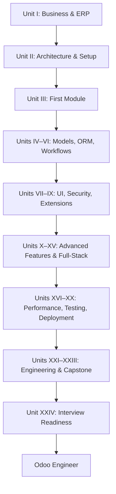

# ODOO Development & Engineering Study Guide

> **From Zero to Odoo Engineer** — A structured, chapter-by-chapter roadmap for learning ERP fundamentals, Odoo development, production engineering, and real-world Odoo engineering practice.

[](https://github.com/Bixal99/ODOO)
[](https://www.odoo.com/)
[](https://www.python.org/)
[](https://www.postgresql.org/)

---

## Table of Contents

- [About](#about)
- [Learning Path](#learning-path)
- [Who Is This For?](#who-is-this-for)
- [Prerequisites](#prerequisites)
- [Repository Structure](#repository-structure)
- [Curriculum Overview](#curriculum-overview)
- [How to Use This Guide](#how-to-use-this-guide)
- [Recommended Study Order](#recommended-study-order)
- [Technologies Covered](#technologies-covered)
- [Official Resources](#official-resources)
- [Contributing](#contributing)
- [License](#license)
- [Author](#author)

---

## About

This repository is a **comprehensive Odoo study guide** designed to take learners from no prior ERP or Odoo knowledge to production-ready **Odoo Engineer** competency. It is organized as a detailed roadmap with **24 units**, **96 chapters**, and hundreds of granular topics covering business fundamentals, backend development, frontend (OWL), integrations, deployment, and professional engineering practices.

Unlike scattered tutorials, this guide follows a deliberate progression:

```
Zero Knowledge → ERP Understanding → Odoo Development
→ Full-Stack Odoo → Production Engineering → Odoo Engineer
```

Each unit builds on the previous one — starting with *why* businesses use ERP systems before diving into *how* Odoo works under the hood, and ending with capstone projects, code review practices, and interview readiness.

---

## Learning Path

| Phase | Units | Focus |
|-------|-------|-------|
| **Foundation** | I–III | ERP concepts, Odoo ecosystem, first module |
| **Core Development** | IV–X | Models, ORM, UI, security, extensions, advanced features |
| **Full-Stack** | XI–XV | i18n, web/portal, APIs, OWL frontend, attachments |
| **Production Skills** | XVI–XX | PostgreSQL, testing, CLI, deployment, upgrades |
| **Professional Engineering** | XXI–XXIV | Functional depth, solution architecture, capstone, interviews |

---

## Who Is This For?

- **Beginners** who want a clear, structured path into Odoo development
- **Python developers** transitioning into ERP and Odoo customization
- **Functional consultants** who want to understand the technical side
- **Junior Odoo developers** looking to fill gaps and reach senior-level breadth
- **Self-learners** preparing for Odoo developer roles or certifications

---

## Prerequisites

| Area | Minimum Level |
|------|---------------|
| **Python** | Basic syntax, functions, classes, and OOP |
| **SQL** | Basic SELECT, WHERE, JOIN (deep PostgreSQL covered in Unit XVI) |
| **Linux / CLI** | Comfortable with terminal commands (deployment units) |
| **Git** | Basic clone, commit, branch (collaboration covered in Unit XXII) |
| **Web basics** | HTML, HTTP, JSON (frontend units build from here) |

No prior ERP or Odoo experience is required — Unit I starts from business process fundamentals.

---

## Repository Structure

```
ODOO/
├── README.md                          # This file — project overview
└── Unit 1/
    └── Table of Content/
        └── Roadmap.md                 # Full curriculum table of contents
```

As the guide is expanded, content will be organized by unit and chapter under directories such as `Unit 1/`, `Unit 2/`, and so on. The master roadmap lives at:

📄 **[Unit 1/Table of Content/Roadmap.md](Unit%201/Table%20of%20Content/Roadmap.md)**

---

## Curriculum Overview

### Unit I — Understand the Business Before the Code
Chapters 1–3 · ERP fundamentals, Odoo ecosystem, core business applications

Learn business processes, departments, master data, and how Odoo apps (CRM, Sales, Inventory, Accounting, etc.) fit together before writing any code.

---

### Unit II — How Odoo Actually Works
Chapters 4–6 · Architecture, dev environment, source code structure

Three-tier architecture, ORM, PostgreSQL, filestore, workers, Python/PostgreSQL setup, and navigating the Odoo source tree.

---

### Unit III — Your First Odoo Module
Chapters 7–8 · Module anatomy and lifecycle

`__manifest__.py`, models, views, security, installation, upgrades, and module flags.

---

### Unit IV — Modeling Business Data
Chapters 9–12 · Models, fields, relationships, computed fields

`models.Model`, field types, Many2one/One2many/Many2many, `@api.depends`, stored vs non-stored computations.

---

### Unit V — Mastering the Odoo ORM
Chapters 13–17 · Environment, CRUD, domains, recordsets, performance

`env`, `search()`, domains, recordset operations, prefetching, N+1 queries, `read_group()`, and ORM internals.

---

### Unit VI — Business Rules & Workflows
Chapters 18–21 · Methods, constraints, onchange, state machines

Method overrides, `@api.constrains`, `@api.onchange`, draft/confirmed/done workflows, and auditability.

---

### Unit VII — Building the User Interface
Chapters 22–26 · XML, views, actions, inheritance

Form/list/kanban/search views, window actions, menus, XPath inheritance, and upgrade-safe view extensions.

---

### Unit VIII — Security & Multi-Company
Chapters 27–31 · Users, ACLs, record rules, multi-company

Groups, `ir.model.access`, `ir.rule`, `sudo()`, field security, `company_id`, and cross-company patterns.

---

### Unit IX — Extending Existing Odoo
Chapters 32–35 · Inheritance, mixins, real module extensions

`_inherit`, `_inherits`, `mail.thread`, extending `sale.order`, `stock.picking`, `account.move`, and more.

---

### Unit X — Advanced Business Features
Chapters 36–42 · Wizards, cron, automation, mail, reports, data

TransientModel wizards, `ir.sequence`, `ir.cron`, server actions, QWeb reports, import/export, and demo data.

---

### Unit XI — Internationalization & Localization
Chapter 43 · Translations and locale

`_()` translation function, `.po` files, translatable fields, and localization modules.

---

### Unit XII — Web Development with Odoo
Chapters 44–46 · Controllers, website, portal

`@http.route`, QWeb pages, website forms, portal users, and customer-facing security.

---

### Unit XIII — APIs & Integrations
Chapters 47–52 · External API, webhooks, payments

JSON-RPC/XML-RPC, custom REST endpoints, webhook security, third-party sync, and payment provider integration.

---

### Unit XIV — Modern Odoo Frontend
Chapters 53–58 · JavaScript, OWL, assets, client actions

OWL components, services, registries, `patch()`, custom field widgets, and client actions.

---

### Unit XV — Files, Attachments & Media
Chapter 59 · Filestore and attachments

`ir.attachment`, binary/image fields, upload security, and access tokens.

---

### Unit XVI — PostgreSQL & Performance
Chapters 60–65 · Database structure, SQL, transactions, optimization

Schema inspection, EXPLAIN ANALYZE, indexes, ORM performance, profiling, and benchmarking.

---

### Unit XVII — Testing & Debugging
Chapters 66–71 · Logging, unit tests, security tests, frontend tests

`TransactionCase`, test tours, HOOT, query count tests, and root cause analysis.

---

### Unit XVIII — CLI & Developer Tooling
Chapter 72 · Odoo command-line interface

`odoo-bin`, install/upgrade flags, `--dev`, shell, scaffold, and test tags.

---

### Unit XIX — Deployment & Operations
Chapters 73–81 · Config, Linux, Nginx, workers, Docker, monitoring

Production configuration, systemd, HTTPS, backups, Odoo.sh, Docker Compose, and incident diagnosis.

---

### Unit XX — Upgrades, Migrations & Maintenance
Chapters 82–88 · Versioning, schema changes, hooks, legacy code

Migration scripts, `pre_init_hook` / `post_init_hook`, upgrade-safe customization, and technical debt.

---

### Unit XXI — Functional Odoo for Developers
Chapter 89 · End-to-end business flows

Deep functional coverage of Sales, Purchase, Inventory, Accounting, MRP, eCommerce, POS, and document flows.

---

### Unit XXII — Real Odoo Engineering
Chapters 90–94 · Requirements, architecture, maintainability, Git

ERP solution design, configuration vs customization decisions, code quality, and team collaboration workflows.

---

### Unit XXIII — Grand Odoo Engineering Capstone
Chapter 95 · Production ERP project

Full-stack capstone: requirements → models → security → UI → API → tests → deployment → documentation.

---

### Unit XXIV — Interview & Odoo Engineer Readiness
Chapter 96 · Knowledge review, live engineering, final assessment

Structured review of all topics, live coding/debugging exercises, mock interviews, and portfolio defense.

---

## How to Use This Guide

1. **Start at Unit I** — Even experienced developers benefit from the business context in early units.
2. **Follow the roadmap sequentially** — Later units assume knowledge from earlier chapters.
3. **Use the table of contents** — Open [Roadmap.md](Unit%201/Table%20of%20Content/Roadmap.md) to jump to specific topics.
4. **Practice alongside reading** — Set up a local Odoo dev environment (Unit II, Chapter 5) and build modules as you learn.
5. **Track your progress** — Check off chapters as you complete them; revisit ORM and security units before interviews.
6. **Build the capstone** — Unit XXIII is designed as a portfolio-worthy production project.

---

## Recommended Study Order



---

## Technologies Covered

| Category | Technologies & Concepts |
|----------|-------------------------|
| **Backend** | Python, Odoo ORM, PostgreSQL |
| **Frontend** | OWL, JavaScript, SCSS, QWeb |
| **Web** | HTTP controllers, Website, Portal |
| **Integration** | JSON-RPC, REST, Webhooks, OAuth |
| **DevOps** | Linux, Nginx, systemd, Docker, Odoo.sh |
| **Quality** | Unit tests, tours, profiling, CI concepts |
| **Business** | CRM, Sales, Inventory, Accounting, MRP, HR |

---

## Official Resources

Use these alongside this study guide:

| Resource | URL |
|----------|-----|
| Odoo Documentation | https://www.odoo.com/documentation |
| Odoo Developer Docs | https://www.odoo.com/documentation/master/developer.html |
| Odoo GitHub (Community) | https://github.com/odoo/odoo |
| OWL Framework | https://github.com/odoo/owl |
| PostgreSQL Documentation | https://www.postgresql.org/docs/ |

---

## Contributing

Contributions are welcome! This guide grows best with community input.

1. **Fork** the repository
2. **Create a branch** for your changes (`feature/unit-4-chapter-9-notes`)
3. **Follow the existing structure** — organize content by unit and chapter
4. **Submit a pull request** with a clear description of what you added or improved

Suggestions for contributions:

- Chapter notes, examples, and exercises
- Code samples and module templates
- Corrections and clarifications to the roadmap
- Translations of study material

---

## License

This study guide is provided as an open educational resource. Please refer to the repository for license details. When sharing or adapting content, credit the original repository and respect Odoo's own licensing terms for Odoo source code and trademarks.

---

## Author

**Repository:** [github.com/Bixal99/ODOO](https://github.com/Bixal99/ODOO)

---

<p align="center">
  <strong>Zero Knowledge → ERP Understanding → Odoo Development → Full-Stack Odoo → Production Engineering → Odoo Engineer</strong>
</p>
