# UNIT I: UNDERSTAND THE BUSINESS BEFORE THE CODE

## CHAPTER 1: WHAT IS ERP?

**Starting-point check:** No prerequisite gap detected. This chapter is intentionally the foundation: before learning Odoo itself, you need to understand the business system Odoo is designed to represent.

The roadmap places Chapter 1 before Odoo applications, architecture, Python, ORM, models, and modules for an important reason. An Odoo developer is not merely programming screens and database tables. You are modeling real business processes and connecting departments through shared data. Every line of code you write later will either help a business run more smoothly, or recreate the same confusion that ERP was invented to eliminate.

---

## CHAPTER 1 TABLE OF CONTENTS

- [**First: What does ERP mean?**](#first-what-does-erp-mean)
- [**1.1** Business Processes](#11-business-processes)
  - [1.1.1 What Is a Business Process?](#111-what-is-a-business-process)
  - [1.1.2 Process Inputs](#112-process-inputs)
  - [1.1.3 Process Activities](#113-process-activities)
  - [1.1.4 Process Outputs](#114-process-outputs)
  - [1.1.5 Process Owners](#115-process-owners)
- [**1.2** Departments](#12-departments)
  - [1.2.1 Sales](#121-sales)
  - [1.2.2 Purchasing](#122-purchasing)
  - [1.2.3 Warehouse](#123-warehouse)
  - [1.2.4 Finance](#124-finance)
  - [1.2.5 HR](#125-hr)
  - [1.2.6 Operations](#126-operations)
- [**1.3** Cross-Department Workflows](#13-cross-department-workflows)
- [**1.4** Master Data](#14-master-data)
  - [1.4.1 Customers](#141-customers)
  - [1.4.2 Vendors](#142-vendors)
  - [1.4.3 Products](#143-products)
  - [1.4.4 Employees](#144-employees)
  - [1.4.5 Accounts](#145-accounts)
- [**1.5** Transactions](#15-transactions)
- [**1.6** Single Source of Truth](#16-single-source-of-truth)
- [**1.7** ERP vs CRM](#17-erp-vs-crm)
- [**1.8** ERP vs Standalone Business Software](#18-erp-vs-standalone-business-software)
- [**1.9** Business Process Mapping](#19-business-process-mapping)
- [Complete Running Example: GulfTech Electronics](#complete-running-example--gulftech-electronics)
- [Common Beginner Mistakes From Chapter 1](#common-beginner-mistakes-from-chapter-1)
- [Chapter 1 Mastery Check](#chapter-1-mastery-check)
- [Chapter 1 Summary](#chapter-1-summary)
- [**Free Learning Resources**](Resources.md)

**Then we will complete:**

- [Free Learning Resources](Resources.md)
- [Chapter Exercise](Exercise.md)
- [Chapter Project](Project.md)

---

## FIRST: WHAT DOES ERP MEAN?

**ERP** stands for **Enterprise Resource Planning**.

The name can initially be misleading because an ERP system does much more than "planning." When people hear "planning," they often picture calendars, forecasts, or budget spreadsheets. An ERP system includes those capabilities, but its real purpose runs much deeper.

A modern ERP is essentially a shared business information system that allows different parts of an organization to work using connected processes and connected data. Instead of each team inventing its own version of reality, everyone works from the same operational picture.

Think about a company with:

- Sales employees
- Purchasing employees
- Warehouse employees
- Accountants
- HR staff
- Managers

Without an integrated system, each department might maintain its own spreadsheets, documents, emails, and software. Sales tracks customers one way. Warehouse tracks stock another way. Finance uses yet another tool. Nobody is necessarily wrong on purpose, but nobody is guaranteed to agree either.

That creates separate islands of information. Each island feels efficient inside its own boundaries, but the moment work crosses from Sales to Warehouse to Finance, the company pays a hidden tax in confusion, duplicated effort, and delayed decisions.

An ERP attempts to turn those islands into one connected business system.

A simplified conceptual relationship is:

<div align="center">

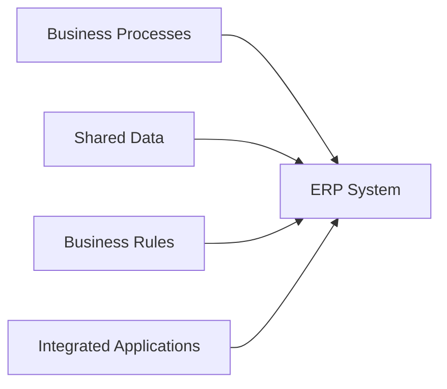

</div>

Odoo is one implementation of this idea. It is not the only ERP in the world, but it is the one this entire study guide is built around.

Before we discuss Odoo itself in Chapter 2, we need to understand what exactly it is integrating. That means learning how businesses actually operate, the processes, the departments, the data, and the workflows that any ERP platform must represent.


### RELEVANT RESOURCES

Here are the relevant resources for **FIRST: WHAT DOES ERP MEAN?**:

> **How previews work on GitHub:** Click a thumbnail to open the video on YouTube. GitHub Markdown cannot embed an inline player, but thumbnails give you a visual preview without leaving the page layout.

### 1. ENTERPRISE RESOURCE PLANNING (ERP) IN 15 MINUTES

| | |
|---|---|
| **Source** | Third-party conceptual overview |
| **Why use it** | Good conceptual ERP introduction before going deeper into Odoo |

<div align="center">

[](https://www.youtube.com/watch?v=gBXJ_PhlADQ)

**Watch on YouTube:** [Enterprise Resource Planning (ERP) in 15 Minutes](https://www.youtube.com/watch?v=gBXJ_PhlADQ)

</div>

---

## 1.1 BUSINESS PROCESSES

A business is not simply a collection of people sitting in departments. Departments matter for organization, but they do not describe what the company actually **does** all day.

A business performs work. Every hour of operation produces movement: goods shift, money flows, people act, documents get created, and customers receive outcomes. That movement is the life of the company.

- Customers place orders.
- Products are purchased.
- Goods arrive.
- Invoices are issued.
- Employees are hired.
- Payments are collected.
- Stock is moved.
- Expenses are approved.

Those activities are not random. They are organized into **business processes**, repeatable sequences that turn business needs into business results.

---

### 1.1.1 WHAT IS A BUSINESS PROCESS?

#### INTUITION

Imagine a customer calls a company and says:

> "I want to buy 10 laptops."

That single sentence sounds simple. Inside the company, it is not simple at all. Several things must happen before the company earns the money, and several things can go wrong along the way.

The company may need to:

- Check the customer.
- Check laptop availability.
- Create a quotation.
- Confirm the sale.
- Prepare the laptops.
- Deliver them.
- Create an invoice.
- Receive payment.

Each step depends on the previous one. You cannot invoice a customer who never ordered. You cannot deliver laptops you do not have. You cannot confirm a sale without checking whether the business can actually fulfill it.

That entire sequence, from customer request to collected payment, is a **business process**.

#### DEFINITION

A **business process** is a structured sequence of related activities performed to achieve a business objective. The activities are related because they serve the same goal. The sequence is structured because order usually matters.

We can describe it abstractly as:

$$ \text{Input} \rightarrow \text{Activities} \rightarrow \text{Output} $$

For example:

$$ \text{Customer Requirement} \rightarrow \text{Sell and Deliver Product} \rightarrow \text{Completed Sale} $$

But real business processes are usually more complicated because several departments may participate. Sales may start the process, Warehouse may fulfill it, and Finance may close it. The process is one chain; the participants are many.

#### WHY PROCESSES MATTER IN ERP

ERP software does not exist merely to store information. A spreadsheet can store information. A text file can store information. ERP software exists to **support processes**, to make the right steps happen in the right order, with the right data, involving the right people.

For example, a Sales Order in an ERP might trigger:

- inventory reservation,
- delivery preparation,
- accounting preparation,
- purchasing requirements,
- manufacturing requirements.

One business event creates consequences across the system. That is not a side effect. That is the point.

Therefore, when an Odoo developer receives a request such as:

> "Add an approval button to the Sales module."

The real question should not immediately be:

> "How do I create the button?"

Instead:

> "Where does approval belong in the sales process, who performs it, what conditions apply, and what should happen afterward?"

That distinction separates basic coding from **ERP engineering**. A button is easy. A correctly placed business rule is valuable.

#### EXAMPLE: EMPLOYEE HIRING

Consider HR recruitment:

$$ \text{Vacant Position} \rightarrow \text{Recruitment} \rightarrow \text{Interview} \rightarrow \text{Offer} \rightarrow \text{Employee Creation} $$

The process has a goal: turn an approved hiring requirement into an employed worker. Every step exists to move the company closer to that outcome.

ERP systems represent many such business processes. Some are commercial, like sales. Some are operational, like inventory movement. Some are administrative, like hiring. The pattern is the same even when the industry changes.

---

### 1.1.2 PROCESS INPUTS

A process cannot begin from nothing. Something has to trigger the work. Something has to enter the system. Something has to give the process a reason to start.

That something is its **input**.

#### DEFINITION

A **process input** is any information, material, request, resource, or event required for the process to begin or continue. Inputs can therefore be physical or informational. A truck arriving at a warehouse is an input. A customer email requesting a quote is also an input.

#### EXAMPLES

| Process           | Possible Input      |
| ----------------- | ------------------- |
| Sales             | Customer inquiry    |
| Purchasing        | Need for materials  |
| Manufacturing     | Raw materials       |
| Payroll           | Employee attendance |
| Inventory receipt | Vendor delivery     |
| Accounting        | Invoice             |
| Recruitment       | Job vacancy         |

#### ERP PERSPECTIVE

Inputs frequently appear in an ERP as **records**. The business world speaks in events; the ERP world stores those events as structured data.

For example:

<div align="center">

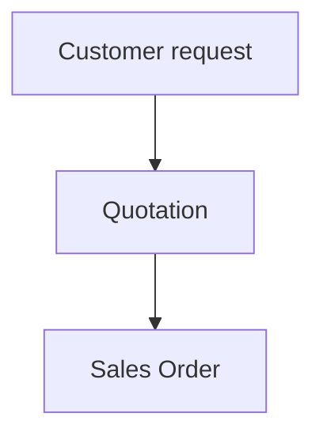

</div>

The real-world business event becomes structured data inside the ERP. The customer call becomes a quotation record. The accepted quotation becomes a sales order record.

This is extremely important for future Odoo development. You'll eventually learn that Odoo represents business information as models and records. But the underlying reason those records exist is usually because some business process needs them. You are not creating database rows for decoration, you are capturing process inputs.

---

### 1.1.3 PROCESS ACTIVITIES

Inputs alone accomplish nothing. A customer inquiry sitting in an inbox does not generate revenue. A job vacancy sitting in a manager's head does not produce a hire.

Someone or something must perform work. Those steps are the **activities** of the process.

For a purchase:

1. Determine that stock is required.
2. Select a supplier.
3. Request or confirm pricing.
4. Create a purchase order.
5. Send the purchase order.
6. Receive the goods.
7. Verify the vendor bill.
8. Pay the vendor.

Each step is an activity. Together, they transform a purchasing need into a completed procurement cycle.

#### HUMAN ACTIVITIES VS AUTOMATED ACTIVITIES

Activities may be performed by **humans**.

**Example:**

A purchasing manager approves a Purchase Order.

They may also be **automated**.

**Example:**

The ERP automatically calculates taxes.

Or **partially automated**.

**Example:**

The ERP detects low inventory but a buyer decides whether to order more.

ERP systems therefore coordinate both:

$$ \text{Human Decisions} + \text{Automated Business Rules} $$

The best ERP implementations do not try to remove humans from judgment. They remove humans from repetitive coordination work so judgment can happen where it actually matters.

#### ACTIVITY DEPENDENCIES

Activities often depend on earlier activities. Business reality has an order, and systems that ignore that order create chaos.

For example:

You normally cannot deliver an order that hasn't been confirmed.

Conceptually:

$$ A \rightarrow B \rightarrow C $$

where:

- A = quotation
- B = confirmed order
- C = delivery

An ERP enforces or assists these dependencies. That is why ERP applications contain things such as:

- statuses,
- approval states,
- validations,
- required fields,
- workflow actions.

These are not arbitrary UI features. They are not there because a designer liked buttons. They represent **business process rules**, the system's way of protecting operational logic.

---

### 1.1.4 PROCESS OUTPUTS

Every process exists to produce something. The result produced by a business process is its **output**.

**Example:**

<div align="center">

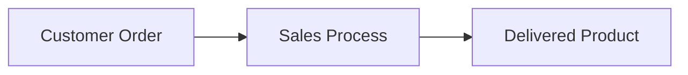

</div>

But one process's output can become another process's input. Business work rarely ends in a single step. It hands off.

For instance:

<div align="center">

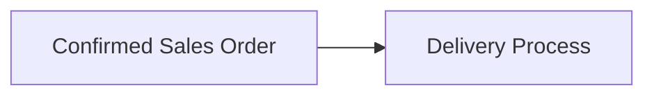

</div>

and:

<div align="center">

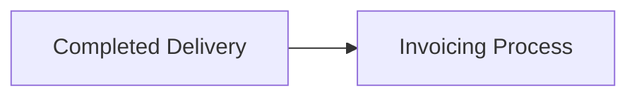

</div>

This chaining is one of the foundations of **ERP integration**. A business rarely consists of isolated processes. Instead, work flows:

<div align="center">

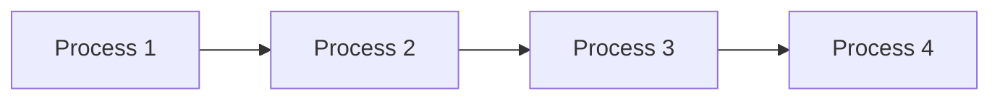

</div>

ERP systems connect them. That connection is what allows a sale in one department to create consequences in three others without anyone retyping the data.

---

### 1.1.5 PROCESS OWNERS

Processes need responsibility. A process without ownership becomes everyone's problem and therefore nobody's problem.

Suppose customers regularly receive incorrect deliveries. Who is responsible for improving the process? Who decides whether the picking checklist needs to change? Who evaluates whether warehouse and sales are using the same product codes?

Without ownership, everyone might say:

> "That isn't my responsibility."

A **process owner** is the person or organizational role responsible for ensuring that a process performs correctly. The owner may not do every task, but the owner answers for the outcome.

A process owner may care about:

- accuracy,
- compliance,
- efficiency,
- approvals,
- performance,
- exceptions,
- improvement.

#### IMPORTANT DISTINCTION

The process owner doesn't necessarily perform every step.

For example, a Sales Manager may own the sales process while:

- salesperson creates quotations,
- warehouse employee delivers goods,
- accountant creates invoices.

Ownership means responsibility for the process as a whole, not ownership of every click.

This becomes important when gathering Odoo requirements. If you're implementing a Sales workflow, interviewing only the programmer or IT department is insufficient. IT may know the software. The process owner knows the business rule.

You often need input from the **business process owner**.

A useful process model to carry with you is:

**Input → Activities → Output**

with:

**Process Owner** responsible for the process.

Keep this model. We will reuse it repeatedly.

So at this point, we can say we have the lens every Odoo developer needs before touching code. A **business process** transforms **inputs** into **outputs** through a structured sequence of **activities**, and ERP software exists to **support processes**, not merely store data; records usually exist because a process needs them. Activities can be human, automated, or partially automated; dependencies between steps show up as statuses, validations, and workflow rules. One process's **output** often becomes another process's **input**, and every process needs a **process owner** accountable for the whole flow even when many people perform individual steps.

With this process model in hand, the next layer is understanding who performs the work inside a company, and that means looking at **departments**.


### RELEVANT RESOURCES

Here are the relevant resources for **1.1 BUSINESS PROCESSES**:

### 2. BUSINESS PROCESS MAPPING 101: STEP-BY-STEP

| | |
|---|---|
| **Source** | Process modeling tutorial |
| **Why use it** | Very relevant to learning how to draw and read business flows |

<div align="center">

[](https://www.youtube.com/watch?v=zGB9SScvoQU)

**Watch on YouTube:** [Business Process Mapping 101: Step-by-Step](https://www.youtube.com/watch?v=zGB9SScvoQU)

</div>

---

## 1.2 DEPARTMENTS

Businesses divide work into specialized groups because no single person can master every function. Salespeople should sell. Accountants should account. Warehouse staff should move goods. Specialization creates speed and expertise.

These groups are usually called **departments** or **functional areas**. ERP software mirrors many of these functions through applications, Sales, Purchase, Inventory, Accounting, HR, and more.

The important insight, however, is:

> Departments are organizational boundaries; business processes frequently cross those boundaries.

A department describes who reports to whom. A process describes what must happen to deliver value. Those two structures overlap, but they are not the same thing.

---

### 1.2.1 SALES

The **Sales** department is responsible for converting customer demand into revenue. If no one sells, the business eventually stops, but selling alone does not complete the customer experience.

Typical responsibilities include:

- responding to customer inquiries,
- preparing quotations,
- negotiating prices,
- maintaining customer relationships,
- confirming sales,
- monitoring orders.

A simplified sales process:

$$ \text{Lead/Request} \rightarrow \text{Quotation} \rightarrow \text{Sales Order} $$

But Sales cannot usually complete the entire customer journey alone. Sales can promise a product, but someone else must often deliver it. Someone else must invoice it. Someone else may need to purchase it first.

Once an order is confirmed, Warehouse may need to deliver it and Finance may need to invoice it. So Sales is part of a larger system, not the whole system.

---

### 1.2.2 PURCHASING

**Purchasing**, also called **Procurement**, obtains goods and services from suppliers. When the company needs something it does not already have in the right quantity, Purchasing goes to the market.

Typical activities include:

- identifying requirements,
- comparing suppliers,
- requesting quotations,
- negotiating,
- issuing Purchase Orders,
- tracking deliveries.

Imagine inventory shows **5 laptops available**, but Sales needs **20**. Then **20 − 5 = 15** additional laptops may need to be purchased.

Sales demand can therefore create purchasing demand. The customer never spoke to Purchasing directly, but the sales process created a procurement requirement anyway.

That connection is precisely what integrated ERP systems are designed to support.

---

### 1.2.3 WAREHOUSE

The **Warehouse** function manages physical inventory movements. In many businesses, this is where operational reality meets the promise Sales made to the customer.

It may perform:

- receiving,
- storing,
- picking,
- packing,
- delivery,
- internal transfers,
- stock counting.

The warehouse does not merely answer:

> "How many products do we have?"

It also needs to know:

- Where are they?
- Are they reserved?
- Are more arriving?
- Are some damaged?
- Which customer should receive them?

Warehouse information therefore affects Sales, Purchase, Accounting, and Operations. If warehouse data is wrong, Sales may confirm orders that cannot ship. Finance may invoice goods that were never delivered. Purchasing may reorder stock that already exists but is misplaced.

---

### 1.2.4 FINANCE

**Finance** tracks the monetary consequences of business activity. Operations move goods; Finance translates those movements into financial truth.

Typical responsibilities include:

- customer invoices,
- vendor bills,
- payments,
- receivables,
- payables,
- accounting entries,
- taxes,
- reporting.

Consider a sale:

$$ \text{Product Delivery} \rightarrow \text{Customer Invoice} \rightarrow \text{Payment} $$

The physical movement of goods eventually produces a financial consequence. Revenue is not real in an accounting sense until the business records it properly, and cash is not collected until payment completes the cycle.

ERP integration connects operational events with accounting events so Finance does not live in a separate universe from the rest of the company.

---

### 1.2.5 HR

**Human Resources** manages information and processes related to employees. People are not background details in an ERP, they are participants in approvals, operations, projects, and costs.

Typical responsibilities include:

- recruitment,
- employee records,
- contracts,
- leave,
- attendance,
- expenses,
- performance-related processes.

**Why is HR relevant to ERP?**

Because people are also resources within enterprise processes.

For example, an employee may:

- approve a Purchase Order,
- submit an expense,
- manage a project,
- record a timesheet,
- operate a warehouse.

ERP systems therefore often connect employee identity with business responsibilities. When a purchase needs approval, the system must know who the approver is, not just that "some manager" exists somewhere.

---

### 1.2.6 OPERATIONS

**Operations** is the function responsible for executing the organization's core productive work. This is the department that actually produces what the company sells, whether that product is physical, digital, or a service.

Its meaning changes according to industry.

| Industry           | Operations may…           |
| ------------------ | ------------------------- |
| Manufacturer       | manufacture products      |
| Consulting company | deliver client projects   |
| Logistics company  | coordinate transportation |
| Restaurant         | prepare and deliver meals |

This is an important ERP lesson:

> The software must model the business rather than force every business into an identical process.

Odoo provides standard structures, but implementations often require configuration or customization to match operational reality. A restaurant's operations look nothing like a manufacturer's, and both deserve a system that fits.

#### DEPARTMENT INTEGRATION EXAMPLE

Imagine a company called **GulfTech Electronics**.

A customer wants 20 monitors.

**Sales** creates the order.

**Warehouse** checks available quantity. Only 8 exist.

**Purchasing** orders another 12 from a supplier.

**Warehouse** receives the 12. Now 20 can be delivered.

**Finance** invoices the customer and records the vendor obligation.

<div align="center">

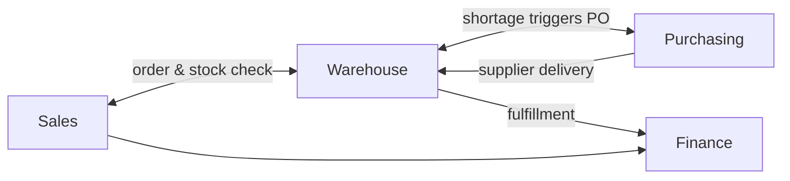

</div>

This is the business foundation behind the integrated ERP concept you described. No department completed the customer journey alone, but together they did.

So now we can see past the org chart. Businesses organize work into **departments** (Sales, Purchasing, Warehouse, Finance, HR, and Operations), and ERP applications mirror those functions. But **departments are boundaries of organization, not boundaries of work**. A single customer order can touch Sales, Warehouse, Purchasing, and Finance in sequence, and **Operations** means something different in every industry, so the ERP must fit the business, not the reverse.

Departments give us the org chart. The next question is what happens when a single business outcome requires several of them to cooperate on one connected path, and that is where **cross-department workflows** enter the picture.


### RELEVANT RESOURCES

Here are the relevant resources for **1.2 DEPARTMENTS**:

### 3. CROSS-FUNCTIONAL INFORMATION SYSTEMS / ERP

| | |
|---|---|
| **Source** | Academic / systems overview |
| **Why use it** | Explains why Sales, Inventory, Purchase, Finance, and other areas cannot be treated as isolated departments |

<div align="center">

[](https://www.youtube.com/watch?v=Igdb0Hp7xJw)

**Watch on YouTube:** [Cross-Functional Information Systems / ERP](https://www.youtube.com/watch?v=Igdb0Hp7xJw)

</div>

---

## 1.3 CROSS-DEPARTMENT WORKFLOWS

Individual departments have clear responsibilities, but customers do not experience the company as a collection of departments. They experience an outcome: the product arrives, the invoice is correct, the support call gets resolved.

A **cross-department workflow** is a business process whose activities involve multiple departments. The process is one; the participants are many.

### EXAMPLE: ORDER-TO-CASH

One famous ERP workflow is **Order-to-Cash**. It describes the journey from customer order to receiving customer payment, the full commercial cycle, not just the sales moment.

<div align="center">

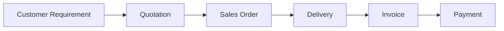

</div>

Departments involved might include:

| Stage     | Department |
| --------- | ---------- |
| Quotation | Sales      |
| Order     | Sales      |
| Picking   | Warehouse  |
| Delivery  | Warehouse  |
| Invoice   | Finance    |
| Payment   | Finance    |

This is one process spread across multiple organizational areas. If you only optimize Sales, you may win the quotation and lose the customer during delivery or billing.

### ANOTHER EXAMPLE: PROCURE-TO-PAY

**Procure-to-Pay** concerns buying something and eventually paying the supplier, the mirror image of Order-to-Cash on the spending side.

<div align="center">

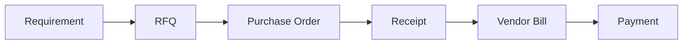

</div>

Departments:

$$ \text{Operations} \rightarrow \text{Purchasing} \rightarrow \text{Warehouse} \rightarrow \text{Finance} $$

### WHY ERP IS POWERFUL HERE

Imagine each department uses different software.

**Sales** knows: Customer ordered 100 units.

**Warehouse** has its own spreadsheet saying: 40 available.

**Purchasing** has another system saying: 60 scheduled for arrival.

**Accounting** doesn't know whether anything has actually been delivered.

Managers now need emails, calls, spreadsheets, and meetings simply to reconstruct the truth. The company is busy, but it is busy **coordinating** instead of **executing**.

ERP reduces this fragmentation by connecting the records involved in the workflow. When the sales order changes, inventory can reflect the reservation. When goods arrive, finance can prepare the bill. One event, many consequences, visible to everyone who needs to act.

Putting it together, a **cross-department workflow** is still one process even when many departments participate. **Order-to-Cash** runs from selling through to customer payment; **Procure-to-Pay** runs from buying through to supplier payment. When each team uses its own tool, managers rebuild the truth by hand. ERP connects the records that belong to the same workflow.

Processes and workflows generate data constantly, but not all data is the same kind. Some records describe events; others describe the stable entities those events revolve around. Separating those two categories is one of the most important distinctions in ERP.


### RELEVANT RESOURCES

Here are the relevant resources for **1.3 CROSS-DEPARTMENT WORKFLOWS**:

### 3. CROSS-FUNCTIONAL INFORMATION SYSTEMS / ERP

| | |
|---|---|
| **Source** | Academic / systems overview |
| **Why use it** | Explains why Sales, Inventory, Purchase, Finance, and other areas cannot be treated as isolated departments |

<div align="center">

[](https://www.youtube.com/watch?v=Igdb0Hp7xJw)

**Watch on YouTube:** [Cross-Functional Information Systems / ERP](https://www.youtube.com/watch?v=Igdb0Hp7xJw)

</div>

---

### 1. SAP LEARNING: EXPLORING END-TO-END BUSINESS PROCESSES IN SAP

| | |
|---|---|
| **Cost** | Free |
| **Covers** | Integrated processes, enterprise structures, master data, transactional data, cross-functional workflows |

[Open course: Exploring End-to-End Business Processes in SAP](https://learning.sap.com/courses/exploring-end-to-end-business-processes-in-sap-business-suite)

---

## 1.4 MASTER DATA

Not all business data represents an event. Some data describes the relatively stable entities used repeatedly across business processes. This is called **master data**, the "who" and "what" the business works with every day.

#### INTUITION

Suppose customer "Qatar Trading LLC" places 50 orders this year.

You should not recreate the customer's:

- company name,
- address,
- tax information,
- phone number,
- payment terms

from scratch for every order. That would waste time, invite typos, and guarantee inconsistency.

Instead, the company maintains a reusable customer record. Every order references the same customer identity. Update the address once, and every future document uses the corrected version.

That is master data.

#### DEFINITION

**Master data** is relatively stable, reusable business information describing core entities used across multiple processes and transactions.

Common ERP master data includes:

- customers,
- suppliers,
- products,
- employees,
- financial accounts.

Master data provides context for transactions. Transactions say what happened; master data says who and what it happened to.

---

### 1.4.1 CUSTOMERS

A **customer** master record may contain:

- name,
- address,
- phone,
- email,
- tax ID,
- payment terms,
- currency,
- salesperson.

That customer can later appear in:

- CRM opportunities,
- quotations,
- Sales Orders,
- deliveries,
- invoices,
- payments.

You do not need five unrelated copies of the customer. Ideally, the ERP shares the same business identity across every application. When Finance sees a customer on an invoice, it should be the same customer Sales saw on the order.

---

### 1.4.2 VENDORS

A **vendor** is an organization or person from whom the business purchases goods or services.

Vendor information might include:

- vendor name,
- address,
- contact details,
- payment terms,
- currency,
- purchasing information.

It may be used in:

$$ \text{RFQ} \rightarrow \text{Purchase Order} \rightarrow \text{Receipt} \rightarrow \text{Vendor Bill} $$

The vendor is **master data**. The Purchase Order is **transaction data**. The vendor exists as a business partner before any particular purchase happens. The purchase order records one specific event.

That distinction matters.

---

### 1.4.3 PRODUCTS

**Product** master data describes something the business buys, sells, stores, manufactures, or consumes.

Typical information:

- product name,
- internal reference,
- price,
- cost,
- category,
- unit of measure,
- tax configuration.

A single product may participate in:

- Sales,
- Purchase,
- Inventory,
- Manufacturing,
- Accounting,
- eCommerce,
- Point of Sale.

This is one of the strongest examples of why ERP integration matters. A product is not "a Sales thing" or "a Warehouse thing." It is a business entity that crosses the entire system.

Changing product information can influence many processes. Raise the price and Sales quotations change. Change the unit of measure and Warehouse calculations change. Adjust tax settings and Accounting behavior changes.

---

### 1.4.4 EMPLOYEES

**Employee** master data may contain:

- employee name,
- department,
- job position,
- manager,
- work contact details,
- organizational relationships.

Employees may later participate in transactions such as:

- leave requests,
- timesheets,
- expenses,
- projects.

Again: **Employee** = Master Data, while **Expense Claim** = Transaction.

The employee exists as a person in the organization. The expense claim records one specific action that person took.

---

### 1.4.5 ACCOUNTS

**Financial accounts** provide the structure used for categorizing monetary activity.

Examples include:

- cash,
- bank,
- accounts receivable,
- accounts payable,
- sales revenue,
- expenses.

The account itself is relatively stable configuration/master information. Individual accounting entries against those accounts are transactions.

#### MASTER DATA VS TRANSACTION DATA

This distinction is important enough to memorize.

| Master Data | Transaction Data |
| ----------- | ---------------- |
| Customer    | Customer invoice |
| Vendor      | Purchase Order   |
| Product     | Sales Order      |
| Employee    | Timesheet        |
| Account     | Journal entry    |

Conceptually: **Master Data** = Who/What, while **Transaction** = What Happened.

Not perfectly in every case, but it is an excellent beginner mental model.

With that distinction clear, we can say **master data** is the stable "who and what" of the business (customers, vendors, products, employees, accounts), while **transaction data** is the "what happened" that references those entities. One product record alone can ripple through Sales, Purchase, Inventory, Manufacturing, Accounting, eCommerce, and Point of Sale. Remember: **Master Data = Who/What**; **Transaction = What Happened**.

Master data tells you who and what exists. **Transactions** tell you what actually happened, and over time, those events become the company's operational history.


### RELEVANT RESOURCES

Here are the relevant resources for **1.4 MASTER DATA**:

### 3. SAP LEARNING: UNDERSTANDING THE CONCEPT OF MASTER DATA

| | |
|---|---|
| **Cost** | Free |
| **Why use it** | Excellent reinforcement for the distinction: **Master Data ≠ Transaction Data** |

[Open lesson: Understanding the Concept of Master Data](https://learning.sap.com/learning-journeys/explore-integrated-business-processes-in-sap-s-4hana-/understanding-the-concept-of-master-data_a91e9234-9d79-47b1-adba-60ed63bd836c)

---

## 1.5 TRANSACTIONS

A **transaction** records a business event or activity. If master data is the cast of characters, transactions are the scenes in the story.

Examples:

- customer places an order,
- supplier sends goods,
- inventory moves,
- customer makes payment,
- employee submits expense.

Transactions typically reference master data. They rarely float alone.

**Example:**

$$ \text{Customer A} + \text{Product X} + \text{Quantity 10} + \text{Price 500} $$

becomes a Sales transaction.

If each item costs 500 QAR:

$$ 10 \times 500 = 5{,}000\text{ QAR} $$

The transaction says: Customer A purchased 10 units of Product X for 5,000 QAR. Every piece of that sentence connects master data (Customer A, Product X) with event data (quantity, price, total).

### TRANSACTIONS CREATE BUSINESS HISTORY

Master data tells us that a customer exists. Transactions tell us what that customer has done.

For example:

**Customer:** Doha Technical Services

**Transactions:**

- Order SO001
- Order SO014
- Invoice INV008
- Payment PAY006

Over time, transactional data becomes the organization's operational history. You can see what was sold, what was delivered, what was invoiced, and what was paid. That history drives reporting, auditing, customer service, and management decisions.

This is why ERP databases become extremely valuable. The data is not just storage, it is evidence of how the business actually ran.

### DOCUMENT FLOW

Many ERP transactions create related documents. One business outcome produces a chain of records, each representing a step in the process.

For example:

$$ \text{Quotation} \rightarrow \text{Sales Order} \rightarrow \text{Delivery} \rightarrow \text{Invoice} \rightarrow \text{Payment} $$

Later, in Odoo, you'll see these relationships directly. A sales order will link to its delivery. A delivery will link to its invoice. Understanding the business meaning now will make the technical implementation much easier.

So a **transaction** is a recorded business event that usually points back to master data. Master data tells us who exists; **transactions tell us what they did**. Stack enough transactions and you have the company's **operational history**: quotations, orders, deliveries, invoices, and payments linked in chains you will recognize in Odoo screens later.

When dozens of departments create thousands of transactions referencing the same customers and products, the company faces a new challenge: which version of the truth is correct?


### RELEVANT RESOURCES

Here are the relevant resources for **1.5 TRANSACTIONS**:

### 2. SAP LEARNING: EXECUTING BASIC ERP PROCESSES WITH SAP S/4HANA

| | |
|---|---|
| **Cost** | Free |
| **Covers** | Purchase order management, goods receipt, invoice verification, sales order management, production basics |

[Open course: Executing Basic ERP Processes with SAP S/4HANA](https://learning.sap.com/courses/executing-basic-erp-processes-with-sap-s-4hana)

---

## 1.6 SINGLE SOURCE OF TRUTH

This is another central ERP principle, and one that sounds simpler than it is.

Imagine **Sales** maintains: Customer phone = 55511111

**Accounting** maintains: Customer phone = 55522222

**Support** maintains: Customer phone = 55533333

Which value is correct? All three departments believe they are helping the customer. All three may be wrong.

This is a **data consistency problem**. It is not a technology problem first. It is a business governance problem that technology can either improve or amplify.

### SINGLE SOURCE OF TRUTH

A **single source of truth** means the organization establishes an authoritative place or record from which information is consistently obtained.

It doesn't necessarily mean "only one physical database table in the whole universe." It means that for a particular business fact, the organization knows which representation is authoritative. If someone asks for the customer's phone number, there is one answer the company trusts.

#### ERP EXAMPLE

Instead of a **Customer** record in Sales, another in Accounting, and another in Inventory, we aim for one **Shared Customer Record** used across applications.

This reduces:

- duplication,
- contradictory information,
- manual synchronization,
- human errors.

#### BUT INTEGRATION CREATES RESPONSIBILITY

A common beginner misconception is:

> "Shared data means everything automatically becomes correct."

No.

Shared incorrect data can actually spread problems faster. If someone enters the wrong customer's tax number into the authoritative record, several departments may use the wrong value, confidently, simultaneously, and at scale.

Therefore ERP requires:

- validation,
- permissions,
- ownership,
- data quality,
- controlled changes.

Single source of truth improves consistency, but only when the source is managed properly. Integration gives you one place to fix problems. It also gives you one place to **create** them if you are careless.

We can now say a **single source of truth** means the company knows which record is authoritative for a given fact: one **shared customer record** across applications instead of scattered copies. That only works when people respect validation, permissions, ownership, and data quality, because integration spreads good data fast and bad data just as fast.

With processes, departments, master data, transactions, and a single source of truth defined, we can now compare ERP to systems you may already have heard of, starting with **CRM**.


### RELEVANT RESOURCES

Here are the relevant resources for **1.6 SINGLE SOURCE OF TRUTH**:

### 1. ENTERPRISE RESOURCE PLANNING (ERP) IN 15 MINUTES

| | |
|---|---|
| **Source** | Third-party conceptual overview |
| **Why use it** | Good conceptual ERP introduction before going deeper into Odoo |

<div align="center">

[](https://www.youtube.com/watch?v=gBXJ_PhlADQ)

**Watch on YouTube:** [Enterprise Resource Planning (ERP) in 15 Minutes](https://www.youtube.com/watch?v=gBXJ_PhlADQ)

</div>

---

## 1.7 ERP VS CRM

ERP and CRM overlap, but they are not the same thing. Many sales teams live inside CRM tools every day and reasonably wonder whether they already "have ERP." The answer depends on what happens after the opportunity closes.

**CRM** means **Customer Relationship Management.**

Its primary concern is the relationship between the company and prospects/customers, before and during the selling conversation.

Typical CRM functionality includes:

- leads,
- opportunities,
- sales pipelines,
- customer interactions,
- sales activities.

ERP covers a much broader operational scope. CRM helps you win the deal. ERP helps you **fulfill** it across the entire company.

### COMPARISON

| CRM                                 | ERP                                  |
| ----------------------------------- | ------------------------------------ |
| Primarily customer-facing processes | Organization-wide business processes |
| Leads                               | Sales                                |
| Opportunities                       | Purchasing                           |
| Pipeline                            | Inventory                            |
| Sales activities                    | Accounting                           |
| Customer interaction                | Manufacturing                        |
| Revenue generation focus            | Resource and operational integration |

CRM asks questions such as:

> Which opportunities may convert this month?

ERP asks much broader questions such as:

> If those opportunities become orders, do we have stock, do we need purchasing, what needs delivery, what must be invoiced, and how does this affect accounting?

CRM optimizes the front of the revenue engine. ERP runs the engine itself.

### ODOO PERSPECTIVE

This distinction will become interesting because Odoo includes CRM as one application inside a larger ERP ecosystem.

So:

$$ \text{CRM} \subset \text{Broader Odoo Business System} $$

conceptually.

CRM is therefore an important part of enterprise operations, but not the entire enterprise system.

In short, **CRM** lives at the front of the revenue story (leads, pipelines, opportunities), while **ERP** runs the whole operation once a deal becomes real work: stock, purchasing, delivery, invoicing, manufacturing. CRM asks which deals might close; ERP asks whether the company can actually fulfill them. In Odoo you will see both, with CRM sitting inside the broader business system rather than replacing it.

CRM is often one application among many. Companies also run standalone tools for accounting, warehouse, HR, and purchasing, and that creates a different kind of challenge.


### RELEVANT RESOURCES

Here are the relevant resources for **1.7 ERP VS CRM**:

### 1. ENTERPRISE RESOURCE PLANNING (ERP) IN 15 MINUTES

| | |
|---|---|
| **Source** | Third-party conceptual overview |
| **Why use it** | Good conceptual ERP introduction before going deeper into Odoo |

<div align="center">

[](https://www.youtube.com/watch?v=gBXJ_PhlADQ)

**Watch on YouTube:** [Enterprise Resource Planning (ERP) in 15 Minutes](https://www.youtube.com/watch?v=gBXJ_PhlADQ)

</div>

---

## 1.8 ERP VS STANDALONE BUSINESS SOFTWARE

Before ERP systems, or even alongside them today, businesses often use independent applications. Each tool may be excellent at its job. The fracture appears when the **process** crosses tool boundaries.

For example:

| Function   | Tool                  |
| ---------- | --------------------- |
| Sales      | spreadsheet           |
| Accounting | accounting software   |
| Warehouse  | inventory application |
| HR         | HR platform           |
| Purchasing | email and Excel       |

Each might work well individually. Sales loves the spreadsheet because it is flexible. Accounting loves its tool because it is compliant. Warehouse loves its app because it tracks bins. The problem appears when the business process crosses application boundaries.

### EXAMPLE

**Sales** confirms: 100 units.

**Warehouse** system says: 80 units available.

**Purchasing** knows: 20 arriving tomorrow.

but those applications don't communicate.

Sales may tell the customer:

> "Everything is available."

Now operational trouble begins. The customer expects 100 units. Warehouse can only ship 80 today. Purchasing expected to backfill, but nobody connected the three truths into one answer.

### STANDALONE SYSTEMS

Standalone systems can offer advantages:

- highly specialized functionality,
- simpler implementation,
- independent deployment.

But they create integration challenges. Data may need to move using:

- manual re-entry,
- CSV exports,
- APIs,
- integrations,
- middleware.

Every transfer is a chance for delay, error, or version mismatch.

### ERP APPROACH

ERP attempts to provide more integrated processes.

Instead of separate data islands, the goal becomes a **Connected Enterprise System** where business applications understand related information.

<div align="center">

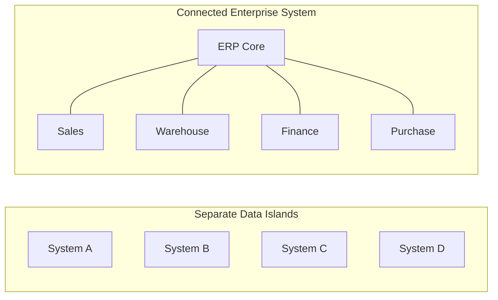

</div>

#### IMPORTANT LIMITATION

ERP does not mean every company must replace every external application. Real organizations may still integrate ERP with:

- banks,
- payment gateways,
- shipping providers,
- eCommerce platforms,
- government services,
- specialist systems.

Therefore enterprise architecture is often:

$$ ERP + External Systems + Integrations $$

rather than:

$$ ERP = \text{Literally Everything} $$

Standalone tools can each be excellent, yet they fracture the moment a process crosses a boundary. Data hops through exports, APIs, or manual re-entry, and every handoff is a chance to lose the plot. ERP aims for a **Connected Enterprise System** where applications share related information, but real life is usually **ERP + External Systems + Integrations**, not one system doing literally everything.

Understanding what ERP is, and what it is not, prepares you for the practical skill that turns business knowledge into implementable design: **business process mapping**.


### RELEVANT RESOURCES

Here are the relevant resources for **1.8 ERP VS STANDALONE BUSINESS SOFTWARE**:

### 3. CROSS-FUNCTIONAL INFORMATION SYSTEMS / ERP

| | |
|---|---|
| **Source** | Academic / systems overview |
| **Why use it** | Explains why Sales, Inventory, Purchase, Finance, and other areas cannot be treated as isolated departments |

<div align="center">

[](https://www.youtube.com/watch?v=Igdb0Hp7xJw)

**Watch on YouTube:** [Cross-Functional Information Systems / ERP](https://www.youtube.com/watch?v=Igdb0Hp7xJw)

</div>

---

## 1.9 BUSINESS PROCESS MAPPING

Before configuring or developing an ERP workflow, you need to understand the process you are implementing. Code without process understanding produces features that work technically and fail operationally.

That is where **business process mapping** comes in.

#### INTUITION

Suppose a manager says:

> "We need an approval system for purchases."

A poor implementation begins immediately with:

> "I'll add an Approve button."

A proper ERP implementation asks:

- Who creates the request?
- What exactly is being requested?
- Who approves it?
- Does every purchase require approval?
- Does approval depend on amount?
- What happens after approval?
- Can approval be rejected?
- Can the requester edit after approval?
- Who receives notifications?
- What records are created afterward?

Only after understanding these questions should the system be designed. The button is the last detail, not the first.

#### PROCESS MAPPING

**Business process mapping** means representing the sequence of activities, decisions, participants, inputs, and outputs in a business process.

A conceptual model can be written as:

$$ I \rightarrow A_1 \rightarrow D_1 \rightarrow A_2 \rightarrow O $$

where:

- I = input
- A = activity
- D = decision
- O = output

#### EXAMPLE: PURCHASE APPROVAL

Suppose the rule is:

- Purchases below 5,000 QAR require manager approval.
- Purchases above 5,000 QAR require manager and finance approval.

We can model the process mathematically.

Let:

$$ P = \text{Purchase Amount} $$

Then:

$$ P < 5000 \Rightarrow \text{Manager Approval} $$

and:

$$ P \geq 5000 \Rightarrow \text{Manager Approval + Finance Approval} $$

<div align="center">

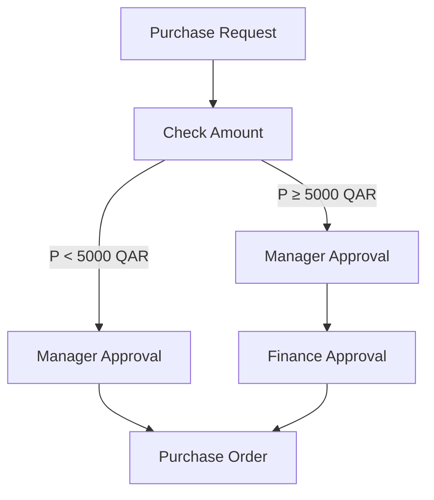

</div>

This is already giving us information that an eventual Odoo customization might require:

- state/status field,
- purchase amount,
- approval rules,
- user roles,
- buttons,
- permissions,
- validations.

Notice what happened. We went from **Business Requirement** to **Business Process**, and only then can we move toward **Odoo Design**, and later **Code**.

That sequence is fundamental. Skip a step and you build the wrong thing efficiently.

#### AS-IS VS TO-BE PROCESSES

Two concepts are especially useful in ERP projects.

**As-Is Process**: How the company works today.

**Example:** Employee emails manager → manager replies → employee sends spreadsheet to Purchasing.

**To-Be Process**: How the company should operate after the new ERP implementation.

**Example:** Employee creates Purchase Request → system routes it to manager → approval automatically creates procurement work.

<div align="center">

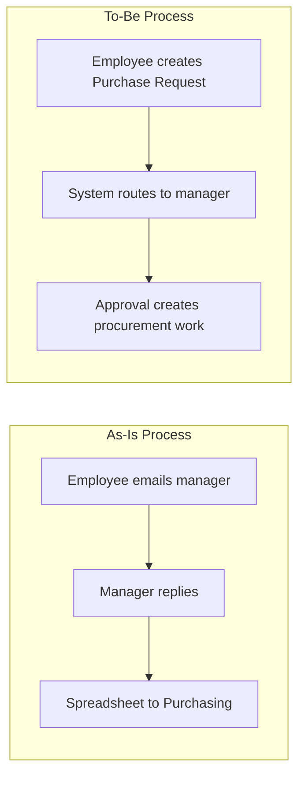

</div>

Do not automatically copy every inefficient existing practice into an ERP. Sometimes implementation means improving the process, not digitizing dysfunction.

#### BUSINESS PROCESS MAPPING QUESTIONS

When investigating a process, ask:

| Category     | Question                       |
| ------------ | ------------------------------ |
| Trigger      | What starts the process?       |
| Input        | What information is required?  |
| Actor        | Who performs each activity?    |
| Activity     | What actually happens?         |
| Decision     | Where can the flow branch?     |
| Rule         | What conditions control it?    |
| Output       | What does the process produce? |
| Exception    | What can go wrong?             |
| Owner        | Who is responsible?            |
| Next process | What happens afterward?        |

These questions will become extremely valuable once you begin actual Odoo development.

So now we can say the practical skill that ties this chapter together is **business process mapping**: capturing activities, decisions, participants, inputs, and outputs before anyone opens Odoo Studio or writes a line of Python. The healthy sequence is **Business Requirement → Business Process → Odoo Design → Code**. Map the **As-Is** process honestly, design the **To-Be** process deliberately, and use the investigation questions from the table above every time a stakeholder says "we just need a button."

---

We can now describe the whole ERP concept much more accurately.

- A company contains departments.
- Those departments execute business processes.
- Processes consume inputs, perform activities, and produce outputs.
- They operate using relatively stable master data.
- They generate transactions.
- Many processes cross multiple departments.
- ERP connects these processes and records while trying to maintain consistent authoritative information, a single source of truth.
- Before implementing such processes in software, we use business process mapping to understand how the business actually works.

Therefore:

**ERP = Integrated Management of Business Processes and Business Data**

That is a much stronger understanding than simply saying:

> "ERP is business software."


### RELEVANT RESOURCES

Here are the relevant resources for **1.9 BUSINESS PROCESS MAPPING**:

### 2. BUSINESS PROCESS MAPPING 101: STEP-BY-STEP

| | |
|---|---|
| **Source** | Process modeling tutorial |
| **Why use it** | Very relevant to learning how to draw and read business flows |

<div align="center">

[](https://www.youtube.com/watch?v=zGB9SScvoQU)

**Watch on YouTube:** [Business Process Mapping 101: Step-by-Step](https://www.youtube.com/watch?v=zGB9SScvoQU)

</div>

---

### 1. BPMN.IO: INTERACTIVE BPMN PROCESS MODELER

| | |
|---|---|
| **Type** | Interactive web tool |
| **Why use it** | Highly recommended for Chapter 1. Instead of merely writing text flows, you can visually draw actual business processes |

[Open the Interactive BPMN Modeler](https://demo.bpmn.io/new)

**Use it to draw:**

**Order-to-Cash**

<div align="center">

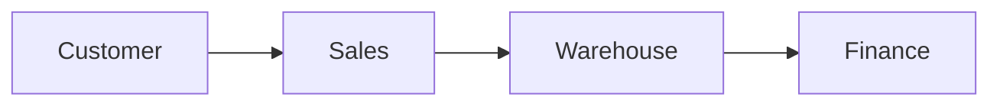

</div>

**Procure-to-Pay**

<div align="center">

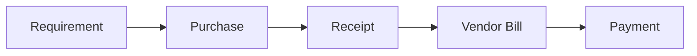

</div>

Also useful:

- [bpmn.io Main Website](https://bpmn.io/)
- [BPMN Walkthrough](https://bpmn.io/toolkit/bpmn-js/walkthrough/) (helpful once you want to understand the visual process notation better)

---

## COMPLETE RUNNING EXAMPLE: GULFTECH ELECTRONICS

Let's combine every Chapter 1 concept.

A customer called **ABC Trading** wants 20 monitors.

### MASTER DATA

Existing records:

**Customer:** ABC Trading

**Product:** 27-inch Monitor

**Vendor:** Global Displays Ltd.

### STEP 1: SALES

ABC Trading requests 20 monitors.

**Input:** Customer Requirement

Sales creates a quotation. After customer acceptance:

<div align="center">

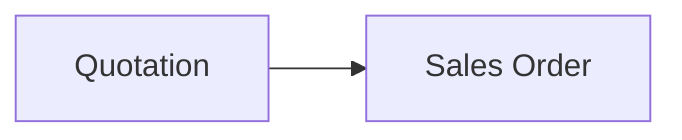

</div>

This creates a transaction.

### STEP 2: WAREHOUSE

ERP checks inventory.

| | Units |
| --- | --- |
| **Available** | 8 |
| **Required** | 20 |
| **Shortage** | 12 (20 − 8) |

Warehouse cannot immediately fulfill the complete order.

### STEP 3: PURCHASING

Purchasing needs 12 additional monitors. It creates a Purchase Order for Global Displays Ltd. That is another transaction.

### STEP 4: VENDOR DELIVERY

The supplier delivers 12 monitors. Warehouse receives them.

Inventory now becomes **20** (8 + 12).

### STEP 5: CUSTOMER DELIVERY

Warehouse prepares the customer's 20 monitors. The delivery transaction confirms stock movement.

### STEP 6: FINANCE

The customer must be invoiced.

**Unit price:** 1,000 QAR

**Invoice total:** 20,000 QAR (20 × 1,000)

Finance creates a customer invoice for 20,000 QAR.

The customer later pays.

<div align="center">

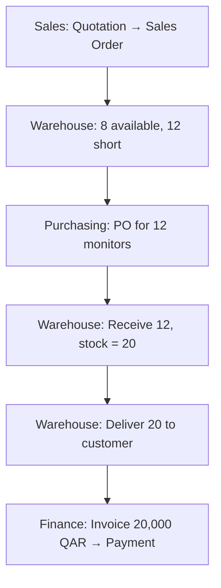

</div>

### WHAT WAS INTEGRATED?

- Sales knew the customer order.
- Warehouse knew the inventory requirement.
- Purchasing knew the shortage.
- Warehouse knew when supplier goods arrived.
- Finance knew what needed invoicing.
- Management could theoretically inspect the process from beginning to end.

That is the integrated enterprise concept at the heart of ERP.


### RELEVANT RESOURCES

Here are the relevant resources for **COMPLETE RUNNING EXAMPLE: GULFTECH ELECTRONICS**:

### 2. BUSINESS PROCESS MAPPING 101: STEP-BY-STEP

| | |
|---|---|
| **Source** | Process modeling tutorial |
| **Why use it** | Very relevant to learning how to draw and read business flows |

<div align="center">

[](https://www.youtube.com/watch?v=zGB9SScvoQU)

**Watch on YouTube:** [Business Process Mapping 101: Step-by-Step](https://www.youtube.com/watch?v=zGB9SScvoQU)

</div>

---

### 1. BPMN.IO: INTERACTIVE BPMN PROCESS MODELER

| | |
|---|---|
| **Type** | Interactive web tool |
| **Why use it** | Highly recommended for Chapter 1. Instead of merely writing text flows, you can visually draw actual business processes |

[Open the Interactive BPMN Modeler](https://demo.bpmn.io/new)

**Use it to draw:**

**Order-to-Cash**

<div align="center">


</div>

**Procure-to-Pay**

<div align="center">


</div>

Also useful:

- [bpmn.io Main Website](https://bpmn.io/)
- [BPMN Walkthrough](https://bpmn.io/toolkit/bpmn-js/walkthrough/) (helpful once you want to understand the visual process notation better)

---

## COMMON BEGINNER MISTAKES FROM CHAPTER 1

### 1. THINKING ERP MEANS ACCOUNTING SOFTWARE

Accounting is only one major component. ERP may integrate Sales, Purchase, Inventory, HR, Manufacturing, Projects, Finance, and much more.

### 2. THINKING ERP MEANS A DATABASE

ERP certainly uses a database, but a database alone doesn't understand business processes. ERP adds:

- workflows,
- business rules,
- permissions,
- documents,
- applications,
- user interfaces,
- automation.

### 3. THINKING EACH DEPARTMENT IS INDEPENDENT

Departments have responsibilities, but enterprise workflows usually cross departments.

### 4. CONFUSING MASTER DATA WITH TRANSACTIONS

Remember: **Customer** = Master Data, and **Customer Order** = Transaction.

### 5. ASSUMING ERP AUTOMATICALLY FIXES BAD PROCESSES

Software can automate a bad process just as easily as a good process. Process understanding comes first.

### 6. CODING BEFORE UNDERSTANDING THE BUSINESS REQUIREMENT

This is one of the most dangerous mistakes for an Odoo developer.

Never translate:

> "We need approval."

directly into:

> "Create an approval button."

First understand the process.

---

## CHAPTER 1 MASTERY CHECK

You should now be able to explain why the following statement is incomplete:

"ERP is software companies use to manage business."

A stronger explanation would be:

ERP is an integrated business system that supports organizational processes across departments using connected master data, transactions, workflows, and business rules. It reduces fragmented information and allows events in one business area, such as Sales, to influence related areas such as Inventory, Purchasing, and Finance.

If that explanation makes sense rather than merely sounding technical, then the foundation is working.

---

## CHAPTER 1 SUMMARY

We began with the most important idea: a business is a network of processes.

<div align="center">

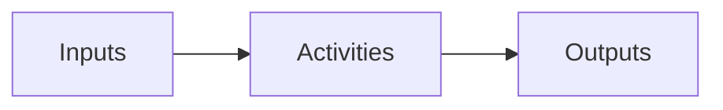

</div>

Processes have ownership. Departments specialize in different responsibilities (**Sales**, **Purchase**, **Warehouse**, **Finance**, **HR**, **Operations**), but business processes frequently cross those boundaries. ERP systems connect those workflows.

We then separated two major data categories:

<div align="center">

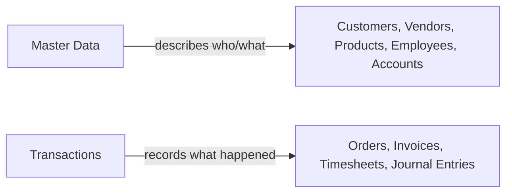

</div>

Integrated systems aim for a reliable **Single Source of Truth**, and ERP is broader than CRM or isolated standalone business applications. ERP implementation begins with **Business Process Mapping**, because software should be designed around a properly understood business process.

At this point we understand the problem domain: customers, vendors, products, employees, departments, processes, transactions, and workflows. What we have not yet answered is how Odoo represents all of this.

<div align="center">

```mermaid
flowchart LR
    C1["ERP as a Business Concept"] --> C2["Odoo as an ERP Platform"]
```

</div>

That is where Chapter 2 picks up. We move from understanding ERP as a business idea to learning **Odoo as an ERP Platform**: what Odoo actually is, its ecosystem, Community vs Enterprise, Odoo Online vs Odoo.sh vs on-premise, apps, addons, users, companies, shared records, standard vs custom modules, and the concept of Odoo Studio.

When you are ready to test yourself on this chapter, work through the [Exercise](Exercise.md) and [Project](Project.md).
