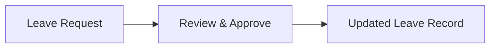
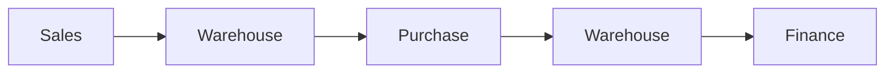
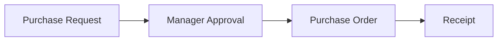
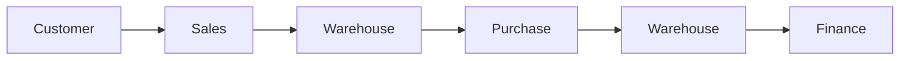
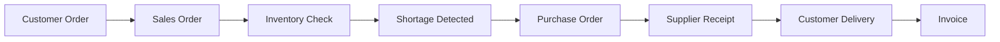

# CHAPTER 1 EXERCISE

Try these without looking back at Content.md immediately. Answer in your own words first, then compare with the complete solution at the bottom of this file.

For ERP videos, SAP courses, and the bpmn.io process modeler, see [Resources.md](Resources.md).

---

## TABLE OF CONTENTS

- [Part A: Concepts](#part-a-concepts)
- [Part B: Scenario](#part-b-scenario)
- [Complete Solution](#chapter-1-exercise-complete-solution)
  - [Part A Solutions](#part-a-concepts-1)
  - [Part B Solution](#part-b-scenario-solution)

---

## PART A: CONCEPTS

1. What makes something a **business process** rather than simply an isolated task?

2. Identify the **input**, **activities**, **output**, and **process owner** of an employee leave-request process.

3. Explain why **Sales**, **Warehouse**, **Purchase**, and **Finance** cannot always operate independently.

4. Explain the difference between **master data** and **transaction data**.

5. Classify each item:

   | Item | Your classification |
   | --- | --- |
   | Customer | |
   | Sales Order | |
   | Product | |
   | Invoice | |
   | Employee | |
   | Purchase Order | |

6. Explain **single source of truth** in your own words.

7. Why is a **CRM** not normally equivalent to a complete **ERP**?

8. Give one **advantage** and one **disadvantage** of standalone business software.

9. What is **business process mapping**?

10. Why should process mapping happen **before** major ERP customization?

---

## PART B: SCENARIO

A company sells office chairs.

- A customer orders **50 chairs**.
- Only **30** are available.
- The company purchases **20** additional chairs.
- The supplier delivers them.
- Warehouse ships all **50 chairs** to the customer.
- Finance invoices the customer.

For this scenario, identify:

- master data,
- transactions,
- departments,
- process inputs,
- process outputs,
- cross-department workflow,
- likely process owners.

---

# CHAPTER 1 EXERCISE: COMPLETE SOLUTION

Work through the questions above first. The solutions below explain the reasoning Chapter 1 expects you to demonstrate.

---

## PART A: CONCEPTS

### 1. WHAT MAKES SOMETHING A BUSINESS PROCESS RATHER THAN SIMPLY AN ISOLATED TASK?

A **business process** is a connected sequence of activities that works toward a defined business outcome.

An isolated task is only one action.

For example:

- **Task:** "Create an invoice."
- **Process:** Receive customer order → prepare goods → deliver goods → create invoice → collect payment.

A business process normally has:

- an input,
- several related activities,
- an expected output,
- people or departments involved,
- business rules,
- a process owner.

So the key difference is that a task is one piece of work, while a business process connects multiple pieces of work to achieve a business goal.

---

### 2. EMPLOYEE LEAVE-REQUEST PROCESS

**Input**

The main input is an employee's request for leave.

Other inputs may include:

- employee identity,
- requested leave dates,
- leave type,
- available leave balance,
- reason, if required.

**Activities**

A typical process could be:

1. Employee creates leave request.
2. System or HR checks the employee's leave balance.
3. Manager reviews the request.
4. Manager approves or rejects it.
5. Approved leave is recorded.
6. HR or scheduling information is updated.

**Output**

Possible outputs are:

- Approved leave request
- Rejected leave request
- Updated leave balance
- Updated employee availability

**Process owner**

A likely process owner is the **HR Manager / Human Resources Department**.

A line manager may approve individual requests, but HR normally owns the overall leave-management process and rules.

---

### 3. WHY SALES, WAREHOUSE, PURCHASE, AND FINANCE CANNOT ALWAYS OPERATE INDEPENDENTLY

These departments work on different parts of the same business process.

Suppose Sales receives an order for 100 products. Sales needs Warehouse to know whether those products are available. If only 70 are available, Purchasing may need to buy another 30. Once the goods are delivered, Finance must create the customer invoice and later record the payment.

If the departments operate independently, problems can appear:

- Sales may promise unavailable stock.
- Purchasing may buy unnecessary products.
- Warehouse may not know which order needs stock.
- Finance may invoice before the goods are delivered.
- Different departments may hold conflicting data.

ERP exists partly to connect these activities.

---

### 4. DIFFERENCE BETWEEN MASTER DATA AND TRANSACTION DATA

**Master data** represents relatively stable business entities that are reused repeatedly.

Examples:

- customers,
- vendors,
- products,
- employees,
- accounts.

**Transaction data** represents business events that happen over time.

Examples:

- Sales Order,
- Purchase Order,
- invoice,
- payment,
- stock movement.

A useful mental model is: **Master Data = Who or What**, while **Transaction Data = What Happened**.

For example:

- **Customer: ABC Trading** is master data.
- **ABC Trading bought 10 monitors today** is transaction data.

---

### 5. CLASSIFICATION

| Item | Classification | Reason |
| --- | --- | --- |
| Customer | Master Data | Reusable business entity |
| Sales Order | Transaction Data | Records a customer purchase event |
| Product | Master Data | Reused across Sales, Purchase, Inventory, etc. |
| Invoice | Transaction Data | Records a financial business event |
| Employee | Master Data | Reusable employee record |
| Purchase Order | Transaction Data | Records a purchasing event |

---

### 6. EXPLAIN "SINGLE SOURCE OF TRUTH"

A **single source of truth** means the company has one authoritative place for a particular piece of business information.

For example, there should not be three unrelated customer addresses: one in Sales, one in Finance, and one in Warehouse. Instead, the departments should use the same authoritative customer record.

If the address changes, the correct record is updated and all connected processes should use that value.

The purpose is to reduce:

- duplicate information,
- contradictions,
- manual synchronization,
- confusion,
- data-entry errors.

It does not mean incorrect data becomes impossible. If incorrect information is stored in the authoritative record, the error can still affect many departments. Data quality and permissions remain important.

---

### 7. WHY CRM IS NOT NORMALLY EQUIVALENT TO A COMPLETE ERP

A **CRM** mainly focuses on customer relationships and sales opportunities.

It usually deals with areas such as:

- leads,
- opportunities,
- sales pipeline,
- customer interactions,
- follow-up activities.

**ERP** has a much broader scope. An ERP may include CRM, Sales, Purchase, Inventory, Accounting, HR, Manufacturing, Projects, and Operations.

Therefore, CRM is usually one business function, while ERP integrates many business functions. Conceptually, **CRM sits inside the broader ERP business environment**.

In Odoo specifically, CRM can operate as one application within a much larger connected business system.

---

### 8. ONE ADVANTAGE AND ONE DISADVANTAGE OF STANDALONE BUSINESS SOFTWARE

**Advantage**

Standalone software can be highly specialized. For example, a dedicated warehouse system may provide advanced warehouse features designed specifically for warehouse operations.

**Disadvantage**

Standalone software may create disconnected data. Sales may have one customer database, Finance another, and Warehouse another. This creates integration problems and may require manual data entry, CSV imports, APIs, middleware, and repeated synchronization.

---

### 9. WHAT IS BUSINESS PROCESS MAPPING?

**Business process mapping** is the activity of documenting how a business process works from beginning to end.

It identifies things such as:

- trigger,
- input,
- activities,
- participants,
- decisions,
- rules,
- output,
- exceptions,
- process owner.

A proper process map helps everyone understand what the organization actually does before the process is represented in software.

---

### 10. WHY PROCESS MAPPING SHOULD HAPPEN BEFORE MAJOR ERP CUSTOMIZATION

Because developers need to understand the business requirement before designing the technical solution.

Suppose the business says: "We need purchase approval."

If a developer immediately creates an "Approve" button, important questions remain unanswered:

- Who approves?
- Does every purchase require approval?
- Is approval based on amount?
- Can the requester approve their own purchase?
- What happens after rejection?
- Can an approved order still be edited?
- Does Finance need a second approval?

Process mapping reveals these rules first.

The proper order is: **Business Requirement → Process Understanding → System Design → Odoo Configuration/Customization**.

Not: **Business Request → Start Coding Immediately**.

---

## PART B: SCENARIO SOLUTION

### SCENARIO RECAP

A company sells office chairs. A customer orders **50 chairs**. Only **30** are available. The company purchases **20** additional chairs. The supplier delivers them. Warehouse ships all **50 chairs** to the customer. Finance invoices the customer.

| | Chairs |
| --- | --- |
| **Customer order** | 50 |
| **Available stock** | 30 |
| **Shortage** | 20 (50 − 30) |

---

### 1. MASTER DATA

The likely master data includes:

**Customer:** the business customer purchasing the chairs (name, address, contact details, payment terms).

**Vendor:** the supplier providing the additional 20 chairs.

**Product:** Office Chair (name, sales price, purchase cost, unit of measure, category).

**Employees:** for example: salesperson, purchasing officer, warehouse employee, accountant.

**Financial Accounts:** for example: Sales Revenue, Accounts Receivable, Accounts Payable, Inventory.

These records are reused across many transactions.

---

### 2. TRANSACTIONS

The main transactions are:

- Customer request / quotation
- Sales Order for 50 chairs
- Purchase Order for 20 chairs
- Supplier receipt for 20 chairs
- Customer delivery for 50 chairs
- Customer invoice
- Customer payment, if the process continues to payment

These transactions record what happened during this particular sale.

---

### 3. DEPARTMENTS

| Department | Role in this scenario |
| --- | --- |
| **Sales** | Receives the customer request and confirms the sale |
| **Warehouse** | Checks stock, receives supplier goods, delivers chairs |
| **Purchasing** | Purchases the missing 20 chairs |
| **Finance** | Creates the customer invoice and records financial consequences |
| **Operations** | May coordinate fulfillment or oversee the overall order process |

---

### 4. PROCESS INPUTS

| Input type | Example in this scenario |
| --- | --- |
| **Initial input** | Customer demand: 50 chairs |
| **Inventory input** | Available stock: 30 chairs |
| **Purchasing requirement** | Shortage: 20 chairs |
| **Supplier input** | Delivery of 20 chairs |
| **Finance input** | Completed customer order/delivery information used to prepare the invoice |

---

### 5. PROCESS OUTPUTS

| Stage | Output |
| --- | --- |
| **Sales** | Confirmed Sales Order |
| **Inventory check** | Shortage requirement of 20 chairs |
| **Purchasing** | Purchase Order sent to supplier |
| **Supplier receipt** | 20 additional chairs available in stock |
| **Warehouse** | 50 chairs delivered to the customer |
| **Finance** | Customer invoice (and payment if completed) |

---

### 6. CROSS-DEPARTMENT WORKFLOW

More specifically:

This is a good example of why ERP systems integrate departments rather than treating them as unrelated systems.

---

### 7. LIKELY PROCESS OWNERS

| Process | Likely owner |
| --- | --- |
| Sales process | Sales Manager |
| Procurement process | Purchasing Manager |
| Warehouse fulfillment | Warehouse Manager |
| Invoicing / payment | Finance Manager |
| Entire order-to-cash process | Sales or Operations leadership (depends on company structure) |

Remember: a process owner does not necessarily perform every activity. The owner is accountable for ensuring the process works correctly.

---

With the exercise complete, you have checked whether Chapter 1 concepts make sense in practice, not just in theory. Compare your own answers with this solution, then move on to the Chapter 1 Project for deeper analysis.
