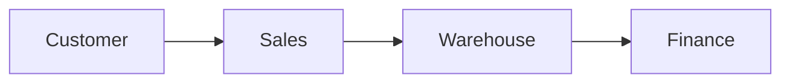
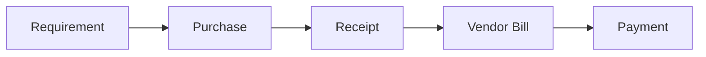

# UNIT I: FREE LEARNING RESOURCES

## CHAPTER 1: WHAT IS ERP?

These resources reinforce **business processes**, **departments**, **master data**, **transactions**, **ERP integration**, **ERP vs CRM**, and **process mapping** from [Chapter 1 Content](Content.md).

Use them after reading each section, not instead of it. Chapter 1 teaches ERP thinking before Odoo buttons.

> **Enhanced verification scope:** This review checked targeted primary sources used by the marked additions. Existing videos and repository listings are retained as supplementary references; their playback, full content, and every link have not been reverified. Odoo-specific references use 19.0 unless stated.

---

## CHAPTER 1 RESOURCES TABLE OF CONTENTS

- [YouTube](#youtube)
- [Free Courses / Websites](#free-courses--websites)
- [Animated / Interactive](#animated--interactive)
- [Repositories](#repositories)
- [Recommended Study Order](#recommended-study-order)

---

## YOUTUBE

> **How previews work on GitHub:** Click a thumbnail to open the video on YouTube. GitHub Markdown cannot embed an inline player, but thumbnails give you a visual preview without leaving the page layout.

### 1. ENTERPRISE RESOURCE PLANNING (ERP) IN 15 MINUTES

| | |
|---|---|
| **Relevant to** | [1.1 Business Processes](Content.md#11-business-processes), [1.3 Cross-Department Workflows](Content.md#13-cross-department-workflows), [1.6 Single Source of Truth](Content.md#16-single-source-of-truth) |
| **Source** | Third-party conceptual overview |
| **Why use it** | Good conceptual ERP introduction before going deeper into Odoo |

**Watch on YouTube:** [Enterprise Resource Planning (ERP) in 15 Minutes](https://www.youtube.com/watch?v=gBXJ_PhlADQ)

---

### 2. BUSINESS PROCESS MAPPING 101: STEP-BY-STEP

| | |
|---|---|
| **Relevant to** | [1.9 Business Process Mapping](Content.md#19-business-process-mapping) |
| **Source** | Process modeling tutorial |
| **Why use it** | Very relevant to learning how to draw and read business flows |

**Watch on YouTube:** [Business Process Mapping 101: Step-by-Step](https://www.youtube.com/watch?v=zGB9SScvoQU)

---

### 3. CROSS-FUNCTIONAL INFORMATION SYSTEMS / ERP

| | |
|---|---|
| **Relevant to** | [1.2 Departments](Content.md#12-departments), [1.3 Cross-Department Workflows](Content.md#13-cross-department-workflows), [1.8 ERP vs Standalone Business Software](Content.md#18-erp-vs-standalone-business-software) |
| **Source** | Academic / systems overview |
| **Why use it** | Explains why Sales, Inventory, Purchase, Finance, and other areas cannot be treated as isolated departments |

**Watch on YouTube:** [Cross-Functional Information Systems / ERP](https://www.youtube.com/watch?v=Igdb0Hp7xJw)

---

## FREE COURSES / WEBSITES

These are **not Odoo-specific**, which is useful for Chapter 1 because this chapter teaches ERP thinking rather than Odoo screens.

### 1. SAP LEARNING: EXPLORING END-TO-END BUSINESS PROCESSES IN SAP

| | |
|---|---|
| **Relevant to** | [1.1–1.3](Content.md#11-business-processes), [1.4 Master Data](Content.md#14-master-data), [1.5 Transactions](Content.md#15-transactions), [1.3 Cross-Department Workflows](Content.md#13-cross-department-workflows) |
| **Cost** | Free |
| **Covers** | Integrated processes, enterprise structures, master data, transactional data, cross-functional workflows |

[Open course: Exploring End-to-End Business Processes in SAP](https://learning.sap.com/courses/exploring-end-to-end-business-processes-in-sap-business-suite)
---

### 2. SAP LEARNING: EXECUTING BASIC ERP PROCESSES WITH SAP S/4HANA

| | |
|---|---|
| **Relevant to** | [1.5 Transactions](Content.md#15-transactions), [1.3 Cross-Department Workflows](Content.md#13-cross-department-workflows), Order-to-Cash and Procure-to-Pay concepts |
| **Cost** | Free |
| **Covers** | Purchase order management, goods receipt, invoice verification, sales order management, production basics |

[Open course: Executing Basic ERP Processes with SAP S/4HANA](https://learning.sap.com/courses/executing-basic-erp-processes-with-sap-s-4hana)
---

### 3. SAP LEARNING: UNDERSTANDING THE CONCEPT OF MASTER DATA

> **Added reading task:** Explain why a reusable customer and a particular order are different records, then identify the agreed price that belongs to an order. Translate the business idea into the chair exercise without memorizing SAP-specific menus. If the exact lesson has moved, use the available end-to-end course above and find its master-data topic.

| | |
|---|---|
| **Relevant to** | [1.4 Master Data](Content.md#14-master-data), [1.5 Transactions](Content.md#15-transactions) |
| **Cost** | Free |
| **Why use it** | Excellent reinforcement for the distinction: **Master Data ≠ Transaction Data** |

[Open lesson: Understanding the Concept of Master Data](https://learning.sap.com/learning-journeys/explore-integrated-business-processes-in-sap-s-4hana-/understanding-the-concept-of-master-data_a91e9234-9d79-47b1-adba-60ed63bd836c)
---

## ANIMATED / INTERACTIVE

### 1. BPMN.IO: INTERACTIVE BPMN PROCESS MODELER

> **Added guided use:** Model a customer request, a stock check, and a decision with both sufficient-stock and shortage paths. Put purchasing and actual receipt on the shortage path before rejoining delivery. Name the performer and completion evidence for each activity in your notes. The tool makes missing branches visible; drawing a diagram does not configure Odoo. The linked toolkit walkthrough explains software embedding and is optional, not prerequisite process-notation training.

| | |
|---|---|
| **Relevant to** | [1.9 Business Process Mapping](Content.md#19-business-process-mapping), [1.3 Cross-Department Workflows](Content.md#13-cross-department-workflows) |
| **Type** | Interactive web tool |
| **Why use it** | Highly recommended for Chapter 1. Instead of merely writing text flows, you can visually draw actual business processes |

[Open the Interactive BPMN Modeler](https://demo.bpmn.io/new)

**Use it to draw:**

**Order-to-Cash**

**Procure-to-Pay**

Also useful:

- [bpmn.io Main Website](https://bpmn.io/)
- [BPMN Walkthrough](https://bpmn.io/toolkit/bpmn-js/walkthrough/) (**Enhanced:** optional developer guide to rendering and embedding the modeler)
---

## REPOSITORIES

### 1. BPMN-JS EXAMPLES

| | |
|---|---|
| **Relevant to** | [1.9 Business Process Mapping](Content.md#19-business-process-mapping) |
| **Type** | Open-source examples behind the BPMN tooling |
| **Why bookmark it** | Especially relevant later if you ever want to build interactive process diagrams into a website |

[GitHub: bpmn-io/bpmn-js-examples](https://github.com/bpmn-io/bpmn-js-examples)
---

## RECOMMENDED STUDY ORDER

If you do not want to consume everything, use this sequence for Chapter 1:

1. **ERP in 15 Minutes** (YouTube)
2. **Business Process Mapping 101** (YouTube)
3. **bpmn.io interactive modeler** (draw Order-to-Cash and Procure-to-Pay)
4. **SAP End-to-End Business Processes** (free course)

That combination gives you **theory + visualization + official ERP reference** before you move into Odoo in Chapter 2.

---

**Next:** [Chapter 2 Resources](../Chapter%202/Resources.md) | **Back to content:** [Chapter 1 Content](Content.md)
