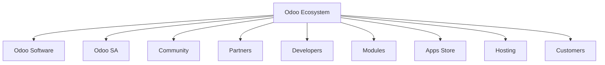
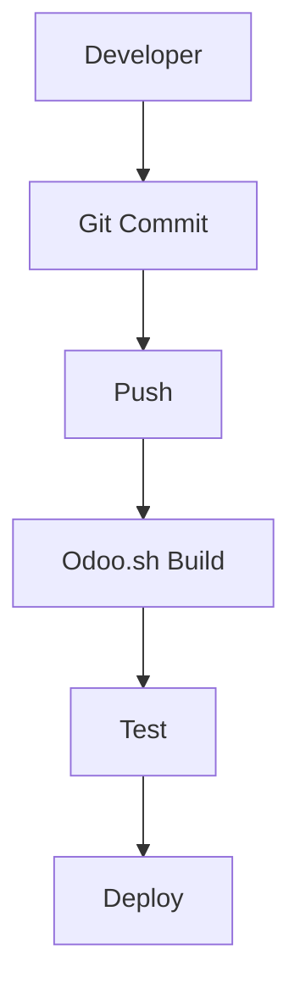
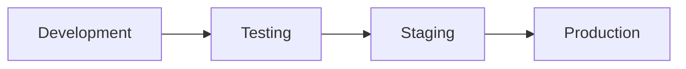
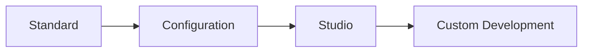
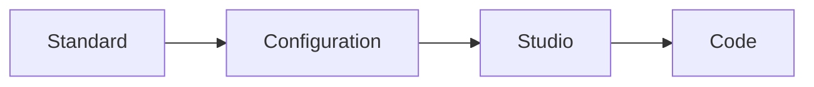
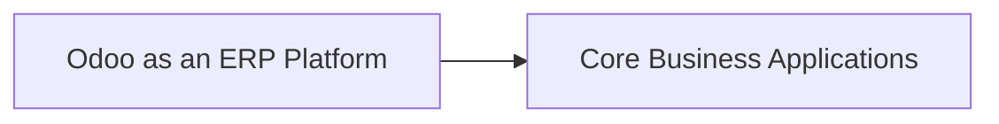
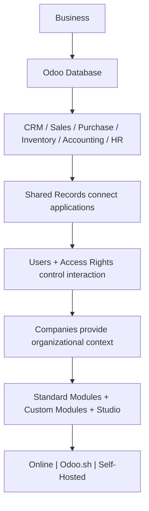

# UNIT I: UNDERSTAND THE BUSINESS BEFORE THE CODE

## CHAPTER 2: UNDERSTANDING ODOO

This chapter connects Odoo's platform concepts to practical decisions: what an addon contains, what a user can actually do, which values are shared, and how hosting constrains customization. References use Odoo 19.0 as the teaching baseline; distinguish edition (Community or Enterprise), release (19.0), commercial plan, and hosting.

Chapter 1 gave us the business-side mental model:

$$ \text{Departments} \rightarrow \text{Processes} \rightarrow \text{Master Data} \rightarrow \text{Transactions} \rightarrow \text{Integrated ERP} $$

Chapter 2 now asks the next question:

What exactly is Odoo, and how does Odoo turn those ERP ideas into an actual software platform?

The roadmap requires all 14 topics below.

Official sources accompany the product-specific explanations below. Video listings are supplementary and may change over time, so use the current official documentation to confirm product behavior.

---

## CHAPTER 2 TABLE OF CONTENTS

- [**2.1** What Odoo Is](#21-what-odoo-is)
- [**2.2** Odoo Ecosystem](#22-odoo-ecosystem)
- [**2.3** Community Edition](#23-community-edition)
- [**2.4** Enterprise Edition](#24-enterprise-edition)
- [**2.5** Odoo Online](#25-odoo-online)
- [**2.6** Odoo.sh](#26-odoosh)
- [**2.7** On-Premise Odoo](#27-on-premise-odoo)
- [**2.8** Odoo Apps](#28-odoo-apps)
- [**2.9** Modules / Addons](#29-modules--addons)
- [**2.10** Users](#210-users)
- [**2.11** Companies](#211-companies)
- [**2.12** Shared Business Records](#212-shared-business-records)
- [**2.13** Standard vs Custom Modules](#213-standard-vs-custom-modules)
- [**2.14** Odoo Studio Concept](#214-odoo-studio-concept)
- [Bringing All of Chapter 2 Together](#bringing-all-of-chapter-2-together)
- [One Complete Example](#one-complete-example)
- [Common Beginner Mistakes in Chapter 2](#common-beginner-mistakes-in-chapter-2)
- [Chapter 2 Summary](#chapter-2-summary)
- [**Free Learning Resources**](Resources.md)

**Then we will complete:**

- [Free Learning Resources](Resources.md)
- [Chapter Exercise](Exercise.md)
- [Chapter Project](Project.md)

---

## 2.1 WHAT ODOO IS

### START WITH THE SIMPLEST MENTAL MODEL

Imagine the company from Chapter 1.

It needs software for:

- customers,
- quotations,
- Sales Orders,
- purchasing,
- inventory,
- invoicing,
- accounting,
- employees,
- projects,
- websites,
- manufacturing.

One approach would be to buy a separate program for everything.

But then we return to the problem from Chapter 1:

$$ \text{Sales Software} \quad \text{Inventory Software} \quad \text{Accounting Software} \quad \text{HR Software} $$

with separate databases and difficult integrations.

Odoo takes a different approach.

It provides a collection of integrated business applications that operate as parts of one broader platform.

#### DEFINITION

Odoo is an ERP and business application platform containing integrated applications for managing many areas of an organization.

That includes applications such as:

- CRM,
- Sales,
- Purchase,
- Inventory,
- Accounting,
- Manufacturing,
- HR,
- Projects,
- Website,
- eCommerce,
- Point of Sale.

But describing Odoo merely as "ERP software" is still incomplete.

For us as future developers, Odoo is simultaneously:

1. **A business application suite**

   Users operate Sales, Inventory, Purchase, etc.

2. **An ERP system**

   Those applications share business processes and data.

3. **A development framework**

   Developers can build new functionality using Odoo's framework.

4. **A database-backed information system**

   Business records are persisted primarily in PostgreSQL.

5. **A web application platform**

   Users normally interact with Odoo through a browser.

So our technical mental model should eventually become:

**Odoo = Business Applications + ERP Integration + Development Framework**

### ODOO CONNECTS WHAT CHAPTER 1 INTRODUCED

Remember our Chapter 1 example:

Customer wants 20 monitors.

We had:

Odoo can represent these through different applications while keeping the records connected.

For example:

- **Sales** creates the Sales Order.
- **Inventory** handles delivery.
- **Purchase** can handle procurement.
- **Accounting** handles financial consequences.

That is why learning Odoo development without understanding ERP first would have been backwards.

The code exists to support these business relationships.

### ODOO IS NOT JUST A COLLECTION OF PAGES

Imagine SO001 has customer ABC Trading and a monitor order line. The customer field points to the party; the order line holds the quantity and agreed price. Inventory needs the product and quantity for shipment, while Finance needs the amount to bill. Identify which facts should be reused and which belong to this particular order. Integration connects those responsibilities; merely installing icons does not configure every connection.

This distinction is extremely important.

A beginner looking at Odoo may think:

> CRM is one page, Sales is another page, Inventory is another page.

But the important thing is not that separate menu icons exist.

The important thing is that their underlying business records can be related.

For example, a **Customer** may be referenced by:

- a **CRM Opportunity**,
- a **Sales Order**,
- an **Invoice**,
- a **Delivery**.

That interconnected data model is what makes Odoo much more interesting than simply having multiple independent applications.

Odoo is therefore not merely a bundle of screens. It is an integrated platform where business records link across applications, and that connected data model is what turns separate apps into a true ERP.

### RELEVANT RESOURCES

Here are the relevant resources for **2.1 WHAT ODOO IS**:

> **How previews work on GitHub:** Click a thumbnail to open the video on YouTube. GitHub Markdown cannot embed an inline player, but thumbnails give you a visual preview without leaving the page layout.

### 1. ODOO BEGINNER'S GUIDE

| | |
|---|---|
| **Source** | Community tutorial |
| **Why use it** | Good broad introduction before studying individual applications |

**Watch on YouTube:** [Odoo Beginner's Guide](https://www.youtube.com/watch?v=QuC6rc2q2mg)

---

### 2. MEET ODOO 19'S BEST FEATURES

| | |
|---|---|
| **Source** | Official Odoo YouTube channel |
| **Why use it** | Useful for seeing the current generation of Odoo rather than only reading concepts |

**Watch on YouTube:** [Meet Odoo 19's Best Features](https://www.youtube.com/watch?v=OZLP-SCHW7A)

---

## 2.2 ODOO ECOSYSTEM

Odoo is not just one executable program maintained in isolation.

There is a larger ecosystem around it.

Think of an ecosystem as all the people, software, services, modules, hosting platforms, and organizations that participate in Odoo.

A simplified conceptual model is the **Odoo Ecosystem**, containing:

### ODOO SA

Odoo SA is the company behind Odoo.

It develops and maintains Odoo and provides commercial services around it.

Think of Odoo SA as the organization that owns the product direction, publishes official releases, and offers the commercial services many businesses rely on when they choose Enterprise or managed hosting.

These include areas such as:

- Enterprise software,
- cloud hosting,
- upgrades,
- support,
- Odoo.sh,
- other commercial services.

Without Odoo SA, the ecosystem would lack a central maintainer of the core platform. Community contributors and partners extend the platform, but Odoo SA remains the primary publisher of official Odoo software.

### COMMUNITY

Odoo also has a large open-source community.

That community includes:

- individual developers,
- consultants,
- businesses,
- contributors,
- open-source organizations.

People may:

- develop modules,
- fix bugs,
- answer questions,
- create integrations,
- contribute documentation,
- implement Odoo for customers.

### PARTNERS

Businesses often hire Odoo implementation partners.

A partner may help a company with:

- requirements analysis,
- business process mapping,
- configuration,
- migration,
- training,
- development,
- support.

Notice how Chapter 1 becomes important again.

A good implementation partner should not begin by writing Python immediately.

They need to understand the company's processes.

### THIRD-PARTY MODULES

A warehouse addon looks suitable, but its screenshots show a different Odoo release. Inspect its supported branch, dependencies, license, documentation, and a sample workflow before selecting it. A listing describes a candidate solution, not proof of compatibility. Test the actual requirement, such as partial delivery with serial-number tracking, and identify who will maintain the addon after an upgrade.

Odoo's functionality can also be extended using third-party modules.

That means your eventual Odoo system might look like:

$$ \text{Odoo Core} + \text{Official Modules} + \text{Custom Modules} + \text{Third-Party Modules} $$

That extensibility is one of the major reasons Odoo development exists as a profession.

### WHY THE ECOSYSTEM MATTERS TO AN ODOO DEVELOPER

Suppose your customer says:

> "We need a special warehouse barcode workflow."

Before writing the entire solution yourself, you should determine whether:

- Odoo already supports it.
- Enterprise functionality supports it.
- an official addon provides it.
- a reputable third-party addon provides it.
- configuration can solve it.
- customization is actually necessary.

A professional Odoo engineer doesn't automatically build everything from scratch.

The Odoo ecosystem matters because a capable developer knows how to search the existing software, partner network, and module marketplace before committing to custom code.

### RELEVANT RESOURCES

Here are the relevant resources for **2.2 ODOO ECOSYSTEM**:

### 1. ODOO BEGINNER'S GUIDE

| | |
|---|---|
| **Source** | Community tutorial |
| **Why use it** | Good broad introduction before studying individual applications |

**Watch on YouTube:** [Odoo Beginner's Guide](https://www.youtube.com/watch?v=QuC6rc2q2mg)

---

## 2.3 COMMUNITY EDITION

Odoo is available in different editions.

The first is Odoo Community Edition.

#### INTUITION

Think of Community Edition as the open-source foundation of Odoo.

Odoo itself describes Community as the core upon which Enterprise is built. Community is currently licensed under LGPLv3.

### WHAT OPEN SOURCE MEANS HERE

The Community source code can be inspected and modified according to its license.

This is important for developers because you can:

- read the framework code,
- understand how standard modules work,
- develop your own addons,
- run Odoo from source,
- debug framework behavior.

This is one reason Odoo is excellent for learning enterprise software engineering.

You are not limited to interacting with a black-box API.

### COMMUNITY DOES NOT MEAN "DEMO"

A common misconception is:

> Community Edition is only a trial.

No.

It is a real Odoo edition.

Organizations can deploy and operate Community Edition.

However, Community and Enterprise do not contain identical functionality.

Enterprise adds commercial features and services.

Odoo's current edition comparison explicitly describes Community as open source and Enterprise as licensed, with Enterprise containing additional capabilities.

### TYPICAL COMMUNITY DEPLOYMENT THINKING

With Community, organizations often manage hosting themselves or use another provider.

That means responsibilities may include:

- operating system,
- PostgreSQL,
- Odoo server,
- backups,
- reverse proxy,
- SSL/TLS,
- monitoring,
- upgrades,
- security,
- availability.

This is why "free software" does not mean:

$$ \text{Total Cost}=0 $$

You may avoid Enterprise licensing, but infrastructure and engineering still cost time and money.

### COMMUNITY STRENGTHS

Community is particularly useful when:

- learning Odoo development,
- studying the framework,
- building open-source solutions,
- requiring strong control over deployment,
- developing custom modules.

### COMMUNITY LIMITATIONS

List a retailer’s required workflows, then mark each as demonstrated in the chosen edition, available through an extension, or still unverified. Community may fit a learning installation even when a production project chooses Enterprise. The official [Community source license](https://github.com/odoo/odoo/blob/19.0/LICENSE) establishes the license baseline; it does not establish feature availability for every third-party addon.

The important limitation is that some Odoo functionality is Enterprise-only.

Therefore you should not assume:

$$ \text{Community} = \text{Enterprise without support} $$

It is more accurate to think:

$$ \text{Community} = \text{Open-source foundation} $$

while:

$$ \text{Enterprise} = \text{Community foundation} + \text{Additional proprietary functionality/services} $$

Community Edition is the real open-source foundation of Odoo: inspectable, deployable, and excellent for learning, but not identical to Enterprise in features or licensing.

### RELEVANT RESOURCES

Here are the relevant resources for **2.3 COMMUNITY EDITION**:

### 2. MEET ODOO 19'S BEST FEATURES

| | |
|---|---|
| **Source** | Official Odoo YouTube channel |
| **Why use it** | Useful for seeing the current generation of Odoo rather than only reading concepts |

**Watch on YouTube:** [Meet Odoo 19's Best Features](https://www.youtube.com/watch?v=OZLP-SCHW7A)

---

## 2.4 ENTERPRISE EDITION

Now consider Odoo Enterprise.

#### INTUITION

Suppose Community provides our base ERP platform.

A business wants additional official functionality, commercial support arrangements, and services around the platform.

That is where Enterprise comes in.

#### DEFINITION

Odoo Enterprise is Odoo's commercially licensed edition.

Current Odoo documentation describes Community as LGPLv3 and Enterprise under the Odoo Enterprise Edition License, requiring a valid Enterprise subscription for use.

### RELATIONSHIP BETWEEN COMMUNITY AND ENTERPRISE

Do not imagine these as completely unrelated products.

A useful high-level mental model is:

**Enterprise = Community Core + Enterprise Addons**

Conceptually, Community supplies much of the foundation, while Enterprise adds additional modules and capabilities.

Odoo itself describes Community as the core upon which Enterprise is built.

### WHAT ENTERPRISE CAN ADD

The exact feature comparison changes as Odoo versions evolve.

But conceptually Enterprise adds areas such as:

- additional business functionality,
- Enterprise-only applications/features,
- commercial services,
- upgrade/support arrangements,
- cloud-related options depending on subscription.

Do not memorize a static feature list from this chapter.

Why?

Because:

$$ \text{Edition Features}_{v18} \neq \text{Edition Features}_{v19} $$

in every detail.

For an implementation project, always check the edition matrix for the target Odoo version.

### COMMUNITY VS ENTERPRISE

Compare the exact workflow, not just the app label. “Accounting needed” is incomplete; “create customer invoices, reconcile bank transactions, and produce the required reports” is testable. Record which edition and plan supports each requirement, then add hosting, implementation, training, and maintenance effort to the decision. Do not infer that an Enterprise subscription alone provides every possible hosting or customization service.

| Community | Enterprise |
| --------- | ---------- |
| Open-source core | Commercial edition |
| LGPLv3 | Enterprise license |
| Can be customized | Can be customized |
| Fewer official features | Additional official capabilities |
| Common for self-managed deployments | Commercial subscription |
| Strong learning/development foundation | Often chosen for broader production needs |

The key lesson isn't:

> Enterprise is automatically better.

The correct question is:

> Which edition fits the organization's functional, technical, licensing, and operational requirements?

Enterprise builds on Community rather than replacing it, and the right edition choice depends on functional needs, licensing constraints, and operational context, not on assuming that commercial always means better.

### RELEVANT RESOURCES

Here are the relevant resources for **2.4 ENTERPRISE EDITION**:

### 2. MEET ODOO 19'S BEST FEATURES

| | |
|---|---|
| **Source** | Official Odoo YouTube channel |
| **Why use it** | Useful for seeing the current generation of Odoo rather than only reading concepts |

**Watch on YouTube:** [Meet Odoo 19's Best Features](https://www.youtube.com/watch?v=OZLP-SCHW7A)

---

## 2.5 ODOO ONLINE

Now we move from edition to hosting.

These are different dimensions.

This distinction matters greatly.

### EDITION VS HOSTING

Edition asks:

> What software/features are being used?

Hosting asks:

> Where and how is the Odoo system operated?

Do not mix them.

Conceptually:

$$ \text{Edition} \neq \text{Hosting Method} $$

### WHAT IS ODOO ONLINE?

Odoo Online is Odoo's managed SaaS hosting option.

Odoo describes it as private databases hosted and managed by Odoo, accessible through a browser without requiring local installation.

#### MENTAL MODEL

Instead of your company managing:

$$ \text{Server} + \text{Operating System} + \text{Odoo} + \text{Infrastructure} $$

Odoo manages much of the hosting platform for you.

Users primarily interact with:

### WHY COMPANIES CHOOSE ODOO ONLINE

It reduces infrastructure responsibility.

The company does not need to operate its own Odoo server.

That can be attractive when the business mostly needs:

- standard Odoo,
- configuration,
- normal application usage,
- supported no-code customization.

### CRITICAL ODOO ONLINE LIMITATION

[Odoo Online administration](https://www.odoo.com/documentation/19.0/administration/odoo_online.html) explicitly describes its custom-module restriction. Use it to distinguish supported in-platform customization from deploying your own Python addon. An external service may still integrate with Odoo where supported interfaces and the chosen plan allow it; “no custom addon deployment” does not mean “no integration of any kind.”

This is especially important for us as future Odoo developers.

Current official documentation states that Odoo Online is not compatible with custom modules or modules from the Odoo Apps Store.

That means:

$$ \text{Odoo Online} \neq \text{Full arbitrary server-side development environment} $$

You can configure and customize within the capabilities allowed by the hosted platform, but you cannot simply deploy arbitrary custom Python addons as you would on Odoo.sh or self-hosted Odoo.

#### EXAMPLE

Suppose the customer says:

> "Change the Sales Order form and add a simple field."

That may be possible without custom Python.

But suppose they say:

> "Install our custom Python module that integrates with a proprietary warehouse API."

Odoo Online is generally not the appropriate environment for that because non-standard modules are not supported there.

This leads us directly to Odoo.sh.

Odoo Online simplifies operations for standard usage, but its restriction on arbitrary custom modules is the dividing line between managed convenience and full developer freedom.

### RELEVANT RESOURCES

Here are the relevant resources for **2.5 ODOO ONLINE**:

### 4. ODOO ONLINE VS ODOO.SH VS ON-PREMISE

| | |
|---|---|
| **Source** | Hosting comparison tutorial |
| **Why use it** | Reinforces that **Online ≠ Odoo.sh ≠ On-Premise** |

**Watch on YouTube:** [Odoo Online vs Odoo.sh vs On-Premise](https://www.youtube.com/watch?v=ws3Z7fhhxuA)

---

## 2.6 ODOO.SH

Odoo.sh occupies an important middle ground.

#### INTUITION

Imagine two extremes.

**Odoo Online**

Very managed, but less freedom for arbitrary custom modules.

**Self-hosting**

Maximum infrastructure control, but you manage much more yourself.

Odoo.sh is designed to provide an Odoo-focused managed development and hosting platform while allowing custom development.

#### MENTAL MODEL

You can think of it as:

**Managed Odoo Hosting + Development Workflow + Custom Code**

### GIT-BASED DEVELOPMENT

Odoo.sh integrates closely with Git repositories.

Current documentation shows Odoo.sh working with GitHub repositories and creating builds from repository revisions.

This means development becomes closer to professional software engineering.

Conceptually:

### ENVIRONMENTS

Development is where a developer tries an approval change. Staging is where testers exercise it using representative data. Production is where staff perform live work. Moving a code change toward production does not mean copying every staging transaction into the live database. For example, test invoice TEST001 should remain test evidence, not become a real customer debt.

Odoo.sh supports concepts such as:

- development,
- staging,
- production.

Why is that important?

Because you should not normally experiment directly on the live business database.

Suppose we build a new approval feature.

A responsible workflow is approximately:

rather than:

Current Odoo.sh documentation describes builds based on specific Git revisions and distinguishes development/staging/production workflows.

### WHY ODOO.SH MATTERS FOR DEVELOPERS

It provides facilities designed around Odoo development, including access to things such as:

- code,
- logs,
- terminals,
- Odoo shell,
- builds,
- databases,
- development environments.

Current documentation also shows that development and staging builds can have their source code inspected or edited, while production source is treated more conservatively.

### ODOO ONLINE VS ODOO.SH

If Bilal needs a custom addon and wants managed infrastructure, evaluate Odoo.sh. If he only needs supported settings, Online may suffice. Confirm the subscription arrangement using the [Odoo.sh FAQ](https://www.odoo.sh/faq), which explains platform eligibility and service boundaries; do not assume hosting is included merely because the software edition is Enterprise.

| Odoo Online | Odoo.sh |
| ----------- | ------- |
| Highly managed SaaS | Managed Odoo development platform |
| Best suited to standard/no-code customization | Supports custom development |
| No arbitrary custom modules | Custom source/addons supported |
| Infrastructure largely abstracted | More technical controls |
| Simpler operations | More development flexibility |

A beginner mistake is thinking Odoo.sh is simply:

> "Odoo Online but faster."

No.

Its role is fundamentally more development-oriented.

Odoo.sh is the managed path for teams that need Git-based workflows, environment separation, and custom Python addons without taking on full infrastructure ownership.

### RELEVANT RESOURCES

Here are the relevant resources for **2.6 ODOO.SH**:

### 5. WORKING WITH ODOO.SH

| | |
|---|---|
| **Source** | Community / partner tutorial |
| **Why use it** | Shows projects, custom code, staging branches, backups, and deployment workflow |

**Watch on YouTube:** [Working with Odoo.sh](https://www.youtube.com/watch?v=vsqzfA3ERD8)

---

### 4. ODOO.SH DOCUMENTATION

| | |
|---|---|

[Odoo.sh Documentation](https://www.odoo.com/documentation/19.0/administration/odoo_sh.html)

[Odoo.sh Getting Started](https://www.odoo.com/documentation/19.0/administration/odoo_sh/getting_started.html)

---

## 2.7 ON-PREMISE ODOO

The third major deployment concept is on-premise, often also called self-hosted.

#### INTUITION

Instead of Odoo operating the hosting environment, your organization controls where Odoo runs.

That could be:

- a physical company server,
- a private data center,
- a virtual machine,
- a cloud VM that your organization manages.

The term "on-premise" is often used broadly in Odoo discussions to mean self-hosting, even though a self-managed server could physically run in a public cloud.

### RESPONSIBILITY

With self-hosting, much more responsibility shifts to you.

Conceptually:

$$ \text{Control} \uparrow $$

but also:

$$ \text{Responsibility} \uparrow $$

You may need to manage:

- Linux/Windows environment,
- Python,
- PostgreSQL,
- Odoo installation,
- configuration,
- reverse proxy,
- HTTPS,
- backups,
- logs,
- monitoring,
- upgrades,
- security patches,
- scaling,
- disaster recovery.

Official Odoo documentation provides both packaged and source installation approaches and confirms that PostgreSQL is required for normal Odoo operation.

### WHY DEVELOPERS OFTEN LIKE SELF-HOSTING

It gives extensive technical control.

For example, you can generally:

- inspect the filesystem,
- modify configuration,
- manage custom addon paths,
- install Python dependencies,
- integrate external services,
- configure PostgreSQL,
- configure reverse proxies,
- control system resources.

This becomes very useful for complex deployments.

### BUT FREEDOM CREATES OPERATIONAL RESPONSIBILITY

For a self-hosted design, name who restores the database and attachments, who applies updates, and who responds when users cannot log in. “We have backups” is incomplete unless someone has restored them successfully. At Unit I level, document these responsibilities; installation commands and recovery procedures belong to later units.

Suppose your Odoo server fails at 10:00 AM on a business day.

If Odoo is critical to:

- Sales,
- Warehouse,
- Accounting,
- Purchase,

then the outage may stop large parts of the company.

Remember Chapter 1:

$$ \text{ERP Failure} \rightarrow \text{Business Process Failure} $$

So self-hosting isn't merely:

> "Install Odoo on Ubuntu."

Production engineering also requires thinking about:

- availability,
- recovery,
- security,
- monitoring,
- backups.

We will reach these subjects later in the roadmap.

### THE THREE HOSTING MENTAL MODELS

| Option | Character |
| --- | --- |
| **Odoo Online** | Maximum platform convenience, limited custom server code |
| **Odoo.sh** | Managed Odoo development/deployment platform with custom development |
| **On-Premise / Self-Hosted** | Maximum infrastructure control, maximum operational responsibility |

Self-hosted Odoo offers the most control and the most operational burden, and the three hosting options form a spectrum from maximum convenience to maximum freedom.

### RELEVANT RESOURCES

Here are the relevant resources for **2.7 ON-PREMISE ODOO**:

### 6. IS SELF-HOSTED ODOO RIGHT FOR YOU?

| | |
|---|---|
| **Source** | Hosting decision guide |
| **Why use it** | Useful for understanding when self-hosting makes sense |

**Watch on YouTube:** [Is Self-Hosted Odoo Right for You?](https://www.youtube.com/watch?v=ngbrg7DUOeQ)

---

### 5. SELF-HOSTED / SOURCE INSTALLATION

| | |
|---|---|

[Odoo 19 Source Installation](https://www.odoo.com/documentation/19.0/administration/on_premise/source.html)

---

## 2.8 ODOO APPS

Now let's move inside Odoo itself.

When users open Odoo, they encounter apps.

Examples:

- Sales
- CRM
- Inventory
- Purchase
- Accounting
- Project
- Employees
- Website
- Manufacturing

### WHAT IS AN APP CONCEPTUALLY?

An app is a relatively large collection of functionality centered around a business domain.

For example:

- **Sales app** supports the full selling process: quotations, Sales Orders, customer communication, and the commercial side of fulfilling customer demand.
- **Inventory app** supports inventory and stock operations: receiving goods, storing them, moving them internally, and shipping them to customers.
- **Purchase app** supports procurement: finding vendors, requesting prices, confirming Purchase Orders, and coordinating incoming supply.

Each app gives users a focused workspace for one major business area, but the records inside those apps can still connect to other apps when the business process crosses boundaries.

So:

$$ \text{Business Function} \rightarrow \text{Odoo App} $$

### APPS ARE INTEGRATED

This is the crucial part.

Imagine installing:

- Sales,
- Inventory,
- Accounting.

You should not picture three independent applications.

Think of them as connected parts of one environment:

They participate in the same broader Odoo environment.

This brings us straight back to Chapter 1's ERP principle.

#### EXAMPLE

Sales confirms:

**SO00052**

This may lead to a delivery operation in Inventory.

Later, invoicing may produce an accounting document.

One business event can propagate through several apps.

That is the difference between:

- having many apps

and:

- having an integrated ERP.

Odoo apps map business domains to software, but their value comes from integration: one confirmed sale can ripple through Inventory, Purchase, and Accounting without re-entering the same facts.

### RELEVANT RESOURCES

Here are the relevant resources for **2.8 ODOO APPS**:

### 2. MODELS, MODULES AND APPS

| | |
|---|---|

[Models, Modules and Apps](https://www.odoo.com/documentation/19.0/applications/general/apps_modules.html)

---

## 2.9 MODULES / ADDONS

Now we need a more technical concept.

The words app, module, and addon are related but not perfectly identical in everyday Odoo terminology.

### MODULE

A model defines a kind of business record; a field holds an attribute or relationship; a view presents records to users; a security rule controls an allowed interaction. For example, a sales approval extension may add approval information to orders, display it on the form, and restrict who approves. The package containing that extension is the module. You need these meanings now, not Python implementation details.

A module is a packaged unit of Odoo functionality.

A module can contain things such as:

- business models,
- fields,
- views,
- menus,
- security rules,
- data,
- reports,
- web controllers,
- static assets.

Current Odoo documentation explains that modules and apps contain elements such as models, views, data files, web controllers, and static web content.

### ADDON

"Addon" is often used broadly for an installable Odoo module that adds or modifies functionality.

For learning purposes:

$$ \text{Addon} \approx \text{Module} $$

in many Odoo conversations.

You'll often hear:

> "Create a custom addon."

meaning:

> "Create a custom Odoo module."

### APP VS MODULE

Odoo's own documentation gives us a very useful rule:

All apps are modules, but not every module is treated as a major standalone app.

That gives us a useful subset relationship in conceptual terms:

**Apps ⊆ Modules** (every app is a module, but not every module is a major app)

#### EXAMPLE

Imagine a large Sales application.

It might depend on other modules providing:

- messaging,
- contacts,
- product functionality,
- accounting integration.

Some modules exist mainly to extend another application.

So visually:

$$ \text{Sales App} $$

can be supported by:

$$ M_1 + M_2 + M_3 + M_4 $$

where each \(M\) represents a module.

### WHY MODULARITY EXISTS

Suppose every Odoo feature existed in one enormous codebase that couldn't be separated.

Then every organization would be forced to load functionality for:

- Manufacturing,
- eCommerce,
- Helpdesk,
- Rental,
- Marketing,
- POS,

even if it never used them.

Modularity allows functionality to be installed selectively.

### MODULE DEPENDENCIES

Open the official [Sales manifest for 19.0](https://github.com/odoo/odoo/blob/19.0/addons/sale/__manifest__.py). Locate its name, dependency list, and data files. Read one listed dependency as “Sales needs this functionality available first.” You are inspecting a package description, not running code. The [manifest reference](https://www.odoo.com/documentation/19.0/developer/reference/backend/module.html) explains those keys when their purpose is unclear.

Modules can depend on other modules.

For example:

$$ A \rightarrow B $$

means module \(A\) needs module \(B\).

Why?

Because \(A\) may extend models or functionality provided by \(B\).

We will study module dependencies formally in later chapters.

For now remember:

Odoo functionality is constructed as a network of modules, not as one indivisible program.

Modules and addons are the building blocks behind every app, installed selectively and linked by dependencies rather than shipped as one monolithic program.

### RELEVANT RESOURCES

Here are the relevant resources for **2.9 MODULES / ADDONS**:

### 1. OFFICIAL ODOO SOURCE CODE

| | |
|---|---|
| **Study branch** | select `19.0` explicitly to match this guide |
| **Browse first** | `addons/` directory: application names and module folders |

[GitHub: odoo/odoo](https://github.com/odoo/odoo)

---

## 2.10 USERS

A business system is useful only if people can interact with it.

Odoo therefore has the concept of users.

#### DEFINITION

A user is an identity that can access an Odoo database.

Current official documentation defines a user as someone with access to an Odoo database and explains that administrators can assign different access rights.

### USER IS NOT THE SAME AS EMPLOYEE

This is an important beginner distinction.

An employee describes a person from the HR/business perspective.

A user describes system access.

Consider:

**Ahmed**

may exist as:

$$ \text{Employee Record} $$

because Ahmed works at the company.

He may also have:

$$ \text{User Account} $$

because Ahmed must log into Odoo.

Those concepts are related, but they answer different questions.

**Employee:** Who works for the company?

**User:** Who can authenticate and use the system?

### USERS NEED PERMISSIONS

Replace “Ali needs Inventory access” with “Ali may validate receipts for the Qatar company and may not change accounting setup.” App access, record visibility, and permission to change a record are separate questions. Test the requirement with Ali’s user identity later; hiding a menu alone is not evidence that data is protected.

Not every user should see or modify everything.

For example:

- **Salesperson** may need Sales.
- **Warehouse Worker** may need Inventory.
- **Accountant** may need Accounting.
- **HR Manager** may need sensitive employee information.

Therefore:

$$ \text{User} + \text{Access Rights} = \text{Authorized Capabilities} $$

Odoo uses groups, access rights, record rules, and other mechanisms to control access. We will study security properly later.

### USER TYPES

A customer’s portal login can expose permitted customer documents without giving the customer staff screens. An anonymous website visitor normally operates through the website’s public-user context; you do not create a personal staff account for every visitor. Also, creating an employee record does not automatically authorize a login.

Current Odoo documentation distinguishes:

- Internal users
- Portal users
- Public users

We don't need security-level detail yet, but the intuition matters.

**Internal user**

Someone operating inside the business system.

Example:

> Salesperson.

**Portal user**

External party with limited portal access.

Example:

> Customer viewing an invoice.

**Public user**

Unauthenticated/public website interaction.

Example:

> Website visitor.

### IMPORTANT LESSON

Do not think:

> "Every person who touches Odoo needs full backend access."

Odoo can expose different interfaces and privileges depending on who the person is.

A user is an access identity, not the same thing as an employee record, and effective Odoo design assigns the minimum access each role actually needs.

### RELEVANT RESOURCES

Here are the relevant resources for **2.10 USERS**:

### ODOO LEARN (ODOO SLIDES)

| | |
|---|---|
| **Type** | Official free Odoo learning platform |
| **Why use it** | This should become one of your main companion resources throughout the roadmap |

[Open Odoo Learn](https://www.odoo.com/slides)

---

### 2. FREE ODOO ONLINE TRIAL

| | |
|---|---|
| **Best for** | Experimentation, not permanent roadmap work |
| **Note** | Temporary environment; no payment needed to create a trial |

[Create an Odoo Trial](https://www.odoo.com/trial)

---

## 2.11 COMPANIES

Remember Chapter 1?

A company is the business organization whose processes we are managing.

Odoo models this explicitly.

#### DEFINITION

In current Odoo documentation, a company represents an individual business entity with its own identity, financial records, and operational settings.

### SINGLE-COMPANY EXAMPLE

Imagine:

**Bilal Office Supplies WLL**

Everything belongs to one business entity.

Users work primarily inside that one company.

Simple.

### MULTI-COMPANY EXAMPLE

Now imagine a group:

**Bilal Holdings**

owns:

- Bilal Qatar LLC
- Bilal Pakistan Pvt Ltd
- Bilal UAE LLC

Management wants to use one Odoo environment.

Odoo supports multiple companies within a database.

Conceptually, one **Odoo Database** contains:

- **C_1** = Qatar Company
- **C_2** = Pakistan Company
- **C_3** = UAE Company

### USER COMPANY ACCESS

Sara may be allowed to access both Qatar and Pakistan, yet each Purchase Order must still use the intended company. Being allowed to work in both does not make their stock or invoices interchangeable. Before creating a transaction, identify the company and then check that its vendor terms, currency, and operational records are appropriate.

Not every user necessarily sees every company.

For example:

- **Ahmed:** \( \{C_1\} \)
- **Sara:** \( \{C_1,C_2\} \)
- **Group CFO:** \( \{C_1,C_2,C_3\} \)

Current Odoo documentation allows users to be granted access to one or more companies and to have a default company.

### WHY MULTI-COMPANY BECOMES COMPLICATED

Suppose the same product exists across three companies.

Should all companies share:

- product name?
- barcode?
- Sales price?
- cost?
- accounting configuration?
- inventory?
- tax configuration?

Some information can be shared.

Some must be company-specific.

This brings us directly to Section 2.12.

Odoo models legal business entities explicitly, and multi-company setups introduce real design questions about what should be shared versus what must remain company-specific.

### RELEVANT RESOURCES

Here are the relevant resources for **2.11 COMPANIES**:

### 6. ODOO ADMINISTRATION

| | |
|---|---|

[Odoo 19 Administration](https://www.odoo.com/documentation/19.0/administration.html)

---

## 2.12 SHARED BUSINESS RECORDS

This section connects almost perfectly to Chapter 1's single source of truth concept.

Remember our customer master record?

Instead of creating five unrelated copies of the same customer, ERP systems often attempt to reuse shared records.

### ODOO SHARED RECORD INTUITION

Imagine two companies inside one Odoo database:

$$ C_A $$

and:

$$ C_B $$

Both sell to:

**ABC Trading**

Do we necessarily need:

$$ \text{ABC Trading}_{A} $$

and:

$$ \text{ABC Trading}_{B} $$

as completely unrelated records?

Not always.

Some Odoo records can be shared.

### CURRENT ODOO BEHAVIOR

Official documentation explains that records such as products and contacts can be shared across companies, while business documents such as quotations, invoices, and vendor bills are typically tied to a particular company.

That distinction makes sense if we think carefully.

### WHY CONTACTS MAY BE SHARED

A customer is still the same external organization.

For example:

**Qatar Airways**

could purchase from multiple subsidiaries within your group.

A common contact record may therefore be useful.

### WHY INVOICES SHOULDN'T SIMPLY BE GLOBALLY SHARED

An invoice belongs to a legal business entity.

Suppose:

$$ C_A = \text{Bilal Qatar LLC} $$

and:

$$ C_B = \text{Bilal Pakistan Pvt Ltd} $$

An invoice issued by \(C_A\) cannot casually be treated as an invoice of \(C_B\).

Financial transactions require company context.

Hence:

$$ \text{Shared Master Data} $$

can coexist with:

$$ \text{Company-Specific Transactions} $$

### THIS IS A POWERFUL ERP PATTERN

Remember Chapter 1:

$$ \text{Master Data} \neq \text{Transactions} $$

Now Odoo makes that distinction concrete.

Potentially shared:

- contacts,
- products.

Usually company-specific:

- Sales Orders,
- invoices,
- vendor bills,
- company accounting transactions.

The exact behavior depends on model and configuration, but this is the key mental model.

### COMPANY-DEPENDENT VALUES

Odoo’s [multi-company guide](https://www.odoo.com/documentation/19.0/applications/general/companies/multi_company.html) distinguishes a shared product’s Sales Price and Reference from its company-specific Cost. Thus, switching company must not be assumed to give an independent value for every field. If two companies require different selling prices, investigate explicit pricing configuration. Use the guide to inspect actual field behavior before declaring a property shared or company-dependent.

It gets even more interesting.

Some information about a shared record can itself depend on company context.

For example, current Odoo documentation describes shared product records where some values can remain common while other properties can be company-specific.

So Odoo can conceptually support:

$$ \text{One Product Identity} $$

while:

$$ \text{Property}_{C_A} \neq \text{Property}_{C_B} $$

This will become technically important much later when we study company-dependent fields and multi-company development.

Odoo separates shared master data from company-specific transactions, and even shared records can carry company-dependent properties where the business requires it.

### RELEVANT RESOURCES

Here are the relevant resources for **2.12 SHARED BUSINESS RECORDS**:

### 1. ODOO BEGINNER'S GUIDE

| | |
|---|---|
| **Source** | Community tutorial |
| **Why use it** | Good broad introduction before studying individual applications |

**Watch on YouTube:** [Odoo Beginner's Guide](https://www.youtube.com/watch?v=QuC6rc2q2mg)

---

## 2.13 STANDARD VS CUSTOM MODULES

Now we're getting closer to the Odoo developer's actual job.

Odoo already contains many modules.

But businesses frequently need modifications.

We therefore distinguish **Standard Modules** from **Custom Modules**.

### STANDARD MODULE

A standard module is functionality already supplied as part of the Odoo software distribution you are using.

Examples conceptually include modules supporting:

- Sales,
- Purchase,
- Inventory,
- Contacts.

You don't build these from scratch for every customer.

### CUSTOM MODULE

A custom module is functionality developed specifically to add, modify, or integrate behavior beyond what the standard system provides.

For example, Bilal Office Supplies says:

> "Any Sales Order above QAR 100,000 requires regional-manager approval before confirmation."

Suppose the standard configuration doesn't satisfy the exact workflow.

We may create:

$$ \texttt{bilal\_sale\_approval} $$

as a custom module.

Conceptually, it might extend the existing Sales functionality rather than replace the Sales application.

### EXTENDING INSTEAD OF REBUILDING

This is a central Odoo philosophy.

Suppose the Sales module already handles:

- customers,
- quotations,
- products,
- Sales Orders,
- totals,
- delivery integration.

We do not want to recreate all of Sales just to add one field.

Instead:

$$ \text{Standard Sales} + \text{Custom Extension} $$

This provides:

$$ \text{Existing Functionality} + \text{Business-Specific Behavior} $$

### WHY KEEPING CUSTOMIZATION SEPARATE MATTERS

Imagine editing Odoo's standard source directly.

You change:

standard sale module

then Odoo releases an upgrade.

Now your modifications are mixed directly into the vendor code.

That creates:

- upgrade difficulty,
- maintenance difficulty,
- debugging confusion,
- source-control problems.

A much healthier architecture is:

$$ \text{Odoo Standard Code} $$

plus:

$$ \text{Your Custom Addons} $$

This separation will become extremely important when we start programming.

### CONFIGURATION BEFORE CUSTOMIZATION

An Odoo engineer should ask:

**Question 1**

Can standard Odoo already do it?

If yes:

Use standard functionality.

**Question 2**

Can configuration solve it?

If yes:

Configure it.

**Question 3**

Can Studio appropriately solve it?

Potentially:

Use Studio.

**Question 4**

Does it require true custom logic?

Then:

Build a custom module.

A useful hierarchy is:

Not every business request deserves Python code.

### COMMON CUSTOMIZATION MISTAKE

A developer hears:

> "Our company calls customers Members."

and immediately creates an entire new customer system.

Bad approach.

The underlying Odoo contact model might already provide everything required.

Perhaps only:

- labels,
- views,
- business rules,

need adjusting.

Always understand what already exists before replacing it.

Prefer the simplest maintainable option that satisfies the requirement. Investigate standard functionality and configuration, and consider Studio when it is available and suitable. A team without Studio or with an explicit code-maintenance requirement can reasonably choose an extension without first building a Studio prototype.

### RELEVANT RESOURCES

Here are the relevant resources for **2.13 STANDARD VS CUSTOM MODULES**:

### 3. ODOO STUDIO: BUILD AND CUSTOMIZE APPS

| | |
|---|---|
| **Source** | Official Odoo YouTube channel |
| **Why use it** | Directly relevant to understanding no-code customization inside Odoo |

**Watch on YouTube:** [Odoo Studio: Build and Customize Apps](https://www.youtube.com/watch?v=IRbj-SzTcrY)

---

## 2.14 ODOO STUDIO CONCEPT

Our final Chapter 2 concept is Odoo Studio.

This introduces another customization path.

#### INTUITION

Imagine a business user wants to add:

**Customer Priority**

to a form.

Possible values:

- Low
- Medium
- High

A Python developer could create a custom module.

But writing and deploying code for every simple field change may be unnecessary.

Odoo Studio exists to provide visual/no-code or low-code customization capabilities.

### WHAT STUDIO CAN DO

Adding “Customer Priority” creates information, but does not by itself make high-priority orders ship first. That second requirement needs an explicit rule and verification. Check [Studio’s documented capabilities](https://www.odoo.com/documentation/19.0/applications/studio.html) against the selected plan before assuming the visual customization tool is available.

Current Odoo documentation describes Studio as a toolbox for customizing Odoo without coding knowledge and lists capabilities including modifying:

- fields,
- views,
- models,
- automation rules,
- webhooks,
- reports,
- approval rules,
- security rules.

It can also be used to create applications.

#### EXAMPLE

Suppose Sales wants a field:

**Customer Importance**

Instead of writing Python immediately:

1. Open the relevant form.
2. Enter Studio.
3. Add a suitable field.
4. Configure its label/options.
5. Position it in the form.
6. Save.

The user now sees the additional information.

### WHAT STUDIO IS DOING CONCEPTUALLY

A beginner may think:

> Studio is only visually moving boxes.

Not quite.

You're still modifying the underlying Odoo system.

For example, adding a field means Odoo needs an underlying model field.

Changing a view changes how the model is presented.

Creating automation adds business behavior.

Current Odoo documentation notes that Studio customizations are packaged into a Studio customization module.

That reveals something important:

$$ \text{Studio} $$

is not separate magic.

It is another way of creating/modifying Odoo configuration and metadata.

### STUDIO VS CUSTOM CODE

This comparison is extremely important.

| Studio | Custom Module |
| ------ | ------------- |
| Visual customization | Code-based customization |
| Lower entry barrier | Requires Odoo development knowledge |
| Excellent for many simple changes | Excellent for complex behavior |
| Faster for basic requirements | More engineering control |
| Limited compared with arbitrary code | Can implement complex logic/integrations |
| Suitable for business/configuration users | Suitable for developers |

#### EXAMPLE 1: STUDIO IS REASONABLE

Requirement:

> "Add a field called Customer Category and display it on the Sales form."

Studio may be appropriate.

#### EXAMPLE 2: CUSTOM MODULE PROBABLY BETTER

Requirement:

> "Whenever a Sales Order is confirmed, call our external logistics API, sign the request using our authentication protocol, retry failed requests, maintain synchronization status, provide manual reprocessing, and log audit events."

This is a software integration problem.

You probably need proper code.

### STUDIO LIMITATION MINDSET

After adding a priority field, check that it persists after reopening the record, is visible to the intended roles, and uses the intended shared or company-specific meaning. For approval, also specify who is blocked, the threshold, and what happens after editing an approved order. A successful screen change is evidence of presentation; workflow correctness needs its own evidence.

The question is not:

> "Can Studio do something clever enough?"

The better question is:

> "Is Studio the maintainable engineering solution for this requirement?"

For small changes:

$$ \text{Studio Advantage} \gg \text{Development Overhead} $$

For complex business logic:

$$ \text{Custom Code Control} \gg \text{Studio Convenience} $$

Studio is a legitimate customization layer for simpler metadata and UI changes, but complex integrations and business logic still belong in custom code.

### RELEVANT RESOURCES

Here are the relevant resources for **2.14 ODOO STUDIO CONCEPT**:

### 3. ODOO STUDIO: BUILD AND CUSTOMIZE APPS

| | |
|---|---|
| **Source** | Official Odoo YouTube channel |
| **Why use it** | Directly relevant to understanding no-code customization inside Odoo |

**Watch on YouTube:** [Odoo Studio: Build and Customize Apps](https://www.youtube.com/watch?v=IRbj-SzTcrY)

---

### 3. ODOO STUDIO

| | |
|---|---|

[Odoo Studio Documentation](https://www.odoo.com/documentation/19.0/applications/studio.html)

---

## BRINGING ALL OF CHAPTER 2 TOGETHER

We can now build a much stronger picture of Odoo.

**Layer 1: Business**

From Chapter 1:

$$ \text{Sales} + \text{Purchase} + \text{Warehouse} + \text{Finance} + \text{HR} $$

**Layer 2: Odoo Apps**

Those functions become:

$$ \text{Sales App} + \text{Purchase App} + \text{Inventory App} + \text{Accounting App} + \text{Employees App} $$

**Layer 3: Modules**

Each application is built from modules and dependencies:

$$ M_1 + M_2 + M_3 + \cdots + M_n $$

**Layer 4: Records**

Modules work with business records such as:

- customers,
- products,
- Sales Orders,
- invoices,
- employees.

**Layer 5: Users and companies**

Users:

$$ U_1,U_2,\ldots,U_n $$

operate inside:

$$ C_1,C_2,\ldots,C_n $$

according to permissions.

**Layer 6: Customization**

Standard behavior may be extended using:

$$ \text{Configuration} + \text{Studio} + \text{Custom Modules} $$

**Layer 7: Hosting**

The system must run somewhere:

- Odoo Online
- Odoo.sh
- Self-Hosted

### RELEVANT RESOURCES

Here are the relevant resources for **BRINGING ALL OF CHAPTER 2 TOGETHER**:

### 2. MEET ODOO 19'S BEST FEATURES

| | |
|---|---|
| **Source** | Official Odoo YouTube channel |
| **Why use it** | Useful for seeing the current generation of Odoo rather than only reading concepts |

**Watch on YouTube:** [Meet Odoo 19's Best Features](https://www.youtube.com/watch?v=OZLP-SCHW7A)

---

### ODOO LEARN (ODOO SLIDES)

| | |
|---|---|
| **Type** | Official free Odoo learning platform |
| **Why use it** | This should become one of your main companion resources throughout the roadmap |

[Open Odoo Learn](https://www.odoo.com/slides)

---

## ONE COMPLETE EXAMPLE

Return to Bilal Office Supplies.

The company uses Odoo Enterprise.

It has installed:

- CRM,
- Sales,
- Purchase,
- Inventory,
- Accounting,
- Employees.

This gives us a realistic small-business Odoo environment: not every possible app, but enough to show how platform concepts from this chapter work in practice.

### USERS

- **Ahmed:** Salesperson
- **Sara:** Purchasing Manager
- **Ali:** Warehouse User
- **Fatima:** Accountant
- **Bilal:** Administrator

Each has different access.

Ahmed should see customers and sales documents, but not full accounting configuration. Sara should manage procurement without accessing HR salary data. Ali should operate inventory without changing financial accounts. Fatima should process invoices and payments without administering the server. Bilal, as administrator, can configure the system, but even administrators should treat production changes carefully.

This reflects the user and permission thinking from Section 2.10.

### SHARED RECORDS

Product:

**Dell Monitor 27"**

Customer:

**ABC Trading**

These master records can participate in multiple applications.

ABC Trading is not recreated separately in Sales, Inventory, and Accounting. The same customer identity can appear across CRM opportunities, Sales Orders, deliveries, and invoices. Likewise, the Dell Monitor product can be referenced by sales lines, stock movements, and purchase lines. That reuse is exactly what shared master data means in Odoo.

### TRANSACTION

ABC Trading asks for:

$$ 20 \text{ monitors} $$

Sales creates:

$$ SO001 $$

At this point, the business has a commercial commitment, but the physical and financial consequences have not yet happened automatically in every domain.

Inventory receives a delivery requirement because the company now owes the customer 20 monitors from stock or supply.

Suppose stock is insufficient.

Purchase handles replenishment because the warehouse cannot fulfill the full quantity from available inventory alone.

Inventory receives the supplier goods when the vendor delivers.

Inventory delivers the customer order once enough stock exists.

Accounting invoices the customer because the sale now has a financial consequence: ABC Trading owes Bilal Office Supplies money for the delivered goods.

The apps are different.

The business process is one connected flow.

From Ahmed's perspective, he confirmed a sale. From Ali's perspective, he moved stock. From Sara's perspective, she may have replenished shortage. From Fatima's perspective, she recorded the invoice. Each person worked inside a different app, but the underlying business event remained connected.

### THEN A CUSTOMIZATION APPEARS

Bilal says:

"Orders of QAR 50,000 or more need Sales Manager approval." This matches the boundary used in the Chapter 2 project.

The developer investigates.

Could standard configuration satisfy it?

If yes, use that.

Otherwise perhaps Studio can handle it.

If the logic is complex, create a custom module.

This is now proper Odoo thinking:

Only then:

$$ \text{Code} $$

The important lesson is sequence. A professional Odoo engineer does not hear a business request and immediately open a Python file. The request is analyzed first, standard Odoo is checked, then configuration, then Studio, and only then custom development if the requirement truly needs it.

---

## COMMON BEGINNER MISTAKES IN CHAPTER 2

### MISTAKE 1: ODOO IS ONE GIANT APPLICATION

No.

Odoo is modular.

A beginner sometimes opens Odoo, sees many menus, and assumes everything is one undifferentiated program. In reality, Odoo is built from installable modules and apps. Organizations can enable only what they need, and developers extend specific modules rather than modifying one monolithic codebase.

### MISTAKE 2: ODOO APPS ARE COMPLETELY SEPARATE PROGRAMS

No.

Their integration and shared records are central to the ERP model.

Sales, Inventory, and Accounting may look like separate apps in the interface, but they operate on connected business records inside one database. That integration is what makes Odoo an ERP rather than a bundle of unrelated tools.

### MISTAKE 3: COMMUNITY IS JUST A TRIAL OF ENTERPRISE

No.

Community is the open-source core edition.

Community is a real deployable edition, not a temporary demo. Many organizations run Community in production, and it is also the foundation developers study when learning the framework.

### MISTAKE 4: COMMUNITY AND ENTERPRISE ARE IDENTICAL

No.

Enterprise adds commercial functionality and has a different license.

Community and Enterprise share a foundation, but Enterprise includes additional official capabilities and commercial services. Choosing between them is a business and licensing decision, not a question of "real vs fake Odoo."

### MISTAKE 5: ODOO ONLINE AND ODOO.SH ARE THE SAME THING

No.

Odoo Online emphasizes managed standard Odoo usage.

Odoo.sh provides a much more development-oriented environment supporting custom code.

Both are hosted by Odoo, but they serve different purposes. Odoo Online is optimized for standard SaaS usage. Odoo.sh is optimized for custom module development with Git-based workflows.

### MISTAKE 6: ON-PREMISE AUTOMATICALLY MEANS A PHYSICAL SERVER INSIDE THE OFFICE

Not necessarily.

The important concept is that you control and operate the hosting environment.

Self-hosted Odoo may run on a cloud virtual machine, a managed private server, or hardware inside the company. "On-premise" in Odoo discussions usually means you operate the environment, not that the server must literally sit in your office.

### MISTAKE 7: APP AND MODULE ALWAYS MEAN EXACTLY THE SAME THING

They overlap, but the useful rule is:

**Every app is a module, but not every module is presented as a major app.**

An app is a major business-facing capability such as Sales. A module is the technical package that implements functionality. Some modules extend other apps without appearing as standalone launcher apps.

### MISTAKE 8: USER EQUALS EMPLOYEE

No.

Employee is a business/HR concept.

User is an application-access identity.

Ahmed may exist as an employee because he works for the company, and separately as a user because he logs into Odoo. Another employee may never receive a user account. A portal customer may be a user without being an employee.

### MISTAKE 9: EVERY RECORD BELONGS TO EXACTLY ONE COMPANY

Not necessarily.

Some records can be shared; others are company-specific.

Contacts and products may be shared across companies in a multi-company database, while invoices and Sales Orders usually belong to one legal entity. Multi-company design requires understanding which records are shared identity and which are company-specific transactions.

### MISTAKE 10: EVERY CUSTOMIZATION NEEDS PYTHON

Definitely not.

First investigate:

Many business requests can be solved with standard functionality, settings, or Studio before any custom module is justified. Python development is powerful, but it also creates maintenance and upgrade responsibility. The professional path is to move right on this sequence only when necessary.

---

## CHAPTER 2 SUMMARY

We started this chapter asking how Odoo turns Chapter 1's ERP ideas into actual software. We can now say Odoo is simultaneously a **business application suite**, an **ERP system**, a **development framework**, a **PostgreSQL-backed information system**, and a **web application platform**.

We mapped the **Odoo ecosystem** (Odoo SA, community, partners, modules, hosting, customers), compared **Community** and **Enterprise**, and separated **edition** from **hosting** across **Odoo Online**, **Odoo.sh**, and **on-premise** deployment.

Inside the platform we learned how **apps** relate to **modules**, how **users** differ from **employees**, how **companies** and **shared records** work, and how customization should flow from **standard functionality** through **configuration** and **Studio** before **custom development**.

At this point we understand the container: editions, hosting, apps, modules, users, companies, shared records, and customization paths. What we have not yet explored in depth is what each individual business application actually does day to day.

Before we leave Chapter 2, you should be able to explain how the pieces fit together conceptually:

The customization sequence from this chapter is worth remembering throughout the entire roadmap:

Chapter 3 opens the Odoo toolbox itself: **Contacts**, **CRM**, **Sales**, **Purchase**, **Inventory**, **Accounting**, **Employees / HR**, **Projects**, **Timesheets**, **Manufacturing**, **Maintenance**, **Website**, **eCommerce**, **Point of Sale**, and **Helpdesk**. Section **3.16 End-to-End Document Flow** will connect those apps back into the same ERP process model we have been building since Chapter 1.

When you are ready to test yourself on this chapter, work through the [Exercise](Exercise.md) and [Project](Project.md).
