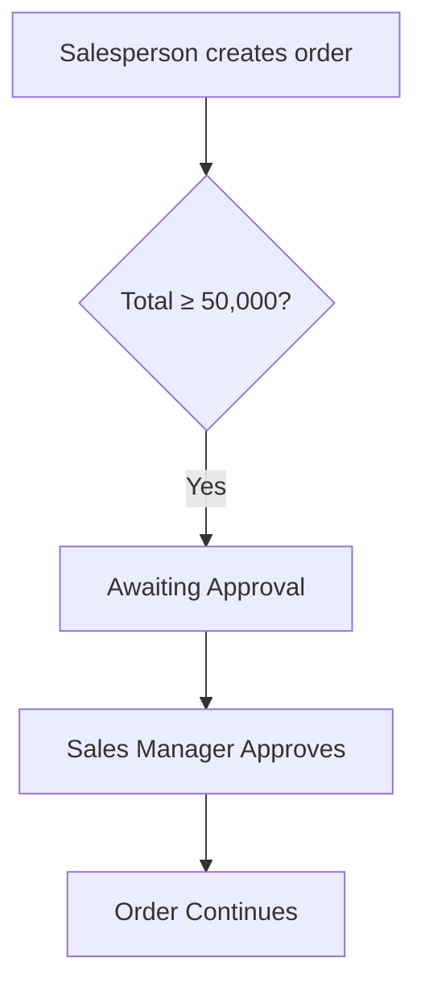
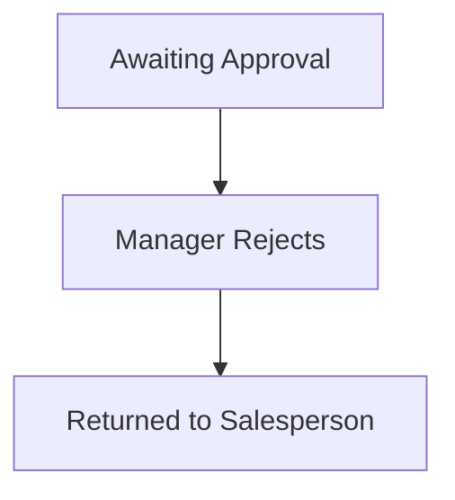
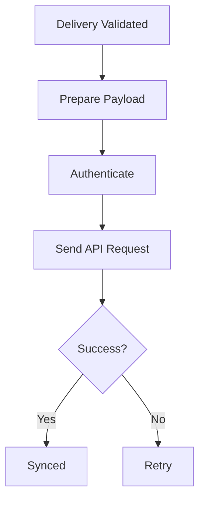

# Chapter 2 Project: Design an Odoo Deployment for Bilal Office Supplies

You already modeled the company's processes in Chapter 1.

Now convert that conceptual company into an Odoo system design.

This is **system design**, not Odoo configuration yet. Do not build records in Odoo until you have documented the requirement.

For Odoo Learn, official documentation, and deployment resources, see [Resources.md](Resources.md).

---

## Table of Contents

- [Part 1: Applications](#part-1-applications)
- [Part 2: Users](#part-2-users)
- [Part 3: Companies](#part-3-companies)
- [Part 4: Master Records](#part-4-master-records)
- [Part 5: Hosting Decision](#part-5-hosting-decision)
- [Part 6: Custom Requirement (Sales Approval)](#part-6-custom-requirement-sales-approval)
- [Part 7: Complex Requirement (Logistics API)](#part-7-complex-requirement-logistics-api)
- [Complete Solution](#chapter-2-project-complete-solution)

---

## Part 1: Applications

Bilal Office Supplies needs:

- customer management,
- Sales,
- Purchasing,
- Inventory,
- invoicing,
- employees.

Identify the Odoo apps you expect to investigate for each requirement.

---

## Part 2: Users

Create these roles:

| User | Role |
| --- | --- |
| Ahmed | Salesperson |
| Sara | Purchasing |
| Ali | Warehouse |
| Fatima | Finance |
| Bilal | Administrator |

For each user, document:

- which apps they need,
- what data they should see,
- what actions they should perform,
- what sensitive functionality they should probably not access.

Do not configure security yet. We are designing the requirement.

---

## Part 3: Companies

Start with **Bilal Office Supplies Qatar**.

Then imagine the company expands to **Bilal Office Supplies Pakistan**.

Determine:

- which users should access both,
- which users should access only one,
- which information might be shared,
- which transactions must remain company-specific.

---

## Part 4: Master Records

Identify likely shared or master data:

- customers,
- vendors,
- products,
- employees.

Then determine which of these may require company-specific information.

---

## Part 5: Hosting Decision

Compare the three options:

- Odoo Online
- Odoo.sh
- Self-hosted

For each, write:

- main advantage,
- main limitation,
- customization capability,
- infrastructure responsibility.

---

## Part 6: Custom Requirement (Sales Approval)

Business requirement:

All orders worth **QAR 50,000** or more require Sales Manager approval.

Document:

- **Trigger:** Total ≥ 50,000
- **Actor:** Sales Manager
- **Expected state:** Awaiting Approval
- **Positive path:** Approve → Continue
- **Negative path:** Reject → Return to salesperson

Then answer:

Would you first investigate standard Odoo, configuration, Studio, or custom code? Explain why.

---

## Part 7: Complex Requirement (Logistics API)

The company later says:

Whenever an order is delivered, send the delivery information to an external logistics API. If the API fails, retry safely and show synchronization status inside Odoo.

Now ask:

- Would Studio likely be enough?
- Would a custom module be more appropriate?
- What new integration concerns appear?

You are not coding yet. The goal is to develop Odoo engineering judgment.

---

# Chapter 2 Project: Complete Solution

Work through the parts above first. The solutions below apply Chapter 2 concepts to Bilal Office Supplies.

---

## Part 1: Applications

The company needs the following:

| Requirement | Odoo Application |
| --- | --- |
| Customer management | Contacts |
| Sales | Sales |
| Purchasing | Purchase |
| Inventory | Inventory |
| Invoicing | Invoicing / Accounting |
| Employees | Employees |

**CRM** might additionally be investigated if the company wants to manage prospects and sales opportunities before quotations.

---

## Part 2: Users

### Ahmed: Salesperson

**Applications:** Contacts, CRM (if used), Sales

**Should see:** customers relevant to Sales, products, quotations, Sales Orders, his sales activities.

**Should perform:** create quotations, update quotations, confirm permitted sales, communicate with customers.

**Should probably not access:** full accounting configuration, employee salary information, server administration, vendor purchasing controls.

### Sara: Purchasing

**Applications:** Purchase, Contacts/Vendors, relevant Inventory information

**Should see:** vendors, products, procurement requirements, Purchase Orders, incoming receipts as relevant.

**Should perform:** create RFQs, create Purchase Orders, select vendors, monitor procurement.

**Should probably not access:** HR confidential information, full accounting administration, unrelated Sales administration, system administration.

### Ali: Warehouse

**Applications:** primarily Inventory

**Should see:** products, stock quantities, incoming shipments, outgoing deliveries, warehouse locations.

**Should perform:** receive goods, validate transfers, pick and pack products, process deliveries.

**Should probably not access:** accounting, vendor financial terms unnecessarily, HR, Odoo administration, sensitive Sales pricing if not required.

### Fatima: Finance

**Applications:** Accounting/Invoicing, Contacts, limited Sales/Purchase information when required for financial processing

**Should see:** invoices, vendor bills, payments, financial accounts, customer and vendor balances.

**Should perform:** issue and post invoices, record payments, process bills, reconcile financial transactions.

**Should probably not access:** system technical settings, unnecessary HR data, arbitrary warehouse administration.

### Bilal: Administrator

**Applications:** potentially all applications

**Should see:** system-wide information necessary for administration.

**Should perform:** user administration, configuration, application installation, permissions management, technical administration.

However, even administrators should use high privilege responsibly. Being an administrator does not mean changing anything at any time. Production systems require controlled changes.

### User-access principle

The requirement should follow **Least Necessary Access**: users get what they need to perform their business responsibilities, not automatically everything.

---

## Part 3: Companies

We now have:

- **C_Q** = Bilal Office Supplies Qatar
- **C_P** = Bilal Office Supplies Pakistan

### User design

| User | Role | Access |
| --- | --- | --- |
| Ahmed | Qatar salesperson | {C_Q} |
| Sara | Group Purchasing Manager | {C_Q, C_P} |
| Ali | Qatar warehouse worker | {C_Q} |
| Fatima | Group finance manager | {C_Q, C_P} |
| Bilal | Administrator | {C_Q, C_P} |

Pakistan-specific staff would normally receive **C_P** only.

### Information that might be shared

Potential examples:

- customer contacts,
- vendor contacts,
- common product identities,
- general contact information.

For example, **Logitech Keyboard** could be recognized as the same product used throughout the group.

### Information that must remain company-specific

Examples:

- Sales Orders,
- Purchase Orders,
- invoices,
- vendor bills,
- accounting entries,
- taxes,
- bank accounts,
- financial reports,
- inventory transactions where company ownership matters.

Example: **INV_Q001 ∈ C_Q** must not accidentally become an accounting transaction for **C_P**.

### Why separation matters

The two businesses may have different currencies, taxes, laws, bank accounts, and accounting structures.

Therefore **Shared ERP Database ≠ Shared Legal Identity**.

---

## Part 4: Master Records

### Customers

Potentially shared.

Example: **ABC International** might purchase from both Qatar and Pakistan.

However, company-specific values could differ, such as payment terms, salesperson, pricing, and accounting treatment.

### Vendors

Potentially shared if the same supplier serves multiple group companies.

Company-specific aspects might include purchase terms, currency, payment arrangements, and accounting information.

### Products

Products are strong candidates for shared master information.

Potentially shared: name, SKU, description, barcode.

Potentially company-dependent: cost, valuation and accounting behavior, pricing, taxes, procurement settings.

### Employees

Employees normally have much stronger company context.

Ahmed working for Bilal Office Supplies Qatar should normally be associated with the Qatar organization.

An employee's department, manager, contract, payroll, and leave rules may depend heavily on their company.

### Overall design principle

Some master information can be **Shared Identity** while certain attributes remain **Company-Specific Context**.

---

## Part 5: Hosting Decision

### Odoo Online

| | |
| --- | --- |
| **Main advantage** | Very low infrastructure-management burden |
| **Main limitation** | Limited freedom for arbitrary custom server-side Python modules |
| **Customization capability** | Good for standard functionality, configuration, and supported Studio-based customization |
| **Infrastructure responsibility** | Mostly handled by Odoo |

### Odoo.sh

| | |
| --- | --- |
| **Main advantage** | Supports real custom development while providing a managed Odoo-focused deployment platform |
| **Main limitation** | Less infrastructure control than fully self-hosting and carries platform or service cost |
| **Customization capability** | High; supports custom modules and Git-oriented development workflows |
| **Infrastructure responsibility** | Shared and managed significantly by Odoo.sh; the development team concentrates more on Odoo than on raw server administration |

### Self-Hosted

| | |
| --- | --- |
| **Main advantage** | Maximum control over server, Odoo, PostgreSQL, dependencies, networking, and integrations |
| **Main limitation** | Maximum operational responsibility |
| **Customization capability** | Very high |
| **Infrastructure responsibility** | Mostly yours; you need backups, security, SSL, updates, monitoring, recovery, and database management |

### Hosting recommendation for Bilal Office Supplies

Suppose this company plans substantial custom development.

A reasonable first choice to evaluate would be **Odoo.sh**, because it provides **Custom Development + Managed Odoo Infrastructure** without immediately forcing a small business to operate its entire production infrastructure itself.

If the company eventually needs deep infrastructure control, strict hosting requirements, or specialized integrations, self-hosting may become attractive.

---

## Part 6: Custom Requirement (Sales Approval)

**Requirement:** Order Total ≥ 50,000 QAR requires approval.

| Element | Design |
| --- | --- |
| **Trigger** | Sales Order Total ≥ 50,000 QAR |
| **Actor** | Sales Manager |
| **Expected state (before approval)** | Awaiting Approval |

### Positive path

### Negative path

The salesperson may then need to revise the order, explain it, cancel it, or resubmit it.

### What should we investigate first?

Do not immediately choose custom Python.

The first investigation should be **Standard Odoo Capability**, followed by **Configuration**, and potentially **Studio**.

If those cannot correctly represent the company's workflow, then use a **Custom Module**.

This follows the decision hierarchy:

### Additional questions an Odoo engineer should ask

Before implementation:

- Can managers approve their own Sales Orders? (Probably a business-rule question.)
- Can the salesperson modify the order after approval? If yes, imagine an order approved at 50,500 QAR then changed to 100,000 QAR. Should the old approval still be valid? Probably not.
- What if the order drops below QAR 50,000? Should approval disappear? Business rule required.
- Does tax count toward QAR 50,000? Possible definitions: **Untaxed Amount ≥ 50,000** or **Total Including Tax ≥ 50,000**. Those are different rules.
- Can Sales Manager reject with no explanation? You might require a **Rejection Reason**.

These questions turn a vague request into a real ERP specification.

---

## Part 7: Complex Requirement (Logistics API)

**Requirement:** After delivery, send delivery information to an external logistics API, retry failures safely, and display synchronization status.

### Would Studio likely be enough?

For the complete requirement: **Probably No**.

A simple webhook might sometimes be possible through no-code tools, but this requirement includes significantly more than merely sending one request. It requires reliable integration behavior.

### Would a custom module be more appropriate?

**Yes.** A custom module would likely be the more maintainable solution.

### Why?

Because we probably need logic such as:

### Integration concerns

**1. Authentication**

How does the external API authenticate? Possibilities include API key, bearer token, OAuth, or request signature. Credentials must be stored securely.

**2. Payload mapping**

Odoo's delivery data must be transformed into whatever format the logistics system expects. For example Odoo might contain customer, delivery address, products, and quantities. The external API may require shipmentReference, recipient, address, items, and quantity. The two schemas must be mapped correctly.

**3. Failure handling**

Suppose the external server returns HTTP 500. We should not necessarily mark the delivery as synchronized. Instead: **Sync Status = Failed**.

**4. Retries**

Transient failures may need retrying, but retries must be safe.

Imagine: Attempt 1 creates shipment SHIP1001, but the response gets lost. Odoo thinks it failed and retries. The external system creates SHIP1002. Now one delivery produced two shipments. That is dangerous.

**5. Idempotency**

We therefore need to think about idempotency. Ideally repeating the same synchronization request should not create duplicate external operations. Sending the same delivery again should not accidentally create another shipment.

**6. Synchronization state**

Odoo might need states such as: Pending, Synchronizing, Synced, Failed. Possibly also Retry Scheduled or Permanent Failure.

**7. External reference**

Store the logistics system's identifier. Example: Odoo Delivery **WH/OUT/0052** linked to External Shipment **SHIP-923812**. This allows the systems to refer to the same real-world shipment.

**8. Logging**

We may need to record synchronization time, request outcome, response code, failure reason, and retry count. Sensitive information should not be carelessly placed in logs.

**9. Timeout**

What happens if the API takes 60 seconds? The Odoo transaction should not necessarily remain blocked indefinitely. A timeout policy is required.

**10. Business continuity**

Suppose the logistics provider is down for two hours. Should warehouse users be unable to validate deliveries? Maybe not.

A better architecture might be:

Rather than coupling the customer's core warehouse operation directly to the external provider's availability.

That is already engineering judgment, not merely writing Python.
