# UNIT I: UNDERSTAND THE BUSINESS BEFORE THE CODE

## CHAPTER 3: CORE BUSINESS APPLICATIONS

The roadmap makes Chapter 3 the final chapter of Unit I and requires us to cover **Contacts**, **CRM**, **Sales**, **Purchase**, **Inventory**, **Accounting / Invoicing**, **Employees / HR**, **Projects**, **Timesheets**, **Manufacturing**, **Maintenance**, **Website**, **eCommerce**, **Point of Sale**, **Helpdesk**, and **End-to-End Document Flow** before moving into Odoo architecture.

The roadmap itself gives the scope and hierarchy; the detailed explanations below are the teaching layer built around those roadmap topics. Exact menus and optional features can vary by Odoo version and edition, so our focus here is the stable business purpose and integration model of each application.

---

## CHAPTER 3 TABLE OF CONTENTS

- [**Before We Start: The Most Important Mental Model**](#before-we-start-the-most-important-mental-model)
- [**3.1** Contacts](#31-contacts)
- [**3.2** CRM](#32-crm)
- [**3.3** Sales](#33-sales)
- [**3.4** Purchase](#34-purchase)
- [**3.5** Inventory](#35-inventory)
- [**3.6** Accounting / Invoicing](#36-accounting--invoicing)
- [**3.7** Employees / HR](#37-employees--hr)
- [**3.8** Projects](#38-projects)
- [**3.9** Timesheets](#39-timesheets)
- [**3.10** Manufacturing](#310-manufacturing)
- [**3.11** Maintenance](#311-maintenance)
- [**3.12** Website](#312-website)
- [**3.13** eCommerce](#313-ecommerce)
- [**3.14** Point of Sale](#314-point-of-sale)
- [**3.15** Helpdesk](#315-helpdesk)
- [**3.16** End-to-End Document Flow](#316-end-to-end-document-flow)
- [Common Beginner Mistakes in Chapter 3](#common-beginner-mistakes-in-chapter-3)
- [Chapter 3 Summary](#chapter-3-summary)
- [**Free Learning Resources**](Resources.md)

**Then complete Unit I in order:**

- [Unit I Conclusion](../Conclusion/Summary.md)
- [Unit I Exercise](../Exercise/Exercise.md)
- [Unit I Project](../Project/Project.md)

---

## BEFORE WE START: THE MOST IMPORTANT MENTAL MODEL

Do not imagine these applications as 15 unrelated programs.

Think instead of **one business** represented through several specialized applications.

For example, the path from **CRM** to **Sales** to **Inventory** to **Accounting** is one connected customer journey.

<div align="center">

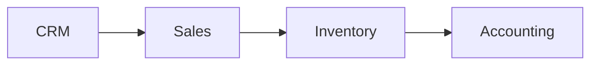

</div>

Likewise, **Purchase** to **Inventory** to **Accounting** is one supplier journey.

<div align="center">

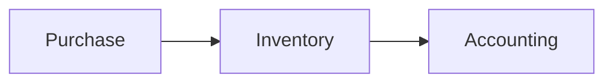

</div>

And **Sales** to **Project** to **Timesheets** to **Accounting** can represent a service business.

<div align="center">

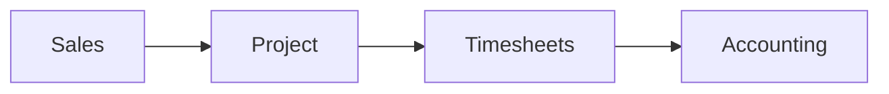

</div>

That integration is the main idea of this entire chapter. Each application has its own responsibility, but the real power of ERP appears when those responsibilities connect into complete business processes.


### RELEVANT RESOURCES

Here are the relevant resources for **BEFORE WE START: THE MOST IMPORTANT MENTAL MODEL**:

> **How previews work on GitHub:** Click a thumbnail to open the video on YouTube. GitHub Markdown cannot embed an inline player, but thumbnails give you a visual preview without leaving the page layout.

### ODOO FULL BEGINNER COURSE 2026

| | |
|---|---|
| **Source** | Long-form community course |
| **Why use it** | Companion overview across multiple Odoo areas, not a replacement for this roadmap |

<div align="center">

[](https://www.youtube.com/watch?v=KL-xWoDksdk)

**Watch on YouTube:** [Odoo Full Beginner Course 2026](https://www.youtube.com/watch?v=KL-xWoDksdk)

</div>

---

## 3.1 CONTACTS

### INTUITION

Every business process involves people or organizations.

You sell to someone. You purchase from someone. You invoice someone. You contact someone. You may even have several individuals working for one customer organization.

Odoo therefore needs a central way to represent these parties. That is the purpose of **Contacts**.

### DEFINITION

**Contacts** is the business application and domain used to maintain information about people and organizations that interact with the company.

Typical examples include:

- customers,
- vendors,
- prospects,
- individuals,
- companies,
- addresses,
- business contacts.

This strongly connects to Chapter 1's idea of **master data**. A customer contact is usually not a transaction. It is reusable information that many transactions refer to.

### WHY CONTACTS EXISTS

Suppose ABC Trading buys from you ten times.

Without reusable contacts, you might repeatedly enter:

- company name,
- address,
- email,
- phone,
- tax information.

That creates duplication.

Instead, one **ABC Trading Contact** can be referenced by many documents:

- CRM Opportunity
- Quotation
- Sales Order
- Delivery
- Invoice
- Payment-related documents

This is the **single source of truth** principle from Chapter 1 becoming practical. Create the party once; reference it everywhere.

<div align="center">

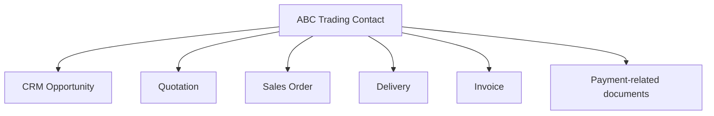

</div>

### COMPANY CONTACT VS INDIVIDUAL CONTACT

Imagine **ABC Trading LLC** has:

- Hassan - Purchasing Manager
- Sara - Finance Manager
- Ahmed - Operations Manager

The organization and its employees are related but not conceptually identical. Odoo needs to represent both the company and the people associated with it.

This helps answer questions such as:

> Who should receive the quotation?

and:

> Who should receive the invoice?

Those may be different people. A quotation might go to Hassan in Purchasing, while the invoice goes to Sara in Finance. Contacts must support that distinction.

### PRACTICAL ODOO USE

Contacts becomes foundational because many other apps need a party to associate with a record.

| Document Type | Associated Party |
|---|---|
| Sales Order | Customer Contact |
| Purchase Order | Vendor Contact |
| CRM Opportunity | Prospect Contact |

That means Contacts is not merely an address book. It is a **shared master-data layer** that other applications depend on.

### COMMON MISTAKE

A beginner may create duplicate contacts:

- ABC Trading
- ABC Trading LLC
- ABC Trading W.L.L.
- ABC Trading Customer

Then different departments use different versions. That breaks the single-source-of-truth principle. Good ERP implementation requires controlled master data: one canonical record per real-world party, with clear naming and deduplication rules.

Contacts is where that discipline begins. Every duplicate contact you allow today becomes a reconciliation problem tomorrow when Sales, Warehouse, and Finance each work from a slightly different version of the same customer.


### RELEVANT RESOURCES

Here are the relevant resources for **3.1 CONTACTS**:

### ODOO FULL BEGINNER COURSE 2026

| | |
|---|---|
| **Source** | Long-form community course |
| **Why use it** | Companion overview across multiple Odoo areas, not a replacement for this roadmap |

<div align="center">

[](https://www.youtube.com/watch?v=KL-xWoDksdk)

**Watch on YouTube:** [Odoo Full Beginner Course 2026](https://www.youtube.com/watch?v=KL-xWoDksdk)

</div>

---

### OFFICIAL DOCUMENTATION

| Application | Documentation |
|---|---|
| **All applications** | [Odoo 19 Applications Documentation](https://www.odoo.com/documentation/19.0/applications.html) |

---

## 3.2 CRM

**CRM** stands for **Customer Relationship Management**.

We already separated CRM from ERP in Chapter 1. Now we place CRM inside Odoo.

### INTUITION

Sales does not always start with an order.

Often it starts with uncertainty. Someone may:

- fill out a website form,
- call the company,
- ask for pricing,
- show interest,
- request a meeting.

At that point, there may be no confirmed sale. CRM manages that earlier stage: the period of possibility before a commercial commitment exists.

### LEAD AND OPPORTUNITY THINKING

Imagine someone says:

> "We may need 100 office chairs next month."

That isn't yet a Sales Order. It is a potential business opportunity.

CRM helps sales teams manage possibilities before they become confirmed transactions.

A simple conceptual progression is:

<div align="center">

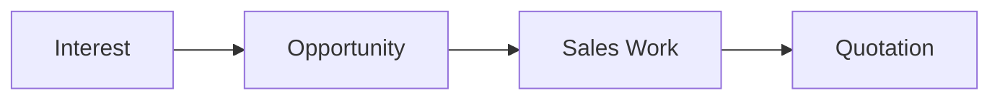

</div>

### PIPELINE CONCEPT

A **sales pipeline** represents opportunities progressing through stages.

For example:

<div align="center">

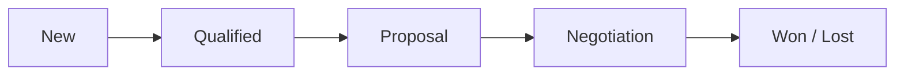

</div>

The exact stages depend on the business. A real estate company's pipeline could differ from a software consultancy's pipeline. The structure is flexible; the purpose is consistent: give salespeople a shared view of where each potential deal stands.

### WHY CRM EXISTS

Without CRM, salespeople often manage prospects through:

- memory,
- notebooks,
- spreadsheets,
- email inboxes.

Problems appear quickly:

- forgotten follow-ups,
- duplicated calls,
- unclear ownership,
- lost opportunities,
- poor forecasting.

CRM gives structure to the process. It turns informal interest into trackable records with owners, stages, expected values, and planned activities.

### CRM VS SALES

This distinction matters greatly.

| Application | Primary Focus |
|---|---|
| **CRM** | **Potential Sale** - managing relationships and opportunities before confirmation |
| **Sales** | **Commercial Offer and Confirmed Sale** - quotations, orders, and commercial terms |

Conceptually:

<div align="center">

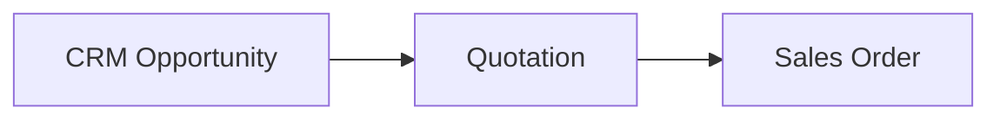

</div>

CRM handles the relationship and opportunity. Sales handles the commercial transaction. They connect, but they are not the same domain.

### EXAMPLE

Ahmed speaks with Gulf Construction. They may require **200 monitors**.

Ahmed creates an opportunity. He records:

- expected value,
- customer,
- notes,
- activities,
- stage.

Once requirements become clear, a quotation can be created.

Thus: **CRM** feeds **Sales** when the business moves from "maybe" to "let us propose terms."

### COMMON MISTAKE

Do not treat every existing customer as a CRM opportunity.

A **contact** represents the party. An **opportunity** represents a potential business deal.

ABC Trading may be one contact but have **Opportunity 1**, **Opportunity 2**, and **Opportunity 3** over several years. The customer persists; each deal is its own opportunity with its own timeline, value, and outcome.

CRM therefore sits upstream of Sales in many organizations. It does not replace Sales, and it does not record confirmed commercial terms. It gives the sales team a structured way to pursue business before any quotation exists. When you later see CRM and Sales as separate Odoo apps, remember that separation reflects a real business distinction between possibility and commitment.


### RELEVANT RESOURCES

Here are the relevant resources for **3.2 CRM**:

### 1. CRM BASICS: PIPELINES AND OPPORTUNITIES

| | |
|---|---|
| **Source** | Official Odoo |
| **Reinforces** | **Lead/Opportunity → Pipeline** |

<div align="center">

[](https://www.youtube.com/watch?v=RpPKOl85kuc)

**Watch on YouTube:** [CRM Basics: Pipelines and Opportunities](https://www.youtube.com/watch?v=RpPKOl85kuc)

</div>

---

### 2. CRM LEAD AND OPPORTUNITY BASICS

| | |
|---|---|
| **Source** | Official Odoo |

<div align="center">

[](https://www.youtube.com/watch?v=BSEf-EldDIA)

**Watch on YouTube:** [CRM Lead and Opportunity Basics](https://www.youtube.com/watch?v=BSEf-EldDIA)

</div>

---

### OFFICIAL DOCUMENTATION

| Application | Documentation |
|---|---|
| **CRM** | [Odoo 19 CRM Documentation](https://www.odoo.com/documentation/19.0/applications/sales/crm.html) |

---

## 3.3 SALES

### INTUITION

CRM asks:

> "Can we win this business?"

Sales asks:

> "What exactly are we offering, under what terms, and has the customer agreed?"

Sales is where commercial language becomes concrete: products, quantities, prices, discounts, taxes, and payment terms.

### CORE SALES FLOW

A common sales process is:

<div align="center">

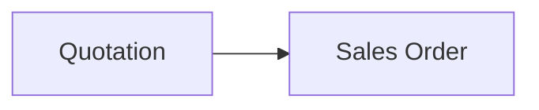

</div>

A **quotation** is a commercial proposal. It can specify:

- customer,
- products/services,
- quantities,
- prices,
- discounts,
- taxes,
- payment terms.

Once the customer accepts and the sale is confirmed, the quotation becomes a confirmed Sales Order conceptually.

### WHY A SALES ORDER MATTERS

A confirmed sale is not merely a PDF. It is a **business commitment**.

Suppose the order contains **20 monitors**. This may mean:

- warehouse must reserve 20 monitors,
- purchasing may need more stock,
- manufacturing may need to produce something,
- accounting may need to invoice the customer.

Therefore, a **Sales Order** can become a trigger for other processes across the organization.

### EXAMPLE

Customer: **ABC Trading**

Orders: **10 monitors** at **1,000 QAR each**

Subtotal:

$$ 10 \times 1{,}000 = 10{,}000 \text{ QAR} $$

The Sales Order captures the commercial agreement. Inventory then deals with the physical movement. Accounting deals with the financial consequence. Sales sits at the center of the commercial promise, not at the end of fulfillment.

### SALES IS NOT INVENTORY

A Sales Order does not itself mean that stock physically moved. It records the commercial obligation. That distinction is critical.

| Record | What It Represents |
|---|---|
| **Sales Order** | What the company promised to sell |
| **Delivery** | What physically moved to the customer |
| **Invoice** | What the customer owes financially |

These are related records in different business domains. Confusing them leads to bad process design and bad development assumptions.

### WHY DEVELOPERS MUST UNDERSTAND THIS

Later you may encounter models such as:

- sales orders,
- stock pickings,
- invoices.

If you don't understand the business distinction, you'll make bad technical assumptions.

For example:

> "When Sales Order is created, the customer has already received the goods."

That is false in many processes. The Sales Order may be confirmed days or weeks before delivery. Warehouse may still be picking, purchasing may still be replenishing, and Finance may not yet have invoiced.

Sales creates demand and commercial obligation. Other domains fulfill that obligation on their own timelines.


### RELEVANT RESOURCES

Here are the relevant resources for **3.3 SALES**:

### SELLING PRODUCTS: ODOO SALES

| | |
|---|---|
| **Source** | Official Odoo |
| **Reinforces** | **Quotation → Sales Order** |

<div align="center">

[](https://www.youtube.com/watch?v=uPMpMH1A6vk)

**Watch on YouTube:** [Selling Products: Odoo Sales](https://www.youtube.com/watch?v=uPMpMH1A6vk)

</div>

---

### OFFICIAL DOCUMENTATION

| Application | Documentation |
|---|---|
| **Sales** | [Odoo 19 Sales Documentation](https://www.odoo.com/documentation/19.0/applications/sales/sales.html) |

---

## 3.4 PURCHASE

Purchase handles the opposite commercial direction.

| Direction | Flow |
|---|---|
| **Sales** | Company → Customer |
| **Purchase** | Vendor → Company |

### INTUITION

Your warehouse needs 50 keyboards. You don't have enough.

Someone must:

- find a supplier,
- request pricing,
- place an order,
- monitor the purchase.

That is **procurement**, and Purchase is the application domain that manages it.

### TYPICAL FLOW

Conceptually:

<div align="center">

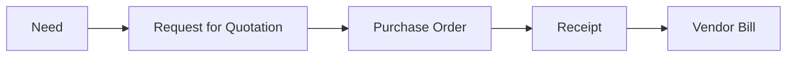

</div>

Notice how several apps participate. Purchase handles the commercial agreement with the vendor. Inventory handles receiving goods. Accounting handles the vendor bill and payment.

### RFQ VS PURCHASE ORDER

An **RFQ** is typically an unconfirmed request or proposed purchase. A **Purchase Order** represents the approved and confirmed purchasing commitment.

Conceptually:

<div align="center">

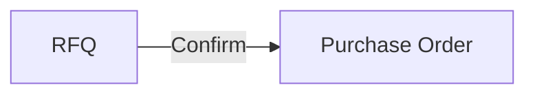

</div>

The RFQ explores options; the Purchase Order commits the company to buy.

### EXAMPLE

Warehouse needs **50 keyboards**.

Vendor price: **150 QAR/unit**

Total:

$$ 50 \times 150 = 7{,}500 \text{ QAR} $$

Purchase handles the commercial order. But the stock should not increase merely because the Purchase Order exists.

Why? Because goods haven't necessarily arrived yet. That is Inventory's job.

### PURCHASE VS INVENTORY

Important:

| Record | What It Represents |
|---|---|
| **Purchase Order** | Commercial commitment to buy from a vendor |
| **Goods Receipt** | Physical arrival of goods into the warehouse |

A vendor can confirm an order today but deliver next week. ERP systems therefore separate:

- purchasing commitment,
- physical receipt.

Purchase tells the organization what it agreed to buy. Inventory tells the organization what actually arrived and where it sits.


### RELEVANT RESOURCES

Here are the relevant resources for **3.4 PURCHASE**:

### 1. PURCHASE AND RFQ BASICS

| | |
|---|---|
| **Source** | Official Odoo |
| **Reinforces** | **RFQ → Purchase Order** |

<div align="center">

[](https://www.youtube.com/watch?v=LX_kRgiqUj0)

**Watch on YouTube:** [Purchase and RFQ Basics](https://www.youtube.com/watch?v=LX_kRgiqUj0)

</div>

---

### 2. PURCHASE APP TOUR: RFQ TO RECEIPT

| | |
|---|---|
| **Source** | Official Odoo |
| **Why use it** | Especially useful because it begins showing cross-application flow |

<div align="center">

[](https://www.youtube.com/watch?v=P17LOOEbufg)

**Watch on YouTube:** [Purchase App Tour: RFQ to Receipt](https://www.youtube.com/watch?v=P17LOOEbufg)

</div>

---

### OFFICIAL DOCUMENTATION

| Application | Documentation |
|---|---|
| **Purchase / Inventory / Manufacturing / Maintenance** | [Odoo 19 Supply Chain Documentation](https://www.odoo.com/documentation/19.0/applications/inventory_and_mrp.html) |

---

## 3.5 INVENTORY

Inventory is one of the most important applications for understanding ERP integration.

### INTUITION

Sales says:

> "We promised the customer 20 monitors."

Purchase says:

> "We ordered 50 keyboards."

Inventory answers:

> "Where are the physical goods, how many exist, and what movement is happening?"

Inventory is the operational truth of physical stock.

### INVENTORY HAS TWO MAJOR CONCERNS

**Quantity:** How much do we have?

**Movement:** Where is it going?

That means Inventory is more than `product quantity = 50`. It needs to represent movement: incoming, outgoing, internal transfers, and reservations.

### PHYSICAL FLOW

Example:

<div align="center">

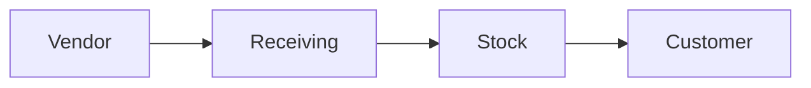

</div>

Each arrow represents a movement of goods.

### INCOMING MOVEMENT

Purchase order: **50 keyboards ordered**

does not necessarily mean:

**50 keyboards in stock**

Only after receipt is processed should inventory reflect the actual physical movement according to the workflow.

### OUTGOING MOVEMENT

Similarly, Sales order: **20 monitors sold** may create an outgoing delivery requirement.

Warehouse operations then:

- locate the products,
- pick them,
- prepare them,
- validate delivery.

The Sales Order created the demand; Inventory executes the physical movement.

### STOCK STATES

Even at a basic level, inventory thinking needs distinctions such as:

- physically available,
- reserved,
- incoming,
- outgoing.

Imagine **100 units physically present** but **80 already reserved**.

Only **20** may effectively remain available for new demand.

So raw "quantity" alone may not tell the whole story. ERP inventory tracks not just totals but commitments against those totals.

### LOCATIONS

Warehouses can also have internal locations.

For example:

<div align="center">

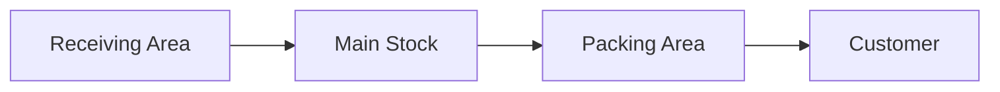

</div>

This allows ERP to represent physical operations more accurately. Goods do not teleport from the loading dock to the customer; they move through defined locations.

### WHY INVENTORY IS CENTRAL

Inventory connects strongly to:

- Sales,
- Purchase,
- Manufacturing,
- Accounting,
- eCommerce,
- POS.

This is why changes in stock logic can have wide consequences. A small change in how reservations work can affect sales availability, manufacturing planning, and financial valuation.

### COMMON MISTAKE

Do not assume Sales creates inventory.

| Domain | What It Creates |
|---|---|
| **Sales** | Demand (commercial obligation) |
| **Purchase** | Supply commitments |
| **Inventory** | Physical stock movements and quantities |

These are different concepts. Sales says what must be fulfilled. Inventory records what actually moved.


### RELEVANT RESOURCES

Here are the relevant resources for **3.5 INVENTORY**:

### INVENTORY BASICS: RECEIVE AND STORE STOCK

| | |
|---|---|
| **Source** | Official Odoo |
| **Reinforces** | **Purchase Order ≠ Receipt**, and why Inventory deals with physical movement |

<div align="center">

[](https://www.youtube.com/watch?v=0r575dWbkMk)

**Watch on YouTube:** [Inventory Basics: Receive and Store Stock](https://www.youtube.com/watch?v=0r575dWbkMk)

</div>

---

### OFFICIAL DOCUMENTATION

| Application | Documentation |
|---|---|
| **Purchase / Inventory / Manufacturing / Maintenance** | [Odoo 19 Supply Chain Documentation](https://www.odoo.com/documentation/19.0/applications/inventory_and_mrp.html) |

---

## 3.6 ACCOUNTING / INVOICING

Now we move from operational events to financial consequences.

### INTUITION

A company can sell many products and still fail financially if it doesn't properly track:

- what customers owe,
- what the company owes vendors,
- payments,
- revenue,
- expenses.

**Accounting / Invoicing** exists to represent the financial side of business activity.

### CUSTOMER INVOICE

Suppose you delivered **10 monitors** at **1,000 QAR each**.

Customer invoice:

$$ 10{,}000 \text{ QAR} $$

The invoice says: the customer owes us this amount according to the transaction.

### VENDOR BILL

Suppose the company purchased **50 keyboards** for **7,500 QAR**.

The vendor bill represents the company's obligation to pay the supplier.

| Document | Financial Meaning |
|---|---|
| **Customer Invoice** | Customer owes us |
| **Vendor Bill** | We owe the vendor |

### PAYMENT IS A SEPARATE EVENT

Creating an invoice does not mean money has arrived. This distinction is crucial.

| Record | What It Represents |
|---|---|
| **Invoice** | Amount owed or due |
| **Payment** | Money actually transferred |

Example:

- Invoice issued: **10,000 QAR**
- Payment received: **0 QAR initially**
- Outstanding: **10,000 QAR**

Later the customer pays. Only then does the payment process occur. Finance tracks both the obligation and the settlement as separate events.

### ACCOUNTS

Chapter 1 introduced financial accounts as master and configuration data.

Transactions post financial consequences into those structures.

At this stage you don't need journal-entry mechanics yet. Just understand:

<div align="center">

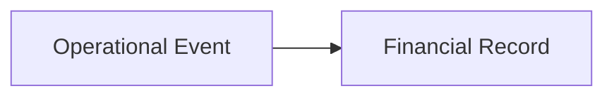

</div>

For example:

- Sale → Invoice
- Purchase → Vendor Bill

Operational work creates financial records; Accounting captures the monetary consequence.

### WHY THIS CONNECTION MATTERS

A standalone warehouse system may know that goods were delivered. A standalone accounting system may not know why.

ERP integration can link operational and financial records. That creates **traceability**: from invoice back to delivery, from delivery back to Sales Order, from Sales Order back to customer.

Accounting is not an island. It is the financial mirror of operational reality.


### RELEVANT RESOURCES

Here are the relevant resources for **3.6 ACCOUNTING / INVOICING**:

### CUSTOMER INVOICE FROM SALES ORDER

| | |
|---|---|
| **Source** | Official Odoo |
| **Reinforces** | **Sales Order → Invoice** |

<div align="center">

[](https://www.youtube.com/watch?v=14AIEJ_B7rA)

**Watch on YouTube:** [Customer Invoice from Sales Order](https://www.youtube.com/watch?v=14AIEJ_B7rA)

</div>

---

### OFFICIAL DOCUMENTATION

| Application | Documentation |
|---|---|
| **Accounting / Invoicing** | [Odoo 19 Accounting Documentation](https://www.odoo.com/documentation/19.0/applications/finance/accounting.html) |

---

## 3.7 EMPLOYEES / HR

### INTUITION

ERP isn't only about products and money. Organizations also manage people.

Employees participate in business processes. HR applications represent people as business resources with their own records, relationships, and workflows.

### EMPLOYEE MASTER DATA

An employee record may describe:

- name,
- department,
- position,
- manager,
- work contact information,
- organizational relationship.

This is another example of **master data**. Like customers and products, an employee record is reusable across many processes.

### EMPLOYEE VS USER

We covered this in Chapter 2. Remember:

| Concept | Domain |
|---|---|
| **Employee** | HR and business concept - who works for the company |
| **User** | System-access concept - who can log into Odoo |

An employee may have an Odoo user account, but the concepts are still different. Not every employee needs system access, and not every system user is an employee.

### HR PROCESSES

HR-related applications can support processes around areas such as:

- employee management,
- recruitment,
- leave and time off,
- expenses,
- attendance,
- appraisals,
- organizational structure.

The exact app set can vary, but the core concept is stable: **people are business resources with their own processes and records**.

### INTEGRATION EXAMPLE

Employee: **Ahmed** works as salesperson.

His employee identity may connect to:

- department,
- manager,
- expenses,
- timesheets,
- projects.

His system user may connect to:

- CRM,
- Sales,
- permissions.

Thus one real human participates in several ERP dimensions. HR knows Ahmed as an employee; Sales knows him as a salesperson; the system knows him as a user with specific access rights.

Employees / HR reminds us that ERP is not only about products and invoices. People are business resources with organizational structure, approvals, time, expenses, and assignments. Any complete Odoo mental model must include humans alongside customers, vendors, and stock.


### RELEVANT RESOURCES

Here are the relevant resources for **3.7 EMPLOYEES / HR**:

### OFFICIAL DOCUMENTATION

| Application | Documentation |
|---|---|
| **All applications** | [Odoo 19 Applications Documentation](https://www.odoo.com/documentation/19.0/applications.html) |

---

## 3.8 PROJECTS

Project management becomes important when the business performs work over time rather than simply shipping products.

### INTUITION

Suppose your company sells:

> "Implement Odoo for ABC Trading."

You cannot simply deliver a box from the warehouse. The company must perform a set of tasks:

- requirements gathering,
- configuration,
- development,
- migration,
- testing,
- training,
- deployment.

This is **project work**: structured effort over time with multiple contributors and milestones.

### PROJECT VS TASK

A **project** is the broader body of work. A **task** is a specific unit of work inside it.

Example: **Project: ABC Odoo Implementation** contains:

- T1 = Requirements Analysis
- T2 = Sales Configuration
- T3 = Data Migration
- T4 = Training

<div align="center">

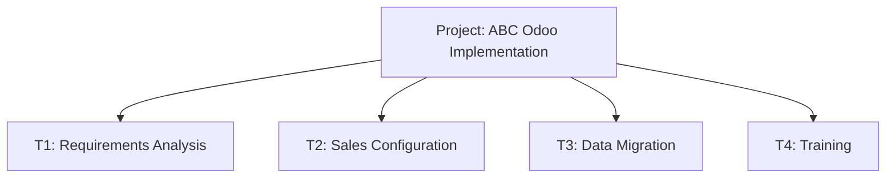

</div>

### WHY PROJECTS EXIST

Projects help coordinate:

- work,
- responsibilities,
- deadlines,
- progress,
- tasks.

This is especially important for:

- consulting,
- software development,
- construction,
- professional services,
- internal initiatives.

### CONNECTION TO SALES

Suppose Sales sells **100 consulting hours**.

The confirmed sale may eventually result in project work.

Conceptually:

<div align="center">

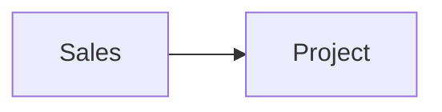

</div>

This is another cross-department workflow. The commercial agreement (Sales) becomes operational work (Projects), which may later connect to time tracking and invoicing.

Projects matter whenever fulfillment is work performed over time rather than a product shipped from stock. For consulting, implementation, construction, and internal initiatives, the project record is how the organization coordinates who does what, by when, and toward which deliverable.


### RELEVANT RESOURCES

Here are the relevant resources for **3.8 PROJECTS**:

### 2. MEASURING PROJECT PROFITABILITY

| | |
|---|---|
| **Source** | Official Odoo |
| **Why use it** | Shows how project work eventually connects back to financial and business outcomes |

<div align="center">

[](https://www.youtube.com/watch?v=tqELamDjaNU)

**Watch on YouTube:** [Measuring Project Profitability](https://www.youtube.com/watch?v=tqELamDjaNU)

</div>

---

### OFFICIAL DOCUMENTATION

| Application | Documentation |
|---|---|
| **Project / Timesheets** | [Odoo 19 Project Management Documentation](https://www.odoo.com/documentation/19.0/applications/services/project.html) |

---

## 3.9 TIMESHEETS

Timesheets answer:

> How much time did someone spend on work?

### INTUITION

Suppose a consultant works **6 hours** on customer A. The next day: **4 hours**.

Total: **10 hours**

The business may need this information for:

- billing,
- costing,
- utilization,
- planning,
- project tracking.

Time is a resource. Timesheets make that resource visible and measurable.

### PROJECT CONNECTION

Timesheets are often associated with:

**Employee + Project + Task + Time**

For example:

| Employee | Project | Task | Hours |
|---|---|---|---|
| Ahmed | ABC Implementation | Data Migration | 4 |
| Ahmed | ABC Implementation | Testing | 3 |
| Sara | ABC Implementation | Training | 2 |

Total project effort:

$$ 4 + 3 + 2 = 9 \text{ hours} $$

### BILLABLE VS INTERNAL TIME

Not all time has the same business meaning.

| Type | Meaning |
|---|---|
| **Billable** | Customer pays for the work |
| **Internal** | Company uses the time but doesn't charge a customer |

This distinction matters for service companies. Billable hours drive revenue; internal hours drive cost and capacity planning.

### INTEGRATION

Conceptually:

<div align="center">

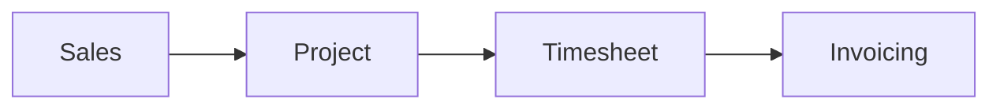

</div>

For service businesses this can be as important as:

<div align="center">

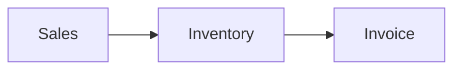

</div>

is for product businesses. The fulfillment path differs, but the integration principle is the same: one commercial commitment triggers work in other domains, which eventually produces a financial record.

Timesheets turn invisible labor into measurable business data. For product companies they support costing and utilization. For service companies they can be the primary evidence that work was performed and is ready to bill. Either way, time is a resource ERP must track when projects and services are part of the business model.


### RELEVANT RESOURCES

Here are the relevant resources for **3.9 TIMESHEETS**:

### 1. TIMESHEETS BASICS

| | |
|---|---|
| **Source** | Official Odoo |
| **Reinforces** | **Employee + Project + Task + Time** |

<div align="center">

[](https://www.youtube.com/watch?v=Gch9tm7cRfs)

**Watch on YouTube:** [Timesheets Basics](https://www.youtube.com/watch?v=Gch9tm7cRfs)

</div>

---

### OFFICIAL DOCUMENTATION

| Application | Documentation |
|---|---|
| **Project / Timesheets** | [Odoo 19 Project Management Documentation](https://www.odoo.com/documentation/19.0/applications/services/project.html) |

---

## 3.10 MANUFACTURING

Manufacturing applies when the business does not merely buy and resell products. It produces them.

### INTUITION

Suppose your company sells desks. You don't buy finished desks. Instead you combine:

- wood,
- screws,
- metal legs,
- packaging.

Then:

<div align="center">

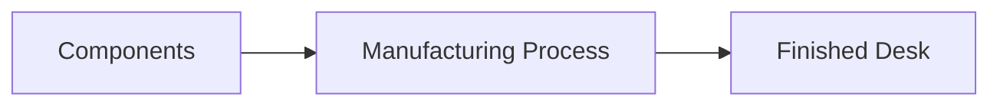

</div>

Manufacturing transforms raw and semi-finished materials into sellable products.

### BILL OF MATERIALS CONCEPT

Manufacturing requires knowing what components are needed.

Suppose one desk needs:

- 1 × Wood Top
- 4 × Leg
- 16 × Screw

That recipe and structure is conceptually the **Bill of Materials (BOM)**.

For **10 desks**, requirements become:

- 10 × Wood Top
- 40 × Leg
- 160 × Screw

The BOM scales demand from finished product back to component requirements.

### MANUFACTURING ORDER

A manufacturing process needs a record representing: produce this quantity of this product.

Conceptually, a **Manufacturing Order**:

- consumes components,
- produces finished goods.

It is the operational instruction that tells the shop floor what to build and in what quantity.

### MANUFACTURING AND INVENTORY

Manufacturing cannot exist independently of Inventory. It needs to know:

- components available,
- components consumed,
- finished products produced.

Thus:

<div align="center">

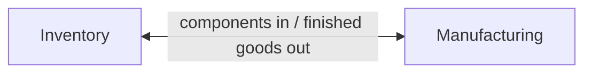

</div>

Every production run is also an inventory event: materials leave stock, finished products enter stock.

### MANUFACTURING AND SALES

Suppose a customer orders a custom desk. Sales may create demand that eventually requires production.

Conceptually:

<div align="center">

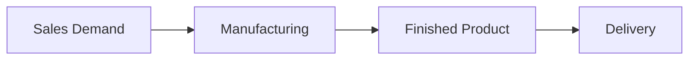

</div>

This is a much more complex workflow than simple resale. The company must plan, produce, and then fulfill.

### COMMON MISTAKE

Manufacturing isn't simply: decrease raw materials and increase finished product.

Real production may involve:

- operations,
- work centers,
- lead times,
- scrap,
- quality,
- capacity.

We don't need those details yet, but remember that manufacturing is its own operational domain with its own planning and execution concerns.

Manufacturing adds a production layer between demand and fulfillment. Sales may create the need, but Manufacturing determines how components become finished goods and Inventory records every physical change along the way. Resale businesses can ignore this app; make-to-stock and make-to-order businesses cannot.


### RELEVANT RESOURCES

Here are the relevant resources for **3.10 MANUFACTURING**:

### 1. BILL OF MATERIALS BASICS

| | |
|---|---|
| **Source** | Official Odoo |
| **Reinforces** | **Components → Finished Product** |

<div align="center">

[](https://www.youtube.com/watch?v=EQMjhnHTV5s)

**Watch on YouTube:** [Bill of Materials Basics](https://www.youtube.com/watch?v=EQMjhnHTV5s)

</div>

---

### 2. SALES ORDER TO MANUFACTURING ORDER

| | |
|---|---|
| **Source** | Official Odoo |
| **Why use it** | One of the best videos for integration instead of one isolated app |

<div align="center">

[](https://www.youtube.com/watch?v=ILpbH7X6vzo)

**Watch on YouTube:** [Sales Order to Manufacturing Order](https://www.youtube.com/watch?v=ILpbH7X6vzo)

</div>

---

### 3. MANUFACTURING ORDER AND WORK ORDER BASICS

| | |
|---|---|
| **Source** | Official Odoo |

<div align="center">

[](https://www.youtube.com/watch?v=r5JewejnfQ4)

**Watch on YouTube:** [Manufacturing Order and Work Order Basics](https://www.youtube.com/watch?v=r5JewejnfQ4)

</div>

---

### OFFICIAL DOCUMENTATION

| Application | Documentation |
|---|---|
| **Manufacturing** | [Odoo 19 Manufacturing Documentation](https://www.odoo.com/documentation/19.0/applications/inventory_and_mrp/manufacturing.html) |

---

## 3.11 MAINTENANCE

Businesses rely on equipment. That equipment can fail.

### INTUITION

Imagine a manufacturing machine breaks. Production stops.

If **Machine Down**, then **Production Capacity** decreases, and customer deliveries may be delayed.

Maintenance exists to manage the health and repair of operational equipment. Equipment reliability is not a side concern; it directly affects business performance.

### CORRECTIVE MAINTENANCE

Something breaks first. Then repair occurs.

<div align="center">

```mermaid
flowchart LR
    FAIL["Failure"] --> REQ["Maintenance Request"] --> REP["Repair"]
```

</div>

Example: packaging machine stopped working. A maintenance request is raised, a technician investigates, and repair restores production capacity.

### PREVENTIVE MAINTENANCE

Instead of waiting for failure, maintenance is planned.

Example: service the machine every three months.

Conceptually:

<div align="center">

```mermaid
flowchart LR
    SCHED["Scheduled Maintenance"] --> RED["Reduced Failure Risk"]
```

</div>

Preventive maintenance trades scheduled downtime for lower risk of unplanned breakdowns.

### WHY ERP INTEGRATION MATTERS

Maintenance may affect Manufacturing.

If Machine A is unavailable:

<div align="center">

```mermaid
flowchart LR
    MPROB["Maintenance Problem"] --> PPROB["Production Problem"]
```

</div>

So equipment health is not isolated from business performance. A maintenance delay can cascade into missed deliveries and unhappy customers.

Maintenance is easy to overlook in ERP training because it does not appear in every company's daily workflow. When production equipment matters, however, downtime becomes a business problem with the same seriousness as stock shortage or late payment. Maintenance connects operational reliability to customer promise.


### RELEVANT RESOURCES

Here are the relevant resources for **3.11 MAINTENANCE**:

### OFFICIAL DOCUMENTATION

| Application | Documentation |
|---|---|
| **Purchase / Inventory / Manufacturing / Maintenance** | [Odoo 19 Supply Chain Documentation](https://www.odoo.com/documentation/19.0/applications/inventory_and_mrp.html) |

---

## 3.12 WEBSITE

Odoo can also participate in the business's public-facing web presence.

### INTUITION

So far most applications have been internal. Employees use CRM, Sales, Inventory, and Accounting.

But customers interact with the organization from outside. The **Website** application provides the public-facing side: the digital front door of the business.

### WEBSITE PURPOSE

A business website may present:

- company information,
- services,
- contact pages,
- marketing pages,
- forms,
- content.

The important ERP idea is that the website does not necessarily have to be a completely disconnected system.

### WEBSITE → CRM EXAMPLE

A visitor fills a form:

> "I need 100 office chairs."

Conceptually:

<div align="center">

```mermaid
flowchart LR
    VIS["Website Visitor"] --> FORM["Form Submission"] --> OPP["CRM Opportunity"]
```

</div>

Now external interaction becomes internal business data. This is integration: the public channel feeds the internal sales process.

### WEBSITE → CONTACTS

A visitor or customer may also produce or update contact-related information.

Again:

<div align="center">

```mermaid
flowchart LR
    WEB["Public Website"] --> REC["Business Records"]
```

</div>

The website is not just marketing. It can be a data entry point for the ERP.

### WHY THIS MATTERS

Without integration, someone might manually copy website form submissions into the CRM. That creates:

- delay,
- errors,
- duplication.

Integrated systems reduce manual transfers. What the customer submits online becomes a business record immediately, ready for follow-up.


### RELEVANT RESOURCES

Here are the relevant resources for **3.12 WEBSITE**:

### 1. BUILDING YOUR DIGITAL STOREFRONT WITH ODOO ECOMMERCE

| | |
|---|---|
| **Source** | Official Odoo |
| **Reinforces** | **Website → eCommerce → Sales** |

<div align="center">

[](https://www.youtube.com/watch?v=vH6jIkmnmhs)

**Watch on YouTube:** [Building Your Digital Storefront with Odoo eCommerce](https://www.youtube.com/watch?v=vH6jIkmnmhs)

</div>

---

## 3.13 ECOMMERCE

Website gives the public web presence. **eCommerce** adds online selling.

### INTUITION

Suppose instead of contacting Sales manually, customers can:

- browse products,
- add products to cart,
- checkout,
- place orders.

That is eCommerce: self-service buying through the web.

### CORE FLOW

Conceptually:

<div align="center">

```mermaid
flowchart LR
    WEB["Website"] --> PROD["Product"] --> CART["Cart"] --> CHK["Checkout"] --> SO["Sales Order"]
```

</div>

Then the internal ERP process continues:

<div align="center">

```mermaid
flowchart LR
    SO["Sales Order"] --> INV["Inventory"] --> DEL["Delivery"] --> ACC["Accounting"]
```

</div>

This is a perfect example of why integrated ERP is powerful. One customer action on the website triggers the same internal process chain that a salesperson-initiated order would trigger.

### EXTERNAL TO INTERNAL TRANSFORMATION

The customer sees: **Buy Now**.

Internally, the business may see:

- customer,
- order,
- products,
- payment status,
- stock demand,
- delivery requirement.

One customer action creates several business consequences across multiple applications.

### PRODUCT DATA CONNECTION

If eCommerce were a totally separate platform, the company might have to maintain product name, price, and stock twice.

Integration can reduce that duplication. The product master record in Odoo can feed both internal operations and the online catalog.

### COMMON MISTAKE

Do not think eCommerce is only website design.

In ERP terms, eCommerce is a **sales channel**. It affects:

- products,
- pricing,
- customers,
- Sales Orders,
- stock,
- payments,
- delivery.

Design matters for customer experience, but the ERP significance is operational: online orders become real business transactions.


### RELEVANT RESOURCES

Here are the relevant resources for **3.13 ECOMMERCE**:

### 1. BUILDING YOUR DIGITAL STOREFRONT WITH ODOO ECOMMERCE

| | |
|---|---|
| **Source** | Official Odoo |
| **Reinforces** | **Website → eCommerce → Sales** |

<div align="center">

[](https://www.youtube.com/watch?v=vH6jIkmnmhs)

**Watch on YouTube:** [Building Your Digital Storefront with Odoo eCommerce](https://www.youtube.com/watch?v=vH6jIkmnmhs)

</div>

---

### 2. CREATE YOUR PRODUCT: ODOO ECOMMERCE

| | |
|---|---|
| **Source** | Official Odoo |

<div align="center">

[](https://www.youtube.com/watch?v=SLAMX3gPyEg)

**Watch on YouTube:** [Create Your Product: Odoo eCommerce](https://www.youtube.com/watch?v=SLAMX3gPyEg)

</div>

---

### OFFICIAL DOCUMENTATION

| Application | Documentation |
|---|---|
| **eCommerce** | [Odoo 19 eCommerce Documentation](https://www.odoo.com/documentation/19.0/applications/websites/ecommerce.html) |

---

## 3.14 POINT OF SALE

**Point of Sale (POS)** handles sales occurring at a physical or direct sales location.

### INTUITION

Imagine a retail store. Customer walks in. Buys **2 keyboards**. Cashier processes the sale immediately.

That workflow is different from a salesperson preparing a formal quotation. POS is optimized for speed, immediacy, and in-person interaction.

### POS TRANSACTION

A POS system typically handles:

- product selection,
- quantities,
- pricing,
- payment,
- receipt.

Conceptually:

<div align="center">

```mermaid
flowchart LR
    CUS["Customer at Store"] --> POS["POS Sale"] --> PAY["Payment"]
    POS --> INV["Inventory Reduction"]
```

</div>

Payment and stock impact often happen in the same session, unlike the multi-step B2B sales cycle.

### SALES VS POS

Both sell things, but the workflow differs.

| Channel | Typical Flow |
|---|---|
| **Sales** | Quotation → Sales Order → Delivery → Invoice |
| **POS** | Select Product → Immediate Sale → Immediate Payment |

The commercial context is different. Sales often involves negotiation, credit terms, and delayed fulfillment. POS assumes immediate exchange.

### INTEGRATION

POS can interact with:

- products,
- prices,
- customers,
- inventory,
- accounting.

So retail transactions are still part of the enterprise system, not a separate cash register disconnected from the rest of the business.

### EXAMPLE

A shop starts with **100 keyboards**. Customer purchases **2**.

After the sale, assuming the inventory workflow reflects that transaction:

$$ 100 - 2 = 98 $$

This stock reduction matters to warehouse and future sales availability. POS is fast, but it still participates in the same inventory truth as every other channel.

Point of Sale proves that not every sales channel follows the quotation-to-delivery cycle. Retail needs speed and immediacy, yet the underlying ERP principle remains: a sale creates stock and financial consequences inside one connected system rather than in a standalone cash register.


### RELEVANT RESOURCES

Here are the relevant resources for **3.14 POINT OF SALE**:

### 1. MANAGE YOUR SHOP WITH ODOO POS

| | |
|---|---|
| **Source** | Official Odoo |

<div align="center">

[](https://www.youtube.com/watch?v=5Bl60GkEa50)

**Watch on YouTube:** [Manage Your Shop with Odoo POS](https://www.youtube.com/watch?v=5Bl60GkEa50)

</div>

---

### 2. SELL PRODUCTS: ODOO POS

| | |
|---|---|
| **Source** | Official Odoo |
| **Why use it** | Contrasts **Traditional Sales Flow** with **Immediate Retail/POS Sale** |

<div align="center">

[](https://www.youtube.com/watch?v=3pfUEX2B3Z4)

**Watch on YouTube:** [Sell Products: Odoo POS](https://www.youtube.com/watch?v=3pfUEX2B3Z4)

</div>

---

## 3.15 HELPDESK

Businesses also need to manage customer problems after the sale.

### INTUITION

Customer sends:

> "The product we received is damaged."

That is not a Sales opportunity. It is not a Purchase Order. It is a **support issue**.

Helpdesk gives structure to customer-support work: tickets, assignments, priorities, and resolution tracking.

### TICKET CONCEPT

A support request is typically represented as a **ticket**. A ticket may contain:

- customer,
- issue,
- responsible support user or team,
- priority,
- status,
- communication history.

The ticket is the container for everything known about one support problem.

### BASIC FLOW

<div align="center">

```mermaid
flowchart LR
    PROB["Customer Problem"] --> TKT["Ticket"] --> ASG["Assignment"] --> INV["Investigation"] --> RES["Resolution"]
```

</div>

### WHY HELPDESK MATTERS IN ERP

The support team may need context.

Customer says:

> "Order SO0052 arrived damaged."

If systems are integrated, support can relate the complaint to existing business records. Instead of asking:

- "Who are you?"
- "What did you buy?"
- "When did you buy it?"

the business may already have those records. Helpdesk connects post-sale problems to pre-sale and fulfillment history.

### HELPDESK AND CUSTOMER LIFECYCLE

| Stage | Application |
|---|---|
| Before sale | CRM |
| During sale | Sales |
| Fulfillment | Inventory |
| Financial | Accounting |
| After sale | Helpdesk |

This gives a broader **customer lifecycle**. ERP does not stop caring about the customer after payment. Support is part of the same connected story.

Helpdesk closes the loop on customer experience. CRM and Sales win the business, Inventory and Accounting fulfill and settle it, and Helpdesk handles what happens when something goes wrong afterward. Integrated support is faster because the ticket can reference the same customer, order, and delivery records the rest of the company already maintains.


### RELEVANT RESOURCES

Here are the relevant resources for **3.15 HELPDESK**:

### AFTER-SALES FEATURES: ODOO HELPDESK

| | |
|---|---|
| **Source** | Official Odoo |
| **Reinforces** | **CRM → Sales → Delivery → After-Sales Support** |

<div align="center">

[](https://www.youtube.com/watch?v=thwZnwPquTI)

**Watch on YouTube:** [After-Sales Features: Odoo Helpdesk](https://www.youtube.com/watch?v=thwZnwPquTI)

</div>

---

## 3.16 END-TO-END DOCUMENT FLOW

This is the most important section in Chapter 3.

Everything before this section introduced individual applications. Now we connect them.

The point of ERP is not simply **15 Apps**. The point is **Integrated Business Flow**: one real-world event traveling across functional boundaries, with each application representing a different stage and responsibility.

### FIRST PRINCIPLE: ONE REAL-WORLD EVENT CAN CREATE SEVERAL RECORDS

Imagine ABC Trading wants 20 monitors.

There isn't necessarily one single record representing the entire universe. Instead different apps represent different parts of reality.

| Business Meaning | Record Concept |
|---|---|
| Potential deal | CRM Opportunity |
| Commercial offer | Quotation |
| Confirmed sale | Sales Order |
| Physical shipment | Delivery |
| Customer debt | Invoice |
| Money received | Payment |

These records are related, but not interchangeable. Each answers a different question about the same underlying business event.

---

### FLOW 1: LEAD-TO-CASH

Let's build the entire sales journey.

**Step 1 - Prospect**

ABC Trading contacts the company.

<div align="center">

```mermaid
flowchart LR
    SRC["Website / Phone / Email"] --> CRM["CRM"]
```

</div>

Possible CRM opportunity: **20 Monitors for New Office**

**Step 2 - Sales Qualification**

Salesperson investigates:

- Does customer actually need the products?
- Can they afford them?
- When?
- What specifications?

The opportunity progresses through pipeline stages.

**Step 3 - Quotation**

Sales prepares **20 × Monitor** at unit price **1,000 QAR**.

Subtotal:

$$ 20 \times 1{,}000 = 20{,}000 \text{ QAR} $$

Now: **CRM → Quotation**

**Step 4 - Sales Order**

Customer accepts.

<div align="center">

```mermaid
flowchart LR
    QUO["Quotation"] -->|"Confirmation"| SO["Sales Order"]
```

</div>

Now the business has a confirmed commitment.

**Step 5 - Inventory Demand**

Sales needs **20**. Inventory available: **8**. Shortage: **12**.

This leads to the supply side.

**Step 6 - Purchase**

Purchasing obtains **12** additional monitors.

Conceptually: **Sales Demand → Purchase Requirement**

**Step 7 - Vendor Receipt**

Vendor delivers **12**. Inventory changes: **8 + 12 = 20**.

Now the customer delivery can be fulfilled.

**Step 8 - Customer Delivery**

Inventory handles **20 monitors** moving out to ABC Trading. This is a physical event.

**Step 9 - Invoice**

Accounting produces a **20,000 QAR invoice**. Now the financial obligation exists.

**Step 10 - Payment**

Customer pays **20,000 QAR**. Outstanding amount becomes **0**.

**Complete Lead-to-Cash Flow**

<div align="center">

```mermaid
flowchart TB
    OPP["Opportunity"] --> QUO["Quotation"]
    QUO --> SO["Sales Order"]
    SO --> PROC["Procurement if Needed"]
    PROC --> REC["Receipt"]
    REC --> DEL["Delivery"]
    DEL --> INV["Invoice"]
    INV --> PAY["Payment"]
```

</div>

At a higher level:

<div align="center">

```mermaid
flowchart LR
    CRM["CRM"] --> SAL["Sales"] --> PUR["Purchase"] --> INV["Inventory"] --> ACC["Accounting"]
```

</div>

This is the ERP mental model you must retain. A single customer need creates a chain of related documents across multiple applications.

---

### FLOW 2: PROCURE-TO-PAY

Now examine the vendor side independently.

Business needs **100 keyboards**.

<div align="center">

```mermaid
flowchart TB
    NEED["Need - Inventory / Purchasing identifies demand"] --> RFQ["RFQ - Vendor receives a request"]
    RFQ --> PO["Purchase Order - Company confirms the purchase"]
    PO --> REC["Receipt - Warehouse receives goods"]
    REC --> BILL["Vendor Bill - Accounting records amount owed"]
    BILL --> PAY["Payment - Company pays the vendor"]
```

</div>

Therefore:

<div align="center">

```mermaid
flowchart LR
    PUR["Purchase"] --> INV["Inventory"] --> ACC["Accounting"]
```

</div>

Procure-to-Pay is the supplier-side mirror of Lead-to-Cash. Purchase commits, Inventory receives, Accounting settles.

---

### FLOW 3: SERVICE BUSINESS

Suppose the company sells consulting instead of monitors.

Customer buys **40 hours**. Then the flow could be:

<div align="center">

```mermaid
flowchart LR
    CRM["CRM"] --> SAL["Sales"] --> PRJ["Project"] --> TS["Timesheets"] --> ACC["Accounting"]
```

</div>

Example:

- Sales Order: **40 hours**
- Consultant works: **8 + 7 + 6 + 9 + 10 = 40 hours**

Timesheets provide evidence of work. Accounting can then participate in billing according to the business arrangement.

There is no warehouse delivery in this flow. The "fulfillment" is time spent on project tasks, recorded and then converted into a billable financial event.

---

### FLOW 4: MANUFACTURING BUSINESS

Customer orders **10 desks**. No finished desks exist.

<div align="center">

```mermaid
flowchart TB
    SAL["Sales Order - 10 desks"] --> MFG["Manufacturing Demand"]
    MFG --> COMP["Requires: wood, legs, screws"]
    COMP --> CHK{"Components sufficient?"}
    CHK -->|"No"| PUR["Purchase obtains components"]
    PUR --> REC["Inventory receives components"]
    REC --> MFG2["Manufacturing consumes components"]
    CHK -->|"Yes"| MFG2
    MFG2 --> FIN["Finished desks enter stock"]
    FIN --> DEL["Inventory delivers to customer"]
    DEL --> ACC["Accounting invoices customer"]
```

</div>

The full flow becomes:

<div align="center">

```mermaid
flowchart LR
    SAL["Sales"] --> MFG["Manufacturing"] --> PUR["Purchase"] --> INV["Inventory"] --> ACC["Accounting"]
```

</div>

depending on the exact process. Manufacturing adds a production layer between sales demand and physical fulfillment.

---

### FLOW 5: ECOMMERCE BUSINESS

Customer visits the website.

<div align="center">

```mermaid
flowchart TB
    WEB["Website"] --> EC["eCommerce"]
    EC --> SO["Sales Order"]
    SO --> INV["Inventory"]
    INV --> DEL["Delivery"]
    DEL --> ACC["Accounting"]
```

</div>

A website click has now become an enterprise transaction. The customer never spoke to a salesperson, but the internal process chain is the same integrated flow.

---

### FLOW 6: RETAIL (POS)

Customer enters store.

<div align="center">

```mermaid
flowchart TB
    CUS["Customer enters store"] --> POS["POS Sale"]
    POS --> INV["Inventory reduction"]
    POS --> ACC["Accounting"]
```

</div>

depending on configuration and workflow. Retail compresses the sales cycle into a single session, but stock and financial records still update through the same integrated system.

---

### FLOW 7: CUSTOMER SUPPORT (HELPDESK)

Customer later complains.

<div align="center">

```mermaid
flowchart TB
    COMP["Customer complaint"] --> HD["Helpdesk Ticket"]
    HD --> CTX["Context from Sales + Inventory + Contacts"]
    CTX --> INV["Investigation"]
    INV --> RES["Resolution"]
```

</div>

The support problem is now part of the same customer history. Helpdesk does not restart the customer story; it continues it.

---

### WHY END-TO-END FLOW IS MORE IMPORTANT THAN MEMORIZING APPS

You could memorize:

- CRM does opportunities,
- Sales does quotations,
- Purchase does purchasing,

and still not really understand ERP.

Real mastery means understanding that **a business event travels across functional boundaries**. Different applications represent different stages and responsibilities.

### DOCUMENT FLOW VS DUPLICATED RECORDS

The same business reality is represented by related documents, not necessarily one gigantic document. That's important.

| Record | Question It Answers |
|---|---|
| **Sales Order** | What did we promise the customer? |
| **Delivery** | What physically moved? |
| **Invoice** | What does the customer owe? |
| **Payment** | What money was received? |

Each has a distinct job. ERP strength comes from linking them, not from collapsing them into one record.

### WHY THIS MATTERS FOR FUTURE ODOO DEVELOPMENT

Later you'll encounter actual technical models corresponding to these domains.

The roadmap eventually introduces examples such as:

- `res.partner`
- `crm.lead`
- `sale.order`
- `purchase.order`
- `stock.picking`
- `account.move`
- `hr.employee`
- `project.project`

But if you understand the business flow first, those technical names will make sense.

Instead of memorizing "sale.order is some Python class," you will understand: it represents the commercial Sales Order part of a larger business workflow.

That's exactly why Unit I came before coding. Business meaning first; technical names second.


### RELEVANT RESOURCES

Here are the relevant resources for **3.16 END-TO-END DOCUMENT FLOW**:

### SELLING PRODUCTS: ODOO SALES

| | |
|---|---|
| **Source** | Official Odoo |
| **Reinforces** | **Quotation → Sales Order** |

<div align="center">

[](https://www.youtube.com/watch?v=uPMpMH1A6vk)

**Watch on YouTube:** [Selling Products: Odoo Sales](https://www.youtube.com/watch?v=uPMpMH1A6vk)

</div>

---

### 2. PURCHASE APP TOUR: RFQ TO RECEIPT

| | |
|---|---|
| **Source** | Official Odoo |
| **Why use it** | Especially useful because it begins showing cross-application flow |

<div align="center">

[](https://www.youtube.com/watch?v=P17LOOEbufg)

**Watch on YouTube:** [Purchase App Tour: RFQ to Receipt](https://www.youtube.com/watch?v=P17LOOEbufg)

</div>

---

### CUSTOMER INVOICE FROM SALES ORDER

| | |
|---|---|
| **Source** | Official Odoo |
| **Reinforces** | **Sales Order → Invoice** |

<div align="center">

[](https://www.youtube.com/watch?v=14AIEJ_B7rA)

**Watch on YouTube:** [Customer Invoice from Sales Order](https://www.youtube.com/watch?v=14AIEJ_B7rA)

</div>

---

### 2. SALES ORDER TO MANUFACTURING ORDER

| | |
|---|---|
| **Source** | Official Odoo |
| **Why use it** | One of the best videos for integration instead of one isolated app |

<div align="center">

[](https://www.youtube.com/watch?v=ILpbH7X6vzo)

**Watch on YouTube:** [Sales Order to Manufacturing Order](https://www.youtube.com/watch?v=ILpbH7X6vzo)

</div>

---

The best Chapter 3 exercise is **not coding**.

Open a free Odoo environment and manually perform:

**Order-to-Cash**

<div align="center">

```mermaid
flowchart TD
    A["Create Contact"] --> B["Create CRM Opportunity"]
    B --> C["Create Quotation"]
    C --> D["Confirm Sales Order"]
    D --> E["Process Delivery"]
    E --> F["Create Invoice"]
    F --> G["Record Payment"]
```

</div>

**Procure-to-Pay** (separately)

<div align="center">

```mermaid
flowchart LR
    A["RFQ"] --> B["Purchase Order"] --> C["Receipt"] --> D["Vendor Bill"]
```

</div>

### ENVIRONMENTS TO USE

| Environment | Best for | Link |
|---|---|---|
| **Odoo Education** | Free educational practice (when eligible) | [Odoo Education](https://www.odoo.com/education/odoo-online) |
| **Odoo Trial** | Temporary free trial for experimentation | [Odoo Trial](https://www.odoo.com/trial) |
| **Odoo Runbot** | Developer/test sandbox (not for permanent work) | [Odoo Runbot](https://runbot.odoo.com/) |
---

---

## COMMON BEGINNER MISTAKES IN CHAPTER 3

### MISTAKE 1: TREATING APPS AS ISOLATED SYSTEMS

**Wrong:** Sales, Inventory, and Accounting as three separate islands.

**Correct:** Sales ↔ Inventory ↔ Accounting as connected domains.

A beginner sometimes learns each app in isolation and treats them like independent software packages. In Odoo, their value comes from integration. A Sales Order in one app creates consequences in others. Thinking in silos leads to broken workflows and incorrect customization.

### MISTAKE 2: CONFUSING CONTACTS WITH TRANSACTIONS

**Customer** = Master Data. **Sales Order** = Transaction.

Contacts persist across time; transactions record specific events. ABC Trading the contact exists for years. SO0047 the Sales Order exists for one commercial event. Mixing these levels causes duplicate master data and lost traceability.

### MISTAKE 3: CONFUSING CRM WITH SALES

CRM manages **potential business**. Sales manages **commercial offers and orders**.

CRM is about possibilities, pipeline stages, and relationship work before confirmation. Sales is about quotations, confirmed orders, and commercial terms. They connect, but assigning Sales responsibilities to CRM (or vice versa) blurs the process.

### MISTAKE 4: ASSUMING SALES ORDER MEANS DELIVERED

No. **Order ≠ Delivery**.

A confirmed Sales Order is a commercial commitment, not proof of physical shipment. Warehouse may still be picking, purchasing may still be replenishing, and delivery may be scheduled for a future date. Never treat order confirmation as delivery confirmation.

### MISTAKE 5: ASSUMING PURCHASE ORDER MEANS STOCK RECEIVED

No. **Purchase Order ≠ Receipt**.

A Purchase Order commits the company to buy. Receipt confirms physical arrival. Vendors routinely confirm orders days or weeks before goods arrive. Stock levels should reflect receipts, not purchase commitments alone.

### MISTAKE 6: ASSUMING INVOICE MEANS PAID

No. **Invoice ≠ Payment**.

An invoice creates a financial obligation. Payment settles it. Customers may pay immediately, pay later, or pay in installments. Finance tracks both the obligation and the settlement as separate events.

### MISTAKE 7: THINKING INVENTORY MEANS ONLY A QUANTITY FIELD

Inventory also concerns:

- locations,
- movements,
- incoming,
- outgoing,
- reservations.

A single quantity number hides commitments against that quantity. One hundred units on hand with eighty reserved means only twenty are truly available for new demand. Inventory is a movement and state system, not a counter.

### MISTAKE 8: THINKING WEBSITE/ECOMMERCE ARE DISCONNECTED FROM ERP

Their real value increases when online activity becomes integrated business data.

A website that only displays marketing content adds limited ERP value. When form submissions become CRM opportunities and checkout creates Sales Orders, the public channel feeds the same internal process chain as traditional sales. Disconnected eCommerce recreates the spreadsheet problem from Chapter 1.

### MISTAKE 9: THINKING TIMESHEETS ARE JUST ATTENDANCE

Timesheets generally represent **time spent on work, projects, and tasks**.

Attendance answers: "Was the employee present?" Timesheets answer: "What work did they perform and for how long?" For service businesses, timesheets drive billing, costing, and project tracking. Confusing the two breaks service delivery workflows.

### MISTAKE 10: THINKING ONE APP SHOULD OWN THE WHOLE PROCESS

No. ERP processes deliberately cross application boundaries.

Lead-to-Cash touches CRM, Sales, Purchase, Inventory, and Accounting. Expecting Sales to "handle everything" ignores how real businesses divide responsibility. Good ERP design respects domain boundaries while maintaining record linkage across them.


### RELEVANT RESOURCES

Here are the relevant resources for **COMMON BEGINNER MISTAKES IN CHAPTER 3**:

### ODOO FULL BEGINNER COURSE 2026

| | |
|---|---|
| **Source** | Long-form community course |
| **Why use it** | Companion overview across multiple Odoo areas, not a replacement for this roadmap |

<div align="center">

[](https://www.youtube.com/watch?v=KL-xWoDksdk)

**Watch on YouTube:** [Odoo Full Beginner Course 2026](https://www.youtube.com/watch?v=KL-xWoDksdk)

</div>

---

### ENVIRONMENTS TO USE

| Environment | Best for | Link |
|---|---|---|
| **Odoo Education** | Free educational practice (when eligible) | [Odoo Education](https://www.odoo.com/education/odoo-online) |
| **Odoo Trial** | Temporary free trial for experimentation | [Odoo Trial](https://www.odoo.com/trial) |
| **Odoo Runbot** | Developer/test sandbox (not for permanent work) | [Odoo Runbot](https://runbot.odoo.com/) |

---

## CHAPTER 3 SUMMARY

You now know the purpose of the main business applications in the roadmap.

| Application | Purpose |
|---|---|
| **Contacts** | Represents reusable people and organization master data |
| **CRM** | Manages potential customer opportunities |
| **Sales** | Manages quotations and confirmed commercial sales |
| **Purchase** | Manages procurement from vendors |
| **Inventory** | Manages physical stock and movements |
| **Accounting / Invoicing** | Represents financial obligations and financial consequences |
| **Employees / HR** | Represents people and HR-related business processes |
| **Projects** | Organizes work over time |
| **Timesheets** | Records time spent on work |
| **Manufacturing** | Converts components into finished products |
| **Maintenance** | Manages equipment upkeep and failures |
| **Website** | Provides the public-facing web presence |
| **eCommerce** | Turns website activity into online sales transactions |
| **Point of Sale** | Supports direct and retail sales |
| **Helpdesk** | Structures customer-support work |
| **End-to-End Document Flow** | Connects everything into integrated enterprise processes |

The key idea is:

**ERP Mastery ≠ Knowing Individual Apps**

Instead:

**ERP Mastery = Understanding How Business Records Flow Between Apps**

<div align="center">

```mermaid
flowchart TB
    subgraph KNOW["Knowing Apps"]
        A1["CRM"] 
        A2["Sales"]
        A3["Inventory"]
    end
    subgraph MASTER["ERP Mastery"]
        FLOW["Business records flow across apps as connected processes"]
    end
    KNOW -.->|"not enough alone"| MASTER
```

</div>

Before we leave Chapter 3, you should be able to trace at least one complete flow from trigger to financial settlement, naming which application owns each stage and which record type represents each business meaning.

<div align="center">

```mermaid
flowchart LR
    C3["Core Business Applications"] --> FLOW["End-to-End Document Flow"]
    FLOW --> U1["Unit I Conclusion, Exercise, Project"]
```

</div>

That covers the application layer of Unit I. From here, walk through the [Conclusion](../Conclusion/Summary.md) to sanity-check what you should now be able to explain, then the [Unit I Exercise](../Exercise/Exercise.md) and [Unit I Project](../Project/Project.md) to put it all together.

---

