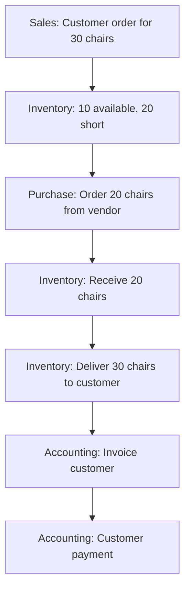
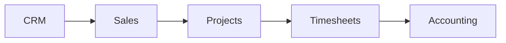
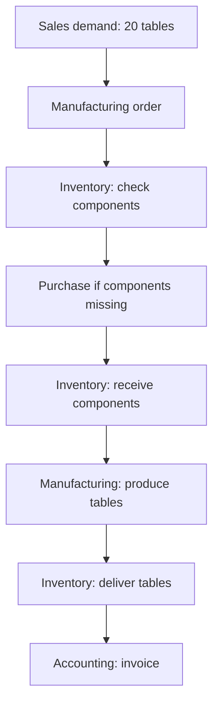

# Chapter 3 Exercise

Try answering these without looking back at Content.md first. Answer in your own words, then compare with the complete solution at the bottom of this file.

For official Odoo app videos and practice database links, see [Resources.md](Resources.md).

---

## Table of Contents

- [Part A: Application Recognition](#part-a-application-recognition)
- [Part B: Distinguish the Records](#part-b-distinguish-the-records)
- [Part C: Build the Flow](#part-c-build-the-flow)
- [Part D: Service Business](#part-d-service-business)
- [Part E: Manufacturing](#part-e-manufacturing)
- [Complete Solution](#chapter-3-exercise-complete-solution)

---

## Part A: Application Recognition

Identify the most relevant application for each situation.

1. A prospect may buy 100 laptops.
2. A customer needs a formal commercial offer.
3. A vendor is asked to supply 50 keyboards.
4. A warehouse receives 50 keyboards.
5. A customer owes QAR 20,000.
6. An employee needs a business record.
7. A consultant performs a customer implementation.
8. A consultant records 6 hours of work.
9. Raw materials are turned into finished desks.
10. A production machine breaks.
11. A visitor reads the company's public pages.
12. A customer buys products through the website.
13. A customer buys two keyboards at a physical shop.
14. A customer reports a damaged delivery.

---

## Part B: Distinguish the Records

Explain why each pair is different:

1. Contact ≠ CRM Opportunity
2. CRM Opportunity ≠ Quotation
3. Quotation ≠ Sales Order
4. Sales Order ≠ Delivery
5. Purchase Order ≠ Receipt
6. Invoice ≠ Payment
7. Project ≠ Timesheet

---

## Part C: Build the Flow

Customer buys **30 office chairs**.

Available stock: **10**

Shortage: **30 − 10 = 20**

The company purchases 20 chairs.

Vendor delivers them.

Warehouse delivers all 30 to the customer.

Customer receives invoice.

Customer pays.

Write the complete application flow.

---

## Part D: Service Business

Customer purchases **50 implementation hours**.

Explain how the following could participate:

- CRM
- Sales
- Projects
- Timesheets
- Accounting

---

## Part E: Manufacturing

Customer orders **20 tables**.

Each table requires:

- 1 tabletop
- 4 legs

How many components are required?

Then explain how **Sales**, **Inventory**, **Manufacturing**, and **Purchase** could interact.

---

# Chapter 3 Exercise: Complete Solution

---

## Part A: Application Recognition

| # | Situation | Most relevant application |
| --- | --- | --- |
| 1 | A prospect may buy 100 laptops | **CRM** (potential business before a confirmed sale) |
| 2 | A customer needs a formal commercial offer | **Sales** (quotation or commercial proposal) |
| 3 | A vendor is asked to supply 50 keyboards | **Purchase** (RFQ or procurement request) |
| 4 | A warehouse receives 50 keyboards | **Inventory** (physical receipt and stock movement) |
| 5 | A customer owes QAR 20,000 | **Accounting / Invoicing** (financial obligation) |
| 6 | An employee needs a business record | **Employees / HR** (employee master data) |
| 7 | A consultant performs a customer implementation | **Projects** (structured work over time) |
| 8 | A consultant records 6 hours of work | **Timesheets** (time spent on work) |
| 9 | Raw materials are turned into finished desks | **Manufacturing** (production process) |
| 10 | A production machine breaks | **Maintenance** (equipment repair or failure handling) |
| 11 | A visitor reads the company's public pages | **Website** (public web presence) |
| 12 | A customer buys products through the website | **eCommerce** (online sales channel) |
| 13 | A customer buys two keyboards at a physical shop | **Point of Sale** (retail or direct store sale) |
| 14 | A customer reports a damaged delivery | **Helpdesk** (customer support ticket) |

---

## Part B: Distinguish the Records

### 1. Contact ≠ CRM Opportunity

A **contact** is reusable master data about a person or organization.

A **CRM opportunity** is a specific potential business deal linked to that contact.

ABC Trading may be one contact but have several opportunities over time.

### 2. CRM Opportunity ≠ Quotation

An **opportunity** represents possible future business and sales pursuit.

A **quotation** is a formal commercial offer with products, quantities, and prices.

The opportunity may exist before the business is ready to quote exact terms.

### 3. Quotation ≠ Sales Order

A **quotation** is a proposal that may still be rejected or revised.

A **Sales Order** is a confirmed commercial commitment.

Confirmation changes the business meaning from "we offered" to "the customer agreed."

### 4. Sales Order ≠ Delivery

A **Sales Order** records what was sold commercially.

A **delivery** records physical movement of goods.

The customer may have ordered products before the warehouse actually shipped them.

### 5. Purchase Order ≠ Receipt

A **Purchase Order** records the purchasing commitment to the vendor.

A **receipt** records that goods physically arrived.

The vendor may confirm an order days before goods reach the warehouse.

### 6. Invoice ≠ Payment

An **invoice** creates or records a financial obligation.

A **payment** records that money was actually received or sent.

A customer can owe money on an invoice long before paying it.

### 7. Project ≠ Timesheet

A **project** is the broader body of work being performed.

A **timesheet** is a record of time spent, often on a project task.

One project may contain many timesheet entries from one or more employees.

---

## Part C: Build the Flow

Given: 30 chairs ordered, 10 available, shortage of 20.

**Application sequence:**

1. **Sales** captures the confirmed customer demand for 30 chairs.
2. **Inventory** identifies only 10 available and creates demand for 20 more.
3. **Purchase** places the procurement commitment for 20 chairs.
4. **Inventory** receives the 20 chairs from the vendor.
5. **Inventory** delivers all 30 chairs to the customer.
6. **Accounting** issues the customer invoice.
7. **Accounting** records payment when the customer pays.

This is a simplified lead-to-cash flow with a procurement step in the middle.

---

## Part D: Service Business

Customer purchases **50 implementation hours**.

**CRM** may manage the opportunity before the sale is won. Sales conversations, expected value, and qualification happen here.

**Sales** creates the commercial agreement for 50 billable hours, including price and terms.

**Projects** organizes the implementation work into tasks such as requirements, configuration, migration, testing, and training.

**Timesheets** records the actual hours consultants spend on project tasks. For example, 8 hours on migration, 6 hours on testing, and so on until the effort approaches or reaches 50 hours.

**Accounting** uses the commercial agreement and recorded time to invoice the customer according to the billing arrangement.

For a service company, this flow can be as central as Sales → Inventory → Invoice is for a product company.

---

## Part E: Manufacturing

Customer orders **20 tables**.

Each table requires 1 tabletop and 4 legs.

**Component requirements:**

- Tabletops: **20 × 1 = 20**
- Legs: **20 × 4 = 80**

**How the applications interact:**

1. **Sales** creates demand for 20 finished tables.
2. **Inventory** checks whether finished tables and raw components exist.
3. **Manufacturing** creates production demand to convert components into finished tables.
4. If components are insufficient, **Purchase** obtains missing materials.
5. **Inventory** receives purchased components and supplies them to manufacturing.
6. **Manufacturing** consumes components and produces finished tables.
7. **Inventory** stores and later delivers the finished tables.
8. **Accounting** invoices the customer after delivery or according to the business rules.

Manufacturing cannot be understood in isolation. It depends on Inventory for components and finished goods, and may trigger Purchase when stock is insufficient.
