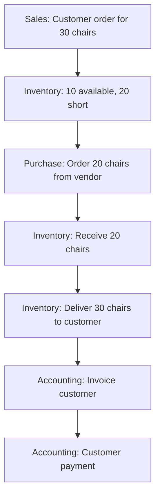
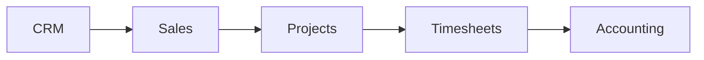
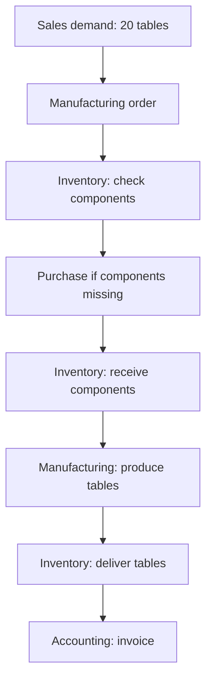

# CHAPTER 3 EXERCISE

Answer before scrolling to the solution. For each response, give the concept, scenario evidence, and a reason. Self-score each original numbered question or named part: 0 = missing/incorrect, 1 = correct label without reasoning, 2 = correct explanation using evidence. Rework every answer below 2. The solution is one defensible model, not wording to memorize; clearly stated alternative assumptions can support a different answer.

Try answering these without looking back at Content.md first. Answer in your own words, then compare with the complete solution at the bottom of this file.

For official Odoo app videos and practice database links, see [Resources.md](Resources.md).

---

## TABLE OF CONTENTS

- [Part A: Application Recognition](#part-a-application-recognition)
- [Part B: Distinguish the Records](#part-b-distinguish-the-records)
- [Part C: Build the Flow](#part-c-build-the-flow)
- [Part D: Service Business](#part-d-service-business)
- [Part E: Manufacturing](#part-e-manufacturing)
- [Complete Solution](#chapter-3-exercise-complete-solution)

---

## PART A: APPLICATION RECOGNITION

Add the expected record and one sentence explaining why the neighboring app is insufficient. For example, a receipt belongs to Inventory because it proves physical arrival; a Purchase Order only states the buying commitment. Also identify the reusable customer/vendor identity supporting the commercial cases so Contacts is assessed alongside the listed apps.

Identify the most relevant application for each situation.

1. A prospect may buy 100 laptops.
2. A customer needs a formal commercial offer.
3. A vendor is asked to supply 50 keyboards.
4. A warehouse receives 50 keyboards.
5. A customer owes QAR 20,000.
6. An employee needs a business record.
7. A consultant performs a customer implementation.
8. A consultant records 6 hours of work.
9. Raw materials are turned into finished desks.
10. A production machine breaks.
11. A visitor reads the company's public pages.
12. A customer buys products through the website.
13. A customer buys two keyboards at a physical shop.
14. A customer reports a damaged delivery.

---

## PART B: DISTINGUISH THE RECORDS

For each pair, state the question each item answers and give one example where the first exists without the second being complete. Distinguish business stages from separate records: a quotation and confirmed Sales Order can be the same Odoo order in different states.

Explain why each pair is different:

1. Contact ≠ CRM Opportunity
2. CRM Opportunity ≠ Quotation
3. Quotation ≠ Sales Order
4. Sales Order ≠ Delivery
5. Purchase Order ≠ Receipt
6. Invoice ≠ Payment
7. Project ≠ Timesheet

---

## PART C: BUILD THE FLOW

Assume ten usable, unreserved chairs in one warehouse, manual buying of the twenty missing chairs, and invoicing after full delivery. Show ordered, on-hand, delivered, and still-needed quantities. Then suppose only fifteen arrive from the supplier: explain the available quantity, the remaining gap, and who agrees a revised delivery plan. No selling price is given, so do not invent an invoice amount.

Customer buys **30 office chairs**.

Available stock: **10**

Shortage: **30 − 10 = 20**

The company purchases 20 chairs.

Vendor delivers them.

Warehouse delivers all 30 to the customer.

Customer receives invoice.

Customer pays.

Write the complete application flow.

---

## PART D: SERVICE BUSINESS

Use an assumed rate of 300 QAR per eligible hour. At an interim review, forty-two customer hours and eight internal training hours were logged. Calculate the time-based invoice amount and total effort, and explain why a fixed-price contract could bill differently. State which project/task and sales line identify the customer work.

Customer purchases **50 implementation hours**.

Explain how the following could participate:

- CRM
- Sales
- Projects
- Timesheets
- Accounting

---

## PART E: MANUFACTURING

Assume no finished tables, twelve usable tabletops, and sixty usable legs. Calculate both gross component demand and the missing quantities. Explain why a confirmed manufacturing order does not yet prove that finished tables can be delivered.

Customer orders **20 tables**.

Each table requires:

- 1 tabletop
- 4 legs

How many components are required?

Then explain how **Sales**, **Inventory**, **Manufacturing**, and **Purchase** could interact.

---

# CHAPTER 3 EXERCISE: COMPLETE SOLUTION

---

## PART A: APPLICATION RECOGNITION

The employee in case 6 belongs in HR because the requirement is a business identity, not login access. Contacts supplies the customer/vendor identity in cases 1–5 and 14. Maintenance in case 10 records equipment work; Manufacturing still owns the affected production schedule. Full credit explains these boundaries rather than only repeating the bold app names.

| # | Situation | Most relevant application |
| --- | --- | --- |
| 1 | A prospect may buy 100 laptops | **CRM** (potential business before a confirmed sale) |
| 2 | A customer needs a formal commercial offer | **Sales** (quotation or commercial proposal) |
| 3 | A vendor is asked to supply 50 keyboards | **Purchase** (RFQ or procurement request) |
| 4 | A warehouse receives 50 keyboards | **Inventory** (physical receipt and stock movement) |
| 5 | A customer owes QAR 20,000 | **Accounting / Invoicing** (financial obligation) |
| 6 | An employee needs a business record | **Employees / HR** (employee master data) |
| 7 | A consultant performs a customer implementation | **Projects** (structured work over time) |
| 8 | A consultant records 6 hours of work | **Timesheets** (time spent on work) |
| 9 | Raw materials are turned into finished desks | **Manufacturing** (production process) |
| 10 | A production machine breaks | **Maintenance** (equipment repair or failure handling) |
| 11 | A visitor reads the company's public pages | **Website** (public web presence) |
| 12 | A customer buys products through the website | **eCommerce** (online sales channel) |
| 13 | A customer buys two keyboards at a physical shop | **Point of Sale** (retail or direct store sale) |
| 14 | A customer reports a damaged delivery | **Helpdesk** (customer support ticket) |

The expected records and boundaries make the choices testable:

1. CRM owns an **opportunity**; Sales would be premature before commercial terms are ready.
2. Sales owns a **quotation**; CRM tracks the pursuit but does not replace the priced offer.
3. Purchase owns an **RFQ or Purchase Order**; Inventory cannot prove a buying commitment.
4. Inventory owns a **receipt**; the Purchase Order states what was ordered, not what arrived.
5. Accounting owns the **posted customer invoice and balance**; Sales records the agreement but not settlement.
6. Employees owns the **employee record**; a user account controls login access and is a separate concept.
7. Projects owns the **project and tasks**; Sales defines the commercial agreement but does not organize delivery work.
8. Timesheets owns the **time entry**; a project can exist without proving that six hours were worked.
9. Manufacturing owns the **manufacturing order and production result**; Inventory records movement but does not define the conversion recipe.
10. Maintenance owns the **maintenance request**; Manufacturing still manages any affected production plan.
11. Website owns the **published page**; eCommerce is needed only when the visitor enters an online buying flow.
12. eCommerce creates the **online cart/order path**; Website alone does not establish checkout behavior.
13. Point of Sale owns the **POS order and payment session**; a normal Sales quotation is not the evidence of an immediate shop transaction.
14. Helpdesk owns the **support ticket**; Inventory may later process a return, but the complaint alone is not a stock movement.

The commercial cases reuse customer or vendor identities from Contacts. Those identities support the transactions without replacing the opportunity, quotation, order, receipt, invoice, or ticket.

---

## PART B: DISTINGUISH THE RECORDS

### 1. CONTACT ≠ CRM OPPORTUNITY

A **contact** is reusable master data about a person or organization.

A **CRM opportunity** is a specific potential business deal linked to that contact.

The contact answers “who is this party?” while the opportunity answers “what possible deal are we pursuing?”

ABC Trading may be one contact but have several opportunities over time.

### 2. CRM OPPORTUNITY ≠ QUOTATION

An **opportunity** represents possible future business and sales pursuit.

A **quotation** is a formal commercial offer with products, quantities, and prices.

The opportunity answers “is there a deal to pursue?” while the quotation answers “what exactly are we offering and on which terms?”

The opportunity may exist before the business is ready to quote exact terms.

### 3. QUOTATION ≠ SALES ORDER

These are different commercial states of the same standard Odoo order record. The distinction in this exercise concerns commitment, not an instruction to create a duplicate order when a quote is accepted.

A **quotation** is a proposal that may still be rejected or revised.

A **Sales Order** is a confirmed commercial commitment.

The quotation answers “what do we propose?” while the confirmed state answers “what has the customer accepted?”

Confirmation changes the business meaning from "we offered" to "the customer agreed."

### 4. SALES ORDER ≠ DELIVERY

A **Sales Order** records what was sold commercially.

A **delivery** records physical movement of goods.

The order answers “what did we promise?” while the delivery answers “what quantity actually left the warehouse?”

The customer may have ordered products before the warehouse actually shipped them.

### 5. PURCHASE ORDER ≠ RECEIPT

A **Purchase Order** records the purchasing commitment to the vendor.

A **receipt** records that goods physically arrived.

The order answers “what did we ask the vendor to supply?” while the receipt answers “what did the warehouse actually receive?”

The vendor may confirm an order days before goods reach the warehouse.

### 6. INVOICE ≠ PAYMENT

An **invoice** creates or records a financial obligation.

A **payment** records payment activity; reconciliation and supporting evidence establish how the invoice is settled. Recording a payment is not the same as proving that funds have cleared.

The invoice answers “what does the customer owe?” while payment and reconciliation answer “what funds were received and which debt did they settle?”

A customer can owe money on an invoice long before paying it.

### 7. PROJECT ≠ TIMESHEET

A **project** is the broader body of work being performed.

A **timesheet** is a record of time spent, often on a project task.

The project answers “how is the work organized?” while a timesheet answers “who spent how much time on which task?”

One project may contain many timesheet entries from one or more employees.

---

## PART C: BUILD THE FLOW

On-hand stock follows 10 → 10 after order confirmation → 30 after receiving twenty → 0 after shipping thirty. If fifteen arrive instead, stock is twenty-five and five are still needed. A partial-delivery agreement changes the fulfillment plan; it does not change the original order to twenty-five without an explicit commercial revision.

Given: 30 chairs ordered, 10 available, shortage of 20.

**Application sequence:**

1. **Sales** captures the confirmed customer demand for 30 chairs.
2. **Inventory** shows ten usable chairs against demand for thirty, revealing a replenishment need for twenty. The buyer acts on that need in this scenario.
3. **Purchase** places the procurement commitment for 20 chairs.
4. **Inventory** receives the 20 chairs from the vendor.
5. **Inventory** delivers all 30 chairs to the customer.
6. **Accounting** issues the customer invoice.
7. **Accounting** records payment when the customer pays.

This is an order-to-cash flow with procurement in the middle. A preceding lead/opportunity is optional and is not stated in this scenario.

---

## PART D: SERVICE BUSINESS

Forty-two eligible customer hours × 300 QAR = 12,600 QAR at this interim time-based billing point. Total effort is fifty hours, but eight internal-training hours do not belong on this customer’s bill under the stated assumption. A fixed-price arrangement follows agreed billing terms instead. Do not invent extra billable hours merely to reach the fifty hours originally sold.

For traceability, assume the eligible entries belong to project **Gulf Office Implementation**, task **Customer Configuration**, and the Sales Order Item for **Implementation Hours**. Internal training uses a separate internal task or non-billable classification so it cannot be confused with customer work.

Customer purchases **50 implementation hours**.

**CRM** may manage the opportunity before the sale is won. Sales conversations, expected value, and qualification happen here.

**Sales** creates the commercial agreement for 50 billable hours, including price and terms.

**Projects** organizes the implementation work into tasks such as requirements, configuration, migration, testing, and training.

**Timesheets** records the actual hours consultants spend on project tasks. For example, 8 hours on migration, 6 hours on testing, and so on until the effort approaches or reaches 50 hours.

**Accounting** uses the commercial agreement and recorded time to invoice the customer according to the billing arrangement.

For a service company, this flow can be as central as Sales → Inventory → Invoice is for a product company.

---

## PART E: MANUFACTURING

Gross demand is twenty tabletops and eighty legs. After subtracting usable stock, purchase eight tabletops and twenty legs. Receipt makes those components available; completed production consumes them and adds twenty finished tables if there is no loss. Delivery then removes the twenty tables. When components already suffice, bypass the purchasing branch pictured below.

A confirmed manufacturing order expresses the plan to produce twenty tables. It does not prove that missing components were received, production finished, quality checks passed, or twenty deliverable tables exist; those later records provide the evidence.

Customer orders **20 tables**.

Each table requires 1 tabletop and 4 legs.

**Component requirements:**

- Tabletops: **20 × 1 = 20**
- Legs: **20 × 4 = 80**

**How the applications interact:**

1. **Sales** creates demand for 20 finished tables.
2. **Inventory** checks whether finished tables and raw components exist.
3. **Manufacturing** creates production demand to convert components into finished tables.
4. If components are insufficient, **Purchase** obtains missing materials.
5. **Inventory** receives purchased components and supplies them to manufacturing.
6. **Manufacturing** consumes components and produces finished tables.
7. **Inventory** stores and later delivers the finished tables.
8. **Accounting** invoices the customer after delivery or according to the business rules.

Manufacturing cannot be understood in isolation. It depends on Inventory for components and finished goods, and may trigger Purchase when stock is insufficient.
