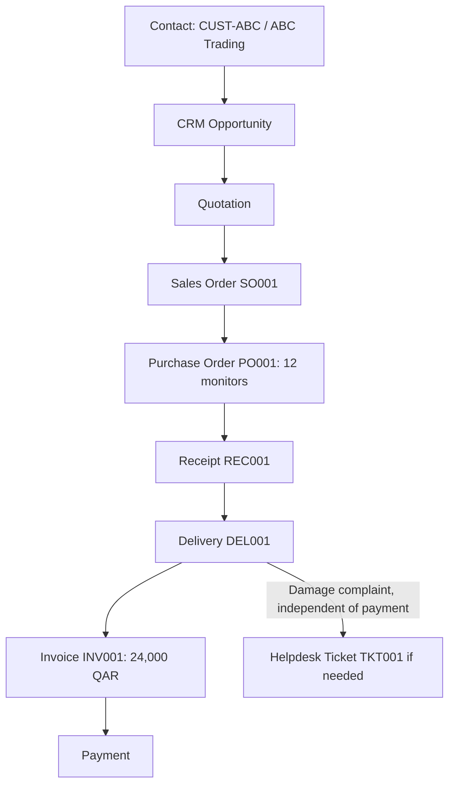

# CHAPTER 3 PROJECT: BILAL OFFICE SUPPLIES INTEGRATED ODOO FLOW

This remains a conceptual project; an optional practice database is not required. Use one company and warehouse, usable unreserved opening stock, manual replenishment, a single full delivery, and billing after delivery. The 24,000 QAR total excludes tax, discounts, and freight. Use illustrative references CUST-ABC, SO001, PO001, REC001, DEL001, INV001, and TKT001 throughout your existing parts so each link can be traced.

We extend the same fictional company from Chapters 1 and 2.

This project connects CRM, Sales, Purchase, Inventory, Accounting, and Helpdesk into one integrated document flow.

For app-specific Odoo videos, documentation, and hands-on environments, see [Resources.md](Resources.md).

---

## TABLE OF CONTENTS

- [Part 1: Master Data](#part-1-master-data)
- [Part 2: CRM](#part-2-crm)
- [Part 3: Sales](#part-3-sales)
- [Part 4: Inventory](#part-4-inventory)
- [Part 5: Purchase](#part-5-purchase)
- [Part 6: Receipt](#part-6-receipt)
- [Part 7: Delivery](#part-7-delivery)
- [Part 8: Accounting](#part-8-accounting)
- [Part 9: Helpdesk](#part-9-helpdesk)
- [Part 10: Final Document Map](#part-10-final-document-map)
- [Complete Solution](#chapter-3-project-complete-solution)

---

## PART 1: MASTER DATA

Give monitors and keyboards distinct product references and unit “unit.” Reuse ABC Trading across the opportunity, order, shipment, invoice, and ticket. Identify its invoice and delivery addresses separately. Explain which employee roles need user access to perform the later actions; an employee record alone does not authorize those actions.

Define:

**Customers**

- ABC Trading
- Doha Tech
- Gulf Office Solutions

**Vendors**

- Global Displays
- Qatar Hardware Supply

**Products**

- Laptop
- Monitor
- Keyboard
- Office Chair

**Employees**

- Ahmed — Sales
- Sara — Purchasing
- Ali — Warehouse
- Fatima — Finance

---

## PART 2: CRM

Record Ahmed as opportunity owner, a proposed next activity, and the evidence needed to qualify the deal. Explain why 24,000 QAR is an estimate here rather than a posted receivable. The opportunity remains as sales history when a linked quotation is created.

Create this conceptual opportunity:

**ABC Trading — New Office Equipment**

Potential requirement:

- 20 monitors
- 20 keyboards

Expected value:

**20(1,000) + 20(200) = 20,000 + 4,000 = 24,000 QAR**

---

## PART 3: SALES

Record two quotation lines, their units, quantities, agreed prices, and customer acceptance. Confirm the existing quotation as an order. Show that confirmation records demand and may plan a delivery, while on-hand stock and payment received remain unchanged at this moment.

Create a quotation linked to the opportunity; the opportunity remains a distinct CRM record.

Customer accepts.

Quotation becomes a confirmed Sales Order.

Demand:

- 20 monitors
- 20 keyboards

---

## PART 4: INVENTORY

Maintain separate monitor and keyboard balances after confirmation, reservation, receipt, and delivery. If the eight monitors are reserved, they remain on hand but unavailable to another order. Explain why treating reservation as a delivery would subtract the same goods twice.

Available stock:

| Product | Required | Available |
| --- | --- | --- |
| Monitor | 20 | 8 |
| Keyboard | 20 | 50 |

Monitor shortage: **20 − 8 = 12**

Keyboard shortage: **max(0, 20 − 50) = 0**; thirty keyboards remain beyond this order’s demand.

Therefore monitors are not sufficient, but keyboards are.

---

## PART 5: PURCHASE

Use PO001 for twelve monitors and identify Global Displays as vendor. The scenario gives a selling price but no vendor price; obtain or explicitly assume a purchase price before calculating a vendor bill. Do not reuse the 1,000 QAR selling price as supplier cost without evidence.

Purchase **12 monitors** from Global Displays.

Document conceptual flow:

**RFQ → Purchase Order**

---

## PART 6: RECEIPT

Record the actual receipt against PO001. If only ten monitors arrive, calculate available stock and the remaining supply obligation. Do not record twelve received simply because twelve were ordered. State who informs Sales about any effect on the promised delivery.

Vendor delivers **12 monitors**.

New monitor stock: **8 + 12 = 20**

---

## PART 7: DELIVERY

Show ending stock after DEL001 and verify it against the two ordered product lines. If part is held back, record an actual partial delivery and outstanding demand. Never use a new customer order merely to represent the unfulfilled part of the same order.

Deliver **20 monitors** and **20 keyboards** to ABC Trading.

---

## PART 8: ACCOUNTING

Distinguish draft invoice, posted invoice, payment activity, and completed settlement. Use the 24,000 QAR customer charge to calculate what remains due after a 10,000 QAR partial settlement and after the final 14,000 QAR. Record a vendor bill/payment as a related procurement branch if that cycle is in scope; no vendor amount is supplied.

Suppose:

- Monitor: **1,000 QAR**
- Keyboard: **200 QAR**

Invoice:

**20(1,000) + 20(200) = 24,000 QAR**

Customer pays **24,000 QAR**.

Outstanding: **0**

---

## PART 9: HELPDESK

Open the ticket when the damage is reported, whether or not the invoice is paid. Add an investigation step and an explicit proposed remedy: repair, replacement, or credit/refund. Name which later record would prove the remedy happened. Ticket references are business requirements; structured links and after-sales buttons depend on installed features and configuration.

After delivery, customer reports:

Two keyboards are damaged.

Create a conceptual Helpdesk ticket containing:

- customer,
- Sales Order reference,
- delivery reference,
- problem,
- responsible support person,
- status.

Explain why connecting this ticket to existing records is better than treating it as an isolated email.

---

## PART 10: FINAL DOCUMENT MAP

Connect the contact to multiple transactions, include receipt between purchasing and delivery, and branch the ticket from the post-delivery complaint independently of payment. For every arrow explain whether it means a shared reference, an action, or an optional dependency. Check quantities and amounts against Parts 4–8. The diagram is complete only when another learner can locate an unfinished shipment or payment from your explanation.

Your project should end with the complete conceptual flow from contact through payment and, if needed, Helpdesk.

That diagram demonstrates the core goal of Unit I:

**Understand the Business Before the Code**

---

# CHAPTER 3 PROJECT: COMPLETE SOLUTION

---

## PART 1: MASTER DATA

### CUSTOMERS

| Customer | Role in this project |
| --- | --- |
| **ABC Trading (CUST-ABC)** | Main customer for the integrated flow |
| **Doha Tech** | Additional customer master record |
| **Gulf Office Solutions** | Additional customer master record |

These are reusable contact records, not transactions.

ABC Trading uses reference **CUST-ABC** throughout the opportunity, SO001, DEL001, INV001, and TKT001. For this example, its invoice address is the Doha head office and its delivery address is the West Bay project site. The first identifies the party and location billed, while the second tells Warehouse where to ship; the difference does not create a second customer identity.

### VENDORS

| Vendor | Role in this project |
| --- | --- |
| **Global Displays** | Supplier used to replenish monitors |
| **Qatar Hardware Supply** | Additional vendor master record |

### PRODUCTS

| Product | Typical use |
| --- | --- |
| Laptop | General catalog product |
| Monitor (PROD-MON), unit “unit” | Used in ABC Trading order |
| Keyboard (PROD-KBD), unit “unit” | Used in ABC Trading order |
| Office Chair | General catalog product |

### EMPLOYEES

| Employee | Department / role |
| --- | --- |
| Ahmed | Sales |
| Sara | Purchasing |
| Ali | Warehouse |
| Fatima | Finance |

Each employee is master data. Only some will also be Odoo users with app access.

Ahmed needs an authorized Sales user, Sara a Purchase user, Ali an Inventory user, and Fatima an Accounting user in this company. Their employee records describe their organizational roles; the linked user accounts and permissions authorize the actions below.

---

## PART 2: CRM

**Opportunity:** ABC Trading — New Office Equipment

**Customer:** ABC Trading

**Potential requirement:**

- 20 monitors
- 20 keyboards

**Expected value:**

- Monitors: 20 × 1,000 = **20,000 QAR**
- Keyboards: 20 × 200 = **4,000 QAR**
- Total expected value: **24,000 QAR**

**Purpose at this stage:** track potential business before a formal quotation exists.

The **24,000 QAR** is an expected opportunity value used for sales planning. It is not a posted receivable because ABC Trading has not yet accepted a quotation and Finance has not posted INV001.

Ahmed may record notes, activities, stage, and expected close information while the deal is still being qualified.

Ahmed is the opportunity owner and schedules the next activity, such as confirming quantities and delivery date with ABC Trading. Evidence that the deal is qualified includes an identified customer, confirmed need for twenty monitors and twenty keyboards, a decision contact, an expected date, and enough pricing context to prepare a quotation. The opportunity remains as sales history after the linked quotation is created.

---

## PART 3: SALES

Once requirements are clear, Ahmed creates a **quotation** linked to the opportunity for ABC Trading:

- 20 monitors, unit **unit**, at 1,000 QAR
- 20 keyboards, unit **unit**, at 200 QAR

When ABC Trading provides acceptance evidence, Ahmed confirms the existing quotation as **Sales Order SO001** rather than creating an unrelated order.

**Confirmed demand:**

- 20 monitors
- 20 keyboards

This Sales Order now triggers operational consequences in Inventory and eventually Accounting.

Confirmation records demand and may create or plan a delivery. It leaves physical on-hand quantities and received customer payment unchanged.

---

## PART 4: INVENTORY

Before receipt there are eight monitors and fifty keyboards on hand. After receiving twelve monitors: twenty monitors and fifty keyboards. After the full delivery: zero monitors and thirty keyboards. If only ten monitors arrive, eighteen are available and two are still missing; agree a partial shipment or wait for the outstanding two.

Reserving the opening eight monitors for SO001 reduces the quantity available to other orders but leaves monitor on-hand stock at eight. Treating that reservation as a completed delivery would subtract the same monitors once at reservation and again when DEL001 is validated.

The separate balances are therefore: after SO001 confirmation, monitors 8 and keyboards 50 on hand; after reserving available demand, the same quantities remain on hand; after REC001, monitors 20 and keyboards 50; after full DEL001, monitors 0 and keyboards 30.

| Product | Required | Available | Result |
| --- | --- | --- | --- |
| Monitor | 20 | 8 | Shortage of **12** |
| Keyboard | 20 | 50 | Sufficient stock |

Inventory analysis:

- Monitors: need 20, have 8, short **12**
- Keyboards: need 20, have 50, no purchase required

Ali sees outgoing delivery demand for both products, but only monitors require replenishment before full fulfillment.

---

## PART 5: PURCHASE

Sara creates **Purchase Order PO001** for **12 monitors** from **Global Displays**.

Conceptual flow:

The Purchase Order represents the commercial commitment to buy 12 monitors.

It does **not** by itself mean the monitors are already in stock.

The scenario provides the customer selling price but no vendor purchase price. Sara must obtain the quoted vendor price or state a separate assumption before Fatima can calculate and verify a vendor bill; 1,000 QAR must not be reused as supplier cost without evidence.

For a worked model, assume Global Displays quotes **700 QAR per monitor**. A full twelve-monitor vendor bill would then be **8,400 QAR**. Under received-quantity bill control, a receipt of only ten supports **7,000 QAR** at that point, while the remaining two stay open for later receipt and billing.

---

## PART 6: RECEIPT

Global Displays delivers **12 monitors** against PO001, and Ali records **receipt REC001**.

Ali processes the receipt in Inventory.

Updated monitor stock:

**8 + 12 = 20 monitors**

Now the warehouse can fulfill the full Sales Order quantity for monitors. Keyboards were already sufficient.

If only ten monitors arrive, REC001 records ten, monitor stock becomes eighteen, and two remain due on PO001. Ali informs Ahmed, who agrees with ABC Trading whether to wait or accept a partial delivery; Warehouse does not record twelve merely because PO001 ordered twelve.

---

## PART 7: DELIVERY

Ali validates **delivery DEL001** to ABC Trading:

- 20 monitors
- 20 keyboards

This is the physical fulfillment stage.

The Sales Order recorded the commercial promise.

The delivery records the actual movement of goods to the customer.

After full DEL001, monitor stock is zero and keyboard stock is thirty. If two monitors are held back, DEL001 records the quantity actually shipped and SO001 retains two as outstanding demand; the company does not create a new customer order for that remainder.

---

## PART 8: ACCOUNTING

Against 24,000 QAR, a matched 10,000 QAR partial settlement leaves 14,000 QAR due; settling the remaining 14,000 leaves zero. The solution’s zero balance assumes the appropriate matching/reconciliation is complete. A payment button or standalone payment entry alone is not sufficient completion evidence.

**Pricing:**

- Monitor: 1,000 QAR
- Keyboard: 200 QAR

**Invoice calculation:**

- Monitors: 20 × 1,000 = 20,000 QAR
- Keyboards: 20 × 200 = 4,000 QAR
- Total invoice: **24,000 QAR**

Fatima creates and posts customer invoice **INV001** for SO001 and the relevant completed delivery under the stated billing policy.

Before posting, INV001 is a draft that Finance can review and it does not yet represent the final posted receivable in this model. Posting establishes the customer obligation. Entering payment records activity, while received funds matched or reconciled to INV001 establish partial or complete settlement.

ABC Trading later pays **24,000 QAR**.

Outstanding balance becomes **0**.

The invoice represents what the customer owes.

The completed settlement in this example is supported by received funds and matching financial records; a payment entry alone does not prove settlement.

---

## PART 9: HELPDESK

Suppose the agreed remedy is to inspect the two returned keyboards and replace them. Receiving two damaged returns does not make them saleable automatically; keep their condition/location explicit. Sending two good replacements from the thirty remaining good keyboards leaves twenty-eight good keyboards. A refund would instead need the appropriate financial correction and payment evidence. The complaint alone changes neither stock nor the invoice.

**Problem reported:** Two keyboards arrived damaged.

The complaint is recorded as **Helpdesk ticket TKT001** for CUST-ABC and linked to SO001 and DEL001.

**Conceptual Helpdesk ticket:**

| Field | Value |
| --- | --- |
| Customer | ABC Trading |
| Sales Order reference | Linked to the original confirmed order |
| Delivery reference | Linked to the delivery that contained the keyboards |
| Problem | Two keyboards damaged on arrival |
| Responsible support person | Assigned support agent or team |
| Status | Example: New, In Progress, Waiting Customer, Resolved |

**Why integration is better than an isolated email:**

If the ticket stands alone, support must manually ask who the customer is, what was ordered, when delivery happened, and which invoice or order is involved.

Because the ticket links to existing Odoo records, support can immediately see:

- the customer contact,
- the Sales Order,
- the products delivered,
- the delivery document,
- prior commercial history.

That reduces delay, duplication, and error. It also preserves the customer lifecycle from CRM and Sales through fulfillment to after-sales support.

---

## PART 10: FINAL DOCUMENT MAP

The support branch below starts from the post-delivery complaint, not from payment. The purchase step supplies this example’s shortage; it is not required for a fully stocked order. Separate references may need to be followed through the originating order rather than assumed to be direct links on every screen.

The arrows have different meanings. CUST-ABC to the opportunity is a shared party reference; opportunity to quotation and quotation to SO001 are commercial progression; SO001 to PO001 is a shortage-driven action rather than a required direct document link; PO001 to REC001 and SO001 to DEL001 connect commitments to physical movements; DEL001 supplies billing evidence for INV001 under the assumed policy; INV001 to payment represents settlement and reconciliation; DEL001 to TKT001 is an optional complaint reference. If REC001 is short, PO001 and SO001 reveal unfinished supply and demand. If settlement is partial, INV001 reveals the remaining balance.

**Complete sequence:**

1. **Contact** — ABC Trading exists as reusable master data.
2. **CRM Opportunity** — potential deal for office equipment.
3. **Quotation** — formal commercial offer.
4. **Sales Order** — confirmed sale for 20 monitors and 20 keyboards.
5. **Purchase Order** — procurement of 12 missing monitors.
6. **Receipt** — vendor delivery increases stock to 20 monitors.
7. **Delivery** — warehouse ships all goods to ABC Trading.
8. **Invoice** — Finance bills 24,000 QAR.
9. **Payment** — customer settles the invoice.
10. **Helpdesk Ticket** — support handles damaged keyboards with full business context.

This demonstrates the core goal of Unit I:

**Understand the Business Before the Code**

Before writing Odoo Python, a developer should be able to explain which business records exist, which application owns each stage, and how one customer journey crosses application boundaries.
