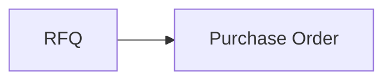
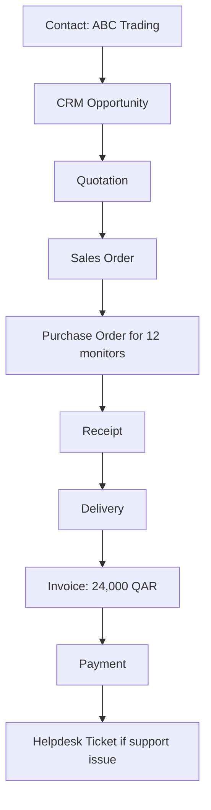

# Chapter 3 Project: Bilal Office Supplies Integrated Odoo Flow

We extend the same fictional company from Chapters 1 and 2.

This project connects CRM, Sales, Purchase, Inventory, Accounting, and Helpdesk into one integrated document flow.

For app-specific Odoo videos, documentation, and hands-on environments, see [Resources.md](Resources.md).

---

## Table of Contents

- [Part 1: Master Data](#part-1-master-data)
- [Part 2: CRM](#part-2-crm)
- [Part 3: Sales](#part-3-sales)
- [Part 4: Inventory](#part-4-inventory)
- [Part 5: Purchase](#part-5-purchase)
- [Part 6: Receipt](#part-6-receipt)
- [Part 7: Delivery](#part-7-delivery)
- [Part 8: Accounting](#part-8-accounting)
- [Part 9: Helpdesk](#part-9-helpdesk)
- [Part 10: Final Document Map](#part-10-final-document-map)
- [Complete Solution](#chapter-3-project-complete-solution)

---

## Part 1: Master Data

Define:

**Customers**

- ABC Trading
- Doha Tech
- Gulf Office Solutions

**Vendors**

- Global Displays
- Qatar Hardware Supply

**Products**

- Laptop
- Monitor
- Keyboard
- Office Chair

**Employees**

- Ahmed — Sales
- Sara — Purchasing
- Ali — Warehouse
- Fatima — Finance

---

## Part 2: CRM

Create this conceptual opportunity:

**ABC Trading — New Office Equipment**

Potential requirement:

- 20 monitors
- 20 keyboards

Expected value:

**20(1,000) + 20(200) = 20,000 + 4,000 = 24,000 QAR**

---

## Part 3: Sales

Convert the opportunity into a quotation.

Customer accepts.

Quotation becomes a confirmed Sales Order.

Demand:

- 20 monitors
- 20 keyboards

---

## Part 4: Inventory

Available stock:

| Product | Required | Available |
| --- | --- | --- |
| Monitor | 20 | 8 |
| Keyboard | 20 | 50 |

Monitor shortage: **20 − 8 = 12**

Keyboard shortage: **20 − 50 < 0** (sufficient stock)

Therefore monitors are not sufficient, but keyboards are.

---

## Part 5: Purchase

Purchase **12 monitors** from Global Displays.

Document conceptual flow:

**RFQ → Purchase Order**

---

## Part 6: Receipt

Vendor delivers **12 monitors**.

New monitor stock: **8 + 12 = 20**

---

## Part 7: Delivery

Deliver **20 monitors** and **20 keyboards** to ABC Trading.

---

## Part 8: Accounting

Suppose:

- Monitor: **1,000 QAR**
- Keyboard: **200 QAR**

Invoice:

**20(1,000) + 20(200) = 24,000 QAR**

Customer pays **24,000 QAR**.

Outstanding: **0**

---

## Part 9: Helpdesk

After delivery, customer reports:

Two keyboards are damaged.

Create a conceptual Helpdesk ticket containing:

- customer,
- Sales Order reference,
- delivery reference,
- problem,
- responsible support person,
- status.

Explain why connecting this ticket to existing records is better than treating it as an isolated email.

---

## Part 10: Final Document Map

Your project should end with the complete conceptual flow from contact through payment and, if needed, Helpdesk.

That diagram demonstrates the core goal of Unit I:

**Understand the Business Before the Code**

---

# Chapter 3 Project: Complete Solution

---

## Part 1: Master Data

### Customers

| Customer | Role in this project |
| --- | --- |
| **ABC Trading** | Main customer for the integrated flow |
| **Doha Tech** | Additional customer master record |
| **Gulf Office Solutions** | Additional customer master record |

These are reusable contact records, not transactions.

### Vendors

| Vendor | Role in this project |
| --- | --- |
| **Global Displays** | Supplier used to replenish monitors |
| **Qatar Hardware Supply** | Additional vendor master record |

### Products

| Product | Typical use |
| --- | --- |
| Laptop | General catalog product |
| Monitor | Used in ABC Trading order |
| Keyboard | Used in ABC Trading order |
| Office Chair | General catalog product |

### Employees

| Employee | Department / role |
| --- | --- |
| Ahmed | Sales |
| Sara | Purchasing |
| Ali | Warehouse |
| Fatima | Finance |

Each employee is master data. Only some will also be Odoo users with app access.

---

## Part 2: CRM

**Opportunity:** ABC Trading — New Office Equipment

**Customer:** ABC Trading

**Potential requirement:**

- 20 monitors
- 20 keyboards

**Expected value:**

- Monitors: 20 × 1,000 = **20,000 QAR**
- Keyboards: 20 × 200 = **4,000 QAR**
- Total expected value: **24,000 QAR**

**Purpose at this stage:** track potential business before a formal quotation exists.

Ahmed may record notes, activities, stage, and expected close information while the deal is still being qualified.

---

## Part 3: Sales

Once requirements are clear, Ahmed converts the opportunity into a **quotation** for ABC Trading:

- 20 monitors at 1,000 QAR
- 20 keyboards at 200 QAR

When ABC Trading accepts, the quotation becomes a confirmed **Sales Order**.

**Confirmed demand:**

- 20 monitors
- 20 keyboards

This Sales Order now triggers operational consequences in Inventory and eventually Accounting.

---

## Part 4: Inventory

| Product | Required | Available | Result |
| --- | --- | --- | --- |
| Monitor | 20 | 8 | Shortage of **12** |
| Keyboard | 20 | 50 | Sufficient stock |

Inventory analysis:

- Monitors: need 20, have 8, short **12**
- Keyboards: need 20, have 50, no purchase required

Ali sees outgoing delivery demand for both products, but only monitors require replenishment before full fulfillment.

---

## Part 5: Purchase

Sara creates procurement for **12 monitors** from **Global Displays**.

Conceptual flow:

The Purchase Order represents the commercial commitment to buy 12 monitors.

It does **not** by itself mean the monitors are already in stock.

---

## Part 6: Receipt

Global Displays delivers **12 monitors**.

Ali processes the receipt in Inventory.

Updated monitor stock:

**8 + 12 = 20 monitors**

Now the warehouse can fulfill the full Sales Order quantity for monitors. Keyboards were already sufficient.

---

## Part 7: Delivery

Ali delivers to ABC Trading:

- 20 monitors
- 20 keyboards

This is the physical fulfillment stage.

The Sales Order recorded the commercial promise.

The delivery records the actual movement of goods to the customer.

---

## Part 8: Accounting

**Pricing:**

- Monitor: 1,000 QAR
- Keyboard: 200 QAR

**Invoice calculation:**

- Monitors: 20 × 1,000 = 20,000 QAR
- Keyboards: 20 × 200 = 4,000 QAR
- Total invoice: **24,000 QAR**

Fatima creates and posts the customer invoice.

ABC Trading later pays **24,000 QAR**.

Outstanding balance becomes **0**.

The invoice represents what the customer owes.

The payment represents money actually received.

---

## Part 9: Helpdesk

**Problem reported:** Two keyboards arrived damaged.

**Conceptual Helpdesk ticket:**

| Field | Value |
| --- | --- |
| Customer | ABC Trading |
| Sales Order reference | Linked to the original confirmed order |
| Delivery reference | Linked to the delivery that contained the keyboards |
| Problem | Two keyboards damaged on arrival |
| Responsible support person | Assigned support agent or team |
| Status | Example: New, In Progress, Waiting Customer, Resolved |

**Why integration is better than an isolated email:**

If the ticket stands alone, support must manually ask who the customer is, what was ordered, when delivery happened, and which invoice or order is involved.

Because the ticket links to existing Odoo records, support can immediately see:

- the customer contact,
- the Sales Order,
- the products delivered,
- the delivery document,
- prior commercial history.

That reduces delay, duplication, and error. It also preserves the customer lifecycle from CRM and Sales through fulfillment to after-sales support.

---

## Part 10: Final Document Map

**Complete sequence:**

1. **Contact** — ABC Trading exists as reusable master data.
2. **CRM Opportunity** — potential deal for office equipment.
3. **Quotation** — formal commercial offer.
4. **Sales Order** — confirmed sale for 20 monitors and 20 keyboards.
5. **Purchase Order** — procurement of 12 missing monitors.
6. **Receipt** — vendor delivery increases stock to 20 monitors.
7. **Delivery** — warehouse ships all goods to ABC Trading.
8. **Invoice** — Finance bills 24,000 QAR.
9. **Payment** — customer settles the invoice.
10. **Helpdesk Ticket** — support handles damaged keyboards with full business context.

This demonstrates the core goal of Unit I:

**Understand the Business Before the Code**

Before writing Odoo Python, a developer should be able to explain which business records exist, which application owns each stage, and how one customer journey crosses application boundaries.
