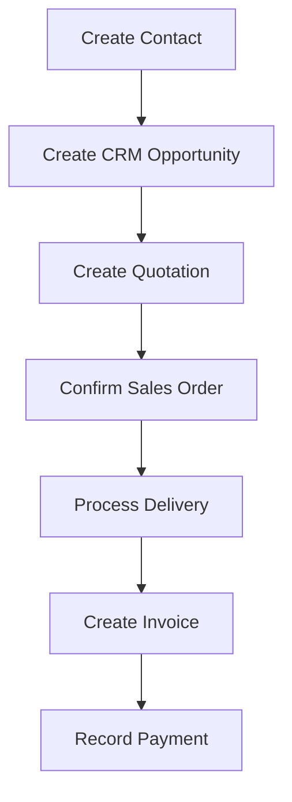
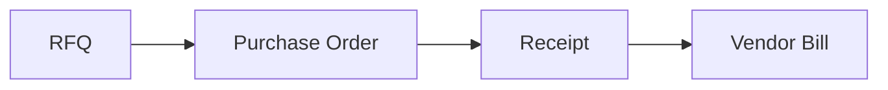

# UNIT I: FREE LEARNING RESOURCES

## CHAPTER 3: CORE BUSINESS APPLICATIONS

Chapter 3 is **functional**, so the best resources are actual Odoo app demonstrations, official documentation, and a practice database from [Chapter 3 Content](Content.md).

These resources map directly to CRM, Sales, Purchase, Inventory, Accounting, Projects, Manufacturing, Website, eCommerce, POS, Helpdesk, and [3.16 End-to-End Document Flow](Content.md#316-end-to-end-document-flow).

> **Enhanced verification scope:** This review checked targeted primary sources used by the marked additions. Existing videos and repository listings are retained as supplementary references; their playback, full content, and every link have not been reverified. Odoo-specific references use 19.0 unless stated.

---

## CHAPTER 3 RESOURCES TABLE OF CONTENTS

- [YouTube: Overview](#youtube-overview)
- [YouTube: CRM](#youtube-crm)
- [YouTube: Sales](#youtube-sales)
- [YouTube: Purchase](#youtube-purchase)
- [YouTube: Inventory](#youtube-inventory)
- [YouTube: Accounting / Invoicing](#youtube-accounting--invoicing)
- [YouTube: Projects and Timesheets](#youtube-projects-and-timesheets)
- [YouTube: Manufacturing](#youtube-manufacturing)
- [YouTube: Website / eCommerce](#youtube-website--ecommerce)
- [YouTube: Point of Sale](#youtube-point-of-sale)
- [YouTube: Helpdesk](#youtube-helpdesk)
- [Official Documentation](#official-documentation)
- [Repositories](#repositories)
- [Practice / Hands-On](#practice--hands-on)
- [Best Resource Order for Unit I](#best-resource-order-for-unit-i)

---

## YOUTUBE: OVERVIEW

> **How previews work on GitHub:** Click a thumbnail to open the video on YouTube. GitHub Markdown cannot embed an inline player, but thumbnails give you a visual preview without leaving the page layout.

### ODOO FULL BEGINNER COURSE 2026

| | |
|---|---|
| **Relevant to** | Entire Chapter 3 overview |
| **Source** | Long-form community course |
| **Why use it** | Companion overview across multiple Odoo areas, not a replacement for this roadmap |

**Watch on YouTube:** [Odoo Full Beginner Course 2026](https://www.youtube.com/watch?v=KL-xWoDksdk)

---

## YOUTUBE: CRM

### 1. CRM BASICS: PIPELINES AND OPPORTUNITIES

| | |
|---|---|
| **Relevant to** | [3.2 CRM](Content.md#32-crm) |
| **Source** | Official Odoo |
| **Reinforces** | **Lead/Opportunity → Pipeline** |

**Watch on YouTube:** [CRM Basics: Pipelines and Opportunities](https://www.youtube.com/watch?v=RpPKOl85kuc)

---

### 2. CRM LEAD AND OPPORTUNITY BASICS

| | |
|---|---|
| **Relevant to** | [3.2 CRM](Content.md#32-crm) |
| **Source** | Official Odoo |

**Watch on YouTube:** [CRM Lead and Opportunity Basics](https://www.youtube.com/watch?v=BSEf-EldDIA)

---

## YOUTUBE: SALES

### SELLING PRODUCTS: ODOO SALES

| | |
|---|---|
| **Relevant to** | [3.3 Sales](Content.md#33-sales) |
| **Source** | Official Odoo |
| **Reinforces** | **Quotation → Sales Order** |

**Watch on YouTube:** [Selling Products: Odoo Sales](https://www.youtube.com/watch?v=uPMpMH1A6vk)

---

## YOUTUBE: PURCHASE

### 1. PURCHASE AND RFQ BASICS

| | |
|---|---|
| **Relevant to** | [3.4 Purchase](Content.md#34-purchase) |
| **Source** | Official Odoo |
| **Reinforces** | **RFQ → Purchase Order** |

**Watch on YouTube:** [Purchase and RFQ Basics](https://www.youtube.com/watch?v=LX_kRgiqUj0)

---

### 2. PURCHASE APP TOUR: RFQ TO RECEIPT

| | |
|---|---|
| **Relevant to** | [3.4 Purchase](Content.md#34-purchase), [3.5 Inventory](Content.md#35-inventory), cross-application flow |
| **Source** | Official Odoo |
| **Why use it** | Especially useful because it begins showing cross-application flow |

**Watch on YouTube:** [Purchase App Tour: RFQ to Receipt](https://www.youtube.com/watch?v=P17LOOEbufg)

---

## YOUTUBE: INVENTORY

### INVENTORY BASICS: RECEIVE AND STORE STOCK

| | |
|---|---|
| **Relevant to** | [3.5 Inventory](Content.md#35-inventory) |
| **Source** | Official Odoo |
| **Reinforces** | **Purchase Order ≠ Receipt**, and why Inventory deals with physical movement |

**Watch on YouTube:** [Inventory Basics: Receive and Store Stock](https://www.youtube.com/watch?v=0r575dWbkMk)

---

## YOUTUBE: ACCOUNTING / INVOICING

### CUSTOMER INVOICE FROM SALES ORDER

| | |
|---|---|
| **Relevant to** | [3.6 Accounting / Invoicing](Content.md#36-accounting--invoicing), [3.16 End-to-End Document Flow](Content.md#316-end-to-end-document-flow) |
| **Source** | Official Odoo |
| **Reinforces** | **Sales Order → Invoice** |

**Watch on YouTube:** [Customer Invoice from Sales Order](https://www.youtube.com/watch?v=14AIEJ_B7rA)

---

## YOUTUBE: PROJECTS AND TIMESHEETS

### 1. TIMESHEETS BASICS

| | |
|---|---|
| **Relevant to** | [3.9 Timesheets](Content.md#39-timesheets), [3.8 Projects](Content.md#38-projects) |
| **Source** | Official Odoo |
| **Reinforces** | **Employee + Project + Task + Time** |

**Watch on YouTube:** [Timesheets Basics](https://www.youtube.com/watch?v=Gch9tm7cRfs)

---

### 2. MEASURING PROJECT PROFITABILITY

| | |
|---|---|
| **Relevant to** | [3.8 Projects](Content.md#38-projects), [3.6 Accounting / Invoicing](Content.md#36-accounting--invoicing) |
| **Source** | Official Odoo |
| **Why use it** | Shows how project work eventually connects back to financial and business outcomes |

**Watch on YouTube:** [Measuring Project Profitability](https://www.youtube.com/watch?v=tqELamDjaNU)

---

## YOUTUBE: MANUFACTURING

### 1. BILL OF MATERIALS BASICS

| | |
|---|---|
| **Relevant to** | [3.10 Manufacturing](Content.md#310-manufacturing) |
| **Source** | Official Odoo |
| **Reinforces** | **Components → Finished Product** |

**Watch on YouTube:** [Bill of Materials Basics](https://www.youtube.com/watch?v=EQMjhnHTV5s)

---

### 2. SALES ORDER TO MANUFACTURING ORDER

| | |
|---|---|
| **Relevant to** | [3.16 End-to-End Document Flow](Content.md#316-end-to-end-document-flow), [3.10 Manufacturing](Content.md#310-manufacturing), [3.3 Sales](Content.md#33-sales) |
| **Source** | Official Odoo |
| **Why use it** | One of the best videos for integration instead of one isolated app |

**Watch on YouTube:** [Sales Order to Manufacturing Order](https://www.youtube.com/watch?v=ILpbH7X6vzo)

---

### 3. MANUFACTURING ORDER AND WORK ORDER BASICS

| | |
|---|---|
| **Relevant to** | [3.10 Manufacturing](Content.md#310-manufacturing) |
| **Source** | Official Odoo |

**Watch on YouTube:** [Manufacturing Order and Work Order Basics](https://www.youtube.com/watch?v=r5JewejnfQ4)

---

## YOUTUBE: WEBSITE / ECOMMERCE

### 1. BUILDING YOUR DIGITAL STOREFRONT WITH ODOO ECOMMERCE

| | |
|---|---|
| **Relevant to** | [3.12 Website](Content.md#312-website), [3.13 eCommerce](Content.md#313-ecommerce) |
| **Source** | Official Odoo |
| **Reinforces** | **Website → eCommerce → Sales** |

**Watch on YouTube:** [Building Your Digital Storefront with Odoo eCommerce](https://www.youtube.com/watch?v=vH6jIkmnmhs)

---

### 2. CREATE YOUR PRODUCT: ODOO ECOMMERCE

| | |
|---|---|
| **Relevant to** | [3.13 eCommerce](Content.md#313-ecommerce) |
| **Source** | Official Odoo |

**Watch on YouTube:** [Create Your Product: Odoo eCommerce](https://www.youtube.com/watch?v=SLAMX3gPyEg)

---

## YOUTUBE: POINT OF SALE

### 1. MANAGE YOUR SHOP WITH ODOO POS

| | |
|---|---|
| **Relevant to** | [3.14 Point of Sale](Content.md#314-point-of-sale) |
| **Source** | Official Odoo |

**Watch on YouTube:** [Manage Your Shop with Odoo POS](https://www.youtube.com/watch?v=5Bl60GkEa50)

---

### 2. SELL PRODUCTS: ODOO POS

| | |
|---|---|
| **Relevant to** | [3.14 Point of Sale](Content.md#314-point-of-sale), [3.3 Sales](Content.md#33-sales) |
| **Source** | Official Odoo |
| **Why use it** | Contrasts **Traditional Sales Flow** with **Immediate Retail/POS Sale** |

**Watch on YouTube:** [Sell Products: Odoo POS](https://www.youtube.com/watch?v=3pfUEX2B3Z4)

---

## YOUTUBE: HELPDESK

### AFTER-SALES FEATURES: ODOO HELPDESK

| | |
|---|---|
| **Relevant to** | [3.15 Helpdesk](Content.md#315-helpdesk), customer lifecycle |
| **Source** | Official Odoo |
| **Reinforces** | **CRM → Sales → Delivery → After-Sales Support** |

**Watch on YouTube:** [After-Sales Features: Odoo Helpdesk](https://www.youtube.com/watch?v=thwZnwPquTI)

---

## OFFICIAL DOCUMENTATION

> **Added focused references:** Use [invoicing policies](https://www.odoo.com/documentation/19.0/applications/sales/sales/invoicing/invoicing_policy.html) for ordered versus delivered billing, [purchase control policies](https://www.odoo.com/documentation/19.0/applications/inventory_and_mrp/purchase/manage_deals/control_bills.html) for bill quantities, and [reordering rules](https://www.odoo.com/documentation/19.0/applications/inventory_and_mrp/inventory/warehouses_storage/replenishment/reordering_rules.html) for replenishment assumptions. For each, explain one setting that changes an arrow in your project flow.
>
> **Added further guidance:** [Payments](https://www.odoo.com/documentation/19.0/applications/finance/accounting/payments.html) and [bank reconciliation](https://www.odoo.com/documentation/19.0/applications/finance/accounting/bank/reconciliation.html) explain settlement evidence. [Timesheets](https://www.odoo.com/documentation/19.0/applications/services/timesheets.html) and [time-and-material invoicing](https://www.odoo.com/documentation/19.0/applications/sales/sales/invoicing/time_materials.html) connect work to a customer agreement. [Bill of materials](https://www.odoo.com/documentation/19.0/applications/inventory_and_mrp/manufacturing/basic_setup/bill_configuration.html) explains component quantities. [After-Sales services](https://www.odoo.com/documentation/19.0/applications/services/helpdesk/advanced/after_sales.html) distinguishes a support ticket from actions such as returns and refunds. These target the specific gaps addressed in the marked lesson additions.

All links below target **Odoo 19.0** documentation.

| Application | Relevant sections | Documentation |
|---|---|---|
| **CRM** | [3.2 CRM](Content.md#32-crm) | [Odoo 19 CRM Documentation](https://www.odoo.com/documentation/19.0/applications/sales/crm.html) |
| **Sales** | [3.3 Sales](Content.md#33-sales) | [Odoo 19 Sales Documentation](https://www.odoo.com/documentation/19.0/applications/sales/sales.html) |
| **Purchase / Inventory / Manufacturing / Maintenance** | [3.4–3.5, 3.10–3.11](Content.md#34-purchase) | [Odoo 19 Supply Chain Documentation](https://www.odoo.com/documentation/19.0/applications/inventory_and_mrp.html) |
| **Manufacturing** | [3.10 Manufacturing](Content.md#310-manufacturing) | [Odoo 19 Manufacturing Documentation](https://www.odoo.com/documentation/19.0/applications/inventory_and_mrp/manufacturing.html) |
| **Accounting / Invoicing** | [3.6 Accounting / Invoicing](Content.md#36-accounting--invoicing) | [Odoo 19 Accounting Documentation](https://www.odoo.com/documentation/19.0/applications/finance/accounting.html) |
| **Project** | [3.8 Projects](Content.md#38-projects), [3.9 Timesheets](Content.md#39-timesheets) | [Odoo 19 Project Management Documentation](https://www.odoo.com/documentation/19.0/applications/services/project.html) |
| **eCommerce** | [3.13 eCommerce](Content.md#313-ecommerce) | [Odoo 19 eCommerce Documentation](https://www.odoo.com/documentation/19.0/applications/websites/ecommerce.html) |
| **All applications** | Contacts, Employees, HR, Website, POS, Helpdesk, etc. | [Odoo 19 Applications Documentation](https://www.odoo.com/documentation/19.0/applications.html) |
---

## REPOSITORIES

You do **not** need to understand their code yet. For now, they are useful for seeing how Odoo business domains correspond to actual addon repositories.

### OFFICIAL ODOO

| Repository | Relevant to | Link |
|---|---|---|
| **odoo/odoo** | **Enhanced:** Community source examples for Sales, Purchase, CRM, Inventory, and Accounting; not the source of every Enterprise app | [GitHub: odoo/odoo](https://github.com/odoo/odoo) |

### OCA (ODOO COMMUNITY ASSOCIATION)

These show real professional Odoo extension patterns rather than toy examples. Bookmark for later units.

| Repository | Domain | Link |
|---|---|---|
| **sale-workflow** | Sales workflows | [GitHub: OCA/sale-workflow](https://github.com/OCA/sale-workflow) |
| **purchase-workflow** | Purchase workflows | [GitHub: OCA/purchase-workflow](https://github.com/OCA/purchase-workflow) |
| **stock-logistics-warehouse** | Warehouse / Inventory | [GitHub: OCA/stock-logistics-warehouse](https://github.com/OCA/stock-logistics-warehouse) |
| **stock-logistics-workflow** | Stock workflows | [GitHub: OCA/stock-logistics-workflow](https://github.com/OCA/stock-logistics-workflow) |
| **account-invoicing** | Accounting / Invoicing | [GitHub: OCA/account-invoicing](https://github.com/OCA/account-invoicing) |
| **project** | Project management | [GitHub: OCA/project](https://github.com/OCA/project) |
| **hr** | HR | [GitHub: OCA/hr](https://github.com/OCA/hr) |
| **website** | Website | [GitHub: OCA/website](https://github.com/OCA/website) |
---

## PRACTICE / HANDS-ON

> **Added optional lab method:** Complete the paper flow first. If you use a practice database, record its release/edition and installed apps, use fictional records, and note product stock tracking, opening quantities, and billing policy. Work through contact → quotation → confirmation → actual receipt/delivery → draft and posted invoice → settlement evidence. At each step record the document reference and before/after quantity or amount. If a step is unavailable, consult its focused reference and record the missing setting; do not substitute a guessed result. The paper project remains the required Unit I deliverable.

The best Chapter 3 exercise is **not coding**.

Open a free Odoo environment and manually perform:

**Order-to-Cash**

**Procure-to-Pay** (separately)

### ENVIRONMENTS TO USE

| Environment | Best for | Link |
|---|---|---|
| **Odoo Education** | Free educational practice (when eligible) | [Odoo Education](https://www.odoo.com/education/odoo-online) |
| **Odoo Trial** | Temporary free trial for experimentation | [Odoo Trial](https://www.odoo.com/trial) |
| **Odoo Runbot** | Developer/test sandbox (not for permanent work) | [Odoo Runbot](https://runbot.odoo.com/) |
---

## BEST RESOURCE ORDER FOR UNIT I

If you do not want to consume everything across all three chapters, use this sequence:

| Step | Chapter | Resources |
|---|---|---|
| 1 | **Chapter 1** | ERP in 15 Minutes → Business Process Mapping video → bpmn.io → SAP End-to-End Processes |
| 2 | **Chapter 2** | Odoo Beginner's Guide → Odoo Learn → official Odoo docs → browse `odoo/odoo` |
| 3 | **Chapter 3** | Official Odoo app videos → create a free practice database → manually perform Sales → Inventory → Invoice and Purchase → Receipt → Bill workflows |

That combination gives you:

**Theory + Visualization + Official Reference + Real Software Practice + Source-Code Exposure**

which is much better than relying on random YouTube tutorials alone.

From now on, this resource stage is part of the roadmap process and happens before we transition out of every unit.

---

**Previous:** [Chapter 2 Resources](../Chapter%202/Resources.md) | **Back to content:** [Chapter 3 Content](Content.md) | **Continue Unit I:** [Conclusion](../Conclusion/Summary.md) → [Exercise](../Exercise/Exercise.md) → [Project](../Project/Project.md)
