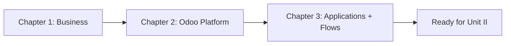
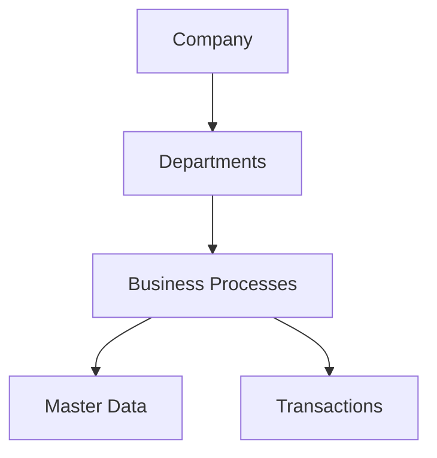
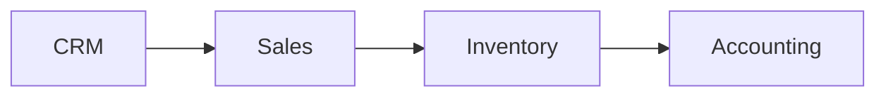
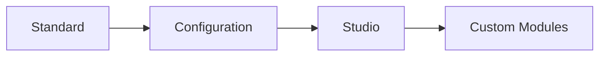
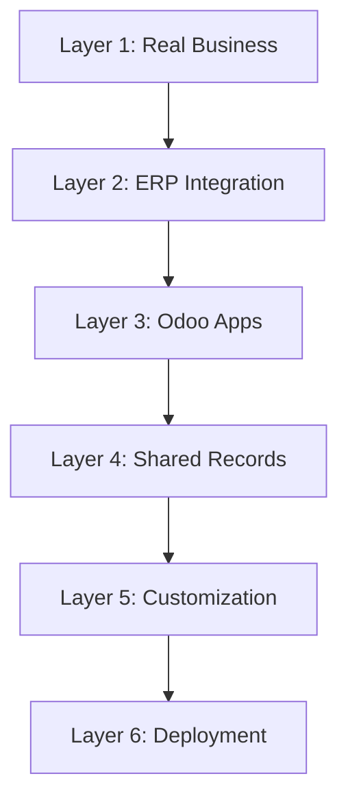

# UNIT I CONCLUSION: UNDERSTAND THE BUSINESS BEFORE THE CODE

You've finished the three teaching chapters of Unit I. Before we go into Unit II and Odoo architecture, let's pause here: check that the full unit landed, then pull the whole picture together in one place.

---

## TABLE OF CONTENTS

- [Did we cover everything?](#did-we-cover-everything)
- [The whole unit in one picture](#the-whole-unit-in-one-picture)

---

## DID WE COVER EVERYTHING?

Knowing the purpose of each application is only the starting point. A learner should also be able to explain transitions, state assumptions, handle exceptions, and identify the evidence that proves each stage is complete. Topic coverage by itself does not demonstrate mastery.

Chapter 3 was the last teaching chapter in Unit I. The roadmap defines this unit as Chapters 1 through 3, then **Unit II: How Odoo Actually Works**. So this is a good moment to ask: did we actually cover what we needed before architecture starts?

### CHAPTER 1: WHAT IS ERP?

We covered:

- **Business Processes:** process meaning, inputs, activities, outputs, owners
- **Departments:** Sales, Purchasing, Warehouse, Finance, HR, Operations
- **Cross-Department Workflows**
- **Master Data:** Customers, Vendors, Products, Employees, Accounts
- **Transactions**
- **Single Source of Truth**
- **ERP vs CRM**
- **ERP vs Standalone Business Software**
- **Business Process Mapping**

Exercise and project are in place.

This chapter gave you the business-side mental model: companies run on processes, not isolated tasks, and ERP systems connect departments through shared data rather than duplicate spreadsheets.

### CHAPTER 2: UNDERSTANDING ODOO

We covered:

- What Odoo Is
- Odoo Ecosystem
- Community Edition
- Enterprise Edition
- Odoo Online
- Odoo.sh
- On-Premise Odoo
- Odoo Apps
- Modules / Addons
- Users
- Companies
- Shared Business Records
- Standard vs Custom Modules
- Odoo Studio Concept

Exercise and project are in place.

This chapter translated Chapter 1's ERP ideas into the Odoo platform: editions, hosting, apps, modules, users, companies, shared records, and the customization hierarchy from standard functionality through configuration, Studio, and custom development.

### CHAPTER 3: CORE BUSINESS APPLICATIONS

We covered all roadmap items:

- Contacts
- CRM
- Sales
- Purchase
- Inventory
- Accounting / Invoicing
- Employees / HR
- Projects
- Timesheets
- Manufacturing
- Maintenance
- Website
- eCommerce
- Point of Sale
- Helpdesk
- End-to-End Document Flow

Exercise and project are in place.

This chapter opened the Odoo toolbox itself. You learned what each major application does, how records differ across domains, and how real business flows cross application boundaries in Lead-to-Cash, Procure-to-Pay, service, manufacturing, eCommerce, POS, and Helpdesk scenarios.

### BEFORE CHAPTER 4, DO YOU NEED MORE FIRST?

You might be wondering whether you should already know:

- Python?
- PostgreSQL internals?
- HTTP?
- ORM?
- workers?

You do not need those technical internals to complete Unit I’s paper exercises. The repository’s basic Python, SQL, Git, command-line, and web prerequisites still apply when you begin implementation; Unit II introduces Odoo architecture and later units deepen the technical topics.

What you actually need before Chapter 4 is simpler:

> Understand what business system Odoo is serving and what records and applications the architecture exists to support.

Check that understanding using the exercises and project evidence below. Reading all sections establishes coverage; correctly explaining a new scenario establishes readiness.

---

## THE WHOLE UNIT IN ONE PICTURE

The entire unit can be condensed into one large model. Each layer below builds on the previous one.

### LAYER 1: THE REAL BUSINESS

A company contains **departments** performing **business processes** using **master data** and creating **transactions**.

This was the foundation of Chapter 1. A business is not a collection of unrelated tasks. It is a network of processes with inputs, activities, outputs, and owners. Departments specialize, but real workflows cross those boundaries constantly.

### LAYER 2: ERP

ERP integrates those areas so Sales, Purchase, Inventory, Finance, and HR work from connected information rather than isolated systems.

When a customer order is confirmed, warehouse, purchasing, and finance should not each invent their own version of reality. ERP connects the workflow.

### LAYER 3: ODOO

Odoo implements those business domains through integrated apps and modules:

- Contacts
- CRM
- Sales
- Purchase
- Inventory
- Accounting
- HR
- Projects
- Manufacturing
- Website
- eCommerce
- Point of Sale
- Helpdesk
- and more

Chapter 2 explained that these apps are not separate programs with separate databases. They are modules inside one platform, installed selectively, linked by dependencies, and connected through shared records.

### LAYER 4: SHARED RECORDS

Applications share or relate business records.

A **customer** can participate in:

The same contact identity can appear in an opportunity, a Sales Order, a delivery, an invoice, and a Helpdesk ticket. That is single-source-of-truth thinking applied inside Odoo.

Some records are shared master data. Others are company-specific transactions. Multi-company setups add another design layer, but the core pattern remains: reuse identity, separate operational documents where the business requires it.

### LAYER 5: CUSTOMIZATION

Business-specific requirements can be addressed through:

Chapter 2 emphasized that professional Odoo work does not begin with Python. Standard capability, configuration, and Studio should be investigated first. Custom modules extend Odoo; they should not replace understanding of what already exists.

### LAYER 6: DEPLOYMENT

Odoo eventually runs through a hosting and deployment approach such as:

**Online | Odoo.sh | Self-Hosted**

Edition (Community vs Enterprise) is separate from hosting. Odoo Online simplifies operations but restricts arbitrary custom modules. Odoo.sh supports Git-based custom development with managed infrastructure. Self-hosted Odoo offers maximum control and maximum operational responsibility.

Unit I built this stack from the ground up: first business concepts, then the Odoo platform, then individual applications and their connected flows. That foundation is what every technical chapter from Unit II onward will assume.

### A QUICK SANITY CHECK

Close the lessons and explain: (1) why reserving eight monitors leaves eight on hand; (2) why an invoice can remain unpaid; (3) why fifteen existing desks plus thirty-five newly made desks fulfill fifty; (4) why two companies can share a product without sharing all field values or stock; and (5) why a damaged-delivery ticket need not wait for payment. Each answer should name evidence and a responsible role. Revisit Chapter 3 Sections 3.5–3.6 and 3.15–3.16 for quantity/settlement/support gaps, Chapter 2 Sections 2.11–2.12 for company gaps, and the unit exercise for production arithmetic.

If you can explain a realistic business scenario across master data, transactions, departments, applications, inventory changes, financial records, and Helpdesk, Unit I has achieved its purpose:

**Understand the Business Before the Code**

You should now be able to answer questions such as:

- What is the difference between a contact and a Sales Order?
- Why does a Purchase Order not automatically mean stock increased?
- Why does an invoice not automatically mean payment received?
- Which Odoo app owns CRM versus Sales versus Inventory?
- When would Studio be enough, and when would custom code be required?
- How does a website order become an internal Sales Order and delivery requirement?

If those questions feel natural rather than confusing, you are ready for the next step.

Work through the **[Unit I Exercise](../Exercise/Exercise.md)** first: one integrated scenario covering Chapters 1, 2, and 3. Then the **[Unit I Project](../Project/Project.md)**: design a complete mini enterprise with four business flows.

---

## UP NEXT: UNIT II

### UNIT I ANSWERED ONE QUESTION

**What business is Odoo modeling?**

We understand:

- processes,
- departments,
- master data,
- transactions,
- Odoo applications,
- connected document flows.

### UNIT II ASKS AN ENTIRELY DIFFERENT QUESTION

**How does the software actually make those business processes work?**

We now leave the functional view of Odoo and move inside its technical architecture.

**Up next:** **Unit II: How Odoo Actually Works**, starting with **Chapter 4: Odoo Architecture**.
