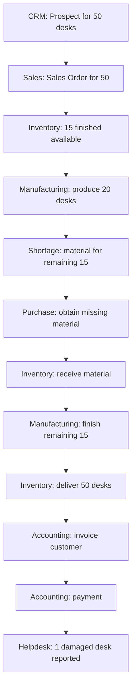

# Unit I Exercise

This exercise covers all of Unit I: Chapters 1, 2, and 3.

Try answering without looking back first. Work through the scenario in your own words, then compare with the complete solution below.

---

## Table of Contents

- [Scenario](#scenario)
- [Your Task](#your-task)
- [Complete Solution](#unit-i-exercise-complete-solution)
  - [1. Master Data](#1-master-data)
  - [2. Transactions](#2-transactions)
  - [3. Departments](#3-departments)
  - [4. Applications](#4-applications)
  - [5. Likely Document Flow](#5-likely-document-flow)
  - [6. Where Inventory Changes](#6-where-inventory-changes)
  - [7. Where Financial Records Appear](#7-where-financial-records-appear)
  - [8. Where Helpdesk Appears](#8-where-helpdesk-appears)
  - [9. Single Source of Truth](#9-single-source-of-truth)
  - [10. One Process or Many?](#10-one-process-or-many)

---

## Scenario

Without looking back, explain this scenario from beginning to end:

A prospect requests **50 desks**. The company has **15 finished desks**. It manufactures **20 more** but lacks material for the remaining **15**, so Purchasing obtains the missing material. Production finishes all **50 desks**, the warehouse delivers them, Finance invoices the customer, and the customer later reports **one damaged desk**.

This scenario deliberately crosses sales, manufacturing, purchasing, inventory, accounting, and support. It is designed to test whether you can think in integrated ERP terms rather than isolated app terms.

---

## Your Task

Identify:

1. master data,
2. transactions,
3. departments,
4. applications,
5. likely document flow,
6. where inventory changes,
7. where financial records appear,
8. where Helpdesk appears,
9. where single-source-of-truth thinking matters,
10. whether this is one business process or multiple connected processes.

---

# Unit I Exercise: Complete Solution

Work through the scenario above first. The solution below explains the reasoning Unit I expects across all three chapters.

---

## 1. Master Data

Master data is reusable information referenced by many transactions.

Examples in this scenario include:

- **Customer / Contact:** the prospect or customer organization requesting desks
- **Product:** desk as the finished good being sold and delivered
- **Components / raw materials:** wood, legs, screws, packaging, or other materials defined in the bill of materials
- **Vendor:** the supplier providing missing materials
- **Employee:** salesperson, purchaser, production worker, warehouse worker, accountant, support agent
- **Bill of Materials:** the recipe defining what components each desk requires

Master data answers questions such as "Who is the customer?" and "What is a desk?" It does not by itself record that a specific sale happened on a specific date.

---

## 2. Transactions

Transactions are specific business events at points in time.

Examples include:

- CRM opportunity or lead for the desk request
- quotation to the customer
- Sales Order for 50 desks
- manufacturing order(s) to produce desks
- Purchase Order for missing materials
- material receipt when components arrive
- production completion records
- delivery of 50 desks to the customer
- customer invoice
- customer payment
- Helpdesk ticket for the damaged desk

Each transaction represents a business event with its own meaning. A Sales Order is not the same as a delivery, and a delivery is not the same as an invoice.

---

## 3. Departments

| Stage | Likely department | Responsibility |
| --- | --- | --- |
| Prospect and sale | Sales | qualify demand, negotiate, confirm commercial agreement |
| Material procurement | Purchasing | source and order missing components |
| Production | Operations / Manufacturing | convert materials into finished desks |
| Stock movement and delivery | Warehouse | receive, store, pick, pack, and ship goods |
| Billing and payment | Finance | invoice the customer and record payment |
| Damage complaint | Customer Support | investigate and resolve after-sales issue |

The workflow crosses several departments even though it began as one customer request. That is normal in ERP. Departments specialize, but enterprise processes connect them.

---

## 4. Applications

| Stage | Odoo application | Why |
| --- | --- | --- |
| Prospect interest | CRM | potential business before confirmed sale |
| Commercial agreement | Sales | quotation and Sales Order |
| Production planning and execution | Manufacturing | produce finished desks from components |
| Component shortage | Purchase | obtain missing materials |
| Stock and delivery | Inventory | physical stock and movements |
| Invoice and payment | Accounting | financial obligations and settlement |
| Damage report | Helpdesk | structured customer support |

Supporting master data lives in **Contacts**, **Products**, and **Employees / HR**.

Chapter 2 taught that these apps share a platform. Chapter 3 taught what each app owns in the business flow.

---

## 5. Likely Document Flow

**Narrative walkthrough:**

1. Sales captures demand for 50 desks.
2. Inventory shows only 15 finished desks available immediately.
3. Manufacturing produces 20 more desks from existing components.
4. Manufacturing still needs material for the final 15 desks.
5. Purchasing orders the missing material.
6. Inventory receives the material.
7. Manufacturing completes the remaining 15 desks.
8. Inventory delivers all 50 desks.
9. Accounting invoices the customer.
10. Accounting records payment when received.
11. Helpdesk handles the damaged desk complaint after delivery.

---

## 6. Where Inventory Changes

Inventory is not one static number. It changes through movements and state transitions.

Inventory changes at several points:

- **Finished desks decrease or become reserved** when the existing 15 desks are allocated to the order.
- **Raw materials decrease** when manufacturing consumes components for the first 20 desks and later for the final 15.
- **Raw materials increase** when Purchasing receives the missing materials.
- **Finished desks increase** when Manufacturing completes each production batch.
- **Finished desks decrease** when the warehouse delivers all 50 desks to the customer.

Inventory tracks quantities, locations, reservations, incoming goods, and outgoing deliveries. That is why Inventory is central to manufacturing and distribution businesses.

---

## 7. Where Financial Records Appear

Financial records appear mainly in **Accounting**.

- **Customer invoice** after delivery or according to the company's billing rules
- **Customer payment** when money is actually received
- **Vendor bill** when purchased materials are invoiced by the supplier
- **Vendor payment** when the company pays the supplier

Operational events in Sales, Manufacturing, and Inventory create the basis for financial records, but the invoice and payment remain distinct documents.

This reflects the Chapter 3 distinction: **Invoice ≠ Payment**.

---

## 8. Where Helpdesk Appears

Helpdesk appears **after delivery**, when the customer reports one damaged desk.

At this stage the business problem is no longer sales, manufacturing, or invoicing. It is support.

The ticket should link to:

- the customer contact,
- the Sales Order,
- the delivery document,
- the product involved,
- possibly the invoice if warranty or replacement policy depends on it

Integrated Helpdesk avoids asking the customer to repeat information Odoo already knows.

---

## 9. Single Source of Truth

Single source of truth matters wherever duplicate records would break traceability.

Examples:

- **Customer:** one contact record reused by CRM, Sales, Delivery, Accounting, and Helpdesk
- **Product / desk:** one product identity used by Sales, Manufacturing, Inventory, and Accounting
- **Sales Order:** the commercial reference that downstream documents should relate to rather than re-enter manually
- **Bill of Materials:** one component recipe used consistently by Manufacturing and Purchasing

If each department creates its own duplicate customer or product record, the business loses the ability to follow one customer journey from prospect to support.

That was the core lesson of Chapter 1, applied concretely in Chapters 2 and 3.

---

## 10. One Process or Many?

This is **multiple connected processes** forming one larger customer journey.

From the customer's perspective, they wanted 50 desks and later reported a defect.

Internally, that journey includes:

- selling,
- manufacturing,
- purchasing,
- warehousing,
- accounting,
- support.

ERP value comes from connecting those processes through shared records rather than treating them as isolated activities.

So the answer is not "one app, one process." The answer is "one customer outcome built from several connected business processes."

---

If you can explain this scenario clearly, Unit I has done its core job at the exercise level.

Continue to the **[Unit I Project](../Project/Project.md)** to design a complete mini enterprise with four integrated business flows. After that, **Unit II: How Odoo Actually Works** is up next.
