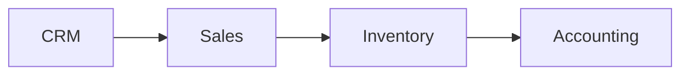
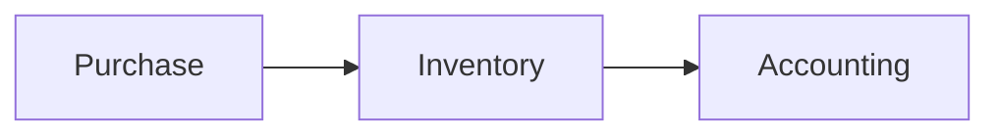
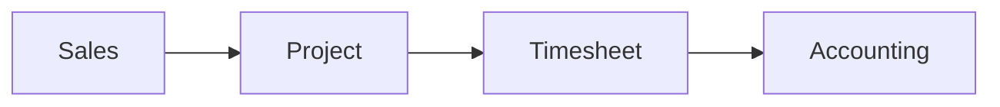
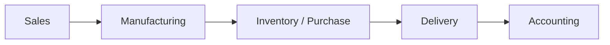
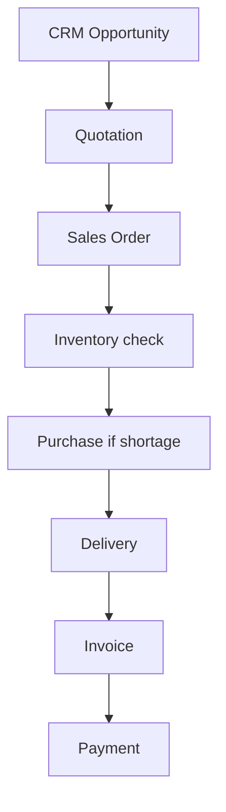
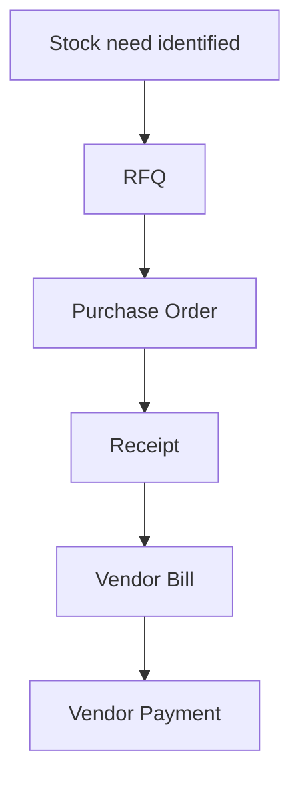
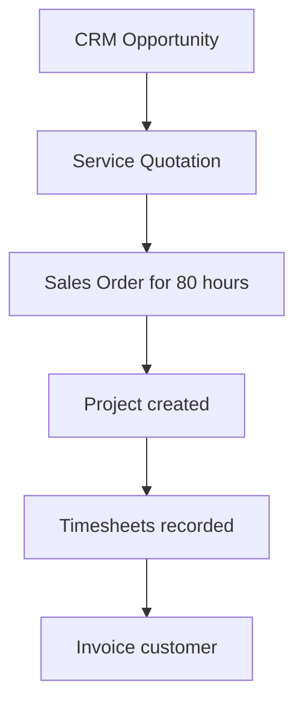
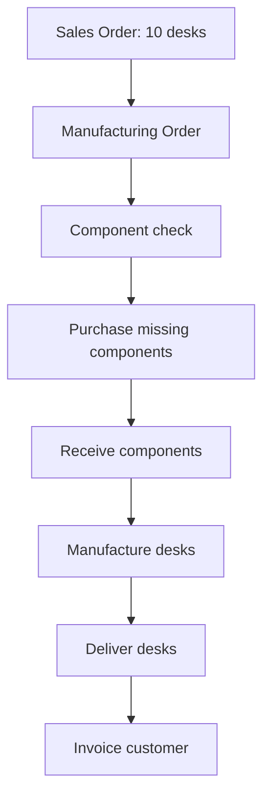
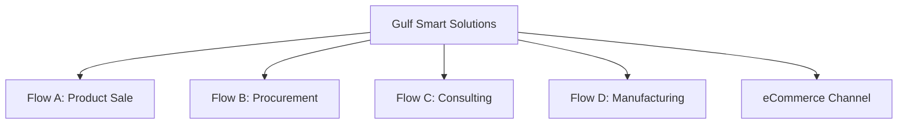
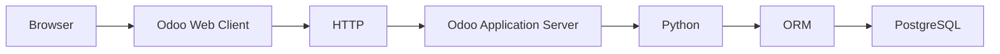

# UNIT I PROJECT: MAP A COMPLETE MINI ENTERPRISE

Design a fictional company that uses Odoo across product sales, procurement, services, manufacturing, and online channels.

This is **business modeling**, not Odoo configuration. Do not build records in Odoo until you can explain the flows on paper.

---

## TABLE OF CONTENTS

- [Project Goal](#project-goal)
- [Part 1: Design the Company](#part-1-design-the-company)
- [Part 2: Flow A - Lead-to-Cash](#part-2-flow-a---lead-to-cash)
- [Part 3: Flow B - Procure-to-Pay](#part-3-flow-b---procure-to-pay)
- [Part 4: Flow C - Service Delivery](#part-4-flow-c---service-delivery)
- [Part 5: Flow D - Manufacturing](#part-5-flow-d---manufacturing)
- [Complete Solution](#unit-i-project-complete-solution)

---

## PROJECT GOAL

Design a fictional company with:

- Sales,
- Purchasing,
- Warehouse,
- Finance,
- HR,
- one service offering,
- one manufactured product,
- one eCommerce channel.

Then create four business flows:

**Flow A - Lead-to-Cash**

**Flow B - Procure-to-Pay**

**Flow C - Service Delivery**

**Flow D - Manufacturing**

For every flow identify:

- trigger,
- master data,
- transactions,
- responsible departments,
- application responsible for each stage,
- output,
- next process.

If you can do that correctly, Unit I has done its job.

---

## PART 1: DESIGN THE COMPANY

Create your fictional company profile including departments, products, services, customers, vendors, and employees.

---

## PART 2: FLOW A - LEAD-TO-CASH

Map a product sale from prospect interest through payment.

---

## PART 3: FLOW B - PROCURE-TO-PAY

Map a procurement cycle from need through vendor payment.

---

## PART 4: FLOW C - SERVICE DELIVERY

Map a consulting or implementation sale from opportunity through billed hours.

---

## PART 5: FLOW D - MANUFACTURING

Map a made-to-order manufacturing scenario from sales demand through delivery and invoicing.

---

# UNIT I PROJECT: COMPLETE SOLUTION

The solution below uses a fictional company called **Gulf Smart Solutions (GSS)**. It sells IT products, manufactures custom office desks, offers Odoo implementation services, and sells selected products through eCommerce.

---

## PART 1: DESIGN THE COMPANY

### COMPANY PROFILE

**Gulf Smart Solutions (GSS)** is a Qatar-based company that:

- resells IT hardware,
- manufactures custom office desks,
- provides Odoo implementation consulting,
- sells selected products online through its website.

### DEPARTMENTS

| Department | Purpose |
| --- | --- |
| **Sales** | manage prospects, quotations, and customer orders |
| **Purchasing** | source vendors and place procurement orders |
| **Warehouse** | receive, store, pick, pack, and deliver physical goods |
| **Finance** | invoice customers, pay vendors, reconcile accounts |
| **HR** | manage employee records and organizational structure |
| **Operations / Manufacturing** | plan and execute desk production |
| **Projects / Consulting** | deliver implementation services |
| **Support** | handle after-sales issues through Helpdesk when needed |

### MASTER DATA

**Customers**

- ABC Trading
- Doha Tech
- Gulf Office Solutions

**Vendors**

- Global Displays (monitors and screens)
- Qatar Hardware Supply (components and general hardware)
- WoodCraft Materials (desk components)

**Products**

- Laptop (resale product)
- Monitor (resale product)
- Keyboard (resale product)
- **Custom Office Desk** (manufactured product)

**Service offering**

- **Odoo Implementation Package** (consulting/service offering billed by project and timesheet)

**eCommerce channel**

- Website store selling keyboards and monitors to online customers

**Employees**

| Employee | Role |
| --- | --- |
| Ahmed | Sales Executive |
| Sara | Purchasing Manager |
| Ali | Warehouse Supervisor |
| Fatima | Accountant |
| Omar | Manufacturing Supervisor |
| Layla | Project Consultant |
| Bilal | HR Officer / Administrator |

---

## PART 2: FLOW A - LEAD-TO-CASH

**Scenario:** Doha Tech may need **20 monitors** for a new office. Ahmed qualifies the opportunity, quotes, confirms the sale, fulfills from stock with partial procurement, delivers, invoices, and receives payment.

| Stage | Detail |
| --- | --- |
| **Trigger** | Doha Tech expresses interest in 20 monitors |
| **Master data** | Customer: Doha Tech; Product: Monitor; Vendor: Global Displays if shortage |
| **Transactions** | CRM opportunity, quotation, Sales Order, Purchase Order if needed, receipt, delivery, invoice, payment |
| **Departments** | Sales, Purchasing, Warehouse, Finance |
| **Applications** | CRM → Sales → Purchase → Inventory → Accounting |
| **Output** | Paid customer invoice and completed delivery |
| **Next process** | Helpdesk if support issue; repeat sales cycle for future opportunities |

**Stage-by-stage mapping**

| Stage | Department | Application | Output |
| --- | --- | --- | --- |
| Prospect interest | Sales | CRM | Qualified opportunity |
| Commercial offer | Sales | Sales | Quotation |
| Confirmed sale | Sales | Sales | Sales Order |
| Stock check / shortage | Warehouse | Inventory | Replenishment need identified |
| Procurement | Purchasing | Purchase | Purchase Order and receipt |
| Fulfillment | Warehouse | Inventory | Delivery |
| Billing | Finance | Accounting | Customer invoice |
| Settlement | Finance | Accounting | Payment recorded |

**Example numbers:** 20 monitors at 1,000 QAR = 20,000 QAR invoice.

---

## PART 3: FLOW B - PROCURE-TO-PAY

**Scenario:** Warehouse stock of keyboards falls below minimum. Sara procures **100 keyboards** from Qatar Hardware Supply, receives them, processes the vendor bill, and Finance pays the vendor.

| Stage | Detail |
| --- | --- |
| **Trigger** | Inventory reorder rule or manual shortage identification |
| **Master data** | Vendor: Qatar Hardware Supply; Product: Keyboard |
| **Transactions** | RFQ, Purchase Order, receipt, vendor bill, vendor payment |
| **Departments** | Warehouse, Purchasing, Finance |
| **Applications** | Inventory → Purchase → Inventory → Accounting |
| **Output** | Stock increased and vendor obligation settled |
| **Next process** | Sales or eCommerce can consume replenished stock |

**Stage-by-stage mapping**

| Stage | Department | Application | Output |
| --- | --- | --- | --- |
| Need identified | Warehouse | Inventory | Replenishment requirement |
| Vendor request | Purchasing | Purchase | RFQ |
| Confirmed purchase | Purchasing | Purchase | Purchase Order |
| Physical receipt | Warehouse | Inventory | Stock increase |
| Financial obligation | Finance | Accounting | Vendor bill |
| Settlement | Finance | Accounting | Vendor payment |

**Important distinction:** Purchase Order ≠ receipt. Stock should increase when goods are received, not merely when the PO is confirmed.

---

## PART 4: FLOW C - SERVICE DELIVERY

**Scenario:** Gulf Office Solutions buys an **Odoo Implementation Package** for **80 consulting hours**. Layla delivers the work through a project with timesheets. Finance invoices based on the commercial agreement.

| Stage | Detail |
| --- | --- |
| **Trigger** | Gulf Office Solutions requests Odoo implementation support |
| **Master data** | Customer: Gulf Office Solutions; Service: Odoo Implementation Package; Employee: Layla |
| **Transactions** | CRM opportunity, quotation, Sales Order, project, tasks, timesheets, invoice, payment |
| **Departments** | Sales, Projects/Consulting, Finance |
| **Applications** | CRM → Sales → Projects → Timesheets → Accounting |
| **Output** | Delivered project work and customer invoice |
| **Next process** | Helpdesk for post-implementation support if included in scope |

**Stage-by-stage mapping**

| Stage | Department | Application | Output |
| --- | --- | --- | --- |
| Opportunity | Sales | CRM | Qualified service opportunity |
| Commercial offer | Sales | Sales | Quotation for 80 hours |
| Confirmed sale | Sales | Sales | Sales Order |
| Work organization | Consulting | Projects | Project and tasks |
| Effort recording | Consulting | Timesheets | Hours by employee/task |
| Billing | Finance | Accounting | Customer invoice |
| Settlement | Finance | Accounting | Payment |

**Example:** Layla records 10 + 12 + 8 + 15 + ... hours across tasks until cumulative effort approaches 80 hours.

For service businesses, **Sales → Project → Timesheet → Accounting** is as important as **Sales → Inventory → Accounting** is for product businesses.

---

## PART 5: FLOW D - MANUFACTURING

**Scenario:** ABC Trading orders **10 custom office desks**. GSS manufactures desks from components. Some components are in stock; WoodCraft Materials supplies missing items. Manufacturing completes the desks, warehouse delivers them, and Finance invoices ABC Trading.

**Bill of Materials per desk:**

- 1 tabletop
- 4 legs
- 16 screws

For 10 desks: **10 tabletops, 40 legs, 160 screws**.

| Stage | Detail |
| --- | --- |
| **Trigger** | Confirmed Sales Order for 10 custom desks |
| **Master data** | Customer: ABC Trading; Product: Custom Office Desk; components; vendor: WoodCraft Materials |
| **Transactions** | Sales Order, manufacturing order, Purchase Order, receipt, production completion, delivery, invoice, payment |
| **Departments** | Sales, Manufacturing, Purchasing, Warehouse, Finance |
| **Applications** | Sales → Manufacturing → Purchase → Inventory → Accounting |
| **Output** | 10 finished desks delivered and invoiced |
| **Next process** | Helpdesk if delivery or quality issue reported |

**Stage-by-stage mapping**

| Stage | Department | Application | Output |
| --- | --- | --- | --- |
| Customer demand | Sales | Sales | Sales Order |
| Production planning | Manufacturing | Manufacturing | Manufacturing order |
| Component shortage | Purchasing | Purchase | Purchase Order to WoodCraft Materials |
| Component receipt | Warehouse | Inventory | Components available |
| Production execution | Manufacturing | Manufacturing | 10 finished desks |
| Delivery | Warehouse | Inventory | Customer delivery |
| Billing | Finance | Accounting | Customer invoice |
| Settlement | Finance | Accounting | Payment |

**Inventory impact:**

- Components decrease during manufacturing.
- Finished desks increase upon production completion.
- Finished desks decrease upon customer delivery.

---

## ECOMMERCE CHANNEL NOTE

GSS also sells keyboards and monitors online.

Conceptual flow:

A website checkout creates the same internal document chain as a traditional sale, which demonstrates why eCommerce is a **sales channel**, not merely website design.

---

## FINAL ENTERPRISE MAP

Gulf Smart Solutions therefore operates four major connected flows inside one enterprise model:

| Flow | Primary path |
| --- | --- |
| **A - Lead-to-Cash** | CRM → Sales → Inventory → Accounting |
| **B - Procure-to-Pay** | Purchase → Inventory → Accounting |
| **C - Service Delivery** | Sales → Project → Timesheet → Accounting |
| **D - Manufacturing** | Sales → Manufacturing → Purchase/Inventory → Delivery → Accounting |

That diagram demonstrates the core goal of Unit I:

**Understand the Business Before the Code**

If you can explain these flows, identify master data versus transactions, and name the responsible application at each stage, you are ready for what comes next.

---

## UP NEXT: UNIT II

### UNIT I ANSWERED ONE QUESTION

**What business is Odoo modeling?**

We understand:

- processes,
- departments,
- master data,
- transactions,
- Odoo applications,
- connected document flows.

### UNIT II ASKS AN ENTIRELY DIFFERENT QUESTION

**How does the software actually make those business processes work?**

We now leave the functional view of Odoo and move inside its technical architecture.

When a salesperson opens a Sales Order in their browser:

- How does the browser communicate with Odoo?
- Where does Python run?
- Where is the customer record stored?
- What is the ORM?
- Why PostgreSQL?
- What are addons?
- What is the registry?
- What are workers?
- What happens between **Click** and **Business Record Loaded**?

**Up next:** **Unit II: How Odoo Actually Works**, starting with **Chapter 4: Odoo Architecture**, where the roadmap moves into:

along with filestore, addons, registry, sessions, workers, cron workers, and long-polling and WebSocket concepts.
