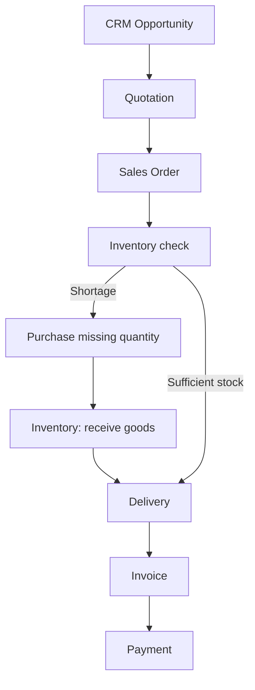
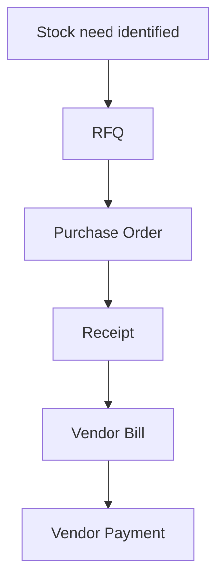
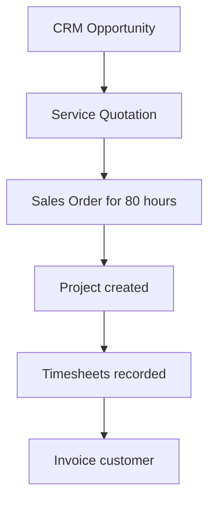
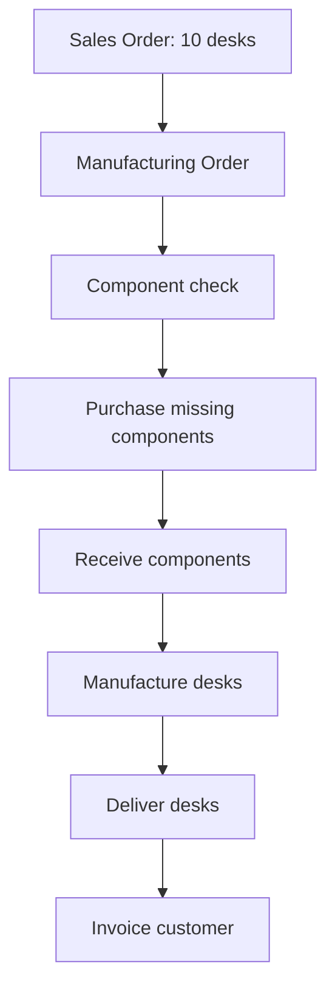
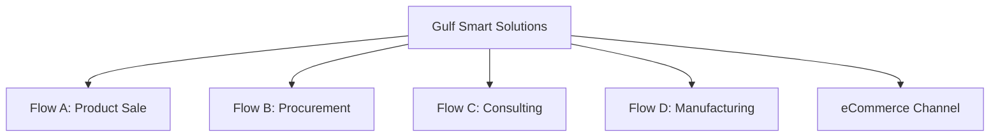
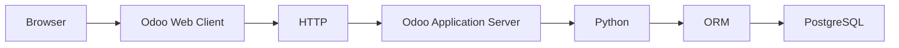

# UNIT I PROJECT: MAP A COMPLETE MINI ENTERPRISE

Design a fictional company that uses Odoo across product sales, procurement, services, manufacturing, and online channels.

This is **business modeling**, not Odoo configuration. Do not build records in Odoo until you can explain the flows on paper.

---

## TABLE OF CONTENTS

- [Project Goal](#project-goal)
- [Part 1: Design the Company](#part-1-design-the-company)
- [Part 2: Flow A - Lead-to-Cash](#part-2-flow-a---lead-to-cash)
- [Part 3: Flow B - Procure-to-Pay](#part-3-flow-b---procure-to-pay)
- [Part 4: Flow C - Service Delivery](#part-4-flow-c---service-delivery)
- [Part 5: Flow D - Manufacturing](#part-5-flow-d---manufacturing)
- [Complete Solution](#unit-i-project-complete-solution)

---

## PROJECT GOAL

> **Added submission and assessment:** Complete the five existing parts and include the eCommerce channel in Part 1 and the relevant sales flow. For each flow provide the seven requested elements, one numerical check, one exception with an owner, and completion evidence. Score each flow 0 for missing/incorrect, 1 for a correct sequence with missing reasoning, or 2 for a traceable explanation with quantities and exception handling. Revise each flow to 2 before moving on. The goal is a coherent business model; no paid environment, code, or deployment is required.

Design a fictional company with:

- Sales,
- Purchasing,
- Warehouse,
- Finance,
- HR,
- one service offering,
- one manufactured product,
- one eCommerce channel.

Then create four business flows:

**Flow A - Lead-to-Cash**

**Flow B - Procure-to-Pay**

**Flow C - Service Delivery**

**Flow D - Manufacturing**

For every flow identify:

- trigger,
- master data,
- transactions,
- responsible departments,
- application responsible for each stage,
- output,
- next process.

If you can do that correctly, Unit I has done its job.

---

## PART 1: DESIGN THE COMPANY

> **Added prompt:** Define at least one customer, vendor, resale item, service, manufactured product and its component recipe, plus the requested departments and employee roles. Choose a release baseline, edition, hosting assumption, and company boundary; explain how these support your flows. Assign a stable reference and unit to each product. Use the same identities when they recur across flows.

Create your fictional company profile including departments, products, services, customers, vendors, and employees.

---

## PART 2: FLOW A - LEAD-TO-CASH

> **Added prompt:** Supply opening stock, ordered quantity, price, billing policy, and payment terms. Trace demand → shortage decision → receipt if required → delivery → billing → settlement. Include sufficient-stock and supplier-delay outcomes. Explain what proof closes fulfillment and what separate proof closes the customer balance.

Map a product sale from prospect interest through payment.

---

## PART 3: FLOW B - PROCURE-TO-PAY

> **Added prompt:** Supply opening quantity, replenishment quantity, vendor price, and bill-control assumption. Identify who orders, who receives, and who verifies the bill. Test a partial receipt and a mismatched supplier bill. State whether buying is manual or triggered by configured replenishment rules.

Map a procurement cycle from need through vendor payment.

---

## PART 4: FLOW C - SERVICE DELIVERY

> **Added prompt:** Define hourly or fixed-price terms, the service product, project/tasks, responsible employee, and eligibility of recorded time. Use a complete set of hours and a rate to calculate a bill. Test non-billable work or an overrun, and identify who agrees a change with the customer.

Map a consulting or implementation sale from opportunity through billed hours.

---

## PART 5: FLOW D - MANUFACTURING

> **Added prompt:** Specify finished demand, opening finished stock, the per-unit BoM, and usable component stock. Calculate gross components, shortages, consumption, finished output, and delivery balance. Test a component shortage or rejected finished unit. Explain which actions are planned manually and which would need configured automation in Odoo.

Map a made-to-order manufacturing scenario from sales demand through delivery and invoicing.

---

# UNIT I PROJECT: COMPLETE SOLUTION

The solution below uses a fictional company called **Gulf Smart Solutions (GSS)**. It sells IT products, manufactures custom office desks, offers Odoo implementation services, and sells selected products through eCommerce.

---

## PART 1: DESIGN THE COMPANY

### COMPANY PROFILE

> **Added sample assumptions:** GSS is one operating company using an Odoo 19.0 conceptual design. For illustration it evaluates Enterprise with Odoo.sh if maintained Python extensions are needed; this is a stated option, not a requirement to purchase hosting. Each quantity example below is independent unless a handoff is explicitly stated. All prices omit tax, discounts, and freight, and opening physical stock is usable and unreserved.

**Gulf Smart Solutions (GSS)** is a Qatar-based company that:

- resells IT hardware,
- manufactures custom office desks,
- provides Odoo implementation consulting,
- sells selected products online through its website.

### DEPARTMENTS

| Department | Purpose |
| --- | --- |
| **Sales** | manage prospects, quotations, and customer orders |
| **Purchasing** | source vendors and place procurement orders |
| **Warehouse** | receive, store, pick, pack, and deliver physical goods |
| **Finance** | invoice customers, pay vendors, reconcile accounts |
| **HR** | manage employee records and organizational structure |
| **Operations / Manufacturing** | plan and execute desk production |
| **Projects / Consulting** | deliver implementation services |
| **Support** | handle after-sales issues through Helpdesk when needed |

### MASTER DATA

> **Added sample references:** Use CUST-ABC, CUST-DOHA, and CUST-GULF for customers; VEN-DISPLAY, VEN-HARDWARE, and VEN-WOOD for vendors; and PROD-LAP, PROD-MON, PROD-KBD, and PROD-DESK for finished/resale products. Use COMP-TOP, COMP-LEG, and COMP-SCREW for components, each counted by the unit. SERV-ODOO is measured in hours. In Flow A, assume invoicing after full delivery with payment due thirty days after invoice; this is a sample commercial term, not a hosting or software default.

> **Added relationship check:** Give the desk and its tabletop, leg, and screw components separate product references. Use Layla’s employee identity for time and a linked authorized user identity when she logs work. Bilal’s HR role should not imply that every employee needs administrative access. The web shop reuses the keyboard/monitor identities; publication and pricing still require deliberate configuration.

**Customers**

- ABC Trading
- Doha Tech
- Gulf Office Solutions

**Vendors**

- Global Displays (monitors and screens)
- Qatar Hardware Supply (components and general hardware)
- WoodCraft Materials (desk components)

**Products**

- Laptop (resale product)
- Monitor (resale product)
- Keyboard (resale product)
- **Custom Office Desk** (manufactured product)

**Service offering**

- **Odoo Implementation Package** (consulting/service offering billed by project and timesheet)

**eCommerce channel**

- Website store selling keyboards and monitors to online customers

**Employees**

| Employee | Role |
| --- | --- |
| Ahmed | Sales Executive |
| Sara | Purchasing Manager |
| Ali | Warehouse Supervisor |
| Fatima | Accountant |
| Omar | Manufacturing Supervisor |
| Layla | Project Consultant |
| Bilal | HR Officer / Administrator |

---

## PART 2: FLOW A - LEAD-TO-CASH

> **Added worked example and diagram correction:** Assume eight monitors on hand and demand for twenty. Buy and receive twelve, then deliver twenty: 8 + 12 − 20 = 0 monitors remaining. The diagram includes receipt after procurement and a sufficient-stock bypass. At 1,000 QAR each the charge is 20,000 QAR; a matched 5,000 QAR settlement leaves 15,000 QAR due. If the supplier delivers only ten, eighteen monitors are available and Sales must agree whether to ship partially or wait for two. Completion requires the actual delivery and settled customer balance, not merely a confirmed order.

**Scenario:** Doha Tech may need **20 monitors** for a new office. Ahmed qualifies the opportunity, quotes, confirms the sale, fulfills from stock with partial procurement, delivers, invoices, and receives payment.

| Stage | Detail |
| --- | --- |
| **Trigger** | Doha Tech expresses interest in 20 monitors |
| **Master data** | Customer: Doha Tech; Product: Monitor; Vendor: Global Displays if shortage |
| **Transactions** | CRM opportunity, quotation, Sales Order, Purchase Order if needed, receipt, delivery, invoice, payment |
| **Departments** | Sales, Purchasing, Warehouse, Finance |
| **Applications** | CRM → Sales → Purchase → Inventory → Accounting |
| **Output** | Paid customer invoice and completed delivery |
| **Next process** | Helpdesk if support issue; repeat sales cycle for future opportunities |

**Stage-by-stage mapping**

| Stage | Department | Application | Output |
| --- | --- | --- | --- |
| Prospect interest | Sales | CRM | Qualified opportunity |
| Commercial offer | Sales | Sales | Quotation |
| Confirmed sale | Sales | Sales | Sales Order |
| Stock check / shortage | Warehouse | Inventory | Replenishment need identified |
| Procurement | Purchasing | Purchase | **Enhanced:** Purchase Order; Warehouse separately records its receipt in Inventory |
| Fulfillment | Warehouse | Inventory | Delivery |
| Billing | Finance | Accounting | Customer invoice |
| Settlement | Finance | Accounting | Payment recorded |

**Example numbers:** 20 monitors at 1,000 QAR = 20,000 QAR invoice.

---

## PART 3: FLOW B - PROCURE-TO-PAY

> **Added worked example:** Assume ten keyboards initially, a manually approved order for 100, and vendor price 130 QAR per keyboard. Full receipt gives 110 keyboards; the supplier charge is 13,000 QAR. If only eighty arrive, stock is ninety and twenty remain due. Under the assumed received-quantity control, the draft bill for this receipt is eighty × 130 = 10,400 QAR; investigate a supplier invoice for all 100. Finance verifies the difference with Purchasing and Warehouse before treating the cycle as complete. [Control policies](https://www.odoo.com/documentation/19.0/applications/inventory_and_mrp/purchase/manage_deals/control_bills.html) clarifies the quantity basis.

**Scenario:** Warehouse stock of keyboards falls below minimum. **Enhanced:** Sara procures **100 keyboards** from Qatar Hardware Supply, Ali records their receipt, and Fatima verifies the vendor bill and processes supplier settlement.

| Stage | Detail |
| --- | --- |
| **Trigger** | Inventory reorder rule or manual shortage identification |
| **Master data** | Vendor: Qatar Hardware Supply; Product: Keyboard |
| **Transactions** | RFQ, Purchase Order, receipt, vendor bill, vendor payment |
| **Departments** | Warehouse, Purchasing, Finance |
| **Applications** | Inventory → Purchase → Inventory → Accounting |
| **Output** | Stock increased and vendor obligation settled |
| **Next process** | Sales or eCommerce can consume replenished stock |

**Stage-by-stage mapping**

| Stage | Department | Application | Output |
| --- | --- | --- | --- |
| Need identified | Warehouse | Inventory | Replenishment requirement |
| Vendor request | Purchasing | Purchase | RFQ |
| Confirmed purchase | Purchasing | Purchase | Purchase Order |
| Physical receipt | Warehouse | Inventory | Stock increase |
| Financial obligation | Finance | Accounting | Vendor bill |
| Settlement | Finance | Accounting | Vendor payment |

**Important distinction:** Purchase Order ≠ receipt. Stock should increase when goods are received, not merely when the PO is confirmed.

---

## PART 4: FLOW C - SERVICE DELIVERY

> **Added evidence and configuration:** The sample uses time-based billing and a Service product linked to project work. Trace an eligible timesheet to its task and Sales Order Item, then to the invoice. Task completion establishes the work outcome; invoicing and settlement establish separate financial outcomes. If the same work were sold for a fixed 24,000 QAR, eighty-five actual hours would not automatically increase that price. [Time-and-material invoicing](https://www.odoo.com/documentation/19.0/applications/sales/sales/invoicing/time_materials.html) explains the service configuration.

**Scenario:** Gulf Office Solutions buys an **Odoo Implementation Package** for **80 consulting hours**. Layla delivers the work through a project with timesheets. Finance invoices based on the commercial agreement.

| Stage | Detail |
| --- | --- |
| **Trigger** | Gulf Office Solutions requests Odoo implementation support |
| **Master data** | Customer: Gulf Office Solutions; Service: Odoo Implementation Package; Employee: Layla |
| **Transactions** | CRM opportunity, quotation, Sales Order, project, tasks, timesheets, invoice, payment |
| **Departments** | Sales, Projects/Consulting, Finance |
| **Applications** | CRM → Sales → Projects → Timesheets → Accounting |
| **Output** | Delivered project work and customer invoice |
| **Next process** | Helpdesk for post-implementation support if included in scope |

**Stage-by-stage mapping**

| Stage | Department | Application | Output |
| --- | --- | --- | --- |
| Opportunity | Sales | CRM | Qualified service opportunity |
| Commercial offer | Sales | Sales | Quotation for 80 hours |
| Confirmed sale | Sales | Sales | Sales Order |
| Work organization | Consulting | Projects | Project and tasks |
| Effort recording | Consulting | Timesheets | Hours by employee/task |
| Billing | Finance | Accounting | Customer invoice |
| Settlement | Finance | Accounting | Payment |

**Enhanced worked example:** Layla records requirements 10 hours, configuration 20, migration 15, testing 15, and training 20: **80 hours total**. Assume all are eligible customer work at **300 QAR/hour**, giving **24,000 QAR**. Additional internal training is recorded separately and is not billed under this assumption. An extra five customer hours would be **1,500 QAR** only if the commercial terms authorize charging them; the original eighty-hour estimate is not automatic approval to bill any overrun.

For service businesses, **Sales → Project → Timesheet → Accounting** is as important as **Sales → Inventory → Accounting** is for product businesses.

---

## PART 5: FLOW D - MANUFACTURING

> **Added worked quantities:** Assume no finished desks and usable stock of six tops, forty legs, and 120 screws. Ten desks require ten tops, forty legs, and 160 screws; obtain four tops and forty screws. After receipt, completing ten desks with no loss consumes those totals and produces ten desks; delivering ten leaves zero finished desks. If one desk fails inspection, only nine are deliverable until the missing output is resolved. At an assumed 1,500 QAR selling price, all ten delivered desks produce a 15,000 QAR charge under this example’s delivered-quantity policy. Component cost and production cost require additional data; they cannot be inferred from selling price.

**Scenario:** ABC Trading orders **10 custom office desks**. GSS manufactures desks from components. Some components are in stock; WoodCraft Materials supplies missing items. Manufacturing completes the desks, warehouse delivers them, and Finance invoices ABC Trading.

**Bill of Materials per desk:**

- 1 tabletop
- 4 legs
- 16 screws

For 10 desks: **10 tabletops, 40 legs, 160 screws**.

| Stage | Detail |
| --- | --- |
| **Trigger** | Confirmed Sales Order for 10 custom desks |
| **Master data** | Customer: ABC Trading; Product: Custom Office Desk; components; vendor: WoodCraft Materials |
| **Transactions** | Sales Order, manufacturing order, Purchase Order, receipt, production completion, delivery, invoice, payment |
| **Departments** | Sales, Manufacturing, Purchasing, Warehouse, Finance |
| **Applications** | Sales → Manufacturing → Purchase → Inventory → Accounting |
| **Output** | 10 finished desks delivered and invoiced |
| **Next process** | Helpdesk if delivery or quality issue reported |

**Stage-by-stage mapping**

| Stage | Department | Application | Output |
| --- | --- | --- | --- |
| Customer demand | Sales | Sales | Sales Order |
| Production planning | Manufacturing | Manufacturing | Manufacturing order |
| Component shortage | Purchasing | Purchase | Purchase Order to WoodCraft Materials |
| Component receipt | Warehouse | Inventory | Components available |
| Production execution | Manufacturing | Manufacturing | 10 finished desks |
| Delivery | Warehouse | Inventory | Customer delivery |
| Billing | Finance | Accounting | Customer invoice |
| Settlement | Finance | Accounting | Payment |

**Inventory impact:**

- Components decrease during manufacturing.
- Finished desks increase upon production completion.
- Finished desks decrease upon customer delivery.

---

## ECOMMERCE CHANNEL NOTE

> **Added worked channel check:** Assume the store sells two keyboards at 200 QAR each with online payment before dispatch. The customer charge is 400 QAR; after completed delivery, starting good stock of thirty becomes twenty-eight. Failed or pending payment requires its own follow-up path before treating the order as paid. Map the online order into Flow A’s fulfillment process and identify the website/company, product, customer, payment evidence, and shipment reference. Checkout alone does not prove every downstream step completed.

GSS also sells keyboards and monitors online.

Conceptual flow:

A website checkout creates the same internal document chain as a traditional sale, which demonstrates why eCommerce is a **sales channel**, not merely website design.

---

## FINAL ENTERPRISE MAP

> **Added final assessment:** Trace one product identity from purchase to stock to sale, then explain why the consulting service uses project work instead of stock shipment. Verify each flow’s arithmetic, record references, owner handoffs, assumptions, exception response, and completion evidence. The four flows should agree on shared identities while retaining separate customer and vendor obligations. If you can only recite the app arrows, revise the relevant part with concrete records and an unfinished-case explanation.

Gulf Smart Solutions therefore operates four major connected flows inside one enterprise model:

| Flow | Primary path |
| --- | --- |
| **A - Lead-to-Cash** | CRM → Sales → Inventory → Accounting |
| **B - Procure-to-Pay** | Purchase → Inventory → Accounting |
| **C - Service Delivery** | Sales → Project → Timesheet → Accounting |
| **D - Manufacturing** | Sales → Manufacturing → Purchase/Inventory → Delivery → Accounting |

That diagram demonstrates the core goal of Unit I:

**Understand the Business Before the Code**

If you can explain these flows, identify master data versus transactions, and name the responsible application at each stage, you are ready for what comes next.

---

## UP NEXT: UNIT II

### UNIT I ANSWERED ONE QUESTION

**What business is Odoo modeling?**

We understand:

- processes,
- departments,
- master data,
- transactions,
- Odoo applications,
- connected document flows.

### UNIT II ASKS AN ENTIRELY DIFFERENT QUESTION

**How does the software actually make those business processes work?**

We now leave the functional view of Odoo and move inside its technical architecture.

When a salesperson opens a Sales Order in their browser:

- How does the browser communicate with Odoo?
- Where does Python run?
- Where is the customer record stored?
- What is the ORM?
- Why PostgreSQL?
- What are addons?
- What is the registry?
- What are workers?
- What happens between **Click** and **Business Record Loaded**?

**Up next:** **Unit II: How Odoo Actually Works**, starting with **Chapter 4: Odoo Architecture**, where the roadmap moves into:

along with filestore, addons, registry, sessions, workers, cron workers, and long-polling and WebSocket concepts.
