# UNIT II: HOW ODOO ACTUALLY WORKS

## CHAPTER 4: ODOO ARCHITECTURE

This chapter explains how an Odoo request moves from the browser to durable storage and back. References use Odoo 19.0 as the teaching baseline. Official architecture documentation describes Odoo as a multitier application: browser-side presentation with HTML/JavaScript/CSS, Python for the logic tier, and PostgreSQL for the data tier.

Unit I answered what business Odoo models. Unit II asks how the software makes those processes work. This chapter develops architecture understanding through layer boundaries, request handoffs, persistent state locations, and observable failure evidence. Worked traces use illustrative references such as SO0052; they are teaching models, not production diagnostics.

Chapter 4 stays conceptual: you learn the layers and their evidence before installing a development environment in Chapter 5.

---

## CHAPTER 4 TABLE OF CONTENTS

- [**4.1** Three-Tiers Architecture](#41-three-tiers-architecture)
- [**4.2** Browser](#42-browser)
- [**4.3** Odoo Web Client](#43-odoo-web-client)
- [**4.4** HTTP Request](#44-http-request)
- [**4.5** Odoo Application Server](#45-odoo-application-server)
- [**4.6** Python Runtime](#46-python-runtime)
- [**4.7** ORM](#47-orm)
- [**4.8** PostgreSQL](#48-postgresql)
- [**4.9** Filestore](#49-filestore)
- [**4.10** Addons](#410-addons)
- [**4.11** Registry](#411-registry)
- [**4.12** HTTP Layer](#412-http-layer)
- [**4.13** Sessions](#413-sessions)
- [**4.14** Workers](#414-workers)
- [**4.15** Cron Workers](#415-cron-workers)
- [**4.16** Long-Polling / WebSocket Concepts](#416-long-polling--websocket-concepts)
- [Putting Chapter 4 Together](#putting-chapter-4-together)
- [Full Architecture Model](#full-architecture-model)
- [Common Chapter 4 Mistakes](#common-chapter-4-mistakes)
- [Chapter 4 Summary](#chapter-4-summary)
- [**Free Learning Resources**](Resources.md)

**Then we will complete:**

- [Free Learning Resources](Resources.md)
- [Chapter Exercise](Exercise.md)
- [Chapter Project](Project.md)

---

## 4.1 THREE-TIERS ARCHITECTURE

### INTUITION

When you use Odoo, everything does not happen inside your browser.

Suppose Rami opens a Sales Order.

He sees:

- buttons,
- fields,
- tables,
- totals.

It can feel as though the entire application is running on his laptop.

But it is not.

Different responsibilities live in different places.

The simplest architecture is:

<div align="center">

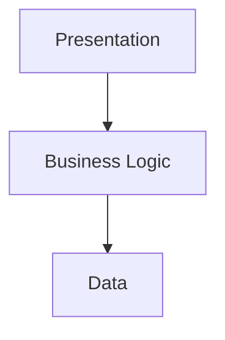

</div>

This is the three-tier model.

### DEFINITION

**Three-tier architecture** separates an application into presentation, business logic, and data tiers.

In Odoo, official architecture documentation describes this as browser-side presentation with HTML/JavaScript/CSS, Python for the logic tier, and PostgreSQL for the data tier.

### TIER 1: PRESENTATION

This is what the user interacts with.

Examples:

- forms,
- lists,
- buttons,
- menus,
- dashboards.

In Odoo, much of this presentation runs in the browser using web technologies.

Official Odoo documentation describes the presentation tier as using:

- HTML5,
- JavaScript,
- CSS.

### TIER 2: LOGIC

This tier decides what business operations actually mean.

Suppose the user presses:

**Confirm Sales Order.**

The server may need to determine:

- is the order valid?
- does the user have permission?
- which records must change?
- should another workflow be triggered?
- which business rules apply?

Odoo's server-side business logic is implemented primarily in Python. Official architecture documentation identifies Python as the logic tier.

### TIER 3: DATA

The system needs durable storage.

Examples:

- customer name,
- Sales Order,
- product,
- invoice,
- user,
- configuration.

Odoo uses PostgreSQL as its supported relational database system for its structured application data.

### OVERALL FLOW

A useful first mental model is:

<div align="center">

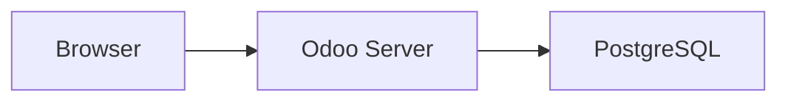

</div>

Chapter 4 makes that model richer:

<div align="center">

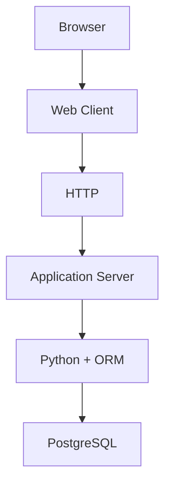

</div>

with addons, registry, sessions, filestore, workers, cron, and WebSockets surrounding that flow.

### WHY TIERS EXIST

Imagine everything were mixed into one giant piece of software.

The UI directly edited database tables.

Business rules lived in random browser scripts.

Database credentials were exposed to users.

The system would be:

- insecure,
- difficult to maintain,
- difficult to scale,
- tightly coupled.

Separation allows each layer to have a clear responsibility.


### EXAMPLE

Rami opens a Sales Order and presses **Confirm**.

Presentation shows the button and form. Logic decides validity, permissions, and which records change. Data persists the result in PostgreSQL.

The **Overall Flow** diagrams above show the same idea: browser to Odoo server to PostgreSQL, then the richer path through web client, HTTP, application server, Python, ORM, and supporting components.


### COMMON MISTAKE

A beginner may assume the entire Odoo application is running inside the browser because that is where the forms, buttons, and totals appear.

That confuses presentation with business logic and data. The three-tier model exists so each layer keeps a clear responsibility: the browser presents, the server decides, and PostgreSQL persists.

### RELEVANT RESOURCES

Here are the relevant resources for **4.1 THREE-TIERS ARCHITECTURE**:

> Topic resources will be added next in [Resources.md](Resources.md) (official Odoo 19.0 documentation and verified supporting materials).

---

## 4.2 BROWSER

### INTUITION

The browser is the user's client application.

Examples:

- Chrome,
- Edge,
- Firefox,
- Safari.

When a user visits:

`https://erp.example.com`

the browser does not connect directly to PostgreSQL.

That would be a serious architectural mistake.

Instead:

$$ \text{Browser} \rightarrow \text{Odoo HTTP Server} $$

### DEFINITION

The **browser** is the user's client application (Chrome, Edge, Firefox, Safari).

It displays UI, runs JavaScript, sends requests, and renders responses. It does not connect directly to PostgreSQL.

### BROWSER RESPONSIBILITIES

The browser can:

- display UI,
- execute JavaScript,
- send requests,
- receive responses,
- maintain browser-side state,
- render forms and views,
- react to user input.

But it should not independently decide authoritative business rules.

### EXAMPLE

Rami changes quantity from:

$$ 10 $$

to:

$$ 20 $$

The browser may immediately update what he sees.

But when the record is saved, authoritative server-side logic must process the operation.

### WHY THE SERVER MUST BE AUTHORITATIVE

Because browser code is under the user's control.

You cannot trust it as the final authority.


### COMMON MISTAKE

A beginner may believe the browser should talk directly to PostgreSQL.

Wrong.

$$ \text{Browser} \rightarrow \text{Odoo Server} \rightarrow \text{PostgreSQL} $$

The browser is under the user's control. Authoritative business rules and credentials must stay on the server.

### RELEVANT RESOURCES

Here are the relevant resources for **4.2 BROWSER**:

> Topic resources will be added next in [Resources.md](Resources.md) (official Odoo 19.0 documentation and verified supporting materials).

---

## 4.3 ODOO WEB CLIENT
### INTUITION

The browser is generic software.

The Odoo Web Client is the Odoo-specific application running inside that browser.

Current Odoo documentation describes the web client as a single-page application, available under `/web`. It requests only the information required rather than loading an entirely new HTML page after every user interaction.

### DEFINITION

The **Odoo Web Client** is the Odoo-specific application running inside the browser.

Current Odoo documentation describes it as a single-page application available under `/web`. It requests only the information required rather than loading an entirely new HTML page after every interaction.

### BROWSER VS WEB CLIENT

Do not confuse these.

| Term | Meaning |
| --- | --- |
| **Browser** | Chrome, Edge, Firefox, Safari |
| **Odoo Web Client** | The Odoo application loaded inside that browser |

Conceptually:

$$ \text{Chrome} \supset \text{Odoo Web Client} $$

### SINGLE-PAGE APPLICATION

Imagine opening Sales.

Then Inventory.

Then Contacts.

A traditional website might reload an entirely new page every time.

A SPA can instead update relevant portions of the interface dynamically.

Conceptually:

$$ \text{Initial Web Client} + \text{Data Requests} + \text{UI Updates} $$

instead of:

$$ \text{Full HTML Reload Every Action} $$

### ODOO'S FRONTEND

Current Odoo frontend architecture uses JavaScript and increasingly relies on Owl, Odoo's component framework. The framework documentation describes the web client as a single-page application and notes Owl as the modern component system.

We do not need to learn Owl yet.

That comes much later.

For Chapter 4 the important idea is:

The web client is the presentation/application layer that communicates with Odoo's server.


### EXAMPLE

Open Sales, then Inventory, then Contacts inside the Odoo Web Client.

The SPA updates the relevant interface portions through data requests instead of forcing a full HTML reload on every navigation action. The detailed SPA contrast appears in **Single-Page Application** above.


### COMMON MISTAKE

A beginner may treat the web client and the browser as the same thing.

No.

The browser hosts/runs the Odoo web client. Chrome is generic software. The Odoo Web Client is the Odoo-specific single-page application loaded inside that browser.

### RELEVANT RESOURCES

Here are the relevant resources for **4.3 ODOO WEB CLIENT**:

> Topic resources will be added next in [Resources.md](Resources.md) (official Odoo 19.0 documentation and verified supporting materials).

---

## 4.4 HTTP REQUEST

### INTUITION

Now Rami presses:

**Open Sales Order SO0052.**

How does the browser ask the server for information?

Through a network request.

### DEFINITION

An **HTTP request** is how the browser or web client asks the Odoo server to perform an operation or return information.

The server later returns a response. Odoo's web client commonly uses RPC-style requests over HTTP.

### REQUEST MENTAL MODEL

Think of an HTTP request as:

"Server, please perform this operation or give me this information."

The server later returns a response.

$$ \text{Client Request} \rightarrow \text{Server} \rightarrow \text{Response} $$

### REQUEST CONTENTS

Depending on the operation, a request may contain information such as:

- URL/path,
- method,
- headers,
- cookies/session data,
- parameters,
- payload.

### ODOO COMMUNICATION

Odoo's web client commonly communicates with the server through RPC-style requests over HTTP. Official Odoo documentation describes RPC as the standard way for the web client to communicate with the server, while lower-level HTTP services are also available.

A simplified flow is:

<div align="center">

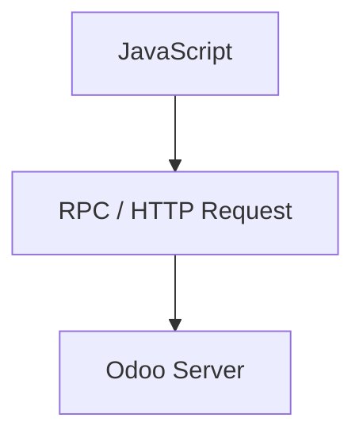

</div>

### EXAMPLE

The web client wants information about a Sales Order.

Conceptually:

**Read sales order 52**

The request reaches Odoo.

The server determines:

- database,
- user,
- permissions,
- model,
- requested operation.

Then the ORM may retrieve the data.


### COMMON MISTAKE

A beginner may think an HTTP request is only "opening a web page" and ignore that Odoo also uses RPC-style requests for model operations.

The important idea is continuity: the client asks, the server authenticates and decides, then the response returns. Skipping that mental model makes debugging much harder.

### RELEVANT RESOURCES

Here are the relevant resources for **4.4 HTTP REQUEST**:

> Topic resources will be added next in [Resources.md](Resources.md) (official Odoo 19.0 documentation and verified supporting materials).

---

## 4.5 ODOO APPLICATION SERVER
### INTUITION

This is the central backend process.

### DEFINITION

The **Odoo application server** is the central backend process that understands authentication, permissions, business rules, models, module extensions, and workflows.

PostgreSQL stores rows. The application server decides what those rows mean for the business.

### HOW THE SERVER FITS

The browser asks:

"Can I open this Sales Order?"

PostgreSQL knows stored rows.

But something needs to understand:

- authentication,
- permissions,
- business rules,
- Odoo models,
- module extensions,
- workflows.

That something is the Odoo application server.

### RESPONSIBILITIES

The server handles areas such as:

- HTTP request processing,
- authentication,
- session handling,
- model operations,
- permissions,
- business logic,
- ORM interaction,
- module loading,
- scheduled tasks,
- responses to the web client.

### WHY BROWSER TO POSTGRESQL DIRECTLY IS WRONG

Imagine:

$$ \text{Browser} \rightarrow \text{PostgreSQL} $$

Then the browser would need:

- database credentials,
- SQL knowledge,
- business logic,
- security rules.

Users could potentially bypass Odoo's application rules.

Instead:

<div align="center">

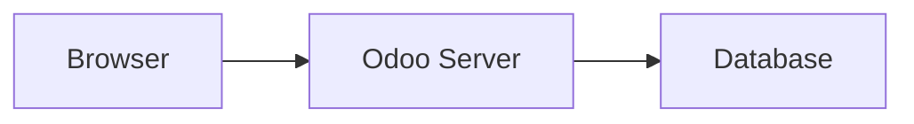

</div>

The server is the controlled business layer.


### EXAMPLE

A junior proposal to connect the browser directly to PostgreSQL fails the architecture test: credentials, business rules, and security enforcement would leave the controlled server path.

The concrete contrast is developed in **Why Browser to PostgreSQL Directly Is Wrong** above: browser must go through the Odoo application server before database access.


### COMMON MISTAKE

A beginner may propose connecting the frontend directly to the database to "make Odoo faster."

That would expose credentials, bypass business rules, weaken security enforcement, and couple the UI to raw schema. The application server is the controlled business layer between browser and database.

### RELEVANT RESOURCES

Here are the relevant resources for **4.5 ODOO APPLICATION SERVER**:

> Topic resources will be added next in [Resources.md](Resources.md) (official Odoo 19.0 documentation and verified supporting materials).

---

## 4.6 PYTHON RUNTIME
### INTUITION

Odoo's server-side logic runs in Python.

That means when Odoo loads:

- models,
- methods,
- business logic,
- custom addons,

Python executes that server code.

Official Odoo architecture documentation identifies Python as the logic tier.

### DEFINITION

The **Python runtime** executes Odoo's server-side logic: models, methods, business rules, and custom addons.

Official Odoo architecture documentation identifies Python as the logic tier.

### EXAMPLE

Imagine a custom rule:

Orders of **50,000 QAR or more** require approval.

The actual server-side implementation might eventually involve Python logic.

Conceptually:

<div align="center">

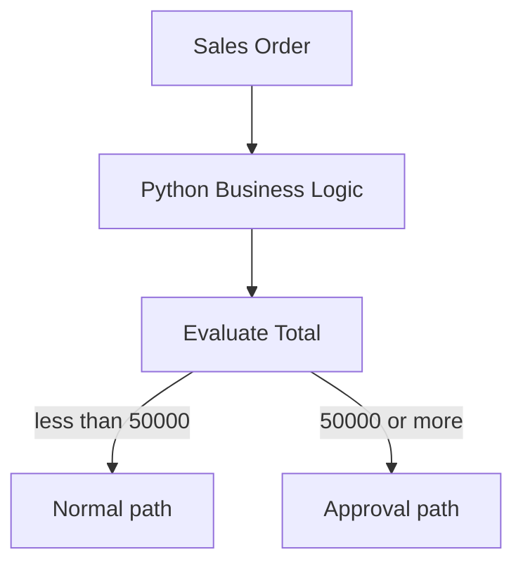

</div>

### PYTHON DOES NOT MEAN EVERYTHING IS PYTHON

Be careful.

Odoo also uses:

- JavaScript for frontend functionality,
- XML/data files for many definitions,
- PostgreSQL for persistence,
- web technologies for presentation.

The phrase:

"Odoo is written in Python"

is useful but incomplete.

A better model is:

| Layer | Primary technology |
| --- | --- |
| **Frontend** | HTML / CSS / JavaScript |
| **Server logic** | Python |
| **Structured data** | PostgreSQL |


### COMMON MISTAKE

A beginner may hear "Odoo is written in Python" and conclude that every part of Odoo is Python.

That is incomplete. Frontend work uses HTML/CSS/JavaScript. Persistence uses PostgreSQL. Many definitions use XML/data files. Python is the primary server-side logic tier, not the entire stack.

### RELEVANT RESOURCES

Here are the relevant resources for **4.6 PYTHON RUNTIME**:

> Topic resources will be added next in [Resources.md](Resources.md) (official Odoo 19.0 documentation and verified supporting materials).

---

## 4.7 ORM
### INTUITION

This is one of the most important ideas in the entire Odoo roadmap.

**ORM** means **Object-Relational Mapping**.

### DEFINITION

**ORM** means **Object-Relational Mapping**.

It lets application code work with models, fields, and recordsets instead of writing raw SQL for every operation. Official Odoo ORM documentation treats recordsets as the fundamental representation of records.

### START WITH THE PROBLEM

Suppose we want customer 42.

Without an ORM, application code might directly write SQL:

```sql
SELECT *
FROM res_partner
WHERE id = 42;
```

Direct SQL is sometimes useful, but imagine every Odoo operation were written manually like this.

Developers would constantly deal with:

- SQL,
- table names,
- joins,
- inserts,
- updates,
- type conversion,
- business model structure.

The ORM provides a higher-level abstraction.

### OBJECT-RELATIONAL MAPPING

Application code thinks in terms of:

$$ \text{Customer Record} $$

rather than only:

$$ \text{Database Row} $$

Odoo's ORM lets developers work with:

- models,
- fields,
- recordsets,
- relationships,
- create/search/write/unlink operations.

Official Odoo ORM documentation says model instances represent the models available for a database and that recordsets are the fundamental representation of records in the ORM.

### EXAMPLE

Eventually you may write something conceptually like:

```python
partner = self.env["res.partner"].browse(42)
```

instead of manually building SQL for every operation.

Do not worry about the syntax yet.

The important idea is:

<div align="center">

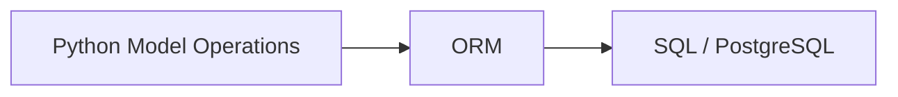

</div>

### ORM DOES MORE THAN SQL TRANSLATION

A good mental model is not:

ORM = automatic SQL generator.

It also participates in Odoo concepts such as:

- model definitions,
- recordsets,
- field behavior,
- relationships,
- computed behavior,
- environment/context,
- caching/prefetching,
- inheritance,
- access-related execution patterns.

We will spend an entire later unit mastering it.


### COMMON MISTAKE

A beginner may say "ORM is the database."

No.

The ORM is an abstraction layer used by application code to interact with persistent records. PostgreSQL remains the database. Confusing the two makes later debugging and performance work harder.

### RELEVANT RESOURCES

Here are the relevant resources for **4.7 ORM**:

> Topic resources will be added next in [Resources.md](Resources.md) (official Odoo 19.0 documentation and verified supporting materials).

---

## 4.8 POSTGRESQL
### INTUITION

PostgreSQL is Odoo's relational database management system.

Official Odoo architecture documentation identifies PostgreSQL as the data-tier RDBMS.

### DEFINITION

**PostgreSQL** is Odoo's relational database management system for structured application data.

Official architecture documentation identifies PostgreSQL as the data-tier RDBMS.

### WHAT POSTGRESQL STORES

Structured Odoo application data includes things such as:

- customers,
- products,
- Sales Orders,
- invoices,
- users,
- companies,
- configuration,
- relationships.

Conceptually:

$$ \text{Odoo Model} \leftrightarrow \text{Database Structures} $$

although the mapping is not always as simple as:

one model = one table in every case.

We'll learn the exceptions later.

### WHY POSTGRESQL EXISTS SEPARATELY FROM ODOO

Odoo application logic and database storage are different responsibilities.

If the Odoo Python process stops:

$$ \text{Application Server Down} $$

the database data does not simply disappear.

PostgreSQL is a separate persistence layer.

### TRANSACTIONS

Relational databases also provide transaction semantics.

Suppose a business operation changes several pieces of data.

You generally want:

$$ \text{All Changes Succeed} $$

or:

$$ \text{All Changes Roll Back} $$

rather than ending in a half-completed state.

Database transactions help make this possible.

We will study this more deeply later.


### EXAMPLE

If the Odoo Python process stops:

$$ \text{Application Server Down} $$

the database data does not simply disappear.

PostgreSQL is a separate persistence layer. Application logic and stored data have different responsibilities.


### COMMON MISTAKE

A beginner may assume that if the Odoo Python process stops, all business data disappears.

PostgreSQL is a separate persistence layer. Application logic and stored data have different responsibilities. Also, not every binary file byte necessarily lives only in ordinary table storage; the filestore may be involved.

### RELEVANT RESOURCES

Here are the relevant resources for **4.8 POSTGRESQL**:

> Topic resources will be added next in [Resources.md](Resources.md) (official Odoo 19.0 documentation and verified supporting materials).

---

## 4.9 FILESTORE
### INTUITION

Now comes a common beginner misconception:

"If Odoo uses PostgreSQL, every file must be stored inside PostgreSQL."

Not necessarily.

Odoo also has a filestore.

Official Odoo 19 documentation describes the filestore as holding database attachments and binary-field files in Odoo-managed environments.

### DEFINITION

The **filestore** holds database attachments and binary-field files in Odoo-managed environments.

Official Odoo 19 documentation distinguishes this filesystem-backed storage from ordinary relational table storage.

### WHY HAVE A FILESTORE?

Imagine users attach:

- PDFs,
- photographs,
- documents,
- scans.

Storing large binary objects in filesystem-backed storage can be preferable to putting all file bytes directly into ordinary relational table storage.

### DATABASE + FILESTORE RELATIONSHIP

Conceptually:

**PostgreSQL** may contain:

- metadata,
- records,
- references,
- permissions,
- attachment information.

While the **filestore** may contain the actual binary file content.

### IMPORTANT BACKUP IMPLICATION

A database backup alone may not represent the entire Odoo state if the associated filestore is omitted.

Official Odoo tooling explicitly distinguishes database dumps that include or exclude the filestore, which reinforces that they are separate pieces of the application's persisted state.

Therefore:

$$ \text{Reliable Odoo Backup} \approx \text{Database} + \text{Relevant Filestore} $$

depending on the deployment configuration.

### EXAMPLE

Imagine PostgreSQL is restored but the corresponding filestore is lost.

The database may still contain attachment references.

But the actual files may no longer exist.

This is why architecture knowledge affects disaster recovery.


### COMMON MISTAKE

A beginner may assume every file must be stored inside PostgreSQL because Odoo uses PostgreSQL.

Not necessarily. Attachments and binary-field files can involve the filestore. A database-only restore can leave attachment references without the actual files.

### RELEVANT RESOURCES

Here are the relevant resources for **4.9 FILESTORE**:

> Topic resources will be added next in [Resources.md](Resources.md) (official Odoo 19.0 documentation and verified supporting materials).

---

## 4.10 ADDONS
### INTUITION

We already learned modules/addons functionally in Unit I.

Now we locate them architecturally.

### DEFINITION

**Addons** (modules) package Odoo functionality into discoverable directories on the addons path.

When installed, an addon can contribute models, fields, Python methods, views, security, data, assets, and controllers.

### PACKAGING FUNCTIONALITY

The base Odoo platform does not contain every possible behavior as one giant file.

Functionality is packaged into modules/addons.

Examples conceptually include:

- Sales,
- CRM,
- Inventory,
- custom approval module.

### ADDON PATH

Odoo searches configured addon directories to discover modules.

The official architecture tutorial states that modules live within module directories and that these directories are configured through the addons path.

Conceptually:

```text
addons/
    sale/
    purchase/
    stock/
    crm/
custom_addons/
    nova_order_gate/
```

### WHY ADDONS MATTER ARCHITECTURALLY

When a module is installed, it can contribute:

- models,
- fields,
- Python methods,
- views,
- security,
- data,
- assets,
- controllers.

So the effective Odoo application is built by composing modules.

$$ \text{Odoo Runtime} = \text{Core} + \text{Installed Addons} $$


### EXAMPLE

A custom module such as `nova_order_gate` lives under a custom addons directory.

Odoo discovers it through the addons path, loads its Python definitions, and contributes them to the runtime:

$$ \text{Odoo Runtime} = \text{Core} + \text{Installed Addons} $$


### COMMON MISTAKE

A beginner may think an addon is only a visual plugin.

No. An addon can contribute Python, models, views, data, security, assets, controllers, and business behavior. Installed addons help compose the effective Odoo runtime.

### RELEVANT RESOURCES

Here are the relevant resources for **4.10 ADDONS**:

> Topic resources will be added next in [Resources.md](Resources.md) (official Odoo 19.0 documentation and verified supporting materials).

---

## 4.11 REGISTRY
### INTUITION

This is a more subtle concept.

### DEFINITION

The **registry** is the loaded model universe for a database: the effective models and extensions available at runtime.

Odoo builds it from installed modules' Python definitions and inheritance. It is not the PostgreSQL database itself.

### HOW THE REGISTRY APPEARS

Suppose the database has these modules installed:

- base,
- contacts,
- sale,
- stock,
- custom_sales_approval.

Each module may define or extend models.

For example, several modules might extend the same Sales Order model.

How does Odoo know the final effective model that should exist?

This is where the server-side registry concept becomes important.

### REGISTRY MENTAL MODEL

Think:

$$ \text{Registry} = \text{Loaded Model Universe for a Database} $$

Odoo's ORM documentation explains that models are instantiated per database and that the actual model class is constructed from the Python classes that create and inherit from that model, depending on modules installed in that database.

### WHY "PER DATABASE" MATTERS

Imagine Database A has:

- Sales,
- Inventory.

Database B has:

- Sales,
- Manufacturing,
- a custom module.

Their effective set of models and extensions may differ.

Therefore their runtime model registries are not conceptually identical.

### SIMPLIFIED BUILD PROCESS

<div align="center">

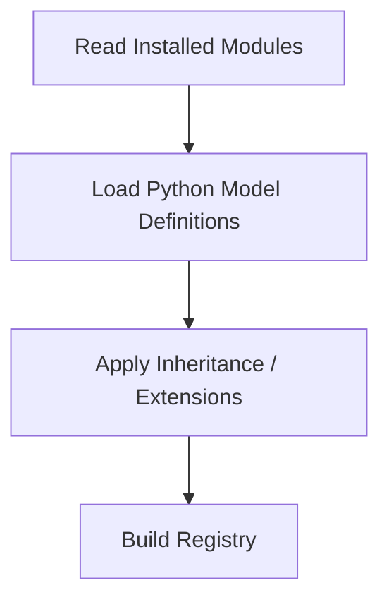

</div>

Then requests can use the resulting models.

### EXAMPLE

Base Sales defines:

`sale.order`

Custom addon extends:

`sale.order`

The registry exposes the final effective model containing the combined behavior according to Odoo's inheritance system.

This is one reason you can extend Odoo without rewriting the original Sales module.

### REGISTRY IS NOT THE POSTGRESQL DATABASE

Do not confuse:

| Concept | Role |
| --- | --- |
| **Registry** | Runtime loaded model structures and behavior |
| **Database** | Persistent stored data |

The database stores persistent data.

The registry represents loaded model structures/behavior available to the runtime.


### COMMON MISTAKE

A beginner may think the registry is a database table.

No. The registry is part of the runtime model-loading architecture: the loaded model universe for a database. The database stores persistent data; the registry exposes effective model behavior after modules and extensions are combined.

### RELEVANT RESOURCES

Here are the relevant resources for **4.11 REGISTRY**:

> Topic resources will be added next in [Resources.md](Resources.md) (official Odoo 19.0 documentation and verified supporting materials).

---

## 4.12 HTTP LAYER
### INTUITION

Earlier we discussed an HTTP request from the browser's perspective.

Now we examine the server side.

### DEFINITION

The **HTTP layer** receives incoming web requests and determines route, authentication, parameters, session, database context, and response format.

Odoo documents routes with `odoo.http.Controller` and `route()`.

### HTTP LAYER RESPONSIBILITY

The HTTP layer receives incoming web requests and determines:

- which route should handle them,
- authentication requirements,
- request parameters,
- session information,
- database context,
- response format.

Odoo's current web controller documentation describes routes implemented with `odoo.http.Controller` and `route()`, with authentication modes and request handling provided by the HTTP framework.

### CONTROLLER ROUTING

Imagine:

`GET /some/path`

or an RPC request.

Something must map that URL to Python code.

That mapping is routing.

Conceptually:

$$ \text{URL} \rightarrow \text{Route} \rightarrow \text{Controller/Dispatcher} \rightarrow \text{Python Logic} $$

### AUTHENTICATION

Some routes may require:

- authenticated users,
- public access,
- bearer/API authentication,
- no database context.

Odoo's current route system supports different authentication modes including user, bearer, public, and none.

We will learn controller implementation later.

For now:

HTTP is the gateway by which browser/API traffic reaches Odoo's server logic.


### EXAMPLE

A browser RPC call or `GET /some/path` must be mapped to Python code through routing.

That gateway behavior is the HTTP layer's job: choose the route, apply authentication, attach session and database context, then dispatch into server logic. See **Controller Routing** above for the mapping pattern.


### COMMON MISTAKE

A beginner may ignore the HTTP layer and treat every failure as either "browser broken" or "database broken."

The HTTP layer is the gateway: routing, authentication mode, session, database context, and response format. Many request failures begin there before ORM or SQL ever run.

### RELEVANT RESOURCES

Here are the relevant resources for **4.12 HTTP LAYER**:

> Topic resources will be added next in [Resources.md](Resources.md) (official Odoo 19.0 documentation and verified supporting materials).

---

## 4.13 SESSIONS
### INTUITION

Imagine Rami logs into Odoo.

Then he opens:

- Sales,
- Inventory,
- Contacts.

Should he enter his username/password for every request?

No.

The application needs continuity.

That is part of what sessions provide.

### DEFINITION

A **session** links several requests to the same ongoing authenticated user interaction.

It helps retain identity and session-specific state so the user is not asked to log in on every navigation action.

### SESSION MENTAL MODEL

A session allows several requests to be associated with the same ongoing user interaction.

Conceptually:

$$ R_1, R_2, R_3, \dots, R_n $$

can be linked to one session.

### WHAT THE SESSION HELPS RETAIN

Examples can include:

- authenticated identity,
- user-related context,
- session-specific state.

Current Odoo documentation describes session information made available to the web client, and the HTTP API includes session-saving behavior around requests.

Odoo.sh documentation also shows a separate sessions directory alongside the filestore in its environment structure.

### SESSION IS NOT USER

Important distinction:

$$ \text{User} \neq \text{Session} $$

A user is an account/identity.

A session is one authenticated interaction context.

One user might have several simultaneous sessions from:

- laptop,
- tablet,
- another browser.


### EXAMPLE

Rami logs into Odoo, then opens Sales, Inventory, and Contacts.

He should not enter username and password for every request.

Several requests:

$$ R_1, R_2, R_3, \dots, R_n $$

can be linked to one session that preserves authenticated identity and interaction context.


### COMMON MISTAKE

A beginner may confuse user and session.

$$ \\text{User} \\neq \\text{Session} $$

A user is an account/identity. A session is one authenticated interaction context. One user can have several sessions from laptop, tablet, or another browser.

### RELEVANT RESOURCES

Here are the relevant resources for **4.13 SESSIONS**:

> Topic resources will be added next in [Resources.md](Resources.md) (official Odoo 19.0 documentation and verified supporting materials).

---

## 4.14 WORKERS
### INTUITION

Now architecture becomes operational.

Imagine one Odoo server receiving requests from:

$$ 500 \text{ users} $$

The system needs mechanisms for processing concurrent work.

That brings us to workers.

### DEFINITION

A **worker** is a server execution process that handles work such as interactive HTTP requests.

Production Odoo commonly uses a multi-process worker pool configured through `workers`.

### WORKER MENTAL MODEL

A worker is a server execution process that handles work.

Think of a restaurant.

Requests arrive like orders.

Workers process them.

$$ \text{Request Queue} \rightarrow \text{Workers} \rightarrow \text{Responses} $$

### DEVELOPMENT MODE VS PRODUCTION MODE

Current Odoo documentation distinguishes:

| Mode | Purpose |
| --- | --- |
| **Multi-threaded server** | Primarily for development/demo and broad OS compatibility |
| **Multi-process server** | Designed primarily for production; creates a pool of worker processes |

The multi-process server is enabled using the `workers` configuration.

### WHY MULTIPLE PROCESSES?

Python has a Global Interpreter Lock in the standard CPython runtime, which limits CPU execution of Python bytecode within a single process.

Using several worker processes allows Odoo to make better use of multi-core systems.

Odoo's deployment documentation explicitly notes this as a reason its multi-processing mode is preferred for production.

### EXAMPLE

Suppose:

- $$ W_1 $$ handles Rami's Sales request.
- $$ W_2 $$ handles Lina's Purchase request.
- $$ W_3 $$ handles Noor's Accounting request.

The users don't need to wait for every other user request to finish sequentially.

### WORKER DOES NOT EQUAL USER

Do not imagine:

one worker = permanently assigned to one user.

Workers process requests.

A given user's later request may be handled by another available worker.

Therefore important persistent state should not simply live only in local memory of one worker.


### COMMON MISTAKE

A beginner may imagine one worker permanently belongs to one user.

No. Workers process requests. A later request from the same user may be handled by another available worker. Important persistent state should not live only in one worker's local memory.

### RELEVANT RESOURCES

Here are the relevant resources for **4.14 WORKERS**:

> Topic resources will be added next in [Resources.md](Resources.md) (official Odoo 19.0 documentation and verified supporting materials).

---

## 4.15 CRON WORKERS
### INTUITION

Not every operation is caused by a human clicking a button.

Some work happens automatically on a schedule.

This is where cron enters.

### DEFINITION

A **cron worker** handles scheduled jobs rather than ordinary interactive user requests.

Current Odoo deployment documentation describes dedicated cron workers/threads and `max_cron_threads`.

### WHY BACKGROUND WORK EXISTS

Suppose the system needs to:

- send reminders,
- execute scheduled jobs,
- process recurring automation,
- clean old temporary data.

No user may be online at that exact moment.

Odoo needs background scheduled execution.

### CRON WORKER CONCEPT

A cron worker handles scheduled jobs rather than ordinary interactive user requests.

Conceptually:

<div align="center">

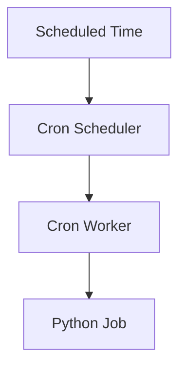

</div>

### WHY SEPARATE IT CONCEPTUALLY?

Interactive requests and scheduled jobs are different workloads.

You don't want a long background operation to unnecessarily block every browser request.

Current Odoo deployment documentation describes dedicated cron workers/threads and configuration through `max_cron_threads`.

### EXAMPLE

Every night at 02:00:

$$ \text{Scheduled Action} \rightarrow \text{Generate Report} $$

or:

$$ \text{Scheduled Action} \rightarrow \text{Process Pending Records} $$

The browser doesn't need to initiate these operations.


### COMMON MISTAKE

A beginner may assume cron jobs are triggered by browser clicks.

Not necessarily. Cron work is scheduled/background work. It should not depend on a salesperson keeping a browser open.

### RELEVANT RESOURCES

Here are the relevant resources for **4.15 CRON WORKERS**:

> Topic resources will be added next in [Resources.md](Resources.md) (official Odoo 19.0 documentation and verified supporting materials).

---

## 4.16 LONG-POLLING / WEBSOCKET CONCEPTS
### INTUITION

This final section deals with server-to-client communication that may need to remain responsive over time.

### DEFINITION

**Long polling** and **WebSockets** are communication concepts for keeping the client updated without forcing a full manual refresh.

Current Odoo 19 deployment documentation describes WebSocket traffic under `/websocket/` and a dedicated gevent/live-chat worker.

### ORDINARY HTTP PROBLEM

Normal request:

<div align="center">

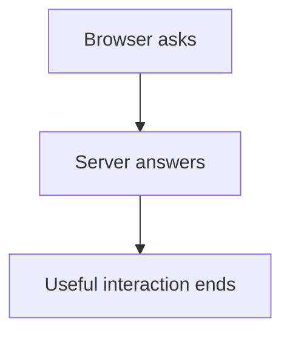

</div>

But imagine the server wants to tell the browser:

Another user sent a message.

or:

A live notification just occurred.

The browser shouldn't necessarily wait until the user manually refreshes.

### POLLING

One simple solution is:

$$ \text{Browser asks every few seconds: any new events?} $$

Problem:

Many unnecessary requests.

### LONG POLLING

Long polling improves this.

The client sends a request.

The server keeps it open until:

- new information appears,
- or a timeout occurs.

Then the client reconnects.

Conceptually:

$$ \text{Client Request} \rightarrow \text{Wait} \rightarrow \text{Event} \rightarrow \text{Response} $$

### WEBSOCKET

WebSockets provide a more persistent bidirectional channel.

After connection establishment:

$$ \text{Browser} \leftrightarrow \text{Server} $$

can remain open.

Either side can communicate without creating an entirely new request cycle for every event.

### CURRENT ODOO IMPLEMENTATION NOTE

The roadmap deliberately says:

**Long-Polling / WebSocket Concepts.**

That is useful because older Odoo architecture discussions often use the long-polling terminology.

Current Odoo 19 deployment documentation describes WebSocket traffic under `/websocket/` and a dedicated gevent/live-chat worker in multi-process deployments, with the gevent port configurable separately.

So the historical conceptual progression is useful:

$$ \text{Polling} \rightarrow \text{Long Polling} \rightarrow \text{Persistent WebSocket Communication} $$

But for current Odoo deployment work, you should pay attention to its WebSocket configuration.

### WHY SPECIAL WORKERS HELP

WebSocket connections can remain open for a long time.

Imagine:

$$ 10{,}000 $$

long-lived connections.

You don't want each connection consuming a heavyweight ordinary request worker unnecessarily.

Event-oriented servers such as gevent are better suited for handling many such waiting connections.

Current Odoo production documentation therefore separates ordinary HTTP workers from the event-driven live/WebSocket worker in multi-process deployments.


### EXAMPLE

Lina needs a notification when another user performs an action.

Ordinary HTTP follows request then response, then the useful interaction ends.

Without a longer-lived channel, the browser would have to ask repeatedly or wait for a manual refresh. Long polling and WebSockets exist to keep that communication responsive.


### COMMON MISTAKE

A beginner may say "WebSocket is just faster HTTP."

Not really. It provides a different persistent communication model. Ordinary screens can work while the WebSocket/event path fails, because they are not the same architectural lane.

### RELEVANT RESOURCES

Here are the relevant resources for **4.16 LONG-POLLING / WEBSOCKET CONCEPTS**:

> Topic resources will be added next in [Resources.md](Resources.md) (official Odoo 19.0 documentation and verified supporting materials).

---

## PUTTING CHAPTER 4 TOGETHER

We can now trace a real user request.

Rami opens Sales Order **SO0052**.

### STEP 1: BROWSER

Chrome is running.

### STEP 2: ODOO WEB CLIENT

The Odoo JavaScript application detects that Rami wants SO0052.

### STEP 3: HTTP/RPC

The client sends a request.

$$ \text{Browser} \rightarrow \text{HTTP} \rightarrow \text{Odoo} $$

### STEP 4: HTTP LAYER

Odoo determines:

- route/request type,
- session,
- database,
- user context.

### STEP 5: WORKER

An available server worker processes the request.

### STEP 6: PYTHON RUNTIME

Odoo server code executes.

### STEP 7: REGISTRY

The server uses the model definitions loaded for that database.

It knows what `sale.order` means after installed modules/extensions have been combined.

### STEP 8: ORM

The Python layer requests:

Retrieve Sales Order 52.

The ORM handles model-level access to persistent data.

### STEP 9: POSTGRESQL

The required structured data is retrieved.

### STEP 10: FILESTORE IF NECESSARY

If the order references attachments such as:

- customer PO PDF,
- scanned document,

the actual binary file may come from Odoo's file storage system.

### STEP 11: RESPONSE

The server sends data back.

### STEP 12: WEB CLIENT

The JavaScript application renders the form.

Rami sees:

**SO0052**

---

## FULL ARCHITECTURE MODEL

<div align="center">

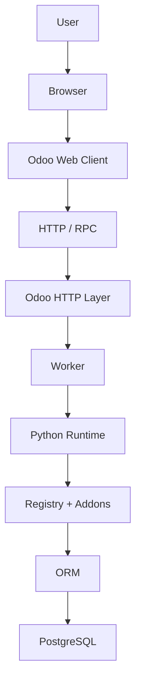

</div>

Supporting pieces around that main path:

| Component | Role |
| --- | --- |
| **Filestore** | Binary attachment content |
| **Sessions** | Request continuity for a logged-in interaction |
| **Cron workers** | Scheduled background work |
| **WebSocket / event worker** | Long-lived live communication |

---

## COMMON CHAPTER 4 MISTAKES

Each topic above already includes a **Common Mistake** for that layer. This section gathers the chapter-level mistakes in one place for review.


### MISTAKE 1

"The browser talks directly to PostgreSQL."

Wrong.

$$ \text{Browser} \rightarrow \text{Odoo Server} \rightarrow \text{PostgreSQL} $$

### MISTAKE 2

"The web client and browser are the same thing."

No.

The browser hosts/runs the Odoo web client.

### MISTAKE 3

"ORM is the database."

No.

The ORM is an abstraction layer used by application code to interact with persistent records.

### MISTAKE 4

"Everything is stored in PostgreSQL."

Not necessarily.

Attachments/binary files can involve the filestore.

### MISTAKE 5

"An addon is only a visual plugin."

No.

An addon can contribute:

- Python,
- models,
- views,
- data,
- security,
- assets,
- controllers,
- business behavior.

### MISTAKE 6

"The registry is a table."

No.

It is part of the runtime model-loading architecture.

### MISTAKE 7

"A worker belongs to one user."

No.

Workers process requests.

### MISTAKE 8

"Cron jobs are triggered by browser clicks."

Not necessarily.

They are scheduled/background work.

### MISTAKE 9

"WebSocket is just faster HTTP."

Not really.

It provides a different persistent communication model.

---

## CHAPTER 4 SUMMARY

Chapter 4 moved us from:

$$ \text{What Odoo does} $$

to:

$$ \text{How Odoo operates internally} $$

The fundamental architecture is:

$$ \text{Presentation} \rightarrow \text{Business Logic} \rightarrow \text{Data} $$

In Odoo this becomes approximately:

$$ \text{Browser/Web Client} \rightarrow \text{Python Odoo Server} \rightarrow \text{PostgreSQL} $$

But a realistic Odoo system also depends on:

- HTTP,
- sessions,
- ORM,
- addons,
- registry,
- filestore,
- HTTP workers,
- cron workers,
- WebSocket/event handling.

The single most important mental model is:

$$ \text{User Action} \rightarrow \text{Request} \rightarrow \text{Server Logic} \rightarrow \text{ORM} \rightarrow \text{Data} \rightarrow \text{Response} $$

This model will make the next several chapters much easier.

Work through the **[Chapter 4 Exercise](Exercise.md)** and **[Chapter 4 Project](Project.md)** next. Resources for this chapter will be added in [Resources.md](Resources.md).

**Up next after Chapter 4:** Chapter 5, Development Environment, where you create a real setup you can run, inspect, and debug.
