# UNIT II: HOW ODOO ACTUALLY WORKS

## CHAPTER 4: ODOO ARCHITECTURE

This chapter explains how an Odoo request moves from the browser to durable storage and back. References use Odoo 19.0 as the teaching baseline. Official architecture documentation describes Odoo as a multitier application: browser-side presentation with HTML/JavaScript/CSS, Python for the logic tier, and PostgreSQL for the data tier.

Picture Nova Retail on an ordinary morning. Rami opens Sales Order **SO0052** for a customer who needs stock tomorrow. Lina is already purchasing replenishment. Noor is reviewing invoice readiness. On the screen, Odoo looks like one calm application. Underneath, several software layers must cooperate, or the company sees contradictory stock, blocked confirmations, or missing attachments.

Unit I answered what business Odoo models. Unit II asks how the software makes those processes work. This chapter develops architecture understanding through layer boundaries, request handoffs, persistent state locations, and observable failure evidence. Worked traces use illustrative references such as SO0052; they are teaching models, not production diagnostics.

**Starting-point check:** You should already understand business processes, departments, and application flow from Unit I. You do not need a local Odoo install yet. Chapter 4 stays conceptual so you can name each layer and the evidence it leaves before Chapter 5 builds a development environment.

A useful habit while reading: after every section, invent one Nova Retail failure and ask which layer would own the first useful log line. If you cannot invent that failure, reread the section before continuing.

This chapter is deliberately evidence-oriented. You are not collecting slogans. You are learning where to look when SO0052, `nova_order_gate`, overnight jobs, or live notifications misbehave. That habit will matter more than any single diagram once Chapter 5 gives you a machine you can inspect.

**How to read Chapter 4:** treat each section as one room in the same building. INTUITION shows the room through a Nova Retail scene. DEFINITION names it. EXAMPLE walks one concrete case with caveats. COMMON MISTAKE shows the usual wrong door. RELEVANT RESOURCES keep official docs and videos attached to that room so you can go deeper without losing the map.

---

## CHAPTER 4 TABLE OF CONTENTS

- [**4.1** Three-Tiers Architecture](#41-three-tiers-architecture)
- [**4.2** Browser](#42-browser)
- [**4.3** Odoo Web Client](#43-odoo-web-client)
- [**4.4** HTTP Request](#44-http-request)
- [**4.5** Odoo Application Server](#45-odoo-application-server)
- [**4.6** Python Runtime](#46-python-runtime)
- [**4.7** ORM](#47-orm)
- [**4.8** PostgreSQL](#48-postgresql)
- [**4.9** Filestore](#49-filestore)
- [**4.10** Addons](#410-addons)
- [**4.11** Registry](#411-registry)
- [**4.12** HTTP Layer](#412-http-layer)
- [**4.13** Sessions](#413-sessions)
- [**4.14** Workers](#414-workers)
- [**4.15** Cron Workers](#415-cron-workers)
- [**4.16** Long-Polling / WebSocket Concepts](#416-long-polling--websocket-concepts)
- [Bringing All of Chapter 4 Together](#bringing-all-of-chapter-4-together)
- [Full Architecture Model](#full-architecture-model)
- [Common Beginner Mistakes in Chapter 4](#common-beginner-mistakes-in-chapter-4)
- [Chapter 4 Mastery Check](#chapter-4-mastery-check)
- [Chapter 4 Summary](#chapter-4-summary)
- [**Free Learning Resources**](Resources.md)

**Then we will complete:**

- [Free Learning Resources](Resources.md)
- [Chapter Exercise](Exercise.md)
- [Chapter Project](Project.md)

---

## 4.1 THREE-TIERS ARCHITECTURE

### INTUITION

When you use Odoo, everything does not happen inside your browser.

Suppose Rami opens Sales Order **SO0052** at Nova Retail. He sees buttons, fields, tables, and totals. The screen is calm. The customer name is visible. The Confirm button looks ready.

It can feel as though the entire application is running on his laptop.

But it is not.

Different responsibilities live in different places. The browser shows the form. The server decides what Confirm means. The database keeps the durable facts. If you collapse those responsibilities into one vague idea called "Odoo," debugging becomes superstition.

The simplest architecture is:

<div align="center">

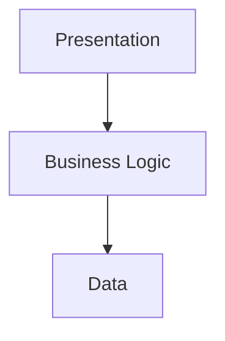

</div>

This is the three-tier model. Chapter 4 keeps returning to it because almost every later component is a refinement of one of these three jobs.

### DEFINITION

**Three-tier architecture** separates an application into presentation, business logic, and data tiers.

In Odoo, official architecture documentation describes this as browser-side presentation with HTML/JavaScript/CSS, Python for the logic tier, and PostgreSQL for the data tier.

The separation is conceptual and practical. Conceptual, because each tier answers a different question. Practical, because failures leave evidence in different places.

### TIER 1: PRESENTATION

This is what the user interacts with: forms, lists, buttons, menus, and dashboards.

In Odoo, much of this presentation runs in the browser using web technologies. Official Odoo documentation describes the presentation tier as using HTML5, JavaScript, and CSS.

Presentation makes work usable. It does not, by itself, make work authoritative. A disabled-looking button can be a usability choice. A server refusal is a business decision. Those are not the same event.

### TIER 2: LOGIC

This tier decides what business operations actually mean.

Suppose Rami presses **Confirm Sales Order** on SO0052.

The server may need to determine whether the order is valid, whether the user has permission, which records must change, whether another workflow should be triggered, and which business rules apply. At Nova Retail, a module such as `nova_order_gate` may add more of those rules.

Odoo's server-side business logic is implemented primarily in Python. Official architecture documentation identifies Python as the logic tier.

### TIER 3: DATA

The system needs durable storage for customer names, Sales Orders, products, invoices, users, and configuration.

Odoo uses PostgreSQL as its supported relational database system for its structured application data.

If presentation is unavailable, users cannot work. If logic is wrong, users can work incorrectly. If data is lost, the company loses memory. Those are different severities, and architecture helps you tell them apart.

### OVERALL FLOW

A useful first mental model is:

<div align="center">

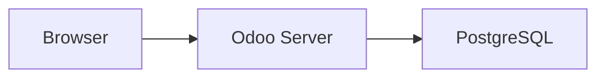

</div>

Chapter 4 makes that model richer:

<div align="center">

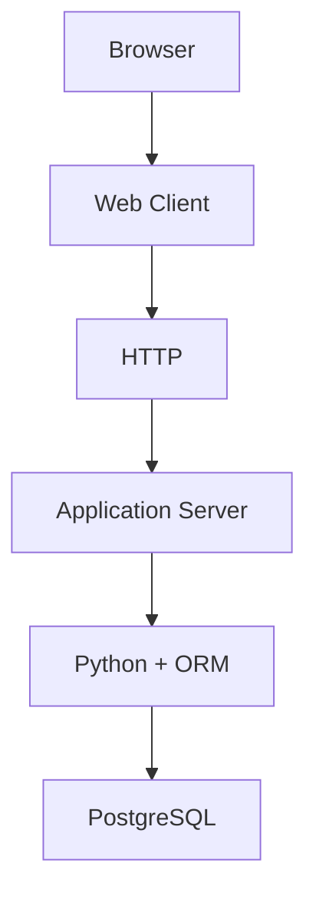

</div>

with addons, registry, sessions, filestore, workers, cron, and WebSockets surrounding that flow. Do not treat the richer diagram as a replacement for three tiers. Treat it as the same idea with more named rooms.

### WHY TIERS EXIST

Imagine everything were mixed into one giant piece of software.

The UI directly edited database tables. Business rules lived in random browser scripts. Database credentials were exposed to users.

The system would be insecure, difficult to maintain, difficult to scale, and tightly coupled. A small UI change could break storage. A storage change could break every screen. Debugging would mean searching one tangled pile for every failure.

Separation allows each layer to have a clear responsibility. Presentation can evolve without rewriting business rules. Business rules can change without exposing the database. The database can be backed up and restored without knowing how buttons are styled.

### WHY THIS MATTERS FOR AN ODOO DEVELOPER

When Nova Retail asks you to "fix Confirm on SO0052," the first useful question is not "which button color is wrong?" It is "which tier owns the failure?"

If the button never appears, the problem may be presentation or security on the view. If the button appears but confirmation is refused, the problem is usually server logic. If confirmation succeeds on screen but tomorrow's report still shows draft, the problem may be persistence, workers, or a later job that never ran.

An Odoo developer who can place a bug in the correct tier wastes less time rewriting the wrong layer. Custom modules such as `nova_order_gate` almost always live in the logic tier, even when the user only notices a message on the form.

### EXAMPLE

At Nova Retail, Rami opens Sales Order **SO0052** and presses **Confirm**.

Presentation shows the button and form. That is Tier 1. The Odoo application server decides validity, permissions, credit checks, and which related records must change. That is Tier 2. PostgreSQL stores the confirmed state and related structured data. That is Tier 3.

Caveat: real confirmations may also create stock moves, accounting drafts, or chatter messages. Those side effects still travel through the same three tiers. They are not proof that the browser itself wrote warehouse rows.

Wrong thinking:

> "Rami confirmed in Chrome, so Chrome updated the database."

Right thinking:

> "Chrome presented Confirm. The Odoo server applied business rules. PostgreSQL stored the durable result."

The **Overall Flow** diagrams above show the same idea: browser to Odoo server to PostgreSQL, then the richer path through web client, HTTP, application server, Python, ORM, and supporting components.


### DIAGNOSTIC SCENE

Lina messages the developer channel: "SO0052 Confirm does nothing."

Before changing code, place the complaint on the three-tier map. Does the button render? Does a request leave the browser? Does the server refuse? Does PostgreSQL retain draft state? Each answer points to a different repair. Architecture turns panic into sequencing.

### COMMON MISTAKE

A beginner may assume the entire Odoo application is running inside the browser because that is where the forms, buttons, and totals appear.

That confuses presentation with business logic and data.

**Wrong:** Odoo equals the web page you see.

**Correct:** The three-tier model exists so each layer keeps a clear responsibility. The browser presents. The server decides. PostgreSQL persists structured business data.

### RELEVANT RESOURCES

Here are the relevant resources for **4.1 THREE-TIERS ARCHITECTURE**:


### 1. ODOO ARCHITECTURE EXPLAINED: THREE-TIERS (ODOO 19)

| | |
|---|---|
| **Source** | Community technical channel (Odoo with Vinay) |
| **Reinforces** | **Presentation → Logic → Data** |

<div align="center">

[](https://www.youtube.com/watch?v=PKMgbCSneyg)

**Watch on YouTube:** [Odoo Architecture Explained | Three-Tiers Architecture in Odoo 19](https://www.youtube.com/watch?v=PKMgbCSneyg)

</div>

---

### 2. ODOO TECHNICAL TRAINING PART 1: ARCHITECTURE AND EDITIONS

| | |
|---|---|
| **Source** | Community technical channel (Odoo Tech) |
| **Version note** | Titled for Odoo 18; use with Odoo 19.0 official docs as the authority |

<div align="center">

[](https://www.youtube.com/watch?v=O8ij3ZF-UyQ)

**Watch on YouTube:** [Odoo 18 Technical Training Part 1 | Architecture | Editions](https://www.youtube.com/watch?v=O8ij3ZF-UyQ)

</div>

---

### OFFICIAL DOCUMENTATION

| Topic | Documentation |
|---|---|
| **Architecture overview** | [Chapter 1: Architecture Overview (Odoo 19)](https://www.odoo.com/documentation/19.0/developer/tutorials/server_framework_101/01_architecture.html) |

Full chapter index: [Resources.md](Resources.md)

---

## 4.2 BROWSER

### INTUITION

Rami sits at Nova Retail with Chrome open. He types the company ERP URL and waits for the login screen. From his point of view, Odoo "lives" in that browser window.

The browser is only the user's client application. Chrome, Edge, Firefox, and Safari are common examples. They are general-purpose programs. They do not understand Nova Retail's credit rules, stock reservation policy, or who may confirm SO0052.

When a user visits:

`https://erp.example.com`

the browser does not connect directly to PostgreSQL.

That would be a serious architectural mistake. Database credentials would sit on every laptop. Anyone who could open DevTools could attempt raw queries. Business rules would become optional.

Instead:

$$ \text{Browser} \rightarrow \text{Odoo HTTP Server} $$

### DEFINITION

The **browser** is the user's client application (Chrome, Edge, Firefox, Safari).

It displays UI, runs JavaScript, sends requests, and renders responses. It does not connect directly to PostgreSQL.

That sentence is short on purpose. Many architecture accidents begin when a team quietly contradicts it under deadline pressure.

### BROWSER RESPONSIBILITIES

The browser can display UI, execute JavaScript, send requests, receive responses, keep short-lived client-side state, render forms and views, and react to user input. Those capabilities make the interface feel fast.

But it should not independently decide authoritative business rules. Local validation can improve usability. Server validation remains the authority. If Rami's browser says a quantity looks fine while the server refuses it, the server wins.

### EXAMPLE

Rami changes quantity on SO0052 from:

$$ 10 $$

to:

$$ 20 $$

The browser may immediately update what he sees. Totals may recompute on screen. That responsiveness is useful.

But when the record is saved, authoritative server-side logic must process the operation. Permissions are checked. Constraints run. Related records may change. Only then is the new quantity durable for Lina's purchasing view and Noor's reporting.

Caveat: client-side JavaScript can be altered, blocked, or outdated. Never treat a browser-only check as the company's final policy.

### WHY THE SERVER MUST BE AUTHORITATIVE

Because browser code is under the user's control.

You cannot trust it as the final authority. A skilled user, a malicious script, or a buggy browser extension can change client behavior. Odoo architecture therefore keeps credentials, access rights, and business enforcement on the server path.

### WHY THIS MATTERS FOR AN ODOO DEVELOPER

When a Nova Retail user reports "the form allowed it, but save failed," that is often correct architecture, not a random glitch. The browser offered a friendly preview. The server enforced the real rule.

If you implement `nova_order_gate` only as JavaScript that hides a button, a determined user may still call the server operation another way. Put authoritative gates in server logic. Use the browser to communicate outcomes clearly.


### DIAGNOSTIC SCENE

A well-meaning intern proposes storing database credentials in frontend config "just for the internal warehouse tablets."

Architecture says no. Internal users are still users. Tablets are still clients under somebody's control. The browser remains untrusted as a final authority, even on the company Wi-Fi.

### COMMON MISTAKE

A beginner may believe the browser should talk directly to PostgreSQL.

**Wrong:**

$$ \text{Browser} \rightarrow \text{PostgreSQL} $$

**Correct:**

$$ \text{Browser} \rightarrow \text{Odoo Server} \rightarrow \text{PostgreSQL} $$

The browser is under the user's control. Authoritative business rules and credentials must stay on the server.

### RELEVANT RESOURCES

Here are the relevant resources for **4.2 BROWSER**:

### OFFICIAL DOCUMENTATION

| Topic | Documentation |
|---|---|
| **Architecture overview (presentation tier)** | [Chapter 1: Architecture Overview (Odoo 19)](https://www.odoo.com/documentation/19.0/developer/tutorials/server_framework_101/01_architecture.html) |
| **Javascript / web client** | [Javascript Reference (Odoo 19)](https://www.odoo.com/documentation/19.0/developer/reference/frontend/javascript_reference.html) |

Full chapter index: [Resources.md](Resources.md)

---

## 4.3 ODOO WEB CLIENT

### INTUITION

The browser is generic software. Chrome does not know what a Sales Order is. Edge does not know Nova Retail's menu structure.

The Odoo Web Client is the Odoo-specific application running inside that browser. After login, Rami is not browsing a pile of unrelated HTML pages. He is inside an application that knows how to open menus, forms, lists, and chatter, and how to ask the server for the records he needs.

Current Odoo documentation describes the web client as a single-page application, available under `/web`. It requests only the information required rather than loading an entirely new HTML page after every user interaction.

### DEFINITION

The **Odoo Web Client** is the Odoo-specific application running inside the browser.

Current Odoo documentation describes it as a single-page application available under `/web`. It requests only the information required rather than loading an entirely new HTML page after every interaction.

### BROWSER VS WEB CLIENT

Do not confuse these.

| Term | Meaning |
| --- | --- |
| **Browser** | Chrome, Edge, Firefox, Safari |
| **Odoo Web Client** | The Odoo application loaded inside that browser |

Conceptually:

$$ \text{Chrome} \supset \text{Odoo Web Client} $$

If Chrome crashes, the web client disappears with it. If the web client has a JavaScript error on one action, Chrome itself may still be healthy. Those are different failure domains.

### SINGLE-PAGE APPLICATION

Imagine Rami opening Sales, then Inventory, then Contacts at Nova Retail.

A traditional website might reload an entirely new page every time. The menu would flash. Local client state would reset more aggressively. Every navigation would feel like leaving and re-entering the building.

A SPA can instead update relevant portions of the interface dynamically. The shell stays. The content area changes. Data arrives through targeted requests.

Conceptually:

$$ \text{Initial Web Client} + \text{Data Requests} + \text{UI Updates} $$

instead of:

$$ \text{Full HTML Reload Every Action} $$

Caveat: "single-page" does not mean "one network call forever." The Network tab will still show many requests. That is normal SPA behavior, not proof that architecture is broken.

For Nova Retail, that means Rami can bounce between Sales and Inventory while the web client keeps its application shell. The visible calm is engineered. The server still receives focused asks for the records each screen needs.

### ODOO'S FRONTEND

Current Odoo frontend architecture uses JavaScript and increasingly relies on Owl, Odoo's component framework. The framework documentation describes the web client as a single-page application and notes Owl as the modern component system.

We do not need to learn Owl yet. That comes much later.

For Chapter 4 the important idea is: the web client is the presentation/application layer that communicates with Odoo's server. It is powerful, but it is still not the authority for durable business state.

### WHY THIS MATTERS FOR AN ODOO DEVELOPER

Support tickets often say "Odoo is broken" when only the web client action failed. Distinguishing browser host problems from web client bugs from server refusals changes your first diagnostic move.

If you later add a client action for `nova_order_gate`, you are extending the web client. If you add a Python constraint on `sale.order`, you are extending server logic. Both can affect what Rami sees after Confirm, but they are not interchangeable fixes.


### EXAMPLE

Rami opens Sales, then Inventory, then Contacts inside the Odoo Web Client at Nova Retail.

The SPA updates the relevant interface portions through data requests instead of forcing a full HTML reload on every navigation action. He can return to SO0052 without "reloading the whole ERP from scratch" in the old multi-page sense.

Wrong thinking:

> "Because the address bar barely changes, nothing contacted the server."

Right thinking:

> "The web client stayed mounted and issued focused requests for the data each screen needed."


### DIAGNOSTIC SCENE

Noor says Chrome works for banking sites, so "the browser is fine," therefore Odoo must be fine.

That skips the web client. Odoo's JavaScript application can fail while Chrome remains perfectly able to open other websites. Separate the host from the hosted application before you reopen unrelated browser settings.

### COMMON MISTAKE

A beginner may treat the web client and the browser as the same thing.

**Wrong:** Browser and Odoo web client are interchangeable labels.

**Correct:** The browser hosts and runs the Odoo web client. Chrome is generic software. The Odoo Web Client is the Odoo-specific single-page application loaded inside that browser.

### RELEVANT RESOURCES

Here are the relevant resources for **4.3 ODOO WEB CLIENT**:

### 1. ODOO SERVICES USING OWL

| | |
|---|---|
| **Source** | AJScript Media |
| **Reinforces** | Browser-side services that talk to the server |

<div align="center">

[](https://www.youtube.com/watch?v=jl9husDIX2o)

**Watch on YouTube:** [Odoo Services Using OWL Javascript Framework](https://www.youtube.com/watch?v=jl9husDIX2o)

</div>

---

### 2. ODOO 19 CLIENT ACTION WITH OWL

| | |
|---|---|
| **Source** | Odoo with Vinay |

<div align="center">

[](https://www.youtube.com/watch?v=bF4aao2DbS8)

**Watch on YouTube:** [Odoo 19 Client Action Explained with JavaScript (OWL)](https://www.youtube.com/watch?v=bF4aao2DbS8)

</div>

---

### OFFICIAL DOCUMENTATION

| Topic | Documentation |
|---|---|
| **Javascript / web client** | [Javascript Reference (Odoo 19)](https://www.odoo.com/documentation/19.0/developer/reference/frontend/javascript_reference.html) |

Full chapter index: [Resources.md](Resources.md)

---

## 4.4 HTTP REQUEST

### INTUITION

Now Rami presses **Open Sales Order SO0052** at Nova Retail.

The web client already knows which menu he used. It still must ask the server for the authoritative record. How does the browser ask the server for information?

Through a network request. That request is the bridge between what Rami intends and what the Odoo server will actually do.

### DEFINITION

An **HTTP request** is how the browser or web client asks the Odoo server to perform an operation or return information.

The server later returns a response. Odoo's web client commonly uses RPC-style requests over HTTP.

Think of every meaningful SO0052 action as unfinished until the response is interpreted. The click starts a conversation. The conversation ends only when the server has answered and the client has applied that answer to what Rami sees.

### REQUEST MENTAL MODEL

Think of an HTTP request as:

"Server, please perform this operation or give me this information."

The server later returns a response.

$$ \text{Client Request} \rightarrow \text{Server} \rightarrow \text{Response} $$

No durable Sales Order change is complete until that round trip succeeds in the way the business requires. A spinner on screen is not persistence. A green client toast is not persistence either unless the server accepted the operation.

### REQUEST CONTENTS

Depending on the operation, a request may carry a URL or path, a method, headers, cookies or session data, parameters, and a payload. You do not need to memorize every header here. You need the habit of asking: what did the client claim, and what did the server accept?

### ODOO COMMUNICATION

Odoo's web client commonly communicates with the server through RPC-style requests over HTTP. Official Odoo documentation describes RPC as the standard way for the web client to communicate with the server, while lower-level HTTP services are also available.

A simplified flow is:

<div align="center">

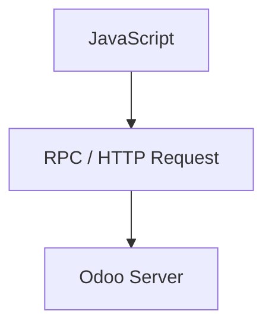

</div>

RPC-style calls still travel as HTTP traffic. The useful teaching point is intent: many Odoo requests are "call this model method" rather than "download this whole HTML page again."

### WHY THIS MATTERS FOR AN ODOO DEVELOPER

When SO0052 fails to open, open the browser Network tab before rewriting Python. A missing request, a 403, a 500, or a successful payload with an unexpected error body point to different layers.

Custom controllers and RPC methods you add later are still HTTP requests. If `nova_order_gate` exposes a route, architecture knowledge tells you the failure may be routing, auth, session, or business logic, not "PostgreSQL forgot the order."


### EXAMPLE

The web client wants information about Sales Order SO0052.

Conceptually:

**Read sales order 52**

The request reaches Odoo. The server determines database, user, permissions, model, and requested operation. Then the ORM may retrieve the data and the response returns to the web client for rendering.

Caveat: a successful HTTP status does not always mean the business operation succeeded. Odoo may return a structured error inside an otherwise completed transport exchange. Read both transport evidence and business evidence.

Wrong thinking:

> "HTTP is only for opening websites, so model operations are something else entirely."

Right thinking:

> "Opening a page and calling a model method are different intents, but both travel through the request/response bridge."


### DIAGNOSTIC SCENE

Rami clicks Save on SO0052 and sees a spinner, then nothing useful.

Open the Network evidence before rewriting models. Was a request sent? What status returned? Did the payload contain a business error? HTTP literacy shortens the distance between "the screen froze" and "the server said no."

### COMMON MISTAKE

A beginner may think an HTTP request is only "opening a web page" and ignore that Odoo also uses RPC-style requests for model operations.

The important idea is continuity: the client asks, the server authenticates and decides, then the response returns. Skipping that mental model makes debugging much harder.

### RELEVANT RESOURCES

Here are the relevant resources for **4.4 HTTP REQUEST**:

### OFFICIAL DOCUMENTATION

| Topic | Documentation |
|---|---|
| **Web controllers / HTTP** | [Web Controllers (Odoo 19)](https://www.odoo.com/documentation/19.0/developer/reference/backend/http.html) |

Full chapter index: [Resources.md](Resources.md)

---

## 4.5 ODOO APPLICATION SERVER

### INTUITION

This is the central backend process.

When Rami asks to confirm SO0052, something behind the browser must understand who he is, whether he may confirm, what Confirm means at Nova Retail, and which related records must change. PostgreSQL alone cannot answer those questions. Rows do not know company policy. The Odoo application server does.

### DEFINITION

The **Odoo application server** is the central backend process that understands authentication, permissions, business rules, models, module extensions, and workflows.

PostgreSQL stores rows. The application server decides what those rows mean for the business.

That division of labor is why Odoo can be both a database-backed system and a rules-backed system. Storage alone does not create ERP behavior. Interpreted business meaning does.

### HOW THE SERVER FITS

The browser asks:

"Can I open this Sales Order?"

PostgreSQL knows stored rows.

But something needs to understand authentication, permissions, business rules, Odoo models, module extensions, and workflows.

That something is the Odoo application server. It is the place where Unit I business meaning becomes executable software policy.

### RESPONSIBILITIES

The server handles HTTP request processing, authentication, session handling, model operations, permissions, business logic, ORM interaction, module loading, scheduled tasks, and responses to the web client.

You do not need to memorize that list as a checklist. Use it as a map of ownership. If the failure involves "who is allowed" or "what Confirm means," you are usually in application server territory.

### WHY BROWSER TO POSTGRESQL DIRECTLY IS WRONG

Imagine:

$$ \text{Browser} \rightarrow \text{PostgreSQL} $$

Then the browser would need database credentials, SQL knowledge, business logic, and security rules. Users could potentially bypass Odoo's application rules. `nova_order_gate` would become optional theater instead of enforcement.

Instead:

<div align="center">

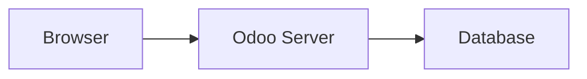

</div>

The server is the controlled business layer.

### WHY THIS MATTERS FOR AN ODOO DEVELOPER

Most custom Odoo work you will do lives here or is invoked from here: Python methods, model constraints, server actions, controllers, security rules, and module loading.

When someone proposes "just update the table from the website," your architecture answer should be calm and firm: that skips the layer that makes Odoo an ERP rather than a shared spreadsheet with nicer fonts.


### EXAMPLE

A junior proposal at Nova Retail suggests connecting the browser directly to PostgreSQL "to make Confirm faster."

That proposal fails the architecture test. Credentials, business rules, and security enforcement would leave the controlled server path. Lina could see stock figures that never passed reservation logic. Noor could see accounting consequences that never passed validation.

Wrong:

> "If the UI can write SQL, we skip overhead."

Right:

> "The Odoo application server is not overhead. It is the business control point between browser and database."


### DIAGNOSTIC SCENE

Someone measures that Confirm feels slow and concludes "the application server is overhead."

Sometimes the server is busy. Sometimes the rule set is expensive. Sometimes the network is poor. Removing the application server to "go faster" is like removing brakes to reduce car weight. You may move quicker until the first sharp corner.

### COMMON MISTAKE

A beginner may propose connecting the frontend directly to the database to "make Odoo faster."

That would expose credentials, bypass business rules, weaken security enforcement, and couple the UI to raw schema. The application server is the controlled business layer between browser and database.

### RELEVANT RESOURCES

Here are the relevant resources for **4.5 ODOO APPLICATION SERVER**:

### ODOO FRAMEWORK EXPLAINED

| | |
|---|---|
| **Source** | EasyDev |
| **Reinforces** | Odoo as a modular application framework, not only an ERP UI |

<div align="center">

[](https://www.youtube.com/watch?v=Ru2cz7l0g5k)

**Watch on YouTube:** [Odoo Framework Explained](https://www.youtube.com/watch?v=Ru2cz7l0g5k)

</div>

---

### OFFICIAL DOCUMENTATION

| Topic | Documentation |
|---|---|
| **Architecture overview** | [Chapter 1: Architecture Overview (Odoo 19)](https://www.odoo.com/documentation/19.0/developer/tutorials/server_framework_101/01_architecture.html) |
| **Deployment / server modes** | [System configuration / Deploy (Odoo 19)](https://www.odoo.com/documentation/19.0/administration/on_premise/deploy.html) |

Full chapter index: [Resources.md](Resources.md)

---

## 4.6 PYTHON RUNTIME

### INTUITION

Odoo's server-side logic runs in Python.

When Nova Retail's Odoo process loads models, methods, business logic, and custom addons such as `nova_order_gate`, Python executes that server code. The browser may display the outcome. PostgreSQL may store the outcome. The decision path that says "this confirmation is allowed" usually runs in Python first.

Official Odoo architecture documentation identifies Python as the logic tier.

### DEFINITION

The **Python runtime** executes Odoo's server-side logic: models, methods, business rules, and custom addons.

Official Odoo architecture documentation identifies Python as the logic tier.

### WHY THIS MATTERS FOR AN ODOO DEVELOPER

If you can read Python, you can eventually read most Odoo business behavior. That does not mean every bug is a Python bug. It means the center of gravity for server-side customization is Python.

When Rami reports that SO0052 refuses to confirm, a stack trace in the Odoo server log is often Python telling you which method rejected the operation. Learning to place breakpoints and read those traces is Chapter 5 work. Knowing that the logic tier is Python is Chapter 4 work.

Also notice what Python is not. It is not the browser layout engine. It is not PostgreSQL. It is not the filestore. When people say "fix it in Python," they usually mean "fix the server-side business meaning," not "rewrite the entire stack."

### EXAMPLE

Nova Retail adopts a custom rule: orders of **50,000 QAR or more** require approval.

The actual server-side implementation might eventually involve Python logic inside a Sales Order method or a related extension from `nova_order_gate`.

Conceptually:

<div align="center">

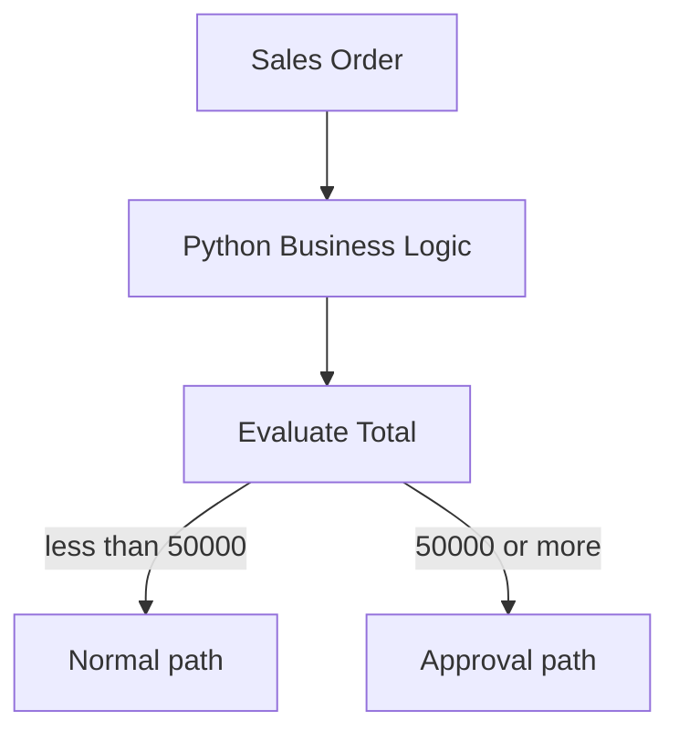

</div>

Caveat: the threshold might also appear in automated actions, server actions, or studio-like configuration depending on the project. The architectural point remains: authoritative evaluation belongs on the server, executed by the Python runtime, not only as a browser warning.

Wrong thinking:

> "If the form shows a warning, the rule is fully enforced."

Right thinking:

> "A warning helps the user. Python server logic enforces the policy."

### PYTHON DOES NOT MEAN EVERYTHING IS PYTHON

Be careful.

Odoo also uses JavaScript for frontend functionality, XML and data files for many definitions, PostgreSQL for persistence, and web technologies for presentation.

The phrase "Odoo is written in Python" is useful but incomplete.

A better model is:

| Layer | Primary technology |
| --- | --- |
| **Frontend** | HTML / CSS / JavaScript |
| **Server logic** | Python |
| **Structured data** | PostgreSQL |


### DIAGNOSTIC SCENE

A new developer refuses to open any XML or JavaScript file because "Odoo is Python."

Then a menu never appears, an asset never loads, or a client action never mounts. Python remains central for server logic, but the whole product still uses other languages for other responsibilities. Architecture literacy prevents that false monopoly.

### COMMON MISTAKE

A beginner may hear "Odoo is written in Python" and conclude that every part of Odoo is Python.

**Wrong:** Every Odoo file is Python.

**Correct:** Frontend work uses HTML/CSS/JavaScript. Persistence uses PostgreSQL. Many definitions use XML/data files. Python is the primary server-side logic tier, not the entire stack.

### RELEVANT RESOURCES

Here are the relevant resources for **4.6 PYTHON RUNTIME**:

### ODOO FRAMEWORK EXPLAINED

| | |
|---|---|
| **Source** | EasyDev |

<div align="center">

[](https://www.youtube.com/watch?v=Ru2cz7l0g5k)

**Watch on YouTube:** [Odoo Framework Explained](https://www.youtube.com/watch?v=Ru2cz7l0g5k)

</div>

---

### OFFICIAL DOCUMENTATION

| Topic | Documentation |
|---|---|
| **Architecture overview (logic tier)** | [Chapter 1: Architecture Overview (Odoo 19)](https://www.odoo.com/documentation/19.0/developer/tutorials/server_framework_101/01_architecture.html) |
| **Building a module** | [Building a Module (Odoo 19)](https://www.odoo.com/documentation/19.0/developer/tutorials/backend.html) |

Full chapter index: [Resources.md](Resources.md)

---

## 4.7 ORM

### INTUITION

This is one of the most important ideas in the entire Odoo roadmap.

Rami does not think "update row 52 in table sale_order." He thinks "open Sales Order SO0052." Python business code needs a bridge between those human business objects and relational storage. That bridge is the ORM.

**ORM** means **Object-Relational Mapping**.

### DEFINITION

**ORM** means **Object-Relational Mapping**.

It lets application code work with models, fields, and recordsets instead of writing raw SQL for every operation. Official Odoo ORM documentation treats recordsets as the fundamental representation of records.

### START WITH THE PROBLEM

Suppose we want customer 42 at Nova Retail.

Without an ORM, application code might directly write SQL:

```sql
SELECT *
FROM res_partner
WHERE id = 42;
```

Direct SQL is sometimes useful, but imagine every Odoo operation were written manually like this.

Developers would constantly deal with SQL, table names, joins, inserts, updates, type conversion, and business model structure. Access rights, computed fields, and module extensions would become easy to skip by accident.

The ORM provides a higher-level abstraction so ordinary business operations stay expressed in model language.

### OBJECT-RELATIONAL MAPPING

Application code thinks in terms of:

$$ \text{Customer Record} $$

rather than only:

$$ \text{Database Row} $$

Odoo's ORM lets developers work with models, fields, recordsets, relationships, and create/search/write/unlink operations.

Official Odoo ORM documentation says model instances represent the models available for a database and that recordsets are the fundamental representation of records in the ORM.

### WHY THIS MATTERS FOR AN ODOO DEVELOPER

Almost every serious customization you write later will touch the ORM: reading SO0052, writing quantities, searching partners, extending `sale.order`, or enforcing `nova_order_gate` conditions.

If you bypass the ORM with raw SQL too early, you can update storage while skipping business behavior the ORM path would have applied. Sometimes raw SQL is justified. As a default habit for business operations, it is dangerous.

A practical Nova Retail story: someone "quick-fixes" a quantity with SQL, then wonders why computed fields, chatter, or related reservations look inconsistent. The database row moved. The business path did not.

### EXAMPLE

Eventually you may write something conceptually like:

```python
partner = self.env["res.partner"].browse(42)
```

instead of manually building SQL for every operation.

Do not worry about the syntax yet.

The important idea is:

<div align="center">

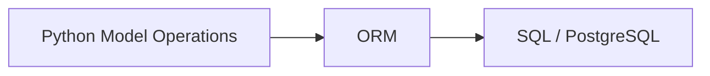

</div>

Caveat: browsing an id does not magically grant permission. The environment still carries user and context. Architecture separates "how we address records" from "whether this user may touch them."

Wrong thinking:

> "ORM is just sugar over SQL, so SQL and ORM are always equivalent."

Right thinking:

> "ORM is the normal business access path. It can generate SQL, and it also participates in wider Odoo behavior."

### ORM DOES MORE THAN SQL TRANSLATION

A good mental model is not:

ORM = automatic SQL generator.

It also participates in Odoo concepts such as model definitions, recordsets, field behavior, relationships, computed behavior, environment/context, caching/prefetching, inheritance, and access-related execution patterns.

We will spend an entire later unit mastering it.


### DIAGNOSTIC SCENE

A ticket says "ORM is slow," and the proposed fix is "replace PostgreSQL."

Maybe the query plan is heavy. Maybe prefetching is missing. Maybe the business method does too much work per click. Those are different investigations. Calling the ORM "the database" collapses them into one useless slogan.

### COMMON MISTAKE

A beginner may say "ORM is the database."

**Wrong:** ORM equals PostgreSQL.

**Correct:** The ORM is an abstraction layer used by application code to interact with persistent records. PostgreSQL remains the database. Confusing the two makes later debugging and performance work harder.

### RELEVANT RESOURCES

Here are the relevant resources for **4.7 ORM**:

### 1. ORM IN ODOO (OBJECT RELATIONAL MAPPING)

| | |
|---|---|
| **Source** | Cybrosys Technologies |
| **Reinforces** | **Python model ↔ PostgreSQL table** via the ORM |
| **Version note** | Titled for Odoo 16; pair with the Odoo 19 ORM API reference |

<div align="center">

[](https://www.youtube.com/watch?v=A8MEl4BfqyY)

**Watch on YouTube:** [ORM (Object Relational Mapping) in Odoo 16](https://www.youtube.com/watch?v=A8MEl4BfqyY)

</div>

---

### 2. ODOO ORM METHODS (PART 1)

| | |
|---|---|
| **Source** | Odoo Mates |

<div align="center">

[](https://www.youtube.com/watch?v=8V-uOG8KkKA)

**Watch on YouTube:** [Odoo ORM Methods - Part1](https://www.youtube.com/watch?v=8V-uOG8KkKA)

</div>

---

### OFFICIAL DOCUMENTATION

| Topic | Documentation |
|---|---|
| **ORM API** | [ORM API (Odoo 19)](https://www.odoo.com/documentation/19.0/developer/reference/backend/orm.html) |

Full chapter index: [Resources.md](Resources.md)

---

## 4.8 POSTGRESQL

### INTUITION

PostgreSQL is Odoo's relational database management system.

When Rami confirms SO0052, the durable structured facts of that confirmation need a home that survives browser refresh, worker restarts, and overnight shutdowns. That home for ordinary business records is PostgreSQL.

Official Odoo architecture documentation identifies PostgreSQL as the data-tier RDBMS.

### DEFINITION

**PostgreSQL** is Odoo's relational database management system for structured application data.

Official architecture documentation identifies PostgreSQL as the data-tier RDBMS.

### WHAT POSTGRESQL STORES

Structured Odoo application data includes customers, products, Sales Orders, invoices, users, companies, configuration, and relationships.

At Nova Retail, that means partner records Lina depends on, product records warehouse teams trust, and order records Noor later invoices from.

Conceptually:

$$ \text{Odoo Model} \leftrightarrow \text{Database Structures} $$

although the mapping is not always as simple as one model equals one table in every case. We'll learn the exceptions later.

### WHY POSTGRESQL EXISTS SEPARATELY FROM ODOO

Odoo application logic and database storage are different responsibilities.

If the Odoo Python process stops:

$$ \text{Application Server Down} $$

the database data does not simply disappear.

PostgreSQL is a separate persistence layer. That separation is why backups, restores, and some performance investigations treat the database as its own evidence source.

### TRANSACTIONS

Relational databases also provide transaction semantics.

Suppose confirming SO0052 changes several pieces of data. You generally want:

$$ \text{All Changes Succeed} $$

or:

$$ \text{All Changes Roll Back} $$

rather than ending in a half-completed state where the order looks confirmed but a related record never wrote.

Database transactions help make this possible. We will study this more deeply later.

For now, keep one operational picture: Odoo can be restarted, upgraded, or temporarily unreachable while PostgreSQL still holds the company's structured memory. Availability of the application and durability of the records are related, but they are not identical.

### WHY THIS MATTERS FOR AN ODOO DEVELOPER

When a user says "Odoo lost my data," ask where the data was supposed to live. If it was structured business data and PostgreSQL was healthy, the loss may actually be a logic, permission, or UI-filter issue. If PostgreSQL itself is damaged or unrestored, no amount of Python rewriting recovers what was never persisted.

You also need this mental model before Chapter 5: installing Odoo without a working PostgreSQL is incomplete architecture, not a minor setup detail.


### EXAMPLE

Nova Retail restarts the Odoo application server after a configuration change.

$$ \text{Application Server Down} $$

then later:

$$ \text{Application Server Up} $$

SO0052 is still there because PostgreSQL kept the structured records. The Python process did not have to stay alive for the order to remain real.

Caveat: attachments may also involve the filestore. Structured rows surviving does not automatically prove every PDF binary survived.

Wrong thinking:

> "If Odoo is stopped, the company data is gone."

Right thinking:

> "If Odoo is stopped, the application is unavailable. PostgreSQL may still hold the durable structured state."


### DIAGNOSTIC SCENE

During maintenance, the Odoo service is stopped. A manager panics: "Did we lose today's orders?"

Ask whether PostgreSQL is intact and whether backups exist. Application downtime is painful. Data loss is a different category of pain. Architecture helps you speak precisely during stressful minutes.

### COMMON MISTAKE

A beginner may assume that if the Odoo Python process stops, all business data disappears.

**Wrong:** Application stop equals data wipe.

**Correct:** PostgreSQL is a separate persistence layer. Application logic and stored data have different responsibilities. Also, not every binary file byte necessarily lives only in ordinary table storage; the filestore may be involved.

### RELEVANT RESOURCES

Here are the relevant resources for **4.8 POSTGRESQL**:

### HOW TO RESTORE YOUR ODOO DATABASE FROM BACKUP

| | |
|---|---|
| **Source** | Cybrosys Technologies |
| **Why use it** | Makes durable database state visible during backup/restore thinking |

<div align="center">

[](https://www.youtube.com/watch?v=kebK_7_ezD8)

**Watch on YouTube:** [How to Restore your Odoo Database from Backup?](https://www.youtube.com/watch?v=kebK_7_ezD8)

</div>

---

### OFFICIAL DOCUMENTATION

| Topic | Documentation |
|---|---|
| **Architecture overview (data tier)** | [Chapter 1: Architecture Overview (Odoo 19)](https://www.odoo.com/documentation/19.0/developer/tutorials/server_framework_101/01_architecture.html) |
| **Deploy / backups** | [System configuration / Deploy (Odoo 19)](https://www.odoo.com/documentation/19.0/administration/on_premise/deploy.html) |
| **CLI db dump / load** | [Command-line interface (Odoo 19)](https://www.odoo.com/documentation/19.0/developer/reference/cli.html) |

Full chapter index: [Resources.md](Resources.md)

---

## 4.9 FILESTORE

### INTUITION

Now comes a common beginner misconception:

"If Odoo uses PostgreSQL, every file must be stored inside PostgreSQL."

Not necessarily.

A customer emails Nova Retail a purchase order PDF. Rami attaches it to SO0052. The order record is structured data. The PDF bytes are bulky binary content. Odoo often keeps those concerns in related but separate storage areas.

Odoo also has a filestore.

Official Odoo 19 documentation describes the filestore as holding database attachments and binary-field files in Odoo-managed environments.

### DEFINITION

The **filestore** holds database attachments and binary-field files in Odoo-managed environments.

Official Odoo 19 documentation distinguishes this filesystem-backed storage from ordinary relational table storage.

### WHY HAVE A FILESTORE?

Imagine users attach PDFs, photographs, documents, and scans.

Storing large binary objects in filesystem-backed storage can be preferable to putting all file bytes directly into ordinary relational table storage. Database backups stay more manageable. File serving can follow different operational patterns. The architecture remains coherent as attachment volume grows.

### DATABASE + FILESTORE RELATIONSHIP

Conceptually:

**PostgreSQL** may contain metadata, records, references, permissions, and attachment information.

While the **filestore** may contain the actual binary file content.

That split explains a confusing support symptom: the attachment line exists, yet opening the file fails. Metadata survived. Bytes did not.

### IMPORTANT BACKUP IMPLICATION

A database backup alone may not represent the entire Odoo state if the associated filestore is omitted.

Official Odoo tooling explicitly distinguishes database dumps that include or exclude the filestore, which reinforces that they are separate pieces of the application's persisted state.

Therefore:

$$ \text{Reliable Odoo Backup} \approx \text{Database} + \text{Relevant Filestore} $$

depending on the deployment configuration.

That formula is easy to recite and easy to ignore during an emergency. Write it into your operational checklist before you need it. Nova Retail should not discover filestore dependence for the first time while customers are waiting.

### WHY THIS MATTERS FOR AN ODOO DEVELOPER

Disaster recovery conversations are architecture conversations. If Nova Retail restores "the database" and Noor discovers invoice PDFs missing, the restore plan was incomplete even if every Sales Order row returned.

When you design training or staging copies in later chapters, copy both sides of durable state unless you intentionally want a metadata-only sandbox.


### EXAMPLE

Imagine PostgreSQL is restored for Nova Retail but the corresponding filestore is lost.

The database may still contain attachment references on SO0052. Rami can see that a customer PO was attached. Clicking it fails because the actual file bytes are gone.

This is why architecture knowledge affects disaster recovery.

Wrong thinking:

> "One SQL dump is always a complete Odoo backup."

Right thinking:

> "Structured data and binary attachments can be separate durable pieces. Backup both unless tooling explicitly includes them together."


### DIAGNOSTIC SCENE

After a partial restore, SO0052 shows an attachment line. Clicking it fails.

Do not start by rewriting Sales. Check whether the filestore was restored with the database. Metadata without bytes is a classic split-brain restore symptom.

### COMMON MISTAKE

A beginner may assume every file must be stored inside PostgreSQL because Odoo uses PostgreSQL.

**Wrong:** PostgreSQL alone always contains every byte the business cares about.

**Correct:** Attachments and binary-field files can involve the filestore. A database-only restore can leave attachment references without the actual files.

### RELEVANT RESOURCES

Here are the relevant resources for **4.9 FILESTORE**:

### HOW TO RESTORE YOUR ODOO DATABASE FROM BACKUP

| | |
|---|---|
| **Source** | Cybrosys Technologies |
| **Why use it** | Shows why database dumps and attachment files both matter |

<div align="center">

[](https://www.youtube.com/watch?v=kebK_7_ezD8)

**Watch on YouTube:** [How to Restore your Odoo Database from Backup?](https://www.youtube.com/watch?v=kebK_7_ezD8)

</div>

---

### OFFICIAL DOCUMENTATION

| Topic | Documentation |
|---|---|
| **Serving attachments / filestore** | [System configuration / Deploy (Odoo 19)](https://www.odoo.com/documentation/19.0/administration/on_premise/deploy.html) |
| **CLI `--data-dir` and db dump** | [Command-line interface (Odoo 19)](https://www.odoo.com/documentation/19.0/developer/reference/cli.html) |
| **Filestore path layout (Odoo.sh example)** | [Containers (Odoo 19)](https://www.odoo.com/documentation/19.0/administration/odoo_sh/advanced/containers.html) |

Full chapter index: [Resources.md](Resources.md)

---

## 4.10 ADDONS

### INTUITION

We already learned modules/addons functionally in Unit I.

Now we locate them architecturally.

At Nova Retail, Sales behavior does not live in one mysterious binary. It lives in installable packages. Standard apps arrive as addons. Custom policy such as `nova_order_gate` also arrives as an addon. Architecture cares where those packages live and how the server discovers them.

### DEFINITION

**Addons** (modules) package Odoo functionality into discoverable directories on the addons path.

When installed, an addon can contribute models, fields, Python methods, views, security, data, assets, and controllers.

### PACKAGING FUNCTIONALITY

The base Odoo platform does not contain every possible behavior as one giant file.

Functionality is packaged into modules/addons. Conceptual examples include Sales, CRM, Inventory, and a custom approval module.

That packaging is what lets Nova Retail enable Inventory without inventing Sales from scratch, and what lets your team add `nova_order_gate` without rewriting core Odoo.

### ADDON PATH

Odoo searches configured addon directories to discover modules.

The official architecture tutorial states that modules live within module directories and that these directories are configured through the addons path.

Conceptually:

```text
addons/
    sale/
    purchase/
    stock/
    crm/
custom_addons/
    nova_order_gate/
```

If `nova_order_gate` is on disk but outside the configured addons path, Odoo will not magically install it. Discovery is configuration, not wishful thinking.

This is one of the earliest "it works on my machine" traps in Odoo development. The module folder exists. The screenshot looks right. The server simply cannot see the addon because the path was never configured for that runtime.

### WHY ADDONS MATTER ARCHITECTURALLY

When a module is installed, it can contribute models, fields, Python methods, views, security, data, assets, and controllers.

So the effective Odoo application is built by composing modules.

$$ \text{Odoo Runtime} = \text{Core} + \text{Installed Addons} $$

### WHY THIS MATTERS FOR AN ODOO DEVELOPER

Your future code rarely starts by editing "Odoo itself" as one blob. It usually starts by creating or extending an addon.

When SO0052 behaves differently after a module install or upgrade, architecture tells you to inspect which addon contributed the new behavior. That habit prevents endless guessing inside unrelated core files.


### EXAMPLE

A custom module such as `nova_order_gate` lives under a custom addons directory at Nova Retail.

Odoo discovers it through the addons path, loads its Python definitions, and contributes them to the runtime:

$$ \text{Odoo Runtime} = \text{Core} + \text{Installed Addons} $$

Caveat: being present on disk is not the same as being installed in the database. Discovery and installation are related steps, not identical ones.

Wrong thinking:

> "An addon is only a theme or menu skin."

Right thinking:

> "An addon is a package that can extend logic, data, security, and presentation together."


### DIAGNOSTIC SCENE

Management asks for "a small plugin" that blocks Confirm above a threshold.

If you only hide the button in the web client, you built a costume. If you package server logic, security, and views inside `nova_order_gate`, you built an addon. Architecture makes the difference speakable in planning meetings.

### COMMON MISTAKE

A beginner may think an addon is only a visual plugin.

**Wrong:** Addons only change screens.

**Correct:** An addon can contribute Python, models, views, data, security, assets, controllers, and business behavior. Installed addons help compose the effective Odoo runtime.

### RELEVANT RESOURCES

Here are the relevant resources for **4.10 ADDONS**:

### 1. ODOO MODULES EXPLAINED

| | |
|---|---|
| **Source** | EasyDev |
| **Reinforces** | Modules as the packaging unit for business features |

<div align="center">

[](https://www.youtube.com/watch?v=uJPjmS5Arug)

**Watch on YouTube:** [Odoo Modules Explained](https://www.youtube.com/watch?v=uJPjmS5Arug)

</div>

---

### 2. ODOO MODULE STRUCTURE: MODELS, VIEWS, SECURITY

| | |
|---|---|
| **Source** | EasyDev |

<div align="center">

[](https://www.youtube.com/watch?v=ov-ReGkIxIg)

**Watch on YouTube:** [Odoo Module Structure Explained](https://www.youtube.com/watch?v=ov-ReGkIxIg)

</div>

---

### 3. MANIFEST FILE IN ODOO 19

| | |
|---|---|
| **Source** | Cybrosys Technologies |

<div align="center">

[](https://www.youtube.com/watch?v=n7OXja3UBVw)

**Watch on YouTube:** [What is the Manifest File in Odoo?](https://www.youtube.com/watch?v=n7OXja3UBVw)

</div>

---

### OFFICIAL DOCUMENTATION

| Topic | Documentation |
|---|---|
| **Module manifests** | [Module Manifests (Odoo 19)](https://www.odoo.com/documentation/19.0/developer/reference/backend/module.html) |
| **Architecture / modules** | [Chapter 1: Architecture Overview (Odoo 19)](https://www.odoo.com/documentation/19.0/developer/tutorials/server_framework_101/01_architecture.html) |

Full chapter index: [Resources.md](Resources.md)

---

## 4.11 REGISTRY

### INTUITION

This is a more subtle concept, and beginners often skip it because it is invisible on the form.

Picture two Nova Retail databases. One has only Sales. Another has Sales plus `nova_order_gate`. When Rami opens SO0052, both databases may show a Sales Order form, but the effective meaning of Confirm can differ. The registry is how the server knows which model universe is active for that database.

### DEFINITION

The **registry** is the loaded model universe for a database: the effective models and extensions available at runtime.

Odoo builds it from installed modules' Python definitions and inheritance. It is not the PostgreSQL database itself.

### HOW THE REGISTRY APPEARS

Suppose the database has these modules installed: base, contacts, sale, stock, and a custom sales approval module.

Each module may define or extend models. Several modules might extend the same Sales Order model.

How does Odoo know the final effective model that should exist?

This is where the server-side registry concept becomes important. Rows in PostgreSQL do not by themselves explain which Python methods are currently combined onto `sale.order`.

### REGISTRY MENTAL MODEL

Think:

$$ \text{Registry} = \text{Loaded Model Universe for a Database} $$

Odoo's ORM documentation explains that models are instantiated per database and that the actual model class is constructed from the Python classes that create and inherit from that model, depending on modules installed in that database.

### WHY "PER DATABASE" MATTERS

Imagine Database A has Sales and Inventory.

Database B has Sales, Manufacturing, and a custom module such as `nova_order_gate`.

Their effective set of models and extensions may differ. Therefore their runtime model registries are not conceptually identical.

That is why "it works on my database" is not automatically transferable without comparing installed modules.

Training databases, staging databases, and production databases can silently diverge here. Architecture literacy makes that divergence visible before users invent folklore about "Odoo being random."

### SIMPLIFIED BUILD PROCESS

<div align="center">

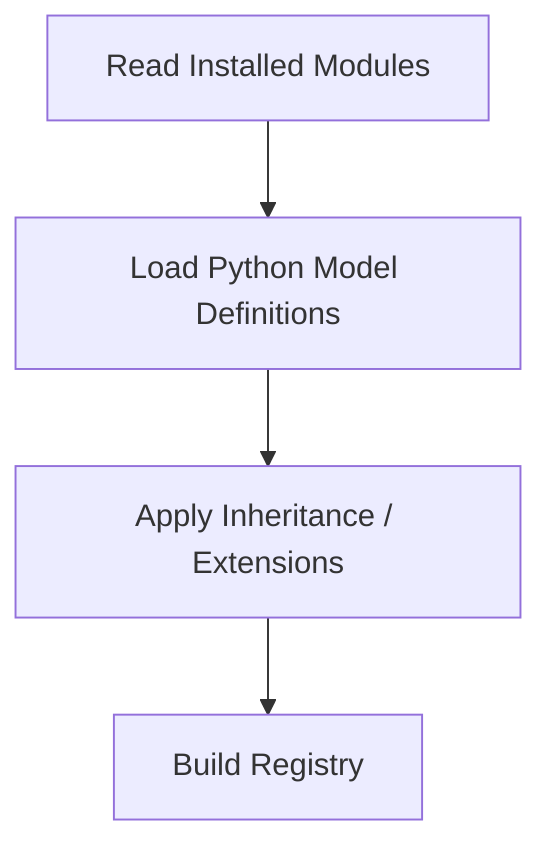

</div>

Then requests can use the resulting models.

### WHY THIS MATTERS FOR AN ODOO DEVELOPER

When you install or upgrade `nova_order_gate`, you are not only adding files on disk. You are asking Odoo to rebuild or refresh the effective model universe for that database.

If an extension method never seems to run, one architectural question is whether the module is installed and whether the registry currently includes that extension. This saves hours of editing the wrong database copy.


### EXAMPLE

Base Sales defines:

`sale.order`

Custom addon `nova_order_gate` extends:

`sale.order`

The registry exposes the final effective model containing the combined behavior according to Odoo's inheritance system.

This is one reason you can extend Odoo without rewriting the original Sales module.

Caveat: registry composition explains available behavior. It does not by itself invent missing PostgreSQL columns or data. Model structure and stored data still have to agree after upgrades.

Wrong thinking:

> "The registry is just another table I can edit with SQL."

Right thinking:

> "The registry is runtime model architecture built from installed module Python definitions."

### REGISTRY IS NOT THE POSTGRESQL DATABASE

Do not confuse:

| Concept | Role |
| --- | --- |
| **Registry** | Runtime loaded model structures and behavior |
| **Database** | Persistent stored data |

The database stores persistent data.

The registry represents loaded model structures/behavior available to the runtime.


### DIAGNOSTIC SCENE

Staging has `nova_order_gate` installed. Production does not. Both contain SO0052-like orders.

Users say "the same order behaves differently." The registries differ. Comparing module installation state is often faster than comparing unrelated CSS.

### COMMON MISTAKE

A beginner may think the registry is a database table.

**Wrong:** Registry equals one PostgreSQL table you casually edit.

**Correct:** The registry is part of the runtime model-loading architecture: the loaded model universe for a database. The database stores persistent data; the registry exposes effective model behavior after modules and extensions are combined.

### RELEVANT RESOURCES

Here are the relevant resources for **4.11 REGISTRY**:

### 1. ODOO MODULE STRUCTURE: MODELS, VIEWS, SECURITY

| | |
|---|---|
| **Source** | EasyDev |
| **Reinforces** | Installed module definitions compose the effective model universe |

<div align="center">

[](https://www.youtube.com/watch?v=ov-ReGkIxIg)

**Watch on YouTube:** [Odoo Module Structure Explained](https://www.youtube.com/watch?v=ov-ReGkIxIg)

</div>

---

### 2. MODULE LIFECYCLE: INSTALL, UPGRADE, UNINSTALL

| | |
|---|---|
| **Source** | EasyDev |

<div align="center">

[](https://www.youtube.com/watch?v=lyUGD4reCys)

**Watch on YouTube:** [Odoo Module Lifecycle Explained](https://www.youtube.com/watch?v=lyUGD4reCys)

</div>

---

### OFFICIAL DOCUMENTATION

| Topic | Documentation |
|---|---|
| **ORM API** | [ORM API (Odoo 19)](https://www.odoo.com/documentation/19.0/developer/reference/backend/orm.html) |
| **Architecture / modules** | [Chapter 1: Architecture Overview (Odoo 19)](https://www.odoo.com/documentation/19.0/developer/tutorials/server_framework_101/01_architecture.html) |

Full chapter index: [Resources.md](Resources.md)

---

## 4.12 HTTP LAYER

### INTUITION

Earlier we discussed an HTTP request from the browser's perspective.

Now we examine the server side.

When Rami's web client asks for SO0052, some server component must accept that traffic, decide which code should run, decide whether he is authenticated, and decide which database context applies. That gateway work is the HTTP layer. It is easy to ignore because users never see a screen labeled "HTTP Layer," yet many failures begin there.

### DEFINITION

The **HTTP layer** receives incoming web requests and determines route, authentication, parameters, session, database context, and response format.

Odoo documents routes with `odoo.http.Controller` and `route()`.

### HTTP LAYER RESPONSIBILITY

The HTTP layer receives incoming web requests and determines which route should handle them, authentication requirements, request parameters, session information, database context, and response format.

Odoo's current web controller documentation describes routes implemented with `odoo.http.Controller` and `route()`, with authentication modes and request handling provided by the HTTP framework.

If the request never reaches your Python method, the ORM and PostgreSQL may be innocent. The gateway may have refused or misrouted the call first.

### CONTROLLER ROUTING

Imagine:

`GET /some/path`

or an RPC request for Sales Order data.

Something must map that URL or RPC endpoint to Python code. That mapping is routing.

Conceptually:

$$ \text{URL} \rightarrow \text{Route} \rightarrow \text{Controller/Dispatcher} \rightarrow \text{Python Logic} $$

Custom modules can contribute controllers too. A route added by `nova_order_gate` is still HTTP-layer architecture, even when the business meaning is Sales approval.

### AUTHENTICATION

Some routes may require authenticated users, public access, bearer/API authentication, or no database context.

Odoo's current route system supports different authentication modes including user, bearer, public, and none.

We will learn controller implementation later.

For now: HTTP is the gateway by which browser/API traffic reaches Odoo's server logic.

If you later expose an integration endpoint for Nova Retail warehouse devices, you are still working in this layer. The business method may be short. The routing and authentication choices around it can still decide whether the design is safe.

### WHY THIS MATTERS FOR AN ODOO DEVELOPER

A 404, auth failure, wrong database selection, or unexpected public access is often an HTTP-layer symptom before it is an ORM symptom.

When you later write a controller for Nova Retail integrations, you are extending this layer. Choosing the wrong auth mode can expose business operations or block legitimate users even if your Python method itself is correct.


### EXAMPLE

Rami's browser issues an RPC call to read SO0052. The HTTP layer must map that call to Python code through routing, apply authentication, attach session and database context, then dispatch into server logic.

If authentication fails, PostgreSQL never becomes the main character of the story. If routing misses, your carefully written model method never runs.

Wrong thinking:

> "Every Odoo error means either the browser or the database is broken."

Right thinking:

> "Many request failures begin at the HTTP gateway: route, auth, session, or database context."


### DIAGNOSTIC SCENE

An API consumer says the endpoint is "down," yet ordinary users can open Sales.

Perhaps routing differs. Perhaps auth mode differs. Perhaps the reverse proxy path differs. The HTTP layer is where those stories separate before you accuse PostgreSQL.

### COMMON MISTAKE

A beginner may ignore the HTTP layer and treat every failure as either "browser broken" or "database broken."

**Wrong:** Skip straight to SQL whenever a screen fails.

**Correct:** The HTTP layer is the gateway: routing, authentication mode, session, database context, and response format. Many request failures begin there before ORM or SQL ever run.

### RELEVANT RESOURCES

Here are the relevant resources for **4.12 HTTP LAYER**:

### OFFICIAL DOCUMENTATION

| Topic | Documentation |
|---|---|
| **Web controllers / HTTP** | [Web Controllers (Odoo 19)](https://www.odoo.com/documentation/19.0/developer/reference/backend/http.html) |
| **Deploy / reverse proxy context** | [System configuration / Deploy (Odoo 19)](https://www.odoo.com/documentation/19.0/administration/on_premise/deploy.html) |

Full chapter index: [Resources.md](Resources.md)

---

## 4.13 SESSIONS

### INTUITION

Imagine Rami logs into Odoo at Nova Retail.

Then he opens Sales, Inventory, and Contacts while reviewing SO0052.

Should he enter his username and password for every request?

No. That would make ordinary work unbearable. The application needs continuity across many small HTTP requests. That is part of what sessions provide.

### DEFINITION

A **session** links several requests to the same ongoing authenticated user interaction.

It helps retain identity and session-specific state so the user is not asked to log in on every navigation action.

### SESSION MENTAL MODEL

A session allows several requests to be associated with the same ongoing user interaction.

Conceptually:

$$ R_1, R_2, R_3, \dots, R_n $$

can be linked to one session.

Without that link, every RPC call would look like a stranger arriving at the gate. With that link, the server can recognize an ongoing authenticated interaction.

### WHAT THE SESSION HELPS RETAIN

Examples can include authenticated identity, user-related context, and session-specific state.

Current Odoo documentation describes session information made available to the web client, and the HTTP API includes session-saving behavior around requests.

Odoo.sh documentation also shows a separate sessions directory alongside the filestore in its environment structure. That operational detail reinforces a teaching point: session state is real infrastructure, not imaginary browser magic.

### SESSION IS NOT USER

Important distinction:

$$ \text{User} \neq \text{Session} $$

A user is an account/identity.

A session is one authenticated interaction context.

One user might have several simultaneous sessions from laptop, tablet, or another browser. Rami on his laptop and Rami on a warehouse tablet are the same user identity with two sessions.

That matters for support conversations. "Rami is logged in" is incomplete. Which device, which browser, which session still valid? Architecture gives you the vocabulary to ask the sharper question.

### WHY THIS MATTERS FOR AN ODOO DEVELOPER

"Works after re-login" is often a session clue. Expired or missing session continuity can look like random permission failures or sudden redirects to login.

When diagnosing SO0052 access problems, ask whether the same user identity is present and whether the current session is still valid. Those are different questions.


### EXAMPLE

Rami logs into Odoo, then opens Sales, Inventory, and Contacts while bouncing back to SO0052.

He should not enter username and password for every request.

Several requests:

$$ R_1, R_2, R_3, \dots, R_n $$

can be linked to one session that preserves authenticated identity and interaction context.

Caveat: ending a session does not delete the user account. It ends one interaction context. The partner records and orders remain in PostgreSQL.

Wrong thinking:

> "User and session are the same thing."

Right thinking:

> "A user is an identity. A session is one ongoing authenticated interaction that can carry that identity across requests."


### DIAGNOSTIC SCENE

Rami works on a laptop and a tablet. One device suddenly demands login again. The other continues.

That can be a session expiry or drop on one interaction context, not deletion of the user account. Support answers become calmer when the vocabulary is precise.

### COMMON MISTAKE

A beginner may confuse user and session.

$$ \text{User} \neq \text{Session} $$

**Wrong:** Logging out deletes the user.

**Correct:** A user is an account/identity. A session is one authenticated interaction context. One user can have several sessions from laptop, tablet, or another browser.

### RELEVANT RESOURCES

Here are the relevant resources for **4.13 SESSIONS**:

### OFFICIAL DOCUMENTATION

| Topic | Documentation |
|---|---|
| **CLI `--data-dir` (filestore and sessions)** | [Command-line interface (Odoo 19)](https://www.odoo.com/documentation/19.0/developer/reference/cli.html) |
| **Sessions path layout (Odoo.sh example)** | [Containers (Odoo 19)](https://www.odoo.com/documentation/19.0/administration/odoo_sh/advanced/containers.html) |
| **Deploy / db selection and access** | [System configuration / Deploy (Odoo 19)](https://www.odoo.com/documentation/19.0/administration/on_premise/deploy.html) |

Full chapter index: [Resources.md](Resources.md)

---

## 4.14 WORKERS

### INTUITION

Now architecture becomes operational.

Imagine Nova Retail's Odoo server receiving requests from many concurrent users: salespeople confirming orders, purchasers checking vendors, accountants opening invoices.

$$ 500 \text{ users} $$

does not mean one Python process can casually serve every click in series without consequence. The system needs mechanisms for processing concurrent work.

That brings us to workers.

### DEFINITION

A **worker** is a server execution process that handles work such as interactive HTTP requests.

Production Odoo commonly uses a multi-process worker pool configured through `workers`.

### WORKER MENTAL MODEL

A worker is a server execution process that handles work.

Think of a restaurant. Requests arrive like orders. Workers process them.

$$ \text{Request Queue} \rightarrow \text{Workers} \rightarrow \text{Responses} $$

Rami does not lease a private kitchen for the day. He gets an available cook when his order is ready to prepare.

### DEVELOPMENT MODE VS PRODUCTION MODE

Current Odoo documentation distinguishes:

| Mode | Purpose |
| --- | --- |
| **Multi-threaded server** | Primarily for development/demo and broad OS compatibility |
| **Multi-process server** | Designed primarily for production; creates a pool of worker processes |

The multi-process server is enabled using the `workers` configuration.

That is why a laptop training instance can feel different from a production Nova Retail deployment even when the business modules match.

### WHY MULTIPLE PROCESSES?

Python has a Global Interpreter Lock in the standard CPython runtime, which limits CPU execution of Python bytecode within a single process.

Using several worker processes allows Odoo to make better use of multi-core systems.

Odoo's deployment documentation explicitly notes this as a reason its multi-processing mode is preferred for production.

You do not need to become an operating-systems specialist in Chapter 4. You only need enough respect for process boundaries to avoid designs that assume one immortal Python process owns every user forever.

### WHY THIS MATTERS FOR AN ODOO DEVELOPER

If you store important temporary state only in one process's memory, the next request may land on a different worker and "forget" that state.

Sticky assumptions break under concurrency. Durable business state belongs in PostgreSQL, sessions, or other shared stores, not in "whatever worker happened to serve Rami at 09:14."


### EXAMPLE

Suppose at Nova Retail:

- $$ W_1 $$ handles Rami's Sales request for SO0052.
- $$ W_2 $$ handles Lina's Purchase request.
- $$ W_3 $$ handles Noor's Accounting request.

The users don't need to wait for every other user request to finish sequentially.

A minute later, Rami's next click may be handled by $$ W_2 $$ instead of $$ W_1 $$. That is normal.

### WORKER DOES NOT EQUAL USER

Do not imagine one worker permanently assigned to one user.

Workers process requests. A given user's later request may be handled by another available worker.

Therefore important persistent state should not simply live only in local memory of one worker.

Wrong thinking:

> "Worker 3 is Rami's worker."

Right thinking:

> "Worker 3 handled one of Rami's requests. The next request may go elsewhere."


### DIAGNOSTIC SCENE

A custom feature stores a temporary approval flag only in process memory on the worker that handled the first request.

The second request lands elsewhere and the flag vanishes. Users call it "random." Architecture calls it an invalid sticky-worker assumption.

### COMMON MISTAKE

A beginner may imagine one worker permanently belongs to one user.

**Wrong:** One worker equals one permanent user assignment.

**Correct:** Workers process requests. A later request from the same user may be handled by another available worker. Important persistent state should not live only in one worker's local memory.

### RELEVANT RESOURCES

Here are the relevant resources for **4.14 WORKERS**:

### OFFICIAL DOCUMENTATION

| Topic | Documentation |
|---|---|
| **Multi-threaded vs multi-processing workers** | [System configuration / Deploy (Odoo 19)](https://www.odoo.com/documentation/19.0/administration/on_premise/deploy.html) |
| **CLI `--workers`, limits, gevent-port** | [Command-line interface (Odoo 19)](https://www.odoo.com/documentation/19.0/developer/reference/cli.html) |

Full chapter index: [Resources.md](Resources.md)

---

## 4.15 CRON WORKERS

### INTUITION

Not every operation is caused by a human clicking a button.

At Nova Retail, reminders, recurring automations, and overnight cleanup may need to run while Rami is asleep and no browser tab is open on SO0052. Some work happens automatically on a schedule.

This is where cron enters.

### DEFINITION

A **cron worker** handles scheduled jobs rather than ordinary interactive user requests.

Current Odoo deployment documentation describes dedicated cron workers/threads and `max_cron_threads`.

### WHY BACKGROUND WORK EXISTS

Suppose the system needs to send reminders, execute scheduled jobs, process recurring automation, or clean old temporary data.

No user may be online at that exact moment. Odoo needs background scheduled execution, or the business becomes dependent on someone remembering to click.

### CRON WORKER CONCEPT

A cron worker handles scheduled jobs rather than ordinary interactive user requests.

Conceptually:

<div align="center">

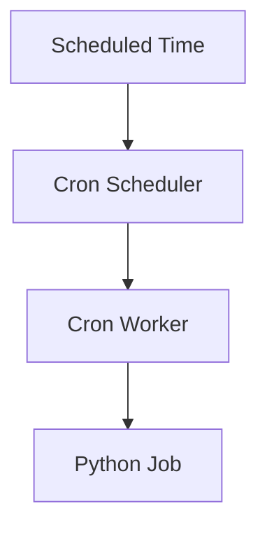

</div>

The job still runs through Odoo's server-side world. It is not mystical. It is simply not driven by the current browser click.

### WHY SEPARATE IT CONCEPTUALLY?

Interactive requests and scheduled jobs are different workloads.

You don't want a long background operation to unnecessarily block every browser request from Rami, Lina, and Noor during the workday.

Current Odoo deployment documentation describes dedicated cron workers/threads and configuration through `max_cron_threads`.

In a small training database the distinction can feel academic. In a busy Nova Retail day, a heavy scheduled job competing with every interactive click is no longer academic. Workload separation is kindness to users.

### WHY THIS MATTERS FOR AN ODOO DEVELOPER

If a nightly process never runs, do not begin by redesigning the Sales form. Ask whether scheduled actions are active, whether cron workers are running, and what the job log shows.

Automation that "only works when someone keeps Odoo open" is usually a design smell. Architecture gives you a cleaner place for that work.


### EXAMPLE

Every night at 02:00 for Nova Retail:

$$ \text{Scheduled Action} \rightarrow \text{Generate Report} $$

or:

$$ \text{Scheduled Action} \rightarrow \text{Process Pending Records} $$

The browser doesn't need to initiate these operations. SO0052-related reminders can still be prepared without Rami watching the screen.

Caveat: a scheduled job can still fail for ordinary business reasons such as missing data or access rights. "Cron ran" is not the same as "business outcome succeeded."

Wrong thinking:

> "Background jobs only run when a user presses a button."

Right thinking:

> "Cron work is scheduled server work. It may run with no interactive browser session attached."


### DIAGNOSTIC SCENE

A reminder never went out overnight. Someone asks Rami whether he left Odoo open.

That question reveals the wrong mental model. Scheduled work should not depend on a salesperson's browser tab. Inspect cron configuration and job evidence instead.

### COMMON MISTAKE

A beginner may assume cron jobs are triggered by browser clicks.

**Wrong:** No click means no automation.

**Correct:** Cron work is scheduled/background work. It should not depend on a salesperson keeping a browser open.

### RELEVANT RESOURCES

Here are the relevant resources for **4.15 CRON WORKERS**:

### 1. SCHEDULED ACTIONS IN ODOO 18

| | |
|---|---|
| **Source** | Cybrosys Technologies |
| **Reinforces** | Scheduled work is server-side, not browser-driven |

<div align="center">

[](https://www.youtube.com/watch?v=9HMwSNPww_c)

**Watch on YouTube:** [What are Scheduled Actions in Odoo 18](https://www.youtube.com/watch?v=9HMwSNPww_c)

</div>

---

### 2. CRON JOBS AND SCHEDULED ACTIONS

| | |
|---|---|
| **Source** | Odooistic |

<div align="center">

[](https://www.youtube.com/watch?v=HQ4XLCw-2tM)

**Watch on YouTube:** [Automate Tasks with Cron Jobs and Scheduled Actions](https://www.youtube.com/watch?v=HQ4XLCw-2tM)

</div>

---

### OFFICIAL DOCUMENTATION

| Topic | Documentation |
|---|---|
| **Scheduled Actions (ir.cron)** | [Actions (Odoo 19)](https://www.odoo.com/documentation/19.0/developer/reference/backend/actions.html) |
| **Cron workers in deployment** | [System configuration / Deploy (Odoo 19)](https://www.odoo.com/documentation/19.0/administration/on_premise/deploy.html) |

Full chapter index: [Resources.md](Resources.md)

---

## 4.16 LONG-POLLING / WEBSOCKET CONCEPTS

### INTUITION

This final section deals with server-to-client communication that may need to remain responsive over time.

At Nova Retail, Lina may need a live notification while she is already looking at a screen. Waiting for her to press Refresh is a weak design for chat, presence, or other near-real-time signals. Architecture therefore needs a communication style beyond one short request and one short response.

### DEFINITION

**Long polling** and **WebSockets** are communication concepts for keeping the client updated without forcing a full manual refresh.

Current Odoo 19 deployment documentation describes WebSocket traffic under `/websocket/` and a dedicated gevent/live-chat worker.

### ORDINARY HTTP PROBLEM

Normal request:

<div align="center">

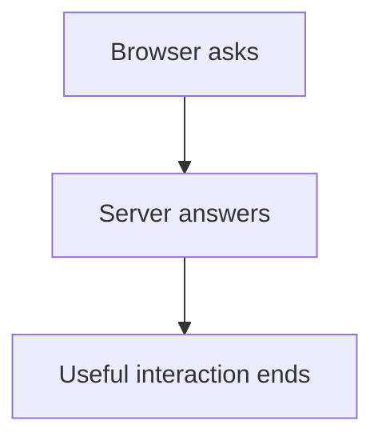

</div>

But imagine the server wants to tell the browser that another user sent a message, or that a live notification just occurred.

The browser shouldn't necessarily wait until the user manually refreshes. Ordinary short HTTP cycles are excellent for opening SO0052. They are awkward for "tell me the moment something happens."

### POLLING

One simple solution is:

$$ \text{Browser asks every few seconds: any new events?} $$

Problem: many unnecessary requests. Most answers are "nothing new," yet the client keeps knocking.

### LONG POLLING

Long polling improves this.

The client sends a request. The server keeps it open until new information appears, or a timeout occurs. Then the client reconnects.

Conceptually:

$$ \text{Client Request} \rightarrow \text{Wait} \rightarrow \text{Event} \rightarrow \text{Response} $$

### WEBSOCKET

WebSockets provide a more persistent bidirectional channel.

After connection establishment:

$$ \text{Browser} \leftrightarrow \text{Server} $$

can remain open.

Either side can communicate without creating an entirely new request cycle for every event.

### CURRENT ODOO IMPLEMENTATION NOTE

The roadmap deliberately says:

**Long-Polling / WebSocket Concepts.**

That is useful because older Odoo architecture discussions often use the long-polling terminology.

Current Odoo 19 deployment documentation describes WebSocket traffic under `/websocket/` and a dedicated gevent/live-chat worker in multi-process deployments, with the gevent port configurable separately.

So the historical conceptual progression is useful:

$$ \text{Polling} \rightarrow \text{Long Polling} \rightarrow \text{Persistent WebSocket Communication} $$

But for current Odoo deployment work, you should pay attention to its WebSocket configuration.

### WHY SPECIAL WORKERS HELP

WebSocket connections can remain open for a long time.

Imagine:

$$ 10{,}000 $$

long-lived connections.

You don't want each connection consuming a heavyweight ordinary request worker unnecessarily.

Event-oriented servers such as gevent are better suited for handling many such waiting connections.

Current Odoo production documentation therefore separates ordinary HTTP workers from the event-driven live/WebSocket worker in multi-process deployments.

That separation is a clue during incidents. If forms save and reports run, but live chatter or notifications stall, investigate the live lane before rewriting Sales Order Python.

### WHY THIS MATTERS FOR AN ODOO DEVELOPER

If live notifications fail while ordinary form saves still work, you may have a WebSocket or event-worker problem rather than a PostgreSQL problem.

That distinction prevents false rebuilds of Sales logic when the real issue is the live communication lane.


### EXAMPLE

Lina needs a notification when another user performs an action related to replenishment while Rami is working SO0052.

Ordinary HTTP follows request then response, then the useful interaction ends.

Without a longer-lived channel, the browser would have to ask repeatedly or wait for a manual refresh. Long polling and WebSockets exist to keep that communication responsive.

Caveat: live channels improve responsiveness. They do not replace authoritative server logic for business operations such as Confirm.

Wrong thinking:

> "WebSocket is just faster HTTP for the same interaction model."

Right thinking:

> "WebSocket-style channels support long-lived communication. That is a different lane from ordinary short request/response HTTP."


### DIAGNOSTIC SCENE

Ordinary saves work. Live notifications do not. A developer rewrites Confirm logic anyway.

That is a lane mistake. Persistent live communication can fail independently from short request/response business operations. Check the live/WebSocket path before blaming Sales Order methods.

### COMMON MISTAKE

A beginner may say "WebSocket is just faster HTTP."

**Wrong:** Same model, only quicker.

**Correct:** It provides a different persistent communication model. Ordinary screens can work while the WebSocket/event path fails, because they are not the same architectural lane.

### RELEVANT RESOURCES

Here are the relevant resources for **4.16 LONG-POLLING / WEBSOCKET CONCEPTS**:

### OFFICIAL DOCUMENTATION

| Topic | Documentation |
|---|---|
| **WebSocket / live chat worker / `/websocket/` routing** | [System configuration / Deploy (Odoo 19)](https://www.odoo.com/documentation/19.0/administration/on_premise/deploy.html) |
| **CLI `--gevent-port`, `--workers`, `--no-http`** | [Command-line interface (Odoo 19)](https://www.odoo.com/documentation/19.0/developer/reference/cli.html) |

Full chapter index: [Resources.md](Resources.md)

---

## BRINGING ALL OF CHAPTER 4 TOGETHER

We can now build a stronger picture of how Odoo actually runs.

Unit I explained business meaning and application flow. Chapter 4 answers a different question: when Rami opens Sales Order **SO0052** at Nova Retail, what software path makes that screen appear?

If you can narrate that path without collapsing every step into "the website talks to the database," the chapter did its job. The point is not memorizing buzzwords. The point is knowing where evidence lives when something fails.

Try telling the story twice: once for a successful open of SO0052, and once for a refused Confirm after `nova_order_gate` intervenes. The successful story teaches the happy path. The refused story teaches where business meaning sits.

### ONE COMPLETE REQUEST TRACE

#### STEP 1: BROWSER

Chrome (or another browser) is running. It hosts the client environment, but it does not own business rules or durable data. If Chrome cannot load the page at all, stop before blaming Sales Order Python.

#### STEP 2: ODOO WEB CLIENT

The Odoo JavaScript application detects that Rami wants SO0052 and prepares the client-side action. This is still presentation-side preparation, not final business authority.

#### STEP 3: HTTP / RPC

The client sends a request:

$$ \text{Browser} \rightarrow \text{HTTP / RPC} \rightarrow \text{Odoo Server} $$

If no request appears in Network evidence, the server never received the intention, no matter what the button looked like.

#### STEP 4: HTTP LAYER

Odoo determines route or request type, session, database, and user context. If this gateway rejects the call, later layers may never run.

#### STEP 5: WORKER

An available server worker processes the request. The worker is not "Rami's permanent process"; it handles work that is currently assigned to it. Concurrency starts to matter here in production-shaped deployments.

#### STEP 6: PYTHON RUNTIME

Odoo server code executes in Python. Custom policy from modules such as `nova_order_gate` can participate here.

#### STEP 7: REGISTRY AND ADDONS

The server uses the model definitions loaded for that database. It knows what `sale.order` means after installed modules and extensions have been combined.

#### STEP 8: ORM

The Python layer asks to retrieve Sales Order 52. The ORM handles model-level access to persistent data without forcing every developer to hand-write SQL for ordinary business reads. Access rights and model behavior travel with this path more naturally than with casual raw SQL.

#### STEP 9: POSTGRESQL

The required structured data is retrieved from PostgreSQL. That is the durable home for ordinary business records.

#### STEP 10: FILESTORE IF NECESSARY

If the order references attachments such as a customer PO PDF or scanned document, the binary content may come from the filestore while metadata remains in the database. A successful order open can still be incomplete if the attachment lane is broken.

#### STEP 11: RESPONSE

The server sends data back over HTTP.

#### STEP 12: WEB CLIENT RENDER

The JavaScript application renders the form. Rami sees **SO0052**.

That is one interactive path. Around it, Odoo also uses sessions for continuity, cron workers for scheduled jobs, and WebSocket or long-lived event channels for live updates. Those supporting pieces are not optional trivia; they explain why production behavior differs from a single-process mental model.

When Lina receives a live notification, or when a nightly job prepares reminders while nobody is logged in, you are seeing those supporting lanes. They do not replace the main request path. They surround it.

If you can retell this trace tomorrow without notes, you already have the architecture spine later chapters will hang tools on: environments, logs, debuggers, and module packaging.

---

## FULL ARCHITECTURE MODEL

Read this model as a map of ownership, not as a claim that every click visits every box with equal drama.

<div align="center">

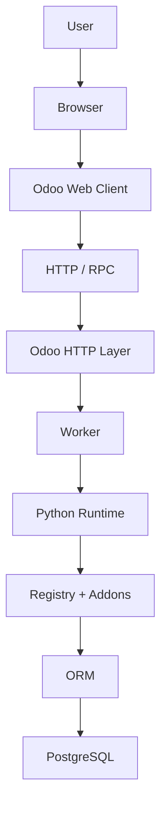

</div>

When Rami opens SO0052, the main path above is the ordinary interactive story. Supporting pieces surround that path and explain production behavior that a single-request cartoon cannot.

| Component | Role | Nova Retail clue |
| --- | --- | --- |
| **Filestore** | Binary attachment content | Customer PO PDF on SO0052 |
| **Sessions** | Request continuity for a logged-in interaction | Rami navigates Sales to Inventory without retyping passwords |
| **Cron workers** | Scheduled background work | Overnight reminder while nobody is clicking |
| **WebSocket / event worker** | Long-lived live communication | Lina receives a live notification without manual refresh |

The chapter-level map is still the three-tier spine:

<div align="center">

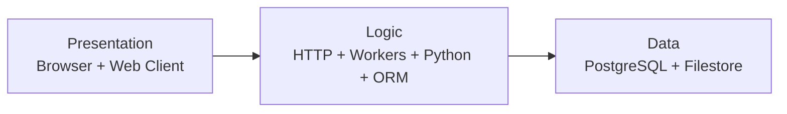

</div>

If you can place a symptom into one cell of that map, you are already thinking like an Odoo developer rather than like a person randomly restarting services.

One more reading tip: do not memorize the diagram as art. Use it as a checklist. Presentation first. Transport next. Server meaning next. Durable storage last. Supporting lanes when the symptom is continuity, schedule, binary files, or live updates.

---

## COMMON BEGINNER MISTAKES IN CHAPTER 4

Each topic above already includes a **Common Mistake** for that layer. This section gathers the chapter-level mistakes in one place for review.

Use it as a rapid self-test. For each wrong statement, ask which Nova Retail symptom would appear if somebody believed it during an incident.

### MISTAKE 1: THINKING THE BROWSER TALKS DIRECTLY TO POSTGRESQL

**Wrong:** Chrome connects straight to the database.

**Correct:**

$$ \text{Browser} \rightarrow \text{Odoo Server} \rightarrow \text{PostgreSQL} $$

The browser presents. The server decides. PostgreSQL persists structured business data. If this boundary disappears, `nova_order_gate` becomes optional decoration.

### MISTAKE 2: TREATING THE WEB CLIENT AND THE BROWSER AS THE SAME THING

**Wrong:** "Browser" and "Odoo web client" are interchangeable labels.

**Correct:** The browser is the host application. The Odoo web client is the JavaScript application running inside it. Chrome can be healthy while one Odoo client action is broken.

### MISTAKE 3: THINKING THE ORM IS THE DATABASE

**Wrong:** ORM equals PostgreSQL.

**Correct:** The ORM is an abstraction layer used by application code to interact with persistent records. PostgreSQL remains the relational database. Fixing storage blindly will not repair model behavior you skipped.

### MISTAKE 4: ASSUMING EVERYTHING IS STORED IN POSTGRESQL

**Wrong:** One database dump preserves the entire system state.

**Correct:** Structured records live in PostgreSQL. Attachments and binary content often involve the filestore. Backup thinking must include both, or SO0052 may return without its customer PO PDF.

### MISTAKE 5: THINKING AN ADDON IS ONLY A VISUAL PLUGIN

**Wrong:** Addons only change screens.

**Correct:** An addon can contribute Python, models, views, data, security, assets, controllers, and business behavior. That is why `nova_order_gate` can change Confirm outcomes, not only labels.

### MISTAKE 6: THINKING THE REGISTRY IS JUST ANOTHER DATABASE TABLE

**Wrong:** Registry equals one PostgreSQL table you can open and edit casually.

**Correct:** The registry is part of the runtime model-loading architecture: the effective model universe built from installed modules. Two databases with different modules can disagree about what `sale.order` means.

### MISTAKE 7: THINKING A WORKER BELONGS TO ONE USER

**Wrong:** Worker 3 is permanently "Rami's worker."

**Correct:** Workers process requests. The same worker can handle different users over time. Rami's next click may land elsewhere.

### MISTAKE 8: ASSUMING CRON JOBS ARE TRIGGERED BY BROWSER CLICKS

**Wrong:** Background jobs only run when somebody presses a button.

**Correct:** Cron work is scheduled or background server work. It may run with no interactive browser session attached. Overnight Nova Retail reminders do not require Rami to keep a tab open.

### MISTAKE 9: THINKING WEBSOCKET IS JUST FASTER HTTP

**Wrong:** WebSocket is merely an optimized request/response shortcut.

**Correct:** WebSocket-style channels support long-lived communication. That is a different interaction model from ordinary short request/response HTTP. Lina's live notification lane can fail while ordinary form saves still succeed.

---

## CHAPTER 4 MASTERY CHECK

Without rereading, explain what happens when Rami opens **SO0052** at Nova Retail.

Name, in order:

1. the presentation pieces involved,
2. the request transport,
3. the server-side processing pieces,
4. where structured data is retrieved,
5. where an attachment PDF would likely live if the order has one.

Then answer these traps:

- If the Network tab shows many calls, does that prove the browser queried PostgreSQL directly?
- If a cron job posts a reminder overnight, did a browser click start it?
- If a database dump restores records but attachments are missing, which architecture piece was incomplete?
- If Confirm is refused after `nova_order_gate` is installed on one database but not another, is the difference more likely in presentation styling or in registry/addon composition?
- If Rami's second click "forgets" memory that existed only inside one worker process, which architecture lesson did the design violate?

A complete answer separates presentation from logic from data, keeps the ORM distinct from PostgreSQL, and treats filestore, sessions, workers, cron, and WebSocket as supporting runtime evidence rather than optional extras. If you only list app names from Unit I, return to Sections 4.1, 4.7, 4.9, and the request trace above.

You should now be able to explain why this statement is incomplete:

> "Odoo is a website that saves data in a database."

A stronger explanation would be:

Odoo is a multitier application. The browser and web client present the interface, the Python application server applies business logic through workers, HTTP handling, the registry, and the ORM, and durable state is kept in PostgreSQL plus filestore-backed binaries, with sessions, cron, and live channels supporting continuity and background work.

If that explanation makes sense rather than merely sounding technical, then the architecture foundation is working. You are ready to turn the map into a machine you can run and inspect in Chapter 5.

Optional stretch: write a six-sentence incident note for Nova Retail where Confirm fails on SO0052 because `nova_order_gate` is installed in staging but missing in another database copy. Name the layers you would compare first. If your note mentions only "Odoo is broken," return to Sections 4.10 and 4.11.

---

## CHAPTER 4 SUMMARY

Chapter 4 moved us from:

$$ \text{What Odoo does} $$

to:

$$ \text{How Odoo operates internally} $$

For Nova Retail, that means you can now explain SO0052 as a journey across presentation, logic, and data rather than as a mysterious screen that "just saves." You also know why attachments, sessions, workers, cron, and live channels belong on the same architecture map.

We began with the three-tier map:

<div align="center">

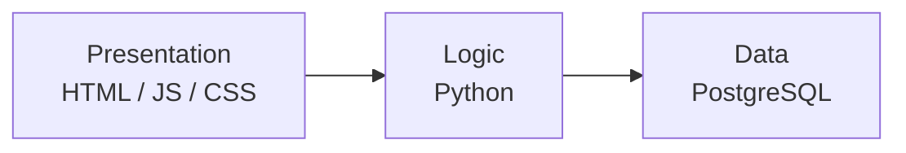

</div>

In Odoo that becomes approximately:

$$ \text{Browser / Web Client} \rightarrow \text{Python Odoo Server} \rightarrow \text{PostgreSQL} $$

We then filled in the realistic request path: HTTP and the HTTP layer, sessions, workers, the Python runtime, addons, the registry, the ORM, PostgreSQL, and the filestore. We also separated interactive request workers from cron workers and from long-lived WebSocket or event handling.

The single most important mental model is:

$$ \text{User Action} \rightarrow \text{Request} \rightarrow \text{Server Logic} \rightarrow \text{ORM} \rightarrow \text{Data} \rightarrow \text{Response} $$

Keep the supporting cast beside that spine: sessions for continuity, filestore for binaries, workers for concurrency, cron for scheduled work, and WebSocket or long-lived channels for live updates.

At this point we understand the architecture map and the evidence each layer leaves. What we have not yet done is install and operate a local environment we can run, inspect, and debug.

<div align="center">

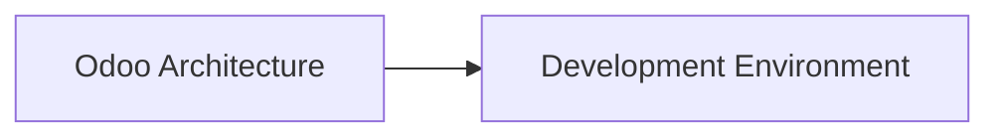

</div>

Chapter 5 is where that map becomes a machine you control: **Python environment**, **virtual environments**, **dependencies**, **PostgreSQL setup**, **Odoo source**, **configuration**, **addons_path**, **custom addons**, **database creation**, **developer mode**, **logging**, and **IDE / debugger setup**.

Until then, practice naming layers out loud using Nova Retail scenes. If SO0052 misbehaves, say whether you suspect browser, web client, HTTP, worker, Python, registry/addons, ORM, PostgreSQL, filestore, session, cron, or live channels. Precision is already a skill.

When you are ready to test yourself on this chapter, work through the [Exercise](Exercise.md) and [Project](Project.md). Use [Resources.md](Resources.md) whenever you need the official docs or verified supporting materials for a layer.
