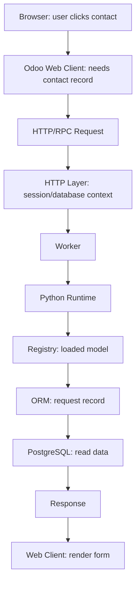

# CHAPTER 4 EXERCISE

Answer before scrolling to the solution. For each response, give the concept, scenario evidence, and a reason. Self-score each original numbered question or named part: 0 = missing/incorrect, 1 = correct label without reasoning, 2 = correct explanation using evidence. Rework every answer below 2. The solution is one defensible model, not wording to memorize; clearly stated alternative assumptions can support a different answer.

Try answering these without looking back at Content.md first. Answer in your own words, then compare with the complete solution at the bottom of this file.

For official architecture docs, verified videos, GitHub repos, and practice environments, see [Resources.md](Resources.md).

---

## TABLE OF CONTENTS

- [Exercise 1: Trace the Failure](#exercise-1-trace-the-failure)
- [Exercise 2: Database Direct Access](#exercise-2-database-direct-access)
- [Exercise 3: Missing Attachment](#exercise-3-missing-attachment)
- [Exercise 4: Custom Addon](#exercise-4-custom-addon)
- [Exercise 5: Multi-Database](#exercise-5-multi-database)
- [Exercise 6: Background Task](#exercise-6-background-task)
- [Exercise 7: High Concurrency](#exercise-7-high-concurrency)
- [Exercise 8: Repeated Login](#exercise-8-repeated-login)
- [Exercise 9: Live Notification](#exercise-9-live-notification)
- [Exercise 10: Full Request Trace](#exercise-10-full-request-trace)
- [Complete Solution](#chapter-4-exercise-complete-solution)

---

## EXERCISE 1: TRACE THE FAILURE

Name at least three architectural layers you would consider first, and one reason PostgreSQL should not be blamed automatically.

Rami opens Odoo and receives:

**500 Internal Server Error**

The browser itself is working and other websites load normally.

Explain which architectural layers you would initially consider and why you should not immediately blame PostgreSQL.

---

## EXERCISE 2: DATABASE DIRECT ACCESS

Give at least four distinct problems. For each, state the architectural risk and what a correct client → server → database path prevents.

A junior developer proposes:

"To make Odoo faster, let's make the JavaScript frontend connect directly to PostgreSQL."

Identify at least four architectural or security problems with this idea.

---

## EXERCISE 3: MISSING ATTACHMENT

Name the first storage component to inspect and the evidence that structured Sales Order data is already available.

A Sales Order opens correctly, but its attached PDF returns a missing-file error.

The rest of the Sales Order data appears normally.

Which storage component would you investigate first, and why?

---

## EXERCISE 4: CUSTOM ADDON

Explain each role in one sentence and show the path from discovery to record operations.

Your company installs:

`nova_order_gate`

which extends the Sales Order model.

Explain the roles of:

- addon discovery,
- Python loading,
- registry,
- ORM,

in making the new behavior available.

---

## EXERCISE 5: MULTI-DATABASE

State whether the registries are identical and give the installed-module evidence that decides your answer.

One Odoo server hosts:

- Database A: Sales + Inventory
- Database B: Sales + Manufacturing + custom addon

Would you expect their effective model registries to be identical? Explain.

---

## EXERCISE 6: BACKGROUND TASK

Name the appropriate mechanism and state why a browser session is not required.

A report must be generated automatically every night at 02:00.

Should this depend on a salesperson keeping their browser open?

Which architectural mechanism is more appropriate?

---

## EXERCISE 7: HIGH CONCURRENCY

Compare multi-process workers with a simple development-server model using concurrency evidence.

A production Odoo system receives requests from many users.

Why would a multi-process worker architecture normally be more appropriate than relying only on the simple development server model?

---

## EXERCISE 8: REPEATED LOGIN

Name the chapter concept and at least two concrete places that could break continuity.

Rami logs in successfully but Odoo asks him to authenticate again on every single navigation action.

Which chapter concept would you investigate?

Explain why.

---

## EXERCISE 9: LIVE NOTIFICATION

Explain why one-off request/response HTTP is inconvenient and which communication concept helps.

Lina receives a notification immediately when another user performs an action.

Why would ordinary one-off request/response HTTP alone be inconvenient for this use case?

What communication concept helps?

---

## EXERCISE 10: FULL REQUEST TRACE

Use at least: Browser, Web Client, HTTP, Worker, Python, Registry, ORM, PostgreSQL, Response.

A user clicks:

**Customers → Meridian Supplies**

Trace the request from the browser to PostgreSQL and back using at least these concepts:

- Browser
- Web Client
- HTTP
- Worker
- Python
- Registry
- ORM
- PostgreSQL
- Response

---

## CHAPTER 4 EXERCISE COMPLETE SOLUTION

### EXERCISE 1: TRACE THE FAILURE

**Concept:** a 500 is a server-side failure signal, not a database diagnosis.

**Scenario evidence:** Rami's browser and other websites work, so the client machine can still browse. The failure appears when talking to Odoo.

**Reason:** Start with layers that participate in the request: HTTP layer, application server, Python / addon code, ORM, and only then PostgreSQL. A custom addon can raise a Python exception before meaningful SQL runs. Logs and stack traces decide the next step.

Do not assume:

$$ 500 \Rightarrow \text{Database Problem} $$

Full credit names at least three layers and explains why PostgreSQL is not automatic.

### EXERCISE 2: DATABASE DIRECT ACCESS

**Concept:** the application server is the control point between client and data.

**Scenario evidence:** a junior proposes browser JavaScript → PostgreSQL directly "for speed."

**Reason:** at least four problems:

1. **Credentials exposure** — the client would need database access information.
2. **Business-rule bypass** — confirm, validate, and workflow rules in Python would be skippable.
3. **Security-rule bypass** — record rules and access rights become much harder to enforce.
4. **Tight coupling** — frontend would know raw schema; schema changes would break clients.

The correct path:

$$ \text{Client} \rightarrow \text{Application Server} \rightarrow \text{Database} $$

Speed without that path is not Odoo architecture; it is an unprotected database client.

### EXERCISE 3: MISSING ATTACHMENT

**Concept:** structured records and binary files are different durable stores.

**Scenario evidence:** the Sales Order opens correctly, so PostgreSQL-backed fields are loading. Only the attached PDF fails.

**Reason:** investigate the **filestore** together with attachment metadata. The partial success is the clue:

$$ \text{Order Fields OK} + \text{PDF Missing} \Rightarrow \text{Filestore / Attachment Path} $$

not "the whole database is gone."

### EXERCISE 4: CUSTOM ADDON

**Concept:** custom behavior becomes real through discovery → Python → registry → ORM.

**Scenario evidence:** `nova_order_gate` extends Sales Order.

**Reason:**

- **Addon discovery:** Odoo finds the module because its parent directory is on `addons_path` and the module is installed.
- **Python loading:** the module's Python defines the extension and business logic.
- **Registry:** installed definitions compose the effective `sale.order` model for that database.
- **ORM:** later record operations go through that composed model, not through a side channel.

$$ \text{Addon} \rightarrow \text{Python Definitions} \rightarrow \text{Registry} \rightarrow \text{ORM Record Operations} $$

### EXERCISE 5: MULTI-DATABASE

**Concept:** registries are per database, shaped by installed modules.

**Scenario evidence:** Database A has Sales + Inventory; Database B has Sales + Manufacturing + a custom addon.

**Reason:** do not expect identical effective registries. Shared server process does not mean shared model universe. Installed modules decide which models and extensions exist.

Database A:

$$ \{\text{Sales, Inventory}\} $$

Database B:

$$ \{\text{Sales, Manufacturing, Custom Addon}\} $$

### EXERCISE 6: BACKGROUND TASK

**Concept:** scheduled work belongs to cron workers, not browser sessions.

**Scenario evidence:** a report must run every night at 02:00.

**Reason:** a salesperson keeping a browser open is the wrong dependency. Browsers close, laptops sleep, sessions expire. Use scheduled / cron architecture:

$$ 02{:}00 \rightarrow \text{Cron} \rightarrow \text{Server-side Job} $$

### EXERCISE 7: HIGH CONCURRENCY

**Concept:** production concurrency needs multiple workers, not a single simple development path.

**Scenario evidence:** many users send requests at once.

**Reason:** multi-process workers can handle requests concurrently across processes and make better use of multi-core hardware. One slow request need not freeze every other user. The simple development-server model is convenient for learning, not a production concurrency design.

$$ \text{Request Queue} \rightarrow \{W_1, W_2, W_3, \dots\} $$

### EXERCISE 8: REPEATED LOGIN

**Concept:** sessions preserve authenticated continuity between requests.

**Scenario evidence:** Rami authenticates successfully, then must log in again on every navigation.

**Reason:** investigate **session** management. Continuity can break in session storage, cookies, proxy configuration, or premature invalidation. The symptom is not "Odoo forgot Sales"; it is "identity is not surviving the next request."

### EXERCISE 9: LIVE NOTIFICATION

**Concept:** live updates need a long-lived channel, not only one-off HTTP.

**Scenario evidence:** Lina receives a notification immediately when another user acts.

**Reason:** ordinary HTTP is request → response. After the response, the server has no convenient open path to push a later event unless the client asks again. Long-lived mechanisms such as WebSockets support:

$$ \text{Client} \leftrightarrow \text{Server} $$

over a persistent connection. That is a different communication model, not "faster HTTP."

### EXERCISE 10: FULL REQUEST TRACE

**Concept:** one UI click travels the full architecture path.

**Scenario evidence:** user opens **Customers → Meridian Supplies**.

**Reason:**

1. **Browser:** user clicks the contact.
2. **Odoo Web Client:** JavaScript decides the contact record must load.
3. **HTTP / RPC:** the client sends the request.
4. **HTTP layer:** Odoo binds session / database / user context.
5. **Worker:** an available worker handles the request.
6. **Python runtime:** server code executes.
7. **Registry:** the effective contact model for this database is available.
8. **ORM:** the record is requested through the model layer.
9. **PostgreSQL:** stored contact data is read.
10. **Response / Web Client:** data returns and the form renders.

A complete answer uses those layers in order and does not jump from browser click straight to SQL.
