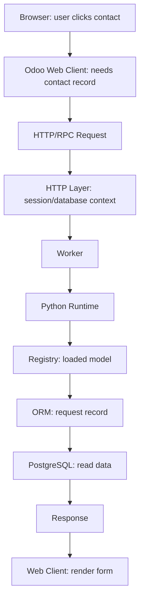

# CHAPTER 4 EXERCISE

Answer before scrolling to the solution. For each response, give the concept, scenario evidence, and a reason. Self-score each original numbered question or named part: 0 = missing/incorrect, 1 = correct label without reasoning, 2 = correct explanation using evidence. Rework every answer below 2. The solution is one defensible model, not wording to memorize; clearly stated alternative assumptions can support a different answer.

Try answering these without looking back at Content.md first. Answer in your own words, then compare with the complete solution at the bottom of this file.

For official architecture docs, verified videos, GitHub repos, and practice environments, see [Resources.md](Resources.md).

---

## TABLE OF CONTENTS

- [Exercise 1: Trace the Failure](#exercise-1-trace-the-failure)
- [Exercise 2: Database Direct Access](#exercise-2-database-direct-access)
- [Exercise 3: Missing Attachment](#exercise-3-missing-attachment)
- [Exercise 4: Custom Addon](#exercise-4-custom-addon)
- [Exercise 5: Multi-Database](#exercise-5-multi-database)
- [Exercise 6: Background Task](#exercise-6-background-task)
- [Exercise 7: High Concurrency](#exercise-7-high-concurrency)
- [Exercise 8: Repeated Login](#exercise-8-repeated-login)
- [Exercise 9: Live Notification](#exercise-9-live-notification)
- [Exercise 10: Full Request Trace](#exercise-10-full-request-trace)
- [Complete Solution](#chapter-4-exercise-complete-solution)

---

## EXERCISE 1: TRACE THE FAILURE

Name at least three architectural layers you would consider first, and one reason PostgreSQL should not be blamed automatically.

Rami opens Odoo and receives:

**500 Internal Server Error**

The browser itself is working and other websites load normally.

Explain which architectural layers you would initially consider and why you should not immediately blame PostgreSQL.

---

## EXERCISE 2: DATABASE DIRECT ACCESS

Give at least four distinct problems. For each, state the architectural risk and what a correct client → server → database path prevents.

A junior developer proposes:

"To make Odoo faster, let's make the JavaScript frontend connect directly to PostgreSQL."

Identify at least four architectural or security problems with this idea.

---

## EXERCISE 3: MISSING ATTACHMENT

Name the first storage component to inspect and the evidence that structured Sales Order data is already available.

A Sales Order opens correctly, but its attached PDF returns a missing-file error.

The rest of the Sales Order data appears normally.

Which storage component would you investigate first, and why?

---

## EXERCISE 4: CUSTOM ADDON

Explain each role in one sentence and show the path from discovery to record operations.

Your company installs:

`nova_order_gate`

which extends the Sales Order model.

Explain the roles of:

- addon discovery,
- Python loading,
- registry,
- ORM,

in making the new behavior available.

---

## EXERCISE 5: MULTI-DATABASE

State whether the registries are identical and give the installed-module evidence that decides your answer.

One Odoo server hosts:

- Database A: Sales + Inventory
- Database B: Sales + Manufacturing + custom addon

Would you expect their effective model registries to be identical? Explain.

---

## EXERCISE 6: BACKGROUND TASK

Name the appropriate mechanism and state why a browser session is not required.

A report must be generated automatically every night at 02:00.

Should this depend on a salesperson keeping their browser open?

Which architectural mechanism is more appropriate?

---

## EXERCISE 7: HIGH CONCURRENCY

Compare multi-process workers with a simple development-server model using concurrency evidence.

A production Odoo system receives requests from many users.

Why would a multi-process worker architecture normally be more appropriate than relying only on the simple development server model?

---

## EXERCISE 8: REPEATED LOGIN

Name the chapter concept and at least two concrete places that could break continuity.

Rami logs in successfully but Odoo asks him to authenticate again on every single navigation action.

Which chapter concept would you investigate?

Explain why.

---

## EXERCISE 9: LIVE NOTIFICATION

Explain why one-off request/response HTTP is inconvenient and which communication concept helps.

Lina receives a notification immediately when another user performs an action.

Why would ordinary one-off request/response HTTP alone be inconvenient for this use case?

What communication concept helps?

---

## EXERCISE 10: FULL REQUEST TRACE

Use at least: Browser, Web Client, HTTP, Worker, Python, Registry, ORM, PostgreSQL, Response.

A user clicks:

**Customers → Meridian Supplies**

Trace the request from the browser to PostgreSQL and back using at least these concepts:

- Browser
- Web Client
- HTTP
- Worker
- Python
- Registry
- ORM
- PostgreSQL
- Response

---

## CHAPTER 4 EXERCISE COMPLETE SOLUTION

### EXERCISE 1: TRACE THE FAILURE

A 500 error indicates that the server-side request failed, but many components could cause that.

Consider first:

- HTTP layer,
- application server,
- Python code,
- installed addons,
- ORM,
- PostgreSQL.

Database failure is only one possibility.

For example, a custom addon could raise a Python exception before any meaningful SQL operation occurs.

Therefore troubleshoot from evidence rather than assuming:

$$ 500 \Rightarrow \text{Database Problem} $$

### EXERCISE 2: DATABASE DIRECT ACCESS

At least four problems appear.

1. **Database credentials**

   The client would need database access information.

   That exposes sensitive credentials.

2. **Business-rule bypass**

   Users could bypass Odoo's Python business logic.

3. **Security-rule bypass**

   Application authorization would become much harder to enforce safely.

4. **Tight coupling**

   Frontend code would need knowledge of raw database schema.

   Any schema change could break the client.

The correct architecture is:

$$ \text{Client} \rightarrow \text{Application Server} \rightarrow \text{Database} $$

### EXERCISE 3: MISSING ATTACHMENT

Investigate the **filestore**, together with its database attachment metadata.

Why?

Because the structured Sales Order data is successfully loading from PostgreSQL.

The failure is specifically related to binary attachment content.

That strongly suggests investigating:

$$ \text{Attachment Metadata} + \text{Filestore} $$

rather than assuming the entire database is unavailable.

### EXERCISE 4: CUSTOM ADDON

**Addon discovery**

Odoo finds the module through configured addon paths.

**Python loading**

The module's Python files define extensions/business logic.

**Registry**

The model extension becomes part of the final effective model available for that database.

**ORM**

Requests operating on Sales Order records use the resulting model through Odoo's ORM.

Conceptually:

$$ \text{Addon} \rightarrow \text{Python Definitions} \rightarrow \text{Registry} \rightarrow \text{ORM Record Operations} $$

### EXERCISE 5: MULTI-DATABASE

Not necessarily.

Database A:

$$ \{\text{Sales, Inventory}\} $$

Database B:

$$ \{\text{Sales, Manufacturing, Custom Addon}\} $$

Because installed modules affect available models and extensions, their effective model environments can differ.

### EXERCISE 6: BACKGROUND TASK

A scheduled/cron job.

The task should not depend on:

- a user being logged in,
- a browser remaining open.

Conceptually:

$$ 02{:}00 \rightarrow \text{Cron} \rightarrow \text{Server-side Job} $$

### EXERCISE 7: HIGH CONCURRENCY

Multiple workers allow requests to be processed concurrently across multiple server processes and make better use of multi-core hardware.

One slow request does not necessarily prevent every other request from being processed.

For production workloads:

$$ \text{Request Queue} \rightarrow \{W_1, W_2, W_3, \dots\} $$

is more scalable than treating the application as one serial execution path.

### EXERCISE 8: REPEATED LOGIN

Investigate **sessions**.

A session should preserve continuity between authenticated requests.

Possible problems could involve:

- session storage,
- cookies,
- proxy configuration,
- session invalidation.

The key architectural layer is session management.

### EXERCISE 9: LIVE NOTIFICATION

Ordinary HTTP normally follows:

$$ \text{Request} \rightarrow \text{Response} $$

The server cannot conveniently push a new event at an arbitrary later moment unless the client asks again.

Long-lived mechanisms such as WebSockets allow:

$$ \text{Client} \leftrightarrow \text{Server} $$

communication over a persistent connection.

### EXERCISE 10: FULL REQUEST TRACE

1. **Browser:** the user clicks the contact.
2. **Odoo Web Client:** JavaScript determines that the contact record needs to be loaded.
3. **HTTP/RPC request:** the client sends the request.
4. **HTTP layer:** Odoo interprets request/session/database context.
5. **Worker:** an available worker processes it.
6. **Python runtime:** server-side code executes.
7. **Registry:** the appropriate loaded model definition is available.
8. **ORM:** the record is requested through the model layer.
9. **PostgreSQL:** stored contact data is read.
10. **Response / Web Client:** the result returns and the form is rendered.
