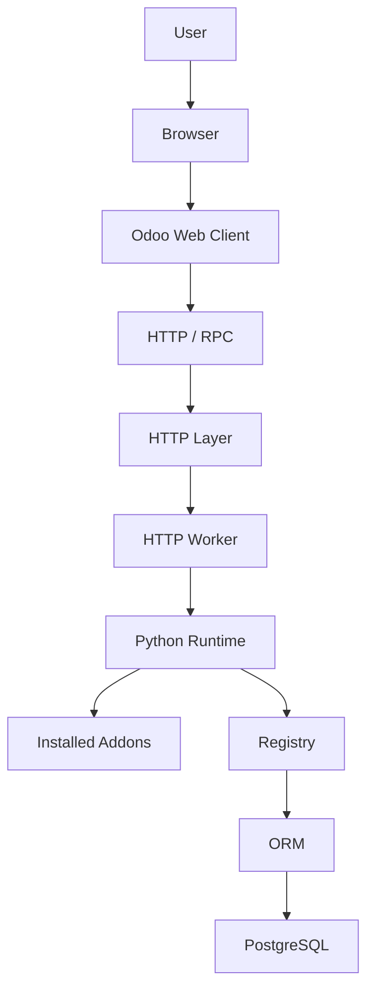
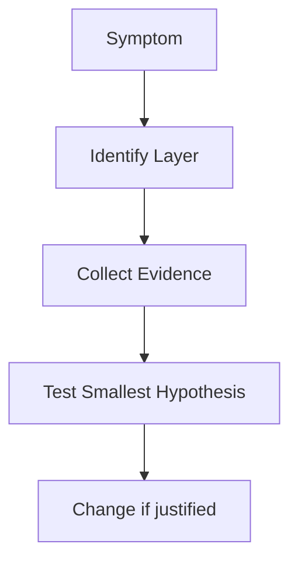

# CHAPTER 4 PROJECT: ODOO REQUEST ARCHITECTURE INVESTIGATION

This is an architecture-analysis project. You are not allowed to modify PostgreSQL, reinstall Odoo, change random configuration, delete files, or blame a component without evidence. Complete all seven tasks with a named layer, the symptom evidence, and one test that would confirm or reject each hypothesis. Self-score each task: 0 = missing/incorrect, 1 = correct label without reasoning, 2 = correct explanation using evidence. Rework every answer below 2.

A project is justified for this chapter because architecture is best learned by tracing a real system rather than memorizing components.

For architecture references when added, see [Resources.md](Resources.md).

---

## TABLE OF CONTENTS

- [Case Study](#case-study)
- [Project Goals](#project-goals)
- [Constraints](#constraints)
- [Task 1: Architecture Map](#task-1-architecture-map)
- [Task 2: Trace a Sales Order](#task-2-trace-a-sales-order)
- [Task 3: Investigate Problem A](#task-3-investigate-problem-a)
- [Task 4: Investigate Problem B](#task-4-investigate-problem-b)
- [Task 5: Investigate Problem C](#task-5-investigate-problem-c)
- [Task 6: Classify Persistent State](#task-6-classify-persistent-state)
- [Task 7: Explain Safety](#task-7-explain-safety)
- [Complete Solution](#chapter-4-project-complete-solution)

---

## CASE STUDY

Nova Retail Group runs an on-premise Odoo deployment.

Users report three problems:

### PROBLEM A

Sales Orders sometimes take several seconds to open.

### PROBLEM B

Sales Orders open correctly, but several attached PDFs are missing after a recent server restore.

### PROBLEM C

Ordinary screens work, but live notifications are no longer appearing.

The IT/development team asks you to create an architecture investigation document before anyone changes the system.

---

## PROJECT GOALS

You must demonstrate that you understand how Odoo requests move through the architecture and identify the likely architectural region for each problem.

---

## CONSTRAINTS

You are not allowed to:

- modify PostgreSQL,
- reinstall Odoo,
- change random configuration,
- delete files,
- blame a component without evidence.

This is an architecture-analysis project.

---

## TASK 1: ARCHITECTURE MAP

Include every listed component and show the main request path plus the supporting pieces.

Produce a conceptual map containing:

- Browser
- Odoo Web Client
- HTTP
- Odoo Application Server
- Worker
- Python Runtime
- Addons
- Registry
- ORM
- PostgreSQL
- Filestore
- Sessions
- Cron Workers
- WebSocket worker

---

## TASK 2: TRACE A SALES ORDER

Name each stage in order and state what happens at that stage for SO0052.

Trace:

Rami opens **SO0052**.

Explain each architecture stage.

---

## TASK 3: INVESTIGATE PROBLEM A

List at least five architectural places that could cause a slow Sales Order request. Do not choose a single root cause yet. For each place, state one piece of evidence you would collect.

Identify at least five different architectural places that could cause a slow Sales Order request.

Do not choose the root cause yet.

---

## TASK 4: INVESTIGATE PROBLEM B

Explain why normal Sales Order fields can load while PDF bytes fail, and what a correct restore must preserve.

Explain why missing attachments after restore could indicate a filestore/backup problem even if normal database records still exist.

---

## TASK 5: INVESTIGATE PROBLEM C

Separate ordinary HTTP workers from the live/WebSocket path and name at least three places to inspect first.

Explain why normal HTTP pages could work while real-time notifications fail.

---

## TASK 6: CLASSIFY PERSISTENT STATE

Place each item primarily in the correct conceptual area. One primary location only.

| Item | Main conceptual location |
| --- | --- |
| Sales Order amount | |
| Customer name | |
| PDF attachment bytes | |
| Loaded model definitions | |
| Logged-in interaction state | |
| Scheduled nightly task definition/execution | |
| Live notification connection | |

---

## TASK 7: EXPLAIN SAFETY

Contrast evidence-based troubleshooting with guess → restart/delete/reinstall, using at least one risk created by premature changes.

Explain why troubleshooting should follow:

$$ \text{Evidence} \rightarrow \text{Layer Identification} \rightarrow \text{Test} \rightarrow \text{Change} $$

rather than:

$$ \text{Guess} \rightarrow \text{Restart/Delete/Reinstall} $$

---

## CHAPTER 4 PROJECT COMPLETE SOLUTION

### TASK 1: ARCHITECTURE MAP

A strong architecture map is:

Alongside the main flow:

| Component | Role |
| --- | --- |
| **Filestore** | Relevant binary content |
| **Sessions** | User/request continuity |
| **Cron workers** | Scheduled tasks |
| **WebSocket / event worker** | Long-lived live communication |

### TASK 2: OPENING SO0052

Rami clicks Sales Order SO0052.

| Stage | What happens |
| --- | --- |
| **Browser** | Receives his interaction |
| **Web Client** | Determines that the Sales Order form/data is required |
| **HTTP** | Sends the request |
| **HTTP Layer** | Processes routing, session, authentication, database context |
| **Worker** | Executes the request |
| **Python** | Runs Odoo's server logic |
| **Registry** | Provides the effective `sale.order` model loaded for this database |
| **ORM** | Retrieves/works with the record |
| **PostgreSQL** | Provides structured data |
| **Response** | Server returns data |
| **Web Client** | Renders the Sales Order |

### TASK 3: POSSIBLE CAUSES OF SLOW SALES ORDER REQUESTS

Without prematurely selecting a root cause, investigate areas such as:

1. **Network/HTTP latency**

   Maybe the request itself is slow reaching the server.

   Evidence: request timing before Odoo processing begins.

2. **Worker saturation**

   All workers may already be busy.

   Evidence: worker utilization / waiting request counts.

3. **Slow Python/custom addon logic**

   A custom method could perform expensive work.

   Evidence: server logs / stack traces during open.

4. **ORM inefficiency**

   Poor record operations could trigger excessive queries.

   Evidence: query count and duration while opening SO0052.

5. **PostgreSQL**

   Queries could be slow due to locks, indexes, resource pressure, or inefficient queries.

   Evidence: database wait events and slow query logs.

6. **Filestore**

   If many attachments are being resolved/loaded, storage latency could contribute.

   Evidence: attachment-related I/O timing.

The correct approach is:

$$ \text{Measure} \rightarrow \text{Locate} \rightarrow \text{Explain} $$

not:

"Odoo is slow, therefore PostgreSQL is bad."

### TASK 4: MISSING PDFS AFTER RESTORE

Normal Sales Order fields work.

That means PostgreSQL may have restored successfully.

However the attachments' actual binary files may live in the filestore.

If the restore contained:

$$ \text{Database} $$

but not the matching:

$$ \text{Filestore} $$

the structured records can exist while attachment content is missing.

Therefore a proper backup must preserve the relationship between:

**Database** and **Filestore**

when filestore-backed content is in use.

### TASK 5: SCREENS WORK BUT NOTIFICATIONS FAIL

Normal pages use ordinary HTTP workers.

Real-time/live communication can use the WebSocket/event path.

Therefore:

$$ \text{Normal HTTP Working} $$

does not guarantee:

$$ \text{WebSocket Path Working} $$

Potential architectural areas include:

- reverse proxy routing,
- WebSocket path,
- gevent worker,
- dedicated port,
- connection upgrade handling.

Thus the symptoms point toward the event communication layer rather than PostgreSQL first.

### TASK 6: STATE CLASSIFICATION

| Item | Main conceptual location |
| --- | --- |
| Sales Order amount | PostgreSQL |
| Customer name | PostgreSQL |
| PDF bytes | Filestore when filestore-backed |
| Loaded model definitions | Registry / runtime |
| Logged-in interaction state | Session |
| Scheduled nightly execution | Cron subsystem |
| Live notification connection | WebSocket / event communication |

### TASK 7: SAFE TROUBLESHOOTING

Suppose we guess:

PostgreSQL is broken.

and restart/reconfigure it immediately.

We might:

- introduce downtime,
- destroy useful evidence,
- make the problem worse,
- change unrelated behavior.

Instead:

That is both better architecture thinking and better production engineering.

---

## UP NEXT: CHAPTER 5

Chapter 4 answered:

**What components make an Odoo system work?**

We now understand the path:

$$ \text{Browser} \rightarrow \text{HTTP} \rightarrow \text{Python/Odoo} \rightarrow \text{ORM} \rightarrow \text{PostgreSQL} $$

and the supporting roles of:

- addons,
- registry,
- filestore,
- sessions,
- workers,
- cron,
- WebSockets.

But right now this is still mostly conceptual.

The next problem is practical:

**How do we create an actual development environment where we can run, inspect, debug, and modify this architecture ourselves?**

That is exactly why the roadmap moves next to:

**Chapter 5: Development Environment**

where we will learn:

- Python environment,
- virtual environments,
- dependencies,
- PostgreSQL setup,
- Odoo source,
- Git clone,
- Odoo configuration,
- addons_path,
- custom addons directory,
- database creation,
- developer modes,
- logging,
- IDE setup,
- debugger setup.
