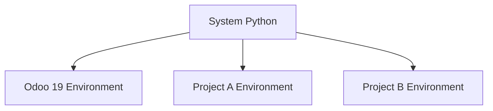
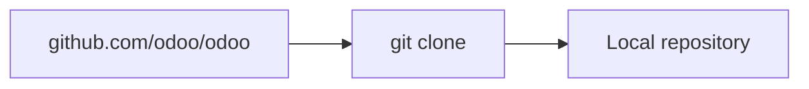
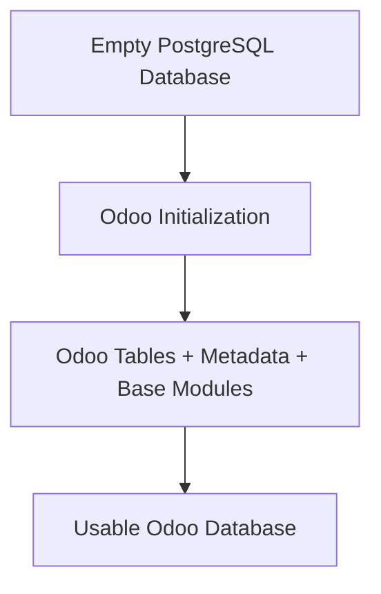
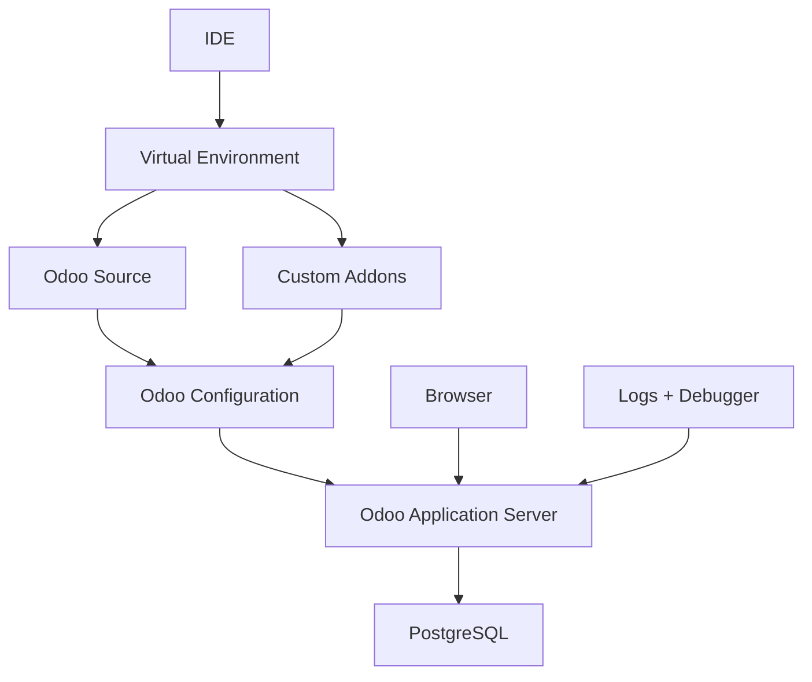
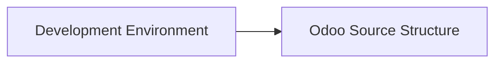

# UNIT II: HOW ODOO ACTUALLY WORKS

## CHAPTER 5: DEVELOPMENT ENVIRONMENT

Chapter 4 taught the architecture:

$$ \text{Browser} \rightarrow \text{Odoo Server} \rightarrow \text{ORM} \rightarrow \text{PostgreSQL} $$

Chapter 5 answers the practical question: how do we create a local environment where we can run, inspect, modify, and debug Odoo?

References use Odoo 19.0 as the teaching baseline. Official source-install documentation currently requires **Python 3.10 or newer** and **PostgreSQL 13 or newer** for source installations. Commands and paths in this chapter are teaching models; adjust them to your OS and absolute paths.

Chapter 5 is practical: you build an inspectable workspace before learning to navigate Odoo source in Chapter 6.

---

## CHAPTER 5 TABLE OF CONTENTS

- [**5.1** Python Environment](#51-python-environment)
- [**5.2** Python Virtual Environments](#52-python-virtual-environments)
- [**5.3** Python Dependencies](#53-python-dependencies)
- [**5.4** PostgreSQL Setup](#54-postgresql-setup)
- [**5.5** PostgreSQL User](#55-postgresql-user)
- [**5.6** Odoo Source](#56-odoo-source)
- [**5.7** Git Clone](#57-git-clone)
- [**5.8** Odoo Configuration File](#58-odoo-configuration-file)
- [**5.9** addons_path](#59-addons_path)
- [**5.10** Custom Addons Directory](#510-custom-addons-directory)
- [**5.11** Database Creation](#511-database-creation)
- [**5.12** Developer Mode](#512-developer-mode)
- [**5.13** Developer Mode with Assets](#513-developer-mode-with-assets)
- [**5.14** Logging](#514-logging)
- [**5.15** IDE Setup](#515-ide-setup)
- [**5.16** Debugger Setup](#516-debugger-setup)
- [Bringing All of Chapter 5 Together](#bringing-all-of-chapter-5-together)
- [Development Environment Architecture](#development-environment-architecture)
- [Common Beginner Mistakes in Chapter 5](#common-beginner-mistakes-in-chapter-5)
- [Chapter 5 Mastery Check](#chapter-5-mastery-check)
- [Chapter 5 Summary](#chapter-5-summary)
- [**Free Learning Resources**](Resources.md)

**Then we will complete:**

- [Free Learning Resources](Resources.md)
- [Chapter Exercise](Exercise.md)
- [Chapter Project](Project.md)

---

## BEFORE WE START: WHAT A DEVELOPMENT ENVIRONMENT IS

A development environment is not simply:

> Install Python.

It is the complete technical workspace required to develop software safely.

For Odoo, a useful mental model is:

$$ \text{Odoo Dev Environment} = \text{Python} + \text{Dependencies} + \text{PostgreSQL} + \text{Odoo Source} + \text{Configuration} + \text{Custom Addons} + \text{IDE} + \text{Debugger} $$

Each piece has a separate responsibility. If one is missing, development becomes difficult or impossible.

---

## 5.1 PYTHON ENVIRONMENT

### INTUITION

Odoo's server-side code is written primarily in Python.

When we run Odoo from source, something must execute that Python code. That something is the Python runtime installed on the machine.

### DEFINITION

A **Python environment**, at the simplest level, includes the Python interpreter, `pip`, installed Python packages, environment variables, and executable paths.

### CHECKING PYTHON

For example:

```bash
python3 --version
```

might return:

```text
Python 3.12.x
```

and:

```bash
pip3 --version
```

confirms that the Python package installer is available.

For Odoo 19, official source-install documentation currently requires Python 3.10 or newer.

### WHY PYTHON VERSION MATTERS

Python versions are not always perfectly interchangeable.

Suppose an application depends on syntax or libraries available only in newer Python releases:

$$ \text{Older Python} \rightarrow \text{Compatibility Failure} $$

Similarly, some dependency versions may not yet support a very new Python version.

So "latest Python available" is not automatically the best rule.

The better rule is: use a Python version supported by the target Odoo release and its dependency set.

### SYSTEM PYTHON

Many operating systems already include Python, for example:

```text
/usr/bin/python3
```

Using the operating system's Python environment directly for application development can be dangerous. The system itself may depend on packages installed there. If you change those packages carelessly:

$$ \text{Application Dependency Change} \rightarrow \text{System Dependency Conflict} $$

This leads naturally to virtual environments.

### EXAMPLE

Nova Retail Group's new developer, Rami, installs Python 3.12 for Odoo 19 and confirms:

```bash
python3 --version
pip3 --version
```

He does not yet install Odoo packages into the system Python. He waits for a virtual environment.

### COMMON MISTAKE

A beginner assumes any installed Python is fine for any Odoo version, or installs project packages into the system Python because "it already works."

That confuses "Python exists on the machine" with "this machine has an isolated, supported Odoo runtime."

### RELEVANT RESOURCES

Here are the relevant resources for **5.1 PYTHON ENVIRONMENT**:

> Topic resources will be added later in [Resources.md](Resources.md) (official Odoo 19.0 source-install documentation and verified supporting materials).

---

## 5.2 PYTHON VIRTUAL ENVIRONMENTS

### INTUITION

Imagine you have two projects.

Project A needs Package X version 1.

Project B needs Package X version 3.

If both projects share one global Python environment, they can conflict.

### DEFINITION

A **virtual environment** gives a project its own isolated Python package environment.

Conceptually, system Python branches into separate environments:

<div align="center">



</div>

Each environment can have its own packages.

Odoo's source-install documentation specifically recommends avoiding unnecessary mixing of Python modules between different Odoo instances or with the operating system, and mentions virtual environments as a solution.

### CREATING A VIRTUAL ENVIRONMENT

A typical command is:

```bash
python3 -m venv .venv
```

This creates:

```text
.venv/
```

containing an isolated environment.

### ACTIVATING IT

Linux/macOS:

```bash
source .venv/bin/activate
```

Windows PowerShell:

```powershell
.venv\Scripts\Activate.ps1
```

After activation, commands such as `python` and `pip` refer to the environment's Python and packages.

### WHY ACTIVATION MATTERS

Without activation:

```bash
pip install package
```

may install into some other Python environment.

With activation:

$$ \text{pip} \rightarrow \text{Odoo Virtual Environment} $$

This keeps Odoo dependencies contained.

### HOW TO RECOGNIZE AN ACTIVE ENVIRONMENT

Your terminal may show something like `(.venv)` before the prompt.

You can also inspect the interpreter.

Linux/macOS:

```bash
which python
```

Windows:

```powershell
where.exe python
```

You want the returned path to point into `.venv`.

### EXAMPLE

Rami creates `.venv` inside `odoo19-development/`, activates it, and confirms `where.exe python` points into that folder before any `pip install`.

### COMMON MISTAKE

A beginner creates `.venv` but forgets to activate it, then installs dependencies globally.

Later Odoo fails because:

> But I installed the package!

Yes, but into the wrong Python environment.

### RELEVANT RESOURCES

Here are the relevant resources for **5.2 PYTHON VIRTUAL ENVIRONMENTS**:

> Topic resources will be added later in [Resources.md](Resources.md) (official Odoo 19.0 source-install documentation and verified supporting materials).

---

## 5.3 PYTHON DEPENDENCIES

### INTUITION

Odoo itself depends on many external Python libraries.

Examples may support XML, HTTP, dates, cryptography, image processing, database access, templates, and email.

You should not install all of these manually one by one from memory.

### DEFINITION

**Python dependencies** for Odoo are external libraries installed through `pip`, usually from the source repository's dependency specification.

### REQUIREMENTS.TXT

The Odoo source repository contains:

```text
requirements.txt
```

which lists required Python packages.

Official source-install documentation directs users to install dependencies from this file.

### TYPICAL INSTALLATION

After activating the virtual environment:

```bash
pip install -r requirements.txt
```

Conceptually:

$$ \texttt{requirements.txt} \rightarrow \texttt{pip} \rightarrow \text{Virtual Environment} $$

### WHY DEPENDENCY FILES MATTER

Without a dependency specification, Developer A may have Library 2.1, Developer B Library 3.4, and CI Library 1.8.

Then "works on my machine" becomes common. Dependency files improve reproducibility.

### PYTHON DEPENDENCIES VS ODOO MODULES

Do not confuse them.

| Layer | What it is | Example |
| --- | --- | --- |
| **Python dependency** | Library installed through pip | `psycopg` |
| **Odoo module** | Addon loaded from an addons directory | `sale` |

$$ \text{Python Dependency} \neq \text{Odoo Addon} $$

### EXTERNAL DEPENDENCIES

Some Odoo functionality may also rely on tools that are not installed through pip. For example, official documentation notes that certain PDF-related tools in supported setups may require separate installation.

This is why environment setup can involve more than Python.

### EXAMPLE

After cloning Odoo, Rami activates `.venv`, changes into the Odoo source directory, and runs:

```bash
pip install -r requirements.txt
```

He treats a missing PDF tool later as a separate system dependency, not as a failed Python package install.

### COMMON MISTAKE

A beginner confuses installing the `sale` Odoo module with installing Python packages, or installs random libraries from memory instead of `requirements.txt`.

### RELEVANT RESOURCES

Here are the relevant resources for **5.3 PYTHON DEPENDENCIES**:

> Topic resources will be added later in [Resources.md](Resources.md) (official Odoo 19.0 source-install documentation and verified supporting materials).

---

## 5.4 POSTGRESQL SETUP

### INTUITION

Chapter 4 established:

$$ \text{Odoo} \rightarrow \text{PostgreSQL} $$

Now we actually prepare it.

### DEFINITION

**PostgreSQL** is the relational database management system that stores structured Odoo data such as users, customers, products, Sales Orders, invoices, settings, and module metadata.

Odoo 19 currently supports PostgreSQL 13 or newer according to official source-install documentation.

### POSTGRESQL SERVER VS DATABASE

Do not confuse:

| Concept | Meaning |
| --- | --- |
| **PostgreSQL server** | The database management system process |
| **Odoo database** | One database hosted inside PostgreSQL |

For example, one PostgreSQL server may contain:

```text
odoo_dev
odoo_test
odoo_training
```

Each can be a separate Odoo database.

### POSTGRESQL INSTALLATION

On Debian/Ubuntu-like systems, official Odoo documentation gives installation along the lines of:

```bash
sudo apt install postgresql postgresql-client
```

The exact package command varies by operating system.

### VERIFY POSTGRESQL

A common check is:

```bash
psql --version
```

But remember: `psql` existing does not necessarily prove the database server itself is running. You also need the server service.

On Linux, something like:

```bash
systemctl status postgresql
```

may be used.

### ODOO AND POSTGRESQL COMMUNICATION

Conceptually:

$$ \text{Odoo Python Process} \rightarrow \text{Database Connection} \rightarrow \text{PostgreSQL Server} $$

The database does not need to live in the same process, or even necessarily on the same machine in more advanced deployments. For local development, a local PostgreSQL server is common and convenient.

### EXAMPLE

Rami installs PostgreSQL 16, confirms `psql --version`, and verifies the service is running before starting Odoo.

### COMMON MISTAKE

A beginner assumes "PostgreSQL is installed" means Odoo can already connect and create databases. Installation alone is not connectivity evidence.

### RELEVANT RESOURCES

Here are the relevant resources for **5.4 POSTGRESQL SETUP**:

> Topic resources will be added later in [Resources.md](Resources.md) (official Odoo 19.0 source-install documentation and verified supporting materials).

---

## 5.5 POSTGRESQL USER

### INTUITION

Odoo needs a PostgreSQL account to authenticate to PostgreSQL.

This is called a database user or database role.

### DEFINITION

A **PostgreSQL user** (role) authenticates the Odoo server process to PostgreSQL. It is not the same identity as an Odoo application login.

### NOT THE SAME AS ODOO LOGIN USER

Suppose your Odoo login is:

```text
admin@example.com
```

That is an Odoo application user.

But PostgreSQL may authenticate Odoo using:

```text
odoo_dev
```

These are different identities:

$$ \text{Odoo User} \neq \text{PostgreSQL User} $$

Official documentation explicitly notes that the database user passed to Odoo is different from the account used to log into the Odoo web interface.

### WHY CREATE A SEPARATE DB USER?

Bad idea: give Odoo unrestricted PostgreSQL superuser access forever.

Better principle: least privilege. The application account should receive only the privileges it actually requires.

For local development, privileges may be broader for convenience, but the architectural principle still matters.

### COMMON MISCONCEPTION

| Identity | Authenticates |
| --- | --- |
| **PostgreSQL user** | Odoo Server → PostgreSQL |
| **Odoo administrator** | Human → Odoo Web Application |

Two completely different layers.

### EXAMPLE

Nova Retail configures PostgreSQL role `odoo_dev` for local development. Rami still logs into Odoo as `admin@novaretail.example` after database creation.

### COMMON MISTAKE

A beginner thinks the Odoo admin email and password are what `db_user` and `db_password` mean in `odoo.conf`.

### RELEVANT RESOURCES

Here are the relevant resources for **5.5 POSTGRESQL USER**:

> Topic resources will be added later in [Resources.md](Resources.md) (official Odoo 19.0 source-install documentation and verified supporting materials).

---

## 5.6 ODOO SOURCE

### INTUITION

If we want to learn development properly, we need Odoo's source code.

### DEFINITION

**Odoo source** means the codebase containing the Odoo framework and Community addons.

A source checkout contains things such as:

```text
odoo/
addons/
odoo-bin
requirements.txt
setup/
```

We will study the structure properly in Chapter 6.

### WHY SOURCE INSTALLATION IS USEFUL FOR DEVELOPERS

With source code available, you can inspect framework code, read official addon implementations, debug Python, follow model definitions, understand inheritance, create custom addons, and inspect stack traces.

| Approach | Best for |
| --- | --- |
| **Packaged installation** | Running Odoo |
| **Source checkout** | Studying and developing Odoo |

### ODOO-BIN

At the source repository root, Odoo provides the main CLI launcher:

```text
odoo-bin
```

Official Odoo source-install documentation describes `odoo-bin` as the command-line interface used to start the server.

Typical concept:

```bash
python3 odoo-bin
```

or when the virtual environment is active:

```bash
python odoo-bin
```

### EXAMPLE

Rami opens the cloned repository root and confirms `odoo-bin` and `requirements.txt` exist before configuring the IDE.

### COMMON MISTAKE

A beginner thinks a packaged installer is enough to study inheritance, ORM internals, and custom addon debugging the same way a source checkout allows.

### RELEVANT RESOURCES

Here are the relevant resources for **5.6 ODOO SOURCE**:

> Topic resources will be added later in [Resources.md](Resources.md) (official Odoo 19.0 source-install documentation and verified supporting materials).

---

## 5.7 GIT CLONE

### INTUITION

We don't normally want to download random source-code ZIPs repeatedly.

Odoo source should usually be managed with Git.

### DEFINITION

**Git clone** copies a remote repository onto your machine with history and branch metadata so you can update and compare versions later.

### WHY GIT?

Git allows you to clone source, inspect history, switch branches, pull updates, compare changes, and maintain custom work separately. This makes development reproducible.

### CLONE MENTAL MODEL

<div align="center">



</div>

### TYPICAL COMMAND

For Odoo 19, conceptually:

```bash
git clone --branch 19.0 https://github.com/odoo/odoo.git
```

You may also use a shallow clone for learning or faster initial download:

```bash
git clone --depth 1 --branch 19.0 https://github.com/odoo/odoo.git
```

| Style | Trade-off |
| --- | --- |
| **Full clone** | More history, more disk/time |
| **Shallow clone** | Faster, but less history |

### BRANCH MATTERS

If we're studying Odoo 19, `19.0` is the relevant stable branch.

Do not accidentally follow `master` if your goal is to learn the stable release. Master can contain future or unreleased changes.

### GIT CLONE VS DOWNLOADING ZIP

A ZIP download gives files.

A Git clone gives files, repository metadata, history, branches, and a version-control workflow.

For serious development:

$$ \text{Git Clone} > \text{Manual ZIP} $$

### EXAMPLE

Rami clones branch `19.0` into `odoo19-development/odoo/` and verifies `git branch` shows `19.0` before installing requirements.

### COMMON MISTAKE

A beginner downloads a ZIP from an unknown page, or clones `master` while intending to learn Odoo 19 stable behavior.

### RELEVANT RESOURCES

Here are the relevant resources for **5.7 GIT CLONE**:

> Topic resources will be added later in [Resources.md](Resources.md) (official Odoo 19.0 source-install documentation and verified supporting materials).

---

## 5.8 ODOO CONFIGURATION FILE

### INTUITION

Running Odoo with a huge command every time is inconvenient.

Example:

```bash
python odoo-bin --addons-path=addons,custom_addons --db_user=odoo_dev --db_password=secret --log-level=debug
```

You could do that every time. Configuration files make repeated settings easier.

### DEFINITION

An **Odoo configuration file** defines server settings such as database credentials, addon paths, ports, and log levels so startup is reproducible.

### PURPOSE

Conceptually:

```ini
[options]
db_user = odoo_dev
db_password = ...
addons_path = ...
```

Without a configuration file, developers may forget parameters, use inconsistent addon paths, connect to the wrong database, or run different logging settings.

### EXAMPLE DEVELOPMENT CONFIG

A simple conceptual development configuration might be:

```ini
[options]
db_host = False
db_port = False
db_user = odoo_dev
db_password = False

addons_path = /path/to/odoo/addons,/path/to/custom_addons

http_port = 8069
log_level = info
```

The exact values depend on your machine and authentication setup.

### STARTING ODOO WITH CONFIG

Typical pattern:

```bash
python odoo-bin -c odoo.conf
```

Now Odoo reads its parameters from that configuration file.

Official documentation confirms that Odoo can be configured through command-line arguments or a configuration file.

### SENSITIVE SETTINGS

Be careful with values such as `db_password` and `admin_passwd`.

These should not be committed carelessly to public repositories. A development environment must still follow basic security hygiene.

### EXAMPLE

Nova Retail keeps `config/odoo.conf` outside public Git content that would expose passwords, and points `addons_path` at both official and custom directories.

### COMMON MISTAKE

A beginner commits `db_password` or `admin_passwd` into a public repository, or runs Odoo with different forgotten CLI flags every day so no two startups match.

### RELEVANT RESOURCES

Here are the relevant resources for **5.8 ODOO CONFIGURATION FILE**:

> Topic resources will be added later in [Resources.md](Resources.md) (official Odoo 19.0 source-install documentation and verified supporting materials).

---

## 5.9 ADDONS_PATH

### INTUITION

Suppose your machine contains modules in:

```text
odoo/addons/
```

and:

```text
custom_addons/
```

How does Odoo know where to look? Through `addons_path`.

### DEFINITION

**`addons_path`** is the list of directories Odoo searches for modules.

$$ \texttt{addons\_path} = \text{List of Directories Odoo Searches for Modules} $$

### EXAMPLE

```ini
addons_path = /home/rami/odoo19-development/odoo/addons,/home/rami/odoo19-development/custom_addons
```

Now Odoo scans both directories for modules.

Official Odoo documentation describes the addons path as the list of directories where modules are stored.

### MULTIPLE PATHS

You can have core addons, Enterprise addons, custom addons, and third-party addons:

$$ \texttt{addons\_path} = P_1, P_2, P_3, \dots, P_n $$

### WHY ORDER CAN MATTER

Odoo's official documentation specifically warns that, for Enterprise source setups, the Enterprise addon path should appear before other addon paths so modules are loaded correctly.

So path ordering is not always arbitrary.

### COMMON MISTAKE

You create:

```text
custom_addons/nova_order_gate
```

but forget to add `custom_addons` to `addons_path`.

Then you ask:

> Why can't Odoo see my module?

Because module discovery never reaches that directory.

### RELEVANT RESOURCES

Here are the relevant resources for **5.9 ADDONS_PATH**:

> Topic resources will be added later in [Resources.md](Resources.md) (official Odoo 19.0 source-install documentation and verified supporting materials).

---

## 5.10 CUSTOM ADDONS DIRECTORY

### INTUITION

A professional Odoo developer should avoid putting personal modules directly inside the official source folders unless there is a very specific reason.

### DEFINITION

A **custom addons directory** is a separate folder outside vendor Odoo source where your team's modules live and are discovered through `addons_path`.

### BETTER LAYOUT

```text
odoo/
    odoo/
    addons/
    odoo-bin

custom_addons/
    nova_sale_approval/
    nova_inventory_rules/
```

### WHY SEPARATE CUSTOM CODE?

Because:

$$ \text{Vendor Code} \neq \text{Your Code} $$

Separating them helps with upgrades, source control, debugging, deployment, and maintenance.

### BAD STRUCTURE

```text
odoo/addons/sale/
    edited_by_rami.py
```

You directly modify standard vendor code. Later you pull a new Odoo version. Conflicts appear, your changes are hard to identify, and upgrades become painful.

### BETTER STRUCTURE

```text
custom_addons/
    nova_sale_approval/
```

and extend standard functionality:

$$ \text{Standard Odoo} + \text{Custom Addon} $$

instead of:

$$ \text{Modified Standard Odoo} $$

### EXAMPLE

Nova Retail keeps `nova_order_gate` under `custom_addons/` and never edits Community `sale` sources in place.

### COMMON MISTAKE

A beginner drops custom modules into `Downloads/` or edits `odoo/addons/sale` directly "just for a quick fix."

### RELEVANT RESOURCES

Here are the relevant resources for **5.10 CUSTOM ADDONS DIRECTORY**:

> Topic resources will be added later in [Resources.md](Resources.md) (official Odoo 19.0 source-install documentation and verified supporting materials).

---

## 5.11 DATABASE CREATION

### INTUITION

Once Python works, dependencies work, PostgreSQL works, source exists, and Odoo starts, we need an Odoo database.

### DEFINITION

**Creating an Odoo database** means more than `CREATE DATABASE example;`. When Odoo initializes a database, it establishes Odoo's application structures and installs foundational modules.

Conceptually:

<div align="center">



</div>

### THROUGH BROWSER

When the database manager is available, Odoo can show a database creation screen.

You might provide master password, database name, email, password, language, country, and demo-data choice.

### THROUGH CLI

Odoo can also target, create, and initialize databases using CLI operations.

Official documentation gives examples of starting Odoo with a database using `-d`.

### DEVELOPMENT DB NAMING

Useful names:

```text
odoo19_dev
odoo19_training
sales_module_test
```

Bad name:

```text
production
```

for your experimental local environment.

Clear naming prevents dangerous mistakes.

### DEMO DATA

For learning, demo data can be useful. It gives you customers, products, and sample records.

For production, demo data is normally undesirable. Environment purpose determines the choice.

### EXAMPLE

Rami creates `odoo19_training` with demo data for learning, and keeps a separate `odoo19_dev` without assuming it is production.

### COMMON MISTAKE

A beginner names a local experiment database `production`, or assumes creating an empty PostgreSQL database alone finished Odoo initialization.

### RELEVANT RESOURCES

Here are the relevant resources for **5.11 DATABASE CREATION**:

> Topic resources will be added later in [Resources.md](Resources.md) (official Odoo 19.0 source-install documentation and verified supporting materials).

---

## 5.12 DEVELOPER MODE

### INTUITION

Normal Odoo users don't need to see every technical option.

Developers do. That is what Developer Mode helps with.

### DEFINITION

**Developer Mode** (also called debug mode) exposes advanced tools and technical settings useful for inspecting implementation details.

Official Odoo documentation describes Developer Mode as exposing advanced tools and technical settings.

### WHAT IT UNLOCKS

It can give access to things like technical menus, model/view metadata, external IDs, field details, actions, and technical configuration.

### WHY DEVELOPER MODE EXISTS

Imagine inspecting a Sales form.

A normal user sees Customer.

A developer may need to know model name, field name, view, XML ID, and action.

Developer mode exposes information useful for understanding the implementation.

### ACTIVATION

Current Odoo documentation allows activation through the interface or by adding:

```text
?debug=1
```

to the URL.

Example:

```text
http://localhost:8069/odoo?debug=1
```

### WHY CAUTION IS NEEDED

Developer Mode can expose powerful settings.

A developer who changes random technical records in production can damage views, permissions, automation, and metadata.

Therefore:

$$ \text{Developer Mode} \neq \text{Safe to Modify Everything} $$

It means you have access to advanced tools, not that every advanced operation is harmless.

### EXAMPLE

Rami enables Developer Mode on `odoo19_training`, opens a Sales Order form, and inspects the model and field technical names without changing production metadata.

### COMMON MISTAKE

A beginner treats Developer Mode as permission to edit any technical record casually, especially on a database that looks like production.

### RELEVANT RESOURCES

Here are the relevant resources for **5.12 DEVELOPER MODE**:

> Topic resources will be added later in [Resources.md](Resources.md) (official Odoo 19.0 source-install documentation and verified supporting materials).

---

## 5.13 DEVELOPER MODE WITH ASSETS

### INTUITION

This is an extension of debug mode designed mainly for frontend debugging.

### DEFINITION

**Developer Mode with assets** (`debug=assets`) avoids normal asset minification and provides source maps, making JavaScript debugging easier.

Current Odoo frontend documentation explains that `debug=assets` avoids normal asset minification and provides source maps.

### WHY ASSETS NORMALLY GET BUNDLED

Production frontend assets are optimized. JavaScript and CSS may be bundled, minified, and processed. That makes loading efficient, but debugging becomes harder.

### NORMAL MODE VS ASSETS MODE

| Mode | Goal |
| --- | --- |
| **Normal** | Optimized use: bundled/minified assets |
| **debug=assets** | Development: readable assets + source maps |

You can enable it using:

```text
?debug=assets
```

### WHEN WOULD YOU USE IT?

If you're debugging JavaScript, Owl components, frontend templates, or asset loading.

For purely Python backend debugging, regular Developer Mode may be enough.

### EXAMPLE

Lina debugs an Owl widget on a Sales form using `?debug=assets`, while Rami continues backend work with `?debug=1`.

### COMMON MISTAKE

A beginner enables `debug=assets` permanently for every session, even when only Python backend work is happening, then wonders why asset loading feels heavier.

### RELEVANT RESOURCES

Here are the relevant resources for **5.13 DEVELOPER MODE WITH ASSETS**:

> Topic resources will be added later in [Resources.md](Resources.md) (official Odoo 19.0 source-install documentation and verified supporting materials).

---

## 5.14 LOGGING

### INTUITION

Suppose Odoo crashes.

Without logs:

> Something failed.

With logs:

```text
ERROR ...
Traceback ...
File ...
Line ...
```

Now you have evidence.

### DEFINITION

**Logging** records runtime events so you can observe startup, module loading, requests, warnings, exceptions, and deeper diagnostic detail.

### WHAT ODOO LOGS CAN REVEAL

Examples include server startup, module loading, HTTP requests, warnings, Python exceptions, database queries at deeper levels, scheduled job activity, and module installation problems.

### LOG LEVELS

A common conceptual hierarchy:

$$ \text{DEBUG} < \text{INFO} < \text{WARNING} < \text{ERROR} < \text{CRITICAL} $$

| Level | Meaning |
| --- | --- |
| **DEBUG** | Very detailed developer information |
| **INFO** | Normal operational events |
| **WARNING** | Something unusual occurred |
| **ERROR** | A real failure occurred |
| **CRITICAL** | Severe failure |

### WHY NOT ALWAYS DEBUG?

Debug logging produces much more information. That can clutter logs, consume disk, reduce signal-to-noise ratio, and potentially expose sensitive internal information.

Therefore:

$$ \text{More Logs} \neq \text{Better Logs} $$

Use the level appropriate to the investigation.

### LOG FILE VS CONSOLE

During development you may simply read logs in the terminal. For longer-running systems, logs are typically written and managed more systematically.

### TRACEBACK

When Python throws an exception, you may see a traceback:

```text
Traceback (most recent call last):
  ...
ValueError: ...
```

The traceback tells you call sequence, files, line numbers, and final exception. Learning to read these will become essential.

### EXAMPLE

Odoo fails to start. Rami reads the terminal output, finds a traceback pointing to a bad `addons_path`, and fixes the path instead of reinstalling PostgreSQL.

### COMMON MISTAKE

A beginner changes many settings blindly without reading the error, or leaves DEBUG logging on forever as if volume equals understanding.

### RELEVANT RESOURCES

Here are the relevant resources for **5.14 LOGGING**:

> Topic resources will be added later in [Resources.md](Resources.md) (official Odoo 19.0 source-install documentation and verified supporting materials).

---

## 5.15 IDE SETUP

### INTUITION

An IDE is where you efficiently inspect and edit code.

Examples include VS Code and PyCharm. The roadmap does not force a specific IDE.

### DEFINITION

An **IDE setup** for Odoo development configures the editor to understand your Odoo source, custom addons, virtual environment, Python interpreter, and Git repository.

### PYTHON INTERPRETER

This is critical.

Suppose VS Code uses System Python while your terminal runs `.venv` Python.

Then your editor may show "import not found" even though Odoo runs correctly.

You want:

$$ \text{IDE Interpreter} = \text{Odoo Virtual Environment Interpreter} $$

### WORKSPACE STRUCTURE

A practical workspace might be:

```text
odoo-development/
├── odoo/
│   ├── odoo/
│   ├── addons/
│   ├── odoo-bin
│   └── requirements.txt
│
├── custom_addons/
│   └── ...
│
├── .venv/
│
└── odoo.conf
```

You may keep the virtual environment elsewhere too; the exact structure is a choice.

### USEFUL IDE CAPABILITIES

A good setup should provide Python syntax highlighting, code navigation, search, breakpoint support, Git integration, terminal, XML support, JavaScript support, and formatting/linting as appropriate.

### SEARCH IS PARTICULARLY IMPORTANT

Odoo development frequently involves answering:

- Where is this model defined?
- Which module adds this field?
- Where is this method overridden?

Your IDE becomes an investigation tool, not merely a text editor.

### EXAMPLE

Rami opens `odoo/` and `custom_addons/` in one workspace and selects the `.venv` interpreter so import resolution matches the terminal that runs `odoo-bin`.

### COMMON MISTAKE

A beginner writes Odoo code in an editor that still points at system Python, then trusts red underlines more than the activated virtual environment that actually runs the server.

### RELEVANT RESOURCES

Here are the relevant resources for **5.15 IDE SETUP**:

> Topic resources will be added later in [Resources.md](Resources.md) (official Odoo 19.0 source-install documentation and verified supporting materials).

---

## 5.16 DEBUGGER SETUP

### INTUITION

Logging tells you what happened.

A debugger lets you pause execution and inspect what is happening right now.

### DEFINITION

A **debugger** stops a running Python process at chosen points so you can inspect variables, call stack, and control flow.

### BREAKPOINT

Suppose this code runs:

```python
def some_method(self):
    value = calculate_something()
    return value
```

You suspect `value` is wrong. A debugger lets you stop execution at a line and inspect `self`, local variables, call stack, and expressions.

$$ \text{Execution} \rightarrow \text{Breakpoint} \rightarrow \text{Pause} $$

### IMPORTANT DEBUGGER CONTROLS

| Control | Meaning |
| --- | --- |
| **Continue** | Resume until the next breakpoint |
| **Step Over** | Execute the current line without entering called functions |
| **Step Into** | Enter a called function |
| **Step Out** | Finish the current function and return to its caller |

### DEBUGGING ODOO

A typical development debugging flow is:

$$ \text{IDE} \rightarrow \text{Launch Odoo Python Process} $$

with arguments such as:

```text
odoo-bin
-c
odoo.conf
-d
odoo19_dev
```

The exact IDE configuration differs between VS Code and PyCharm.

### EXAMPLE VS CODE MENTAL MODEL

You might configure the debugger to launch:

- Python interpreter: `.venv`
- Program: `odoo-bin`
- Arguments: `-c odoo.conf -d odoo19_dev`

Then place a breakpoint in your custom module.

### DEBUGGER VS LOGGING

Do not ask which one you should use. Use both.

| Tool | Strong for |
| --- | --- |
| **Logging** | Production-like observation, repeated operations, long-running flow, historical evidence |
| **Debugger** | Examining variables, stepping through logic, understanding control flow |

A mature developer uses:

$$ \text{Logs} + \text{Debugger} + \text{Code Reading} $$

### EXAMPLE

Rami places a breakpoint in `nova_order_gate`, launches Odoo from the IDE, confirms a Sales Order, and verifies the breakpoint pauses with the expected record in `self`.

### COMMON MISTAKE

A beginner only restarts Odoo and re-clicks the UI when logic is wrong, never attaching a debugger or reading a traceback.

### RELEVANT RESOURCES

Here are the relevant resources for **5.16 DEBUGGER SETUP**:

> Topic resources will be added later in [Resources.md](Resources.md) (official Odoo 19.0 source-install documentation and verified supporting materials).

---

## BRINGING ALL OF CHAPTER 5 TOGETHER

We can now assemble the full development environment.

### ONE COMPLETE SETUP TRACE

#### STEP 1: PYTHON

Install a supported Python version. For Odoo 19:

$$ \text{Python} \geq 3.10 $$

according to current official source-install documentation.

#### STEP 2: VIRTUAL ENVIRONMENT

```bash
python3 -m venv .venv
```

Activate it.

#### STEP 3: CLONE ODOO

```bash
git clone --branch 19.0 https://github.com/odoo/odoo.git
```

#### STEP 4: INSTALL DEPENDENCIES

Inside the environment:

```bash
cd odoo
pip install -r requirements.txt
```

Official Odoo documentation uses the repository's `requirements.txt` as the dependency source.

#### STEP 5: POSTGRESQL

Install PostgreSQL 13+ for Odoo 19 and confirm the server is running.

#### STEP 6: DATABASE USER

Create or use a PostgreSQL role appropriate for Odoo.

Remember:

$$ \text{PostgreSQL User} \neq \text{Odoo Login User} $$

#### STEP 7: CUSTOM ADDONS DIRECTORY

```text
custom_addons/
```

#### STEP 8: CONFIGURATION

Example:

```ini
[options]
db_user = odoo_dev
addons_path = /path/to/odoo/addons,/path/to/custom_addons
http_port = 8069
```

#### STEP 9: START ODOO

```bash
python odoo-bin -c /path/to/odoo.conf
```

Official documentation also gives direct CLI examples using `odoo-bin`, `--addons-path`, and `-d`.

#### STEP 10: BROWSER

Open:

```text
http://localhost:8069
```

#### STEP 11: CREATE TRAINING DATABASE

Example:

```text
odoo19_training
```

#### STEP 12: ENABLE DEVELOPER MODE

Use the UI or `?debug=1`.

#### STEP 13: CONFIGURE IDE

Point it to the `.venv` Python interpreter and open Odoo source plus custom addons.

#### STEP 14: CONFIGURE DEBUGGER

Launch Odoo from the IDE and verify a breakpoint can stop execution.

---

## DEVELOPMENT ENVIRONMENT ARCHITECTURE

Your final setup conceptually becomes:

<div align="center">



</div>

Chapter 4's architecture still holds. Chapter 5 simply makes that architecture runnable on your machine.

---

## COMMON BEGINNER MISTAKES IN CHAPTER 5

### MISTAKE 1: INSTALLING EVERYTHING GLOBALLY

**Wrong:** All Odoo packages go into system Python.

**Correct:** Prefer an isolated virtual environment so Odoo, the OS, and other projects do not fight over package versions.

### MISTAKE 2: USING UNSUPPORTED PYTHON OR POSTGRESQL VERSIONS

**Wrong:** Any recent version is fine without checking the release.

**Correct:** Always check the target Odoo release requirements. For Odoo 19 source installs, that currently means Python 3.10+ and PostgreSQL 13+.

### MISTAKE 3: CONFUSING DB USER WITH ODOO ADMIN USER

**Wrong:** `db_user` is the email you type on the login screen.

**Correct:** PostgreSQL role and Odoo application user exist at separate layers.

### MISTAKE 4: EDITING STANDARD ODOO SOURCE DIRECTLY

**Wrong:** Patch Community files in place for every requirement.

**Correct:** Prefer custom addons that extend standard behavior.

### MISTAKE 5: FORGETTING CUSTOM_ADDONS IN ADDONS_PATH

**Wrong:** Module exists on disk, so Odoo must see it.

**Correct:** Odoo discovers modules only under configured addon directories.

### MISTAKE 6: RUNNING THE WRONG ODOO BRANCH

**Wrong:** Clone `master` while intending to learn Odoo 19 stable.

**Correct:** Use the `19.0` branch for this roadmap's teaching baseline.

### MISTAKE 7: IDE USES A DIFFERENT PYTHON INTERPRETER

**Wrong:** Terminal uses `.venv`, IDE uses system Python, and both are "close enough."

**Correct:** IDE interpreter and environment interpreter should match.

### MISTAKE 8: USING A PRODUCTION DATABASE FOR EXPERIMENTS

**Wrong:** Local experiments against a database named or treated as production.

**Correct:** Development work should use clearly named isolated development databases.

### MISTAKE 9: COMMITTING PASSWORDS

**Wrong:** Put `db_password` or `admin_passwd` into public Git history.

**Correct:** Treat configuration secrets carefully; Git history is persistent.

### MISTAKE 10: ENABLING DEBUG=ASSETS ALL THE TIME

**Wrong:** Always run with asset debug mode because it feels more "developer."

**Correct:** Use it when frontend asset debugging is needed.

---

## CHAPTER 5 MASTERY CHECK

Without rereading, design a local Odoo 19 development workspace for Nova Retail.

Name:

1. the Python and PostgreSQL version constraints you would check first,
2. why a virtual environment exists,
3. why Git clone of branch `19.0` beats a random ZIP,
4. what `addons_path` must include for both official and custom modules,
5. one PostgreSQL role name and one Odoo database name that communicate development purpose,
6. how Developer Mode differs from `debug=assets`,
7. how you would prove the IDE debugger is attached to the same process that serves the browser.

Then answer these traps:

- If `pip install` succeeded but Odoo still misses imports in the IDE, what layer mismatch is likely?
- If a custom module exists under `Desktop/my_module`, why might Apps still not list it?
- If logs show a traceback about configuration paths, should you reinstall PostgreSQL first?

A complete answer separates system Python from project environments, PostgreSQL roles from Odoo logins, vendor source from custom addons, and evidence (logs, interpreter path, `addons_path`) from blind reinstalls. If you only list "install Odoo," return to Sections 5.2, 5.5, 5.9, and 5.15.

You should now be able to explain why this statement is incomplete:

> "A development environment means Python is installed."

A stronger explanation would be:

An Odoo development environment is a reproducible, isolated, inspectable workspace: supported Python in a virtual environment, dependencies from `requirements.txt`, a running PostgreSQL server with a dedicated role, Odoo 19 source under Git, a configuration file with correct `addons_path`, a separate custom addons directory, a clearly named development database, Developer Mode when needed, logging, and an IDE plus debugger bound to the same interpreter that runs `odoo-bin`.

If that explanation makes sense rather than merely sounding technical, then the workspace foundation is working.

---

## CHAPTER 5 SUMMARY

This chapter converted Odoo architecture into a real development workspace.

The core environment is:

$$ \text{Python} + \text{Virtual Environment} + \text{Dependencies} + \text{PostgreSQL} + \text{Odoo Source} + \text{Configuration} + \text{Custom Addons} + \text{IDE} + \text{Debugger} $$

The main lessons are:

- Odoo runs server-side Python.
- Keep Python dependencies isolated with virtual environments.
- Install Odoo dependencies from the source repository's requirements.
- PostgreSQL stores structured Odoo data.
- The PostgreSQL role is not an Odoo application user.
- Use Git to obtain and manage Odoo source.
- Use configuration files for repeatable server settings.
- `addons_path` determines where Odoo looks for modules.
- Keep custom addons separate from vendor source.
- Development databases should be isolated from production.
- Developer Mode exposes technical information.
- `debug=assets` is useful for frontend debugging.
- Logs provide runtime evidence.
- IDE and debugger setup turn source code into an inspectable development environment.

Most importantly:

$$ \text{A Good Development Environment} = \text{Reproducible} + \text{Isolated} + \text{Inspectable} + \text{Safe} $$

At this point we can make Odoo runnable. What we have not yet done is open the source tree and answer where everything lives.

<div align="center">



</div>

Chapter 6 is where that navigation begins: `odoo/`, `addons/`, core framework files, HTTP, services, registry, module loading, official addons, model definitions, XML IDs, and method tracing.

When you are ready to test yourself on this chapter, work through the [Exercise](Exercise.md) and [Project](Project.md). Use [Resources.md](Resources.md) later when verified links are added.
