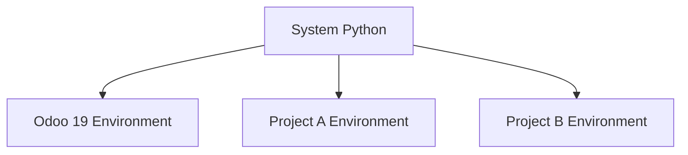
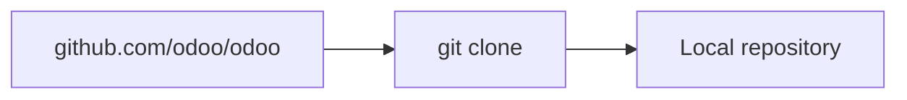
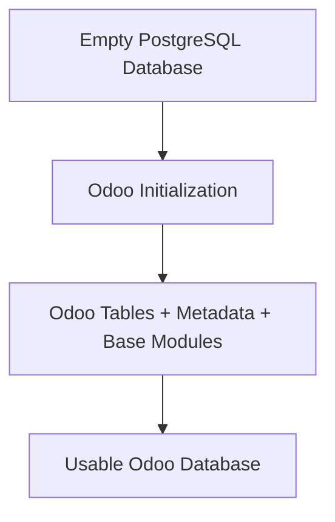
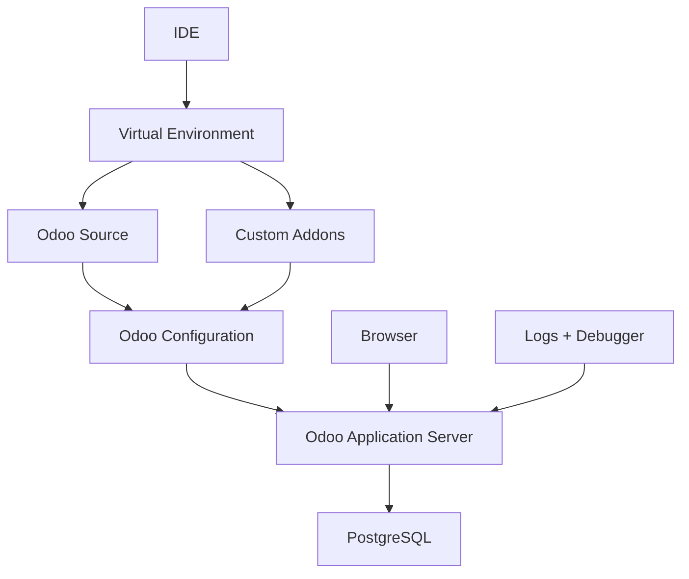
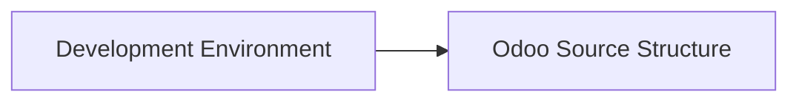

# UNIT II: HOW ODOO ACTUALLY WORKS

## CHAPTER 5: DEVELOPMENT ENVIRONMENT

Chapter 4 taught the architecture:

$$ \text{Browser} \rightarrow \text{Odoo Server} \rightarrow \text{ORM} \rightarrow \text{PostgreSQL} $$

That diagram is useful only if you can run it. Chapter 5 answers the practical question: how do we create a local environment where we can run, inspect, modify, and debug Odoo?

References use Odoo 19.0 as the teaching baseline. Official source-install documentation currently requires **Python 3.10 or newer** and **PostgreSQL 13 or newer** for source installations. Commands and paths in this chapter are teaching models; adjust them to your OS and absolute paths. Worked examples omit production hardening, SSL termination, reverse proxies, and multi-server deployments unless stated. They are local-development models, not hosting playbooks.

**Starting-point check:** Chapter 4 should already feel familiar. You do not need to memorize every worker diagram yet, but you should know that Odoo is not "a website folder." It is a Python process talking to PostgreSQL, serving a browser client, and loading modules from addon directories. If that sentence still sounds empty, revisit Chapter 4 briefly before treating this chapter as a pure install checklist.

Think of Chapter 4 as the map of the city and Chapter 5 as getting keys to a workshop inside that city. Without the map, the workshop tools feel random. Without the workshop, the map never becomes something you can touch.

Chapter 5 is practical: you build an inspectable workspace before learning to navigate Odoo source in Chapter 6. The goal is not merely "Odoo opened in the browser." The goal is a workspace you can trust when something breaks.

---

## CHAPTER 5 TABLE OF CONTENTS

- [**Before We Start: What a Development Environment Is**](#before-we-start-what-a-development-environment-is)
- [**5.1** Python Environment](#51-python-environment)
- [**5.2** Python Virtual Environments](#52-python-virtual-environments)
- [**5.3** Python Dependencies](#53-python-dependencies)
- [**5.4** PostgreSQL Setup](#54-postgresql-setup)
- [**5.5** PostgreSQL User](#55-postgresql-user)
- [**5.6** Odoo Source](#56-odoo-source)
- [**5.7** Git Clone](#57-git-clone)
- [**5.8** Odoo Configuration File](#58-odoo-configuration-file)
- [**5.9** addons_path](#59-addons_path)
- [**5.10** Custom Addons Directory](#510-custom-addons-directory)
- [**5.11** Database Creation](#511-database-creation)
- [**5.12** Developer Mode](#512-developer-mode)
- [**5.13** Developer Mode with Assets](#513-developer-mode-with-assets)
- [**5.14** Logging](#514-logging)
- [**5.15** IDE Setup](#515-ide-setup)
- [**5.16** Debugger Setup](#516-debugger-setup)
- [Bringing All of Chapter 5 Together](#bringing-all-of-chapter-5-together)
- [Development Environment Architecture](#development-environment-architecture)
- [Common Beginner Mistakes in Chapter 5](#common-beginner-mistakes-in-chapter-5)
- [Chapter 5 Mastery Check](#chapter-5-mastery-check)
- [Chapter 5 Summary](#chapter-5-summary)
- [**Free Learning Resources**](Resources.md)

**Then we will complete:**

- [Free Learning Resources](Resources.md)
- [Chapter Exercise](Exercise.md)
- [Chapter Project](Project.md)

---

## BEFORE WE START: WHAT A DEVELOPMENT ENVIRONMENT IS

Monday morning at Nova Retail Group. Rami joins the Odoo team. Lina points at a whiteboard and says:

> "We need a place where you can break things safely."

Rami answers the way many beginners answer:

> "So I install Python?"

Lina shakes her head. Installing Python is one ingredient. It is not the kitchen.

A development environment is the complete technical workspace required to develop software safely. For Odoo, "safely" means you can start the server, create a disposable database, load custom modules, read logs, pause code in a debugger, and recover when you make a mistake, without damaging production data or fighting the operating system.

Noor overhears and adds a business constraint:

> "And do not practice on the database where we reviewed real customer invoices."

That constraint is part of environment design. Safety is technical isolation plus naming discipline plus habit.

A useful mental model is:

$$ \text{Odoo Dev Environment} = \text{Python} + \text{Dependencies} + \text{PostgreSQL} + \text{Odoo Source} + \text{Configuration} + \text{Custom Addons} + \text{IDE} + \text{Debugger} $$

Each piece has a separate responsibility. If one is missing, development becomes difficult or impossible. If the pieces disagree with each other, for example if the IDE uses one Python and the terminal uses another, the environment feels haunted: one tool says a package exists, another says it does not.

Contrast two Monday mornings:

| Incomplete setup | Coherent setup |
| --- | --- |
| Python exists somewhere | Supported Python in a known `.venv` |
| Odoo opened once somehow | Odoo starts from a named config every time |
| A database exists | A clearly named training database exists |
| Code was edited | Breakpoints and logs can inspect that code |

The left column can still produce a login screen. The right column produces a workspace you can trust when `nova_order_gate` fails.

### WHY THIS MATTERS FOR AN ODOO DEVELOPER

Odoo development is evidence work. When a Sales Order confirmation fails, you need a place where you can reproduce the failure, inspect the stack, and change one variable at a time. That place is your development environment. Without it, you are guessing in production clothing.

Chapter 5 builds that place piece by piece. Do not skip a piece because "I already have Python." Ask whether the whole chain is coherent.

---

## 5.1 PYTHON ENVIRONMENT

### INTUITION

Odoo's server-side code is written primarily in Python.

When we run Odoo from source, something must execute that Python code. That something is the Python runtime installed on the machine. The browser does not execute `sale.order` methods. PostgreSQL does not interpret Odoo business rules. The Python process does.

Picture Rami double-clicking a packaged Odoo installer on a laptop. The installer may hide Python entirely. That can be fine for running Odoo as an end-user application. It is a weak foundation for studying how Odoo works, because the interpreter, packages, and launch path are harder to inspect.

For development, we want the opposite: a visible Python environment we can verify.

### DEFINITION

A **Python environment**, at the simplest level, includes the Python interpreter, `pip`, installed Python packages, environment variables, and executable paths.

It is not only "a `python.exe` file." It is the combination of interpreter plus the packages that interpreter can import plus the path rules that decide which `python` and `pip` your shell actually calls.

### CHECKING PYTHON

For example:

```bash
python3 --version
```

might return:

```text
Python 3.12.x
```

and:

```bash
pip3 --version
```

confirms that the Python package installer is available.

On some Windows setups the command is `python` rather than `python3`. The teaching point is the same: verify the interpreter you think you are using.

For Odoo 19, official source-install documentation currently requires Python 3.10 or newer.

### WHY PYTHON VERSION MATTERS

Python versions are not always perfectly interchangeable.

Suppose an application depends on syntax or libraries available only in newer Python releases:

$$ \text{Older Python} \rightarrow \text{Compatibility Failure} $$

Similarly, some dependency versions may not yet support a very new Python version. "Latest Python available" is not automatically the best rule. A brand-new interpreter can arrive before Odoo's pinned dependencies are ready for it.

The better rule is: use a Python version supported by the target Odoo release and its dependency set. That is a release-aware decision, not a fashion decision.

### SYSTEM PYTHON

Many operating systems already include Python, for example:

```text
/usr/bin/python3
```

Using the operating system's Python environment directly for application development can be dangerous. The system itself may depend on packages installed there. If you change those packages carelessly:

$$ \text{Application Dependency Change} \rightarrow \text{System Dependency Conflict} $$

This does not mean system Python is evil. It means system Python has a job that is not "host every experiment Rami installs this week." That leads naturally to virtual environments in the next section.

### WHY THIS MATTERS FOR AN ODOO DEVELOPER

Every later step in this chapter assumes you can answer three questions quickly:

1. Which Python binary am I calling?
2. Which version is it?
3. Is that version acceptable for Odoo 19 source installs?

If you cannot answer those, later failures will look mysterious. Import errors, wheel build failures, and "works in one terminal but not another" problems often begin here.

### EXAMPLE

Nova Retail Group's new developer, Rami, installs Python 3.12 for Odoo 19 and confirms:

```bash
python3 --version
pip3 --version
```

He writes the version into his setup notes. He does not yet install Odoo packages into the system Python. He waits for a virtual environment.

Caveat: this example assumes a clean machine where Python 3.12 is available and supported by the dependency set Rami will install. If a corporate image only provides Python 3.9, "install whatever is newest on the internet" is still the wrong move; the first move is to obtain a supported interpreter through an approved channel.

### COMMON MISTAKE

A beginner assumes any installed Python is fine for any Odoo version, or installs project packages into the system Python because "it already works."

That confuses "Python exists on the machine" with "this machine has an isolated, supported Odoo runtime."

**Wrong thinking:**

> Python is installed, so the Odoo environment is ready.

**Better thinking:**

> A supported Python interpreter exists, and I still need isolation, dependencies, PostgreSQL, source, and configuration before the environment is ready.

### RELEVANT RESOURCES

Here are the relevant resources for **5.1 PYTHON ENVIRONMENT**:

> Topic resources will be added later in [Resources.md](Resources.md) (official Odoo 19.0 source-install documentation and verified supporting materials).

---

## 5.2 PYTHON VIRTUAL ENVIRONMENTS

### INTUITION

Imagine you have two projects.

Project A needs Package X version 1.

Project B needs Package X version 3.

If both projects share one global Python environment, they can conflict. The conflict is not theoretical. One project's upgrade becomes the other project's breakage.

At Nova Retail, Rami also maintains a small internal reporting script that pins an older library. Lina warns him:

> "If Odoo and that script share one global site-packages folder, one of them will lose."

A virtual environment is how you refuse that fight.

### DEFINITION

A **virtual environment** gives a project its own isolated Python package environment.

Conceptually, system Python branches into separate environments:

<div align="center">



</div>

Each environment can have its own packages. The interpreter often still originates from a base Python install, but the installed libraries stay separated.

Odoo's source-install documentation specifically recommends avoiding unnecessary mixing of Python modules between different Odoo instances or with the operating system, and mentions virtual environments as a solution.

### CREATING A VIRTUAL ENVIRONMENT

A typical command is:

```bash
python3 -m venv .venv
```

This creates:

```text
.venv/
```

containing an isolated environment. The folder name `.venv` is conventional, not magical. Teams may use `venv`, `env`, or another name. What matters is consistency and activation discipline.

### ACTIVATING IT

Linux/macOS:

```bash
source .venv/bin/activate
```

Windows PowerShell:

```powershell
.venv\Scripts\Activate.ps1
```

After activation, commands such as `python` and `pip` refer to the environment's Python and packages.

Activation is shell-local. Opening a new terminal usually means activating again. That is normal, not a failure.

### WHY ACTIVATION MATTERS

Without activation:

```bash
pip install package
```

may install into some other Python environment.

With activation:

$$ \text{pip} \rightarrow \text{Odoo Virtual Environment} $$

This keeps Odoo dependencies contained. The most expensive beginner bug in this chapter is not a missing package. It is a package installed into the wrong environment while the developer watches the wrong prompt.

### HOW TO RECOGNIZE AN ACTIVE ENVIRONMENT

Your terminal may show something like `(.venv)` before the prompt.

You can also inspect the interpreter.

Linux/macOS:

```bash
which python
```

Windows:

```powershell
where.exe python
```

You want the returned path to point into `.venv`.

If the path points at system Python, stop. Do not install Odoo requirements yet. Fix activation first.

### WHY THIS MATTERS FOR AN ODOO DEVELOPER

Odoo dependency sets are large. Mixing them with system packages or with unrelated projects creates failures that look like "Odoo is broken" when the real problem is environment contamination. Isolation is not ceremony. Isolation is how you keep evidence trustworthy.

### EXAMPLE

Rami creates `.venv` inside `odoo19-development/`, activates it, and confirms `where.exe python` points into that folder before any `pip install`.

He then opens a second PowerShell window, forgets to activate, and notices `where.exe python` points elsewhere. That second window is a trap. He closes it rather than "quickly installing one package" there.

Caveat: some teams use tools that select interpreters without classic activation prompts. The principle still holds. Before installing, verify which environment receives the packages.

### COMMON MISTAKE

A beginner creates `.venv` but forgets to activate it, then installs dependencies globally.

Later Odoo fails because:

> But I installed the package!

Yes, but into the wrong Python environment.

**Wrong workflow:**

1. Create `.venv`
2. Skip activation
3. Run `pip install -r requirements.txt`
4. Wonder why the active Odoo process cannot import the package

**Correct workflow:**

1. Create `.venv`
2. Activate
3. Verify interpreter path
4. Then install

### RELEVANT RESOURCES

Here are the relevant resources for **5.2 PYTHON VIRTUAL ENVIRONMENTS**:

> Topic resources will be added later in [Resources.md](Resources.md) (official Odoo 19.0 source-install documentation and verified supporting materials).

---

## 5.3 PYTHON DEPENDENCIES

### INTUITION

Odoo itself depends on many external Python libraries.

Examples may support XML, HTTP, dates, cryptography, image processing, database access, templates, and email. Rami does not need to memorize that list on day one. He needs a reliable way to install the correct set for the Odoo revision he cloned.

You should not install all of these manually one by one from memory. Memory invents version drift.

### DEFINITION

**Python dependencies** for Odoo are external libraries installed through `pip`, usually from the source repository's dependency specification.

They are libraries the Python process imports. They are not Odoo Apps you click Install inside the browser.

### REQUIREMENTS.TXT

The Odoo source repository contains:

```text
requirements.txt
```

which lists required Python packages.

Official source-install documentation directs users to install dependencies from this file. That file is tied to the source tree you cloned. If you change Odoo branch later, re-check dependencies. Do not assume last month's install still matches this week's branch.

### TYPICAL INSTALLATION

After activating the virtual environment:

```bash
pip install -r requirements.txt
```

Conceptually:

`requirements.txt` → `pip` → Virtual Environment

If installation fails, read the error. A compiler missing for a binary wheel, a wrong Python version, or a network proxy issue is a different problem from "Odoo is misconfigured." Treat the failure as evidence, not as a cue to randomly upgrade everything.

### WHY DEPENDENCY FILES MATTER

Without a dependency specification, Developer A may have Library 2.1, Developer B Library 3.4, and CI Library 1.8.

Then "works on my machine" becomes common. Dependency files improve reproducibility. They do not make machines identical by magic, but they make the intended package set explicit.

### PYTHON DEPENDENCIES VS ODOO MODULES

Do not confuse them.

| Layer | What it is | Example |
| --- | --- | --- |
| **Python dependency** | Library installed through pip | `psycopg` |
| **Odoo module** | Addon loaded from an addons directory | `sale` |

$$ \text{Python Dependency} \neq \text{Odoo Addon} $$

Rami can install every Python dependency correctly and still have zero Sales features until the `sale` module is installed into an Odoo database. Conversely, he can see `sale` in Apps and still fail to start Odoo if a required Python library is missing.

### EXTERNAL DEPENDENCIES

Some Odoo functionality may also rely on tools that are not installed through pip. For example, official documentation notes that certain PDF-related tools in supported setups may require separate installation.

This is why environment setup can involve more than Python. When PDF generation fails later, ask whether the missing piece is a pip package or a system tool before rewriting `odoo.conf`.

### WHY THIS MATTERS FOR AN ODOO DEVELOPER

Custom module development sits on top of a working dependency layer. If that layer is incomplete, stack traces become noisy and beginners often blame their own Python business logic first. Stabilize dependencies before debugging `nova_order_gate`.

### EXAMPLE

After cloning Odoo, Rami activates `.venv`, changes into the Odoo source directory, and runs:

```bash
pip install -r requirements.txt
```

He treats a missing PDF tool later as a separate system dependency, not as a failed Python package install.

Caveat: exact package pins change over time with the Odoo branch. Copying a `pip freeze` from an unrelated tutorial blog can recreate someone else's old environment instead of the one matching your checkout.

### COMMON MISTAKE

A beginner confuses installing the `sale` Odoo module with installing Python packages, or installs random libraries from memory instead of `requirements.txt`.

**Wrong approach:**

> I need Sales, so I `pip install sale`.

**Correct approach:**

> I install Python dependencies from `requirements.txt`, start Odoo, then install the `sale` addon into the database through Odoo's module system.

### RELEVANT RESOURCES

Here are the relevant resources for **5.3 PYTHON DEPENDENCIES**:

> Topic resources will be added later in [Resources.md](Resources.md) (official Odoo 19.0 source-install documentation and verified supporting materials).

---

## 5.4 POSTGRESQL SETUP

### INTUITION

Chapter 4 established:

$$ \text{Odoo} \rightarrow \text{PostgreSQL} $$

Now we actually prepare it.

Noor from Accounting asks Rami a fair question:

> "Where do invoices live when I close the laptop?"

They live in PostgreSQL, not in the browser tab and not in the Python process memory. If PostgreSQL is missing or stopped, Odoo can fail before any business screen appears. That failure is often clearer than a half-working UI, but only if you know what to check.

### DEFINITION

**PostgreSQL** is the relational database management system that stores structured Odoo data such as users, customers, products, Sales Orders, invoices, settings, and module metadata.

Odoo 19 currently supports PostgreSQL 13 or newer according to official source-install documentation.

### POSTGRESQL SERVER VS DATABASE

Do not confuse:

| Concept | Meaning |
| --- | --- |
| **PostgreSQL server** | The database management system process |
| **Odoo database** | One database hosted inside PostgreSQL |

For example, one PostgreSQL server may contain:

```text
odoo_dev
odoo_test
odoo_training
```

Each can be a separate Odoo database. Destroying one training database does not require uninstalling PostgreSQL. That separation is part of why local experimentation is possible.

### POSTGRESQL INSTALLATION

On Debian/Ubuntu-like systems, official Odoo documentation gives installation along the lines of:

```bash
sudo apt install postgresql postgresql-client
```

The exact package command varies by operating system. On Windows, installation often uses an official installer and a service that starts at login. Learn your OS service tools; do not memorize only one distro's command.

### VERIFY POSTGRESQL

A common check is:

```bash
psql --version
```

But remember: `psql` existing does not necessarily prove the database server itself is running. You also need the server service.

On Linux, something like:

```bash
systemctl status postgresql
```

may be used.

On Windows, check that the PostgreSQL service is running in Services or with your usual administration tools. Client tools without a live server are like a phone with no signal: the app exists, the network does not.

### ODOO AND POSTGRESQL COMMUNICATION

Conceptually:

$$ \text{Odoo Python Process} \rightarrow \text{Database Connection} \rightarrow \text{PostgreSQL Server} $$

The database does not need to live in the same process, or even necessarily on the same machine in more advanced deployments. For local development, a local PostgreSQL server is common and convenient.

Connection settings later appear in `odoo.conf` or CLI flags. If those settings point at a stopped server, Odoo cannot invent storage.

### WHY THIS MATTERS FOR AN ODOO DEVELOPER

Many "Odoo will not start" tickets are really "PostgreSQL is not reachable" tickets. Before rewriting Python, confirm the database tier is alive. Chapter 4's architecture becomes practical the first time a connection refused error appears in the log.

### EXAMPLE

Rami installs PostgreSQL 16, confirms `psql --version`, and verifies the service is running before starting Odoo.

He then stops the service on purpose once, starts Odoo, and reads the failure. That deliberate failure teaches him what the error looks like, so the next accidental outage is recognizable.

Caveat: PostgreSQL 16 is one valid choice under "13 or newer." The example is not a rule that every team must standardize on 16. Use a supported version your team can maintain.

### COMMON MISTAKE

A beginner assumes "PostgreSQL is installed" means Odoo can already connect and create databases. Installation alone is not connectivity evidence.

**Wrong checklist:**

- PostgreSQL installer finished
- Therefore Odoo is ready

**Better checklist:**

- Supported version installed
- Server service running
- Client can talk to server
- Odoo has credentials that work

### RELEVANT RESOURCES

Here are the relevant resources for **5.4 POSTGRESQL SETUP**:

> Topic resources will be added later in [Resources.md](Resources.md) (official Odoo 19.0 source-install documentation and verified supporting materials).

---

## 5.5 POSTGRESQL USER

### INTUITION

Odoo needs a PostgreSQL account to authenticate to PostgreSQL.

This is called a database user or database role.

Rami creates an Odoo database through the browser and chooses email `admin@novaretail.example`. He then opens `odoo.conf` and sees `db_user = odoo_dev`. For a moment he thinks those must be the same person. They are not. One identity logs humans into the web application. The other identity lets the server process talk to PostgreSQL.

### DEFINITION

A **PostgreSQL user** (role) authenticates the Odoo server process to PostgreSQL. It is not the same identity as an Odoo application login.

### NOT THE SAME AS ODOO LOGIN USER

Suppose your Odoo login is:

```text
admin@example.com
```

That is an Odoo application user.

But PostgreSQL may authenticate Odoo using:

```text
odoo_dev
```

These are different identities:

$$ \text{Odoo User} \neq \text{PostgreSQL User} $$

Official documentation explicitly notes that the database user passed to Odoo is different from the account used to log into the Odoo web interface.

### WHY CREATE A SEPARATE DB USER?

Bad idea: give Odoo unrestricted PostgreSQL superuser access forever.

Better principle: least privilege. The application account should receive only the privileges it actually requires.

For local development, privileges may be broader for convenience, but the architectural principle still matters. Habits formed in training environments leak into shared servers.

### COMMON MISCONCEPTION

| Identity | Authenticates |
| --- | --- |
| **PostgreSQL user** | Odoo Server → PostgreSQL |
| **Odoo administrator** | Human → Odoo Web Application |

Two completely different layers.

If PostgreSQL authentication fails, the browser login form may never appear. If browser login fails, PostgreSQL may already be healthy. Diagnose the layer that actually failed.

### WHY THIS MATTERS FOR AN ODOO DEVELOPER

Configuration files speak in database roles. Support tickets often speak in application emails. Mixing those vocabularies wastes hours. When Lina says "the user cannot log in," ask which user layer she means before resetting the wrong password.

### EXAMPLE

Nova Retail configures PostgreSQL role `odoo_dev` for local development. Rami still logs into Odoo as `admin@novaretail.example` after database creation.

He stores the PostgreSQL role password using whatever secret practice the team allows for local machines, and he refuses to paste it into a public chat "just this once."

Caveat: some local peer-authentication setups may allow passwordless local connections depending on PostgreSQL configuration. That convenience is an environment detail, not proof that `db_user` equals the Odoo admin email.

### COMMON MISTAKE

A beginner thinks the Odoo admin email and password are what `db_user` and `db_password` mean in `odoo.conf`.

**Wrong mental model:**

```text
db_user = admin@novaretail.example
```

because that is the login on the website.

**Correct mental model:**

```text
db_user = odoo_dev
```

is the PostgreSQL role the server uses, while `admin@novaretail.example` remains an application user stored inside the Odoo database.

### RELEVANT RESOURCES

Here are the relevant resources for **5.5 POSTGRESQL USER**:

> Topic resources will be added later in [Resources.md](Resources.md) (official Odoo 19.0 source-install documentation and verified supporting materials).

---

## 5.6 ODOO SOURCE

### INTUITION

If we want to learn development properly, we need Odoo's source code.

Packaged installs can run a business. Source checkouts teach a developer how the business software is built. Rami can click Confirm all day on a packaged server and still never see the Python method that runs afterward. Chapter 6 will navigate that tree. Chapter 5 must obtain it.

### DEFINITION

**Odoo source** means the codebase containing the Odoo framework and Community addons.

A source checkout contains things such as:

```text
odoo/
addons/
odoo-bin
requirements.txt
setup/
```

We will study the structure properly in Chapter 6. For now, recognize the checkout as the inspectable implementation of the architecture from Chapter 4.

### WHY SOURCE INSTALLATION IS USEFUL FOR DEVELOPERS

With source code available, you can inspect framework code, read official addon implementations, debug Python, follow model definitions, understand inheritance, create custom addons, and inspect stack traces.

| Approach | Best for |
| --- | --- |
| **Packaged installation** | Running Odoo |
| **Source checkout** | Studying and developing Odoo |

Neither approach is universally "better." They optimize for different jobs. Nova Retail may run packaged or containerized servers in some environments while developers still keep a source checkout on their machines.

### ODOO-BIN

At the source repository root, Odoo provides the main CLI launcher:

```text
odoo-bin
```

Official Odoo source-install documentation describes `odoo-bin` as the command-line interface used to start the server.

Typical concept:

```bash
python3 odoo-bin
```

or when the virtual environment is active:

```bash
python odoo-bin
```

That command is the bridge between "I have files on disk" and "I have a running application server."

### WHY THIS MATTERS FOR AN ODOO DEVELOPER

Stack traces point at files. Inheritance points at modules. Breakpoints point at lines. Without source, those references are rumors. With source, they become navigation targets.

### EXAMPLE

Rami opens the cloned repository root and confirms `odoo-bin` and `requirements.txt` exist before configuring the IDE.

He resists the urge to start editing files inside `addons/sale` on day one. The source is for reading and extending, not for casual rewriting of Community modules.

Caveat: Enterprise source layouts and licensing are separate topics. This chapter's teaching baseline is Community source structure for learning. Follow your team's licensing and repository rules for Enterprise paths.

### COMMON MISTAKE

A beginner thinks a packaged installer is enough to study inheritance, ORM internals, and custom addon debugging the same way a source checkout allows.

**Wrong expectation:**

> The Apps screen is the source code.

**Correct expectation:**

> The Apps screen is the product surface. The source checkout is where implementation lives.

### RELEVANT RESOURCES

Here are the relevant resources for **5.6 ODOO SOURCE**:

> Topic resources will be added later in [Resources.md](Resources.md) (official Odoo 19.0 source-install documentation and verified supporting materials).

---

## 5.7 GIT CLONE

### INTUITION

We don't normally want to download random source-code ZIPs repeatedly.

Odoo source should usually be managed with Git.

Lina asks Rami how he got his first copy of Odoo. He shows a ZIP from a random mirror. She asks how he will update it next month, compare a bugfix, or confirm he is really on `19.0`. He cannot answer. That is the intuition for Git.

### DEFINITION

**Git clone** copies a remote repository onto your machine with history and branch metadata so you can update and compare versions later.

### WHY GIT?

Git allows you to clone source, inspect history, switch branches, pull updates, compare changes, and maintain custom work separately. This makes development reproducible.

Reproducibility here does not mean every developer machine is identical down to the pixel. It means you can name the revision you are running and move between revisions deliberately.

### CLONE MENTAL MODEL

<div align="center">



</div>

### TYPICAL COMMAND

For Odoo 19, conceptually:

```bash
git clone --branch 19.0 https://github.com/odoo/odoo.git
```

You may also use a shallow clone for learning or faster initial download:

```bash
git clone --depth 1 --branch 19.0 https://github.com/odoo/odoo.git
```

| Style | Trade-off |
| --- | --- |
| **Full clone** | More history, more disk/time |
| **Shallow clone** | Faster, but less history |

A shallow clone can be enough for early learning. If you later need deeper history, you may need to deepen or re-clone. Choose consciously.

### BRANCH MATTERS

If we're studying Odoo 19, `19.0` is the relevant stable branch.

Do not accidentally follow `master` if your goal is to learn the stable release. Master can contain future or unreleased changes. Tutorials written against another branch can disagree with your runtime in confusing ways.

### GIT CLONE VS DOWNLOADING ZIP

A ZIP download gives files.

A Git clone gives files, repository metadata, history, branches, and a version-control workflow.

For serious development:

$$ \text{Git Clone} > \text{Manual ZIP} $$

This inequality is about workflow quality, not moral judgment. A ZIP can still be useful for a quick read-only glance. It is a weak long-term development foundation.

### WHY THIS MATTERS FOR AN ODOO DEVELOPER

Bug reports need version context. "Odoo is broken" is incomplete. "Odoo 19.0 at this commit, with this custom addon, fails when confirming a Sales Order" is actionable. Git makes that specificity possible.

### EXAMPLE

Rami clones branch `19.0` into `odoo19-development/odoo/` and verifies `git branch` shows `19.0` before installing requirements.

He also records the remote URL in his notes so he knows he did not clone an unofficial fork by accident.

Caveat: cloning from the official repository is the teaching default. Organizations may use internal mirrors. The important part is knowing which remote and branch your tree tracks.

### COMMON MISTAKE

A beginner downloads a ZIP from an unknown page, or clones `master` while intending to learn Odoo 19 stable behavior.

**Wrong move:**

> Clone whatever default branch the hosting page highlights.

**Correct move:**

> Clone the branch that matches the release you are studying, here `19.0`.

### RELEVANT RESOURCES

Here are the relevant resources for **5.7 GIT CLONE**:

> Topic resources will be added later in [Resources.md](Resources.md) (official Odoo 19.0 source-install documentation and verified supporting materials).

---

## 5.8 ODOO CONFIGURATION FILE

### INTUITION

Running Odoo with a huge command every time is inconvenient.

Example:

```bash
python odoo-bin --addons-path=addons,custom_addons --db_user=odoo_dev --db_password=secret --log-level=debug
```

You could do that every time. Configuration files make repeated settings easier.

On Rami's second day, he starts Odoo three different ways before lunch and gets three different behaviors. One startup misses `custom_addons`. One connects with different database credentials. One floods the terminal with debug noise. Lina's diagnosis is blunt:

> "Your settings are tribal knowledge in your scrollback. Put them in a file."

### DEFINITION

An **Odoo configuration file** defines server settings such as database credentials, addon paths, ports, and log levels so startup is reproducible.

### PURPOSE

Conceptually:

```ini
[options]
db_user = odoo_dev
db_password = ...
addons_path = ...
```

Without a configuration file, developers may forget parameters, use inconsistent addon paths, connect to the wrong database, or run different logging settings.

A config file does not remove the need to understand the parameters. It removes the need to retype them perfectly every morning.

### EXAMPLE DEVELOPMENT CONFIG

A simple conceptual development configuration might be:

```ini
[options]
db_host = False
db_port = False
db_user = odoo_dev
db_password = False

addons_path = /path/to/odoo/addons,/path/to/custom_addons

http_port = 8069
log_level = info
```

The exact values depend on your machine and authentication setup. `False` for host or password in teaching examples often means "use defaults / local auth conventions," not "type the word False into production secrets management." Read the meaning in context of your OS and PostgreSQL auth setup.

### STARTING ODOO WITH CONFIG

Typical pattern:

```bash
python odoo-bin -c odoo.conf
```

Now Odoo reads its parameters from that configuration file.

Official documentation confirms that Odoo can be configured through command-line arguments or a configuration file. Command-line flags can still override or supplement settings. Know which source of truth you intended for a given launch.

### SENSITIVE SETTINGS

Be careful with values such as `db_password` and `admin_passwd`.

These should not be committed carelessly to public repositories. A development environment must still follow basic security hygiene. Git history remembers secrets long after you delete them from the working tree.

### WHY THIS MATTERS FOR AN ODOO DEVELOPER

Reproducible startup is how teams share environments. When Noor cannot reproduce Rami's bug, the first comparison is often configuration: addon paths, database name, log level, port. A named config file makes that comparison possible.

### EXAMPLE

Nova Retail keeps `config/odoo.conf` outside public Git content that would expose passwords, and points `addons_path` at both official and custom directories.

Rami starts the server with `-c` every time during training, even when he thinks he "remembers" the flags. Memory is how path drift begins.

Caveat: some projects generate config from templates or environment variables. That is still configuration management. The anti-pattern is undocumented one-off CLI folklore.

### COMMON MISTAKE

A beginner commits `db_password` or `admin_passwd` into a public repository, or runs Odoo with different forgotten CLI flags every day so no two startups match.

**Wrong habit:**

> I will just add one more flag this time.

**Correct habit:**

> I will update the config intentionally, or document the temporary override and revert it.

### RELEVANT RESOURCES

Here are the relevant resources for **5.8 ODOO CONFIGURATION FILE**:

> Topic resources will be added later in [Resources.md](Resources.md) (official Odoo 19.0 source-install documentation and verified supporting materials).

---

## 5.9 ADDONS_PATH

### INTUITION

Suppose your machine contains modules in:

```text
odoo/addons/
```

and:

```text
custom_addons/
```

How does Odoo know where to look? Through `addons_path`.

Rami finishes `nova_order_gate`, opens Apps, updates the list, and sees nothing. The module folder exists. The `__manifest__.py` exists. The server is running. The missing piece is discovery: Odoo never searched the directory that contains the module.

### DEFINITION

**`addons_path`** is the list of directories Odoo searches for modules.

It is a search path, not a compliment. Modules outside the path are invisible to module discovery no matter how carefully written they are.

### EXAMPLE PATH

```ini
addons_path = /home/rami/odoo19-development/odoo/addons,/home/rami/odoo19-development/custom_addons
```

Now Odoo scans both directories for modules.

Official Odoo documentation describes the addons path as the list of directories where modules are stored.

### MULTIPLE PATHS

You can have core addons, Enterprise addons, custom addons, and third-party addons:

**`addons_path`** = $$ P_1, P_2, P_3, \dots, P_n $$

Each path is a root that contains module directories, not usually a single module folder itself. Putting only `.../custom_addons/nova_order_gate` in the path is a different shape from putting `.../custom_addons` and letting Odoo find `nova_order_gate` underneath. Learn the intended layout your team uses.

A practical contrast:

| Path entry | What Odoo expects underneath |
| --- | --- |
| `.../custom_addons` | Module folders such as `nova_order_gate/` |
| `.../odoo/addons` | Official Community modules such as `sale/` |

If Rami points `addons_path` at the module itself instead of the parent addons directory, discovery can fail in ways that look mysterious until someone inspects the configured path carefully.

### WHY ORDER CAN MATTER

Odoo's official documentation specifically warns that, for Enterprise source setups, the Enterprise addon path should appear before other addon paths so modules are loaded correctly.

So path ordering is not always arbitrary. When two trees could provide similarly named modules, order becomes policy.

### WHY THIS MATTERS FOR AN ODOO DEVELOPER

Custom development lives or dies by discovery. Before debugging Python in `nova_sale_approval`, confirm the addon directory is on `addons_path` and that the server was restarted after the config change. Many "my module is broken" reports are "my module was never seen."

### EXAMPLE

Rami adds `custom_addons` to `addons_path`, restarts Odoo, and only then updates Apps. `nova_order_gate` appears.

If he changes `addons_path` but leaves an old server process running, he is debugging a ghost. Restart discipline matters as much as the config line.

Caveat: exact UI labels for updating module lists can vary with version and studio-like tooling. The underlying idea remains: discovery path first, then module list refresh, then install.

### COMMON MISTAKE

You create:

```text
custom_addons/nova_order_gate
```

but forget to add `custom_addons` to `addons_path`.

Then you ask:

> Why can't Odoo see my module?

Because module discovery never reaches that directory.

**Wrong diagnosis:**

> My Python is wrong.

**Better first check:**

> Is the parent addons directory on `addons_path`, and did I restart with that config?

### RELEVANT RESOURCES

Here are the relevant resources for **5.9 ADDONS_PATH**:

> Topic resources will be added later in [Resources.md](Resources.md) (official Odoo 19.0 source-install documentation and verified supporting materials).

---

## 5.10 CUSTOM ADDONS DIRECTORY

### INTUITION

A professional Odoo developer should avoid putting personal modules directly inside the official source folders unless there is a very specific reason.

Rami's first instinct is convenient:

> "The `sale` folder is right there. I will edit it."

Lina stops him. Convenience today becomes upgrade pain tomorrow. Custom code needs a home that survives vendor updates.

### DEFINITION

A **custom addons directory** is a separate folder outside vendor Odoo source where your team's modules live and are discovered through `addons_path`.

### BETTER LAYOUT

```text
odoo/
    odoo/
    addons/
    odoo-bin

custom_addons/
    nova_sale_approval/
    nova_inventory_rules/
```

Vendor source remains vendor source. Nova Retail's modules remain Nova Retail's modules.

### WHY SEPARATE CUSTOM CODE?

Because:

$$ \text{Vendor Code} \neq \text{Your Code} $$

Separating them helps with upgrades, source control, debugging, deployment, and maintenance.

When Odoo releases fixes on `19.0`, Rami wants to pull vendor updates without reconciling handwritten patches sprinkled through Community files. Custom addons keep the diff where it belongs: in Nova Retail repositories.

### BAD STRUCTURE

```text
odoo/addons/sale/
    edited_by_rami.py
```

You directly modify standard vendor code. Later you pull a new Odoo version. Conflicts appear, your changes are hard to identify, and upgrades become painful.

### BETTER STRUCTURE

```text
custom_addons/
    nova_sale_approval/
```

and extend standard functionality:

$$ \text{Standard Odoo} + \text{Custom Addon} $$

instead of:

$$ \text{Modified Standard Odoo} $$

Extension through modules is not only cleaner packaging. It matches how Odoo expects customization to be composed.

### WHY THIS MATTERS FOR AN ODOO DEVELOPER

Your future self will bisect bugs by disabling custom modules. That technique fails if custom logic is welded into Community files. Separation turns "is this our bug or Odoo's bug?" into an experiment you can actually run.

### EXAMPLE

Nova Retail keeps `nova_order_gate` under `custom_addons/` and never edits Community `sale` sources in place.

When a Sales confirmation bug appears, Rami can compare behavior with the custom module uninstalled. That comparison is only clean because the custom logic was isolated.

Caveat: rare core contributions or emergency hotfixes may touch vendor trees under strict process. Those exceptions are not the default student workflow.

### COMMON MISTAKE

A beginner drops custom modules into `Downloads/` or edits `odoo/addons/sale` directly "just for a quick fix."

**Wrong layout:**

```text
Downloads/nova_order_gate/
```

not on `addons_path`, invisible, easy to lose.

**Correct layout:**

```text
custom_addons/nova_order_gate/
```

referenced by configuration and tracked in the team's source control.

### RELEVANT RESOURCES

Here are the relevant resources for **5.10 CUSTOM ADDONS DIRECTORY**:

> Topic resources will be added later in [Resources.md](Resources.md) (official Odoo 19.0 source-install documentation and verified supporting materials).

---

## 5.11 DATABASE CREATION

### INTUITION

Once Python works, dependencies work, PostgreSQL works, source exists, and Odoo starts, we need an Odoo database.

Rami starts the server, opens the browser, and feels done. He is not done. An empty PostgreSQL cluster with no initialized Odoo database is not yet a place to click Sales. Odoo initialization creates the application structures the ORM expects.

### DEFINITION

**Creating an Odoo database** means more than `CREATE DATABASE example;`. When Odoo initializes a database, it establishes Odoo's application structures and installs foundational modules.

Conceptually:

<div align="center">



</div>

A raw SQL `CREATE DATABASE` without Odoo initialization leaves you with a container, not an ERP.

### THROUGH BROWSER

When the database manager is available, Odoo can show a database creation screen.

You might provide master password, database name, email, password, language, country, and demo-data choice.

Those fields create application-level identity and initial settings. They do not replace the PostgreSQL role in `odoo.conf`.

### THROUGH CLI

Odoo can also target, create, and initialize databases using CLI operations.

Official documentation gives examples of starting Odoo with a database using `-d`.

CLI workflows are useful for automation and repeatable training setups. Browser workflows are useful for first-time visibility. Learn both ideas even if you prefer one day to day.

### DEVELOPMENT DB NAMING

Useful names:

```text
odoo19_dev
odoo19_training
sales_module_test
```

Bad name:

```text
production
```

for your experimental local environment.

Clear naming prevents dangerous mistakes. Names shape caution. People hesitate before dropping `odoo19_training`. People get reckless with a database they casually called `production` even when it is local.

### DEMO DATA

For learning, demo data can be useful. It gives you customers, products, and sample records.

For production, demo data is normally undesirable. Environment purpose determines the choice.

Nova Retail's training databases may enable demo data so Rami can click through Sales quickly. A near-production staging database usually should not.

Contrast the decision explicitly:

| Environment purpose | Demo data tendency |
| --- | --- |
| First-week learning on `odoo19_training` | Often useful |
| Feature spike on `odoo19_dev` | Sometimes useful, sometimes noisy |
| Shared staging that Noor reviews | Usually undesirable |
| Real production | Not a teaching playground at all |

The point is not that demo data is good or bad forever. The point is that database purpose drives the choice, and naming should make that purpose obvious.

### WHY THIS MATTERS FOR AN ODOO DEVELOPER

Module installation state, demo records, and configuration live per database. Two databases on one PostgreSQL server can tell completely different stories. Always know which database your browser session and your CLI `-d` flag are using.

### EXAMPLE

Rami creates `odoo19_training` with demo data for learning, and keeps a separate `odoo19_dev` without assuming it is production.

When he experiments with destructive module uninstall tests, he uses a disposable copy rather than the database where Noor reviewed sample invoices yesterday.

Caveat: database manager availability depends on configuration and deployment choices. Some hardened setups disable database listing and creation in the UI. Local teaching setups often leave it available.

### COMMON MISTAKE

A beginner names a local experiment database `production`, or assumes creating an empty PostgreSQL database alone finished Odoo initialization.

**Wrong belief:**

> `CREATE DATABASE odoo19_dev;` means Odoo is ready.

**Correct belief:**

> PostgreSQL created a database object. Odoo still needs to initialize application structures before it is an Odoo database in the useful sense.

### RELEVANT RESOURCES

Here are the relevant resources for **5.11 DATABASE CREATION**:

> Topic resources will be added later in [Resources.md](Resources.md) (official Odoo 19.0 source-install documentation and verified supporting materials).

---

## 5.12 DEVELOPER MODE

### INTUITION

Normal Odoo users don't need to see every technical option.

Developers do. That is what Developer Mode helps with.

Noor needs to change a customer payment term. She should not wade through model technical names to do it. Rami needs to know whether a field on the Sales form comes from `sale` or from `nova_sale_approval`. He needs technical menus. Different jobs, different visibility.

### DEFINITION

**Developer Mode** (also called debug mode) exposes advanced tools and technical settings useful for inspecting implementation details.

Official Odoo documentation describes Developer Mode as exposing advanced tools and technical settings.

### WHAT IT UNLOCKS

It can give access to things like technical menus, model/view metadata, external IDs, field details, actions, and technical configuration.

Exact menus evolve across versions, but the purpose stays stable: reveal the implementation under the business UI.

### WHY DEVELOPER MODE EXISTS

Imagine inspecting a Sales form.

A normal user sees Customer.

A developer may need to know model name, field name, view, XML ID, and action.

Developer mode exposes information useful for understanding the implementation. It turns "this screen" into "this model, this view, this action."

### ACTIVATION

Current Odoo documentation allows activation through the interface or by adding:

```text
?debug=1
```

to the URL.

Example:

```text
http://localhost:8069/odoo?debug=1
```

Activation in a local training database is ordinary. Activation on a shared production database without process is reckless, even if the URL trick is easy.

### WHY CAUTION IS NEEDED

Developer Mode can expose powerful settings.

A developer who changes random technical records in production can damage views, permissions, automation, and metadata.

Therefore:

$$ \text{Developer Mode} \neq \text{Safe to Modify Everything} $$

It means you have access to advanced tools, not that every advanced operation is harmless.

### WHY THIS MATTERS FOR AN ODOO DEVELOPER

Chapter 6 will ask you to find definitions and XML IDs. Developer Mode is one of the bridges between UI observation and source investigation. Learn to look before you edit.

### EXAMPLE

Rami enables Developer Mode on `odoo19_training`, opens a Sales Order form, and inspects the model and field technical names without changing production metadata.

He writes down a field name, then searches for it in the source tree later. That habit connects this chapter to the next one.

Caveat: some technical edits are normal during development, such as experimenting with a view on a disposable database. The caution is about treating every technical menu as a playground on databases that matter.

### COMMON MISTAKE

A beginner treats Developer Mode as permission to edit any technical record casually, especially on a database that looks like production.

**Wrong attitude:**

> Debug mode is on, so editing base views directly is fine.

**Correct attitude:**

> Debug mode reveals tools. Disposable databases are for experiments. Shared databases need discipline.

### RELEVANT RESOURCES

Here are the relevant resources for **5.12 DEVELOPER MODE**:

> Topic resources will be added later in [Resources.md](Resources.md) (official Odoo 19.0 source-install documentation and verified supporting materials).

---

## 5.13 DEVELOPER MODE WITH ASSETS

### INTUITION

This is an extension of debug mode designed mainly for frontend debugging.

Lina is chasing a JavaScript bug on a Sales form widget. Rami is chasing a Python constraint in `nova_order_gate`. Both say "I am debugging," but they need different asset behavior. Bundled minified frontend code helps production performance. It hurts Lina's browser debugger.

### DEFINITION

**Developer Mode with assets** (`debug=assets`) avoids normal asset minification and provides source maps, making JavaScript debugging easier.

Current Odoo frontend documentation explains that `debug=assets` avoids normal asset minification and provides source maps.

### WHY ASSETS NORMALLY GET BUNDLED

Production frontend assets are optimized. JavaScript and CSS may be bundled, minified, and processed. That makes loading efficient, but debugging becomes harder.

Readable code and fast delivery pull in opposite directions. Modes let you choose which goal wins for the current session.

### NORMAL MODE VS ASSETS MODE

| Mode | Goal |
| --- | --- |
| **Normal** | Optimized use: bundled/minified assets |
| **debug=assets** | Development: readable assets + source maps |

You can enable it using:

```text
?debug=assets
```

### WHEN WOULD YOU USE IT?

If you're debugging JavaScript, Owl components, frontend templates, or asset loading.

For purely Python backend debugging, regular Developer Mode may be enough.

Using assets mode for a pure backend investigation is not immoral. It is often unnecessary overhead.

### WHY THIS MATTERS FOR AN ODOO DEVELOPER

Odoo work spans Python and JavaScript. Knowing which debug mode matches the layer under investigation prevents false conclusions like "the backend is slow" when the browser is simply loading unminified assets on purpose.

### EXAMPLE

Lina debugs an Owl widget on a Sales form using `?debug=assets`, while Rami continues backend work with `?debug=1`.

They do not argue about which mode is "more developer." They match the mode to the evidence they need.

Caveat: frontend tooling and asset pipelines evolve. The durable lesson is mode selection by debugging target, not memorizing one URL forever without reading current docs when behavior changes.

### COMMON MISTAKE

A beginner enables `debug=assets` permanently for every session, even when only Python backend work is happening, then wonders why asset loading feels heavier.

**Wrong default:**

> Always use the heaviest debug mode so I never miss anything.

**Correct default:**

> Use the lightest mode that exposes the layer I am inspecting.

### RELEVANT RESOURCES

Here are the relevant resources for **5.13 DEVELOPER MODE WITH ASSETS**:

> Topic resources will be added later in [Resources.md](Resources.md) (official Odoo 19.0 source-install documentation and verified supporting materials).

---

## 5.14 LOGGING

### INTUITION

Suppose Odoo crashes.

Without logs:

> Something failed.

With logs:

```text
ERROR ...
Traceback ...
File ...
Line ...
```

Now you have evidence.

Rami's first instinct after a failure is to reinstall PostgreSQL. Lina's first instinct is to read the terminal. One of those instincts scales. The other creates unnecessary chaos.

### DEFINITION

**Logging** records runtime events so you can observe startup, module loading, requests, warnings, exceptions, and deeper diagnostic detail.

Logs are the server's narration of what it tried to do. They are incomplete by nature, but they are vastly better than silent failure.

### WHAT ODOO LOGS CAN REVEAL

Examples include server startup, module loading, HTTP requests, warnings, Python exceptions, database queries at deeper levels, scheduled job activity, and module installation problems.

A single traceback can point at a bad path, a missing dependency, a failed query, or a bug in custom Python. The log does not replace thinking. It constrains guessing.

### LOG LEVELS

A common conceptual hierarchy:

$$ \text{DEBUG} < \text{INFO} < \text{WARNING} < \text{ERROR} < \text{CRITICAL} $$

| Level | Meaning |
| --- | --- |
| **DEBUG** | Very detailed developer information |
| **INFO** | Normal operational events |
| **WARNING** | Something unusual occurred |
| **ERROR** | A real failure occurred |
| **CRITICAL** | Severe failure |

Exact filtering behavior depends on configuration, but the conceptual ladder helps you choose intensity.

### WHY NOT ALWAYS DEBUG?

Debug logging produces much more information. That can clutter logs, consume disk, reduce signal-to-noise ratio, and potentially expose sensitive internal information.

Therefore:

$$ \text{More Logs} \neq \text{Better Logs} $$

Use the level appropriate to the investigation. Raise verbosity to catch a bug, then return to a calmer level when the investigation ends.

### LOG FILE VS CONSOLE

During development you may simply read logs in the terminal. For longer-running systems, logs are typically written and managed more systematically.

Local teaching setups often live in the terminal because feedback is immediate. That habit should not make you ignore log files when a service runs detached.

### TRACEBACK

When Python throws an exception, you may see a traceback:

```text
Traceback (most recent call last):
  ...
ValueError: ...
```

The traceback tells you call sequence, files, line numbers, and final exception. Learning to read these will become essential.

Read from the bottom for the final exception, then upward for the call path. Beginners often stare at the first line and miss the actual failure.

### WHY THIS MATTERS FOR AN ODOO DEVELOPER

Custom modules fail in context: during install, during a button click, during a cron. Logs timestamp that context. Without them, debugging becomes theater.

### EXAMPLE

Odoo fails to start. Rami reads the terminal output, finds a traceback pointing to a bad `addons_path`, and fixes the path instead of reinstalling PostgreSQL.

He keeps a short personal note of recurring log patterns: connection refused, module not found, parse errors in XML. Pattern recognition accelerates future work.

Caveat: not every warning is an emergency. Flooding yourself with DEBUG and then treating every line as critical is another way to miss the signal.

### COMMON MISTAKE

A beginner changes many settings blindly without reading the error, or leaves DEBUG logging on forever as if volume equals understanding.

**Wrong response to failure:**

> Reinstall everything.

**Correct first response:**

> Read the traceback, identify the layer, change one thing.

### RELEVANT RESOURCES

Here are the relevant resources for **5.14 LOGGING**:

> Topic resources will be added later in [Resources.md](Resources.md) (official Odoo 19.0 source-install documentation and verified supporting materials).

---

## 5.15 IDE SETUP

### INTUITION

An IDE is where you efficiently inspect and edit code.

Examples include VS Code and PyCharm. The roadmap does not force a specific IDE.

Rami can edit Odoo in Notepad and still learn. He will simply spend more time hunting definitions and less time understanding them. An IDE is leverage, not identity.

### DEFINITION

An **IDE setup** for Odoo development configures the editor to understand your Odoo source, custom addons, virtual environment, Python interpreter, and Git repository.

### PYTHON INTERPRETER

This is critical.

Suppose VS Code uses System Python while your terminal runs `.venv` Python.

Then your editor may show "import not found" even though Odoo runs correctly.

You want:

$$ \text{IDE Interpreter} = \text{Odoo Virtual Environment Interpreter} $$

Red squiggles are only trustworthy when the IDE and runtime agree.

### WORKSPACE STRUCTURE

A practical workspace might be:

```text
odoo-development/
├── odoo/
│   ├── odoo/
│   ├── addons/
│   ├── odoo-bin
│   └── requirements.txt
│
├── custom_addons/
│   └── ...
│
├── .venv/
│
└── odoo.conf
```

You may keep the virtual environment elsewhere too; the exact structure is a choice. What matters is that your editor can see vendor source and custom addons together when you investigate inheritance across both trees.

### USEFUL IDE CAPABILITIES

A good setup should provide Python syntax highlighting, code navigation, search, breakpoint support, Git integration, terminal, XML support, JavaScript support, and formatting/linting as appropriate.

You will not use every feature on day one. Search and navigation pay rent immediately.

### SEARCH IS PARTICULARLY IMPORTANT

Odoo development frequently involves answering:

- Where is this model defined?
- Which module adds this field?
- Where is this method overridden?

Your IDE becomes an investigation tool, not merely a text editor.

When Developer Mode shows a field name, search is the bridge into Chapter 6's source navigation.

### WHY THIS MATTERS FOR AN ODOO DEVELOPER

Environment mismatch between IDE and terminal creates fake bugs. Teams lose time "fixing imports" that were never broken at runtime. Align interpreters early.

### EXAMPLE

Rami opens `odoo/` and `custom_addons/` in one workspace and selects the `.venv` interpreter so import resolution matches the terminal that runs `odoo-bin`.

He confirms by checking the interpreter path in the IDE UI and comparing it with `where.exe python` in an activated shell.

Caveat: multi-root workspaces and separate repos for custom addons are common. The principle is visibility and interpreter alignment, not one mandatory folder tree.

### COMMON MISTAKE

A beginner writes Odoo code in an editor that still points at system Python, then trusts red underlines more than the activated virtual environment that actually runs the server.

**Wrong trust order:**

1. Believe IDE warnings blindly
2. Ignore the running environment

**Correct trust order:**

1. Align IDE interpreter with `.venv`
2. Then treat warnings as meaningful

### RELEVANT RESOURCES

Here are the relevant resources for **5.15 IDE SETUP**:

> Topic resources will be added later in [Resources.md](Resources.md) (official Odoo 19.0 source-install documentation and verified supporting materials).

---

## 5.16 DEBUGGER SETUP

### INTUITION

Logging tells you what happened.

A debugger lets you pause execution and inspect what is happening right now.

Rami reads a log line that says a value is wrong. He still does not know which branch of an `if` statement produced it. A breakpoint answers that question without spraying `print()` across half the module.

### DEFINITION

A **debugger** stops a running Python process at chosen points so you can inspect variables, call stack, and control flow.

### BREAKPOINT

Suppose this code runs:

```python
def some_method(self):
    value = calculate_something()
    return value
```

You suspect `value` is wrong. A debugger lets you stop execution at a line and inspect `self`, local variables, call stack, and expressions.

$$ \text{Execution} \rightarrow \text{Breakpoint} \rightarrow \text{Pause} $$

That pause is the difference between guessing and observing.

### IMPORTANT DEBUGGER CONTROLS

| Control | Meaning |
| --- | --- |
| **Continue** | Resume until the next breakpoint |
| **Step Over** | Execute the current line without entering called functions |
| **Step Into** | Enter a called function |
| **Step Out** | Finish the current function and return to its caller |

Learn these four before inventing elaborate watch setups. Most early debugging is navigation discipline.

### DEBUGGING ODOO

A typical development debugging flow is:

$$ \text{IDE} \rightarrow \text{Launch Odoo Python Process} $$

with arguments such as:

```text
odoo-bin
-c
odoo.conf
-d
odoo19_dev
```

The exact IDE configuration differs between VS Code and PyCharm. The shared idea is that the debugger must launch or attach to the same Python process that serves your browser requests.

### EXAMPLE VS CODE MENTAL MODEL

You might configure the debugger to launch:

- Python interpreter: `.venv`
- Program: `odoo-bin`
- Arguments: `-c odoo.conf -d odoo19_dev`

Then place a breakpoint in your custom module.

If the browser hits the code path and the breakpoint never fires, you are probably not debugging the process you think you are debugging. Fix launch configuration before rewriting business logic.

### DEBUGGER VS LOGGING

Do not ask which one you should use. Use both.

| Tool | Strong for |
| --- | --- |
| **Logging** | Production-like observation, repeated operations, long-running flow, historical evidence |
| **Debugger** | Examining variables, stepping through logic, understanding control flow |

A mature developer uses:

$$ \text{Logs} + \text{Debugger} + \text{Code Reading} $$

### WHY THIS MATTERS FOR AN ODOO DEVELOPER

Custom approval rules, constraints, and overrides are easier to trust when you have watched them run once with real record data in `self`. Debuggers turn abstract ORM talk into concrete values.

### EXAMPLE

Rami places a breakpoint in `nova_order_gate`, launches Odoo from the IDE, confirms a Sales Order, and verifies the breakpoint pauses with the expected record in `self`.

He steps over a helper call first, then steps into it only when the helper's result looks wrong. That restraint keeps him from drowning in framework frames on day one.

Caveat: some request paths, workers, or gevent setups can complicate attaching debuggers in advanced deployments. Local single-process development is the teaching baseline here.

### COMMON MISTAKE

A beginner only restarts Odoo and re-clicks the UI when logic is wrong, never attaching a debugger or reading a traceback.

**Wrong loop:**

> Click → fail → restart → click → fail

**Correct loop:**

> Reproduce → read log → set breakpoint → inspect → change one hypothesis

### RELEVANT RESOURCES

Here are the relevant resources for **5.16 DEBUGGER SETUP**:

> Topic resources will be added later in [Resources.md](Resources.md) (official Odoo 19.0 source-install documentation and verified supporting materials).

---

## BRINGING ALL OF CHAPTER 5 TOGETHER

We can now assemble the full development environment as one story instead of sixteen isolated facts.

Return to Nova Retail on Rami's first week. The goal is not to memorize commands. The goal is to build a chain where each link has a reason.

If you feel overwhelmed, compress the chapter into four questions and answer them in order:

1. What runs Python code, and is it isolated?
2. What stores durable data, and can Odoo authenticate to it?
3. Where does Odoo source live, and where does Nova Retail custom code live?
4. How do I observe failures: config, logs, Developer Mode, IDE, debugger?

Those four questions are the spine. Sections 5.1 through 5.16 are the detailed vertebrae.

### ONE COMPLETE SETUP TRACE

#### STEP 1: PYTHON

Install a supported Python version. For Odoo 19:

$$ \text{Python} \geq 3.10 $$

according to current official source-install documentation.

Verify with `--version` before doing anything fashionable with package installs.

#### STEP 2: VIRTUAL ENVIRONMENT

```bash
python3 -m venv .venv
```

Activate it. Confirm the interpreter path. Refuse to install requirements until that confirmation is honest.

#### STEP 3: CLONE ODOO

```bash
git clone --branch 19.0 https://github.com/odoo/odoo.git
```

Confirm the branch. A beautiful clone of the wrong branch is still the wrong teaching baseline.

#### STEP 4: INSTALL DEPENDENCIES

Inside the environment:

```bash
cd odoo
pip install -r requirements.txt
```

Official Odoo documentation uses the repository's `requirements.txt` as the dependency source.

If this step fails, fix this step. Do not skip ahead to configuration as if dependencies were optional decoration.

#### STEP 5: POSTGRESQL

Install PostgreSQL 13+ for Odoo 19 and confirm the server is running.

Client tools without a running server are not enough.

#### STEP 6: DATABASE USER

Create or use a PostgreSQL role appropriate for Odoo.

Remember:

$$ \text{PostgreSQL User} \neq \text{Odoo Login User} $$

Nova Retail's local role name `odoo_dev` is intentional communication: this role is for development connectivity.

#### STEP 7: CUSTOM ADDONS DIRECTORY

```text
custom_addons/
```

Create it before you need it. Empty directories are cheap. Tangled vendor edits are expensive.

#### STEP 8: CONFIGURATION

Example:

```ini
[options]
db_user = odoo_dev
addons_path = /path/to/odoo/addons,/path/to/custom_addons
http_port = 8069
```

Point at real absolute paths on your machine. Keep secrets out of public Git.

#### STEP 9: START ODOO

```bash
python odoo-bin -c /path/to/odoo.conf
```

Official documentation also gives direct CLI examples using `odoo-bin`, `--addons-path`, and `-d`.

Watch the startup log. Startup success is evidence, not vibes.

#### STEP 10: BROWSER

Open:

```text
http://localhost:8069
```

If the page does not load, return to logs before reinstalling the world.

#### STEP 11: CREATE TRAINING DATABASE

Example:

```text
odoo19_training
```

Name it like a training database. Treat it like a training database.

#### STEP 12: ENABLE DEVELOPER MODE

Use the UI or `?debug=1`.

Add `debug=assets` only when frontend asset debugging needs it.

#### STEP 13: CONFIGURE IDE

Point it to the `.venv` Python interpreter and open Odoo source plus custom addons.

Make IDE truth match terminal truth.

#### STEP 14: CONFIGURE DEBUGGER

Launch Odoo from the IDE and verify a breakpoint can stop execution.

A debugger configuration that never pauses is not configured. It is decorated.

### WHAT "DONE" MEANS

Rami is done with Chapter 5 setup when he can:

1. start Odoo from a known config,
2. open a named development database,
3. see a custom module directory on `addons_path`,
4. read a failure from logs,
5. pause custom Python in a debugger.

If any one of those fails, the environment is incomplete even if the login screen looks pretty.

A useful closing rehearsal is a deliberate tiny failure. Rami can temporarily break `addons_path`, restart, read the consequence, then restore the path. He can stop PostgreSQL once, read the connection error, then start it again. Those rehearsals are not cruelty. They teach the shape of evidence before a real emergency arrives during `nova_sale_approval` work.

Caveat: deliberate failures belong on local training databases and local services. Do not rehearse outages on shared environments Noor depends on.

---

## DEVELOPMENT ENVIRONMENT ARCHITECTURE

Your final setup conceptually becomes:

<div align="center">



</div>

Chapter 4's architecture still holds:

$$ \text{Browser} \rightarrow \text{Odoo Server} \rightarrow \text{ORM} \rightarrow \text{PostgreSQL} $$

Chapter 5 simply makes that architecture runnable and inspectable on your machine.

Notice what the diagram refuses to merge. The IDE is not PostgreSQL. The virtual environment is not `addons_path`. Developer Mode is not a substitute for logs. Each tool answers a different question. Mature setup is not maximal tooling. Mature setup is coherent tooling.

At Nova Retail, Lina can ask Rami:

> "Which layer failed?"

and expect an answer like "PostgreSQL connection," "module discovery," or "custom Python," rather than "Odoo is broken." That vocabulary is the real deliverable of this chapter.

Another way to read the same architecture is as a dependency order. Python and the virtual environment come before dependency installs. PostgreSQL comes before a usable Odoo database. Source and `addons_path` come before custom module discovery. Logs and debuggers become useful only after a process actually runs. Skipping ahead does not make you faster. It makes failures ambiguous.

| If this is wrong | Symptoms often look like |
| --- | --- |
| Virtual environment | Packages "installed" but missing at runtime |
| PostgreSQL service | Odoo cannot create or open databases |
| `addons_path` | Custom module invisible in Apps |
| IDE interpreter | False import errors while server runs fine |
| Debugger launch | Breakpoints never hit despite UI actions |

Keep that table nearby during your first week. It turns panic into triage.

---

## COMMON BEGINNER MISTAKES IN CHAPTER 5

These mistakes repeat because each one confuses two layers that feel similar from the outside.

### MISTAKE 1: INSTALLING EVERYTHING GLOBALLY

**Wrong:**

Rami installs all Odoo packages into system Python because the first `pip install` succeeded and the terminal did not complain.

**Correct:**

Prefer an isolated virtual environment so Odoo, the OS, and other projects do not fight over package versions. Success of a command is not proof it wrote to the right environment.

### MISTAKE 2: USING UNSUPPORTED PYTHON OR POSTGRESQL VERSIONS

**Wrong:**

Any recent version is fine without checking the release notes for the Odoo branch you cloned.

**Correct:**

Always check the target Odoo release requirements. For Odoo 19 source installs, that currently means Python 3.10+ and PostgreSQL 13+. Supported beats newest when they disagree.

### MISTAKE 3: CONFUSING DB USER WITH ODOO ADMIN USER

**Wrong:**

Rami sets `db_user` to `admin@novaretail.example` because that is the email he types on the login screen.

**Correct:**

PostgreSQL role and Odoo application user exist at separate layers. `odoo_dev` can authenticate the server while `admin@novaretail.example` authenticates the human.

### MISTAKE 4: EDITING STANDARD ODOO SOURCE DIRECTLY

**Wrong:**

Patch Community files in place for every Nova Retail requirement because the change looks small.

**Correct:**

Prefer custom addons such as `nova_sale_approval` that extend standard behavior. Small vendor edits become large upgrade debts.

### MISTAKE 5: FORGETTING CUSTOM_ADDONS IN ADDONS_PATH

**Wrong:**

`nova_order_gate` exists on disk, so Odoo must see it.

**Correct:**

Odoo discovers modules only under configured addon directories. Disk presence without path membership is invisibility.

### MISTAKE 6: RUNNING THE WRONG ODOO BRANCH

**Wrong:**

Clone `master` while intending to learn Odoo 19 stable, then blame the tutorial when menus differ.

**Correct:**

Use the `19.0` branch for this roadmap's teaching baseline. Branch mismatch creates false contradictions.

### MISTAKE 7: IDE USES A DIFFERENT PYTHON INTERPRETER

**Wrong:**

Terminal uses `.venv`, IDE uses system Python, and both are "close enough" because they are both Python 3.

**Correct:**

IDE interpreter and environment interpreter should match. Version similarity is not environment identity.

### MISTAKE 8: USING A PRODUCTION DATABASE FOR EXPERIMENTS

**Wrong:**

Local experiments against a database named or treated as production, including demo toggles and module uninstall tests.

**Correct:**

Development work should use clearly named isolated development databases such as `odoo19_dev` or `odoo19_training`.

### MISTAKE 9: COMMITTING PASSWORDS

**Wrong:**

Put `db_password` or `admin_passwd` into public Git history because the repo is "just for learning."

**Correct:**

Treat configuration secrets carefully. Git history is persistent, and learning projects still get copied, forked, and pushed.

### MISTAKE 10: ENABLING DEBUG=ASSETS ALL THE TIME

**Wrong:**

Always run with asset debug mode because it feels more "developer," then diagnose performance feelings that the mode itself introduced.

**Correct:**

Use `debug=assets` when frontend asset debugging is needed. Use ordinary Developer Mode for many backend inspections.

### A PATTERN UNDER THE TEN MISTAKES

Notice the repeating shape:

$$ \text{Two similar-looking things} \rightarrow \text{One wrong substitution} \rightarrow \text{Confusing failure} $$

System Python versus project Python. PostgreSQL role versus Odoo login. Vendor addon tree versus custom addon tree. Disk folder versus `addons_path` membership. Terminal interpreter versus IDE interpreter. Logging volume versus logging usefulness.

If you remember only one meta-lesson from the mistake list, remember this: when something fails, ask which pair of lookalikes you might have swapped.

---

## CHAPTER 5 MASTERY CHECK

Without rereading, design a local Odoo 19 development workspace for Nova Retail.

Name:

1. the Python and PostgreSQL version constraints you would check first,
2. why a virtual environment exists,
3. why Git clone of branch `19.0` beats a random ZIP,
4. what `addons_path` must include for both official and custom modules,
5. one PostgreSQL role name and one Odoo database name that communicate development purpose,
6. how Developer Mode differs from `debug=assets`,
7. how you would prove the IDE debugger is attached to the same process that serves the browser.

Then answer these traps:

- If `pip install` succeeded but Odoo still misses imports in the IDE, what layer mismatch is likely?
- If a custom module exists under `Desktop/my_module`, why might Apps still not list it?
- If logs show a traceback about configuration paths, should you reinstall PostgreSQL first?

A complete answer separates system Python from project environments, PostgreSQL roles from Odoo logins, vendor source from custom addons, and evidence (logs, interpreter path, `addons_path`) from blind reinstalls. If you only list "install Odoo," return to Sections 5.2, 5.5, 5.9, and 5.15.

Work one short scene as a final check. Noor asks Rami to reproduce a Sales approval bug safely. Rami should be able to say which database he will use, which config file launches the server, where `nova_sale_approval` lives, how he will enable technical inspection, and whether he needs assets debugging or a Python breakpoint. If that answer is vague, the workspace is not yet operational knowledge.

You should now be able to explain why this statement is incomplete:

> "A development environment means Python is installed."

A stronger explanation would be:

An Odoo development environment is a reproducible, isolated, inspectable workspace: supported Python in a virtual environment, dependencies from `requirements.txt`, a running PostgreSQL server with a dedicated role, Odoo 19 source under Git, a configuration file with correct `addons_path`, a separate custom addons directory, a clearly named development database, Developer Mode when needed, logging, and an IDE plus debugger bound to the same interpreter that runs `odoo-bin`.

If that explanation makes sense rather than merely sounding technical, then the workspace foundation is working.

---

## CHAPTER 5 SUMMARY

This chapter converted Odoo architecture into a real development workspace.

If Chapter 4 answered "where does a request travel," Chapter 5 answered "how do I build a machine that can carry that request locally, repeatedly, and inspectably." Those are different skills. One is conceptual literacy. The other is operational literacy. Odoo developers need both.

The core environment is:

$$ \text{Python} + \text{Virtual Environment} + \text{Dependencies} + \text{PostgreSQL} + \text{Odoo Source} + \text{Configuration} + \text{Custom Addons} + \text{IDE} + \text{Debugger} $$

The main lessons are:

- Odoo runs server-side Python, so interpreter identity and version are first-class concerns.
- Keep Python dependencies isolated with virtual environments.
- Install Odoo dependencies from the source repository's requirements, and do not confuse pip packages with Odoo Apps.
- PostgreSQL stores structured Odoo data; a running server matters as much as an installed client.
- The PostgreSQL role is not an Odoo application user.
- Use Git to obtain and manage Odoo source on the correct branch.
- Use configuration files for repeatable server settings, and keep secrets out of public history.
- `addons_path` determines where Odoo looks for modules.
- Keep custom addons such as `nova_order_gate` and `nova_sale_approval` separate from vendor source.
- Development databases such as `odoo19_dev` should be isolated from production.
- Developer Mode exposes technical information; it is not a license for careless metadata edits.
- `debug=assets` is useful for frontend debugging, not a mandatory lifestyle.
- Logs provide runtime evidence before reinstall instincts take over.
- IDE and debugger setup turn source code into an inspectable development environment only when they target the same interpreter that runs `odoo-bin`.

Most importantly:

$$ \text{A Good Development Environment} = \text{Reproducible} + \text{Isolated} + \text{Inspectable} + \text{Safe} $$

At this point we can make Odoo runnable. What we have not yet done is open the source tree and answer where everything lives.

<div align="center">



</div>

Chapter 6 is where that navigation begins: `odoo/`, `addons/`, core framework files, HTTP, services, registry, module loading, official addons, model definitions, XML IDs, and method tracing.

When you are ready to test yourself on this chapter, work through the [Exercise](Exercise.md) and [Project](Project.md). Use [Resources.md](Resources.md) later when verified links are added.
