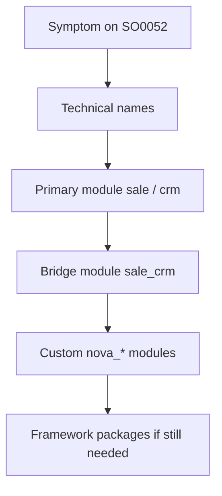
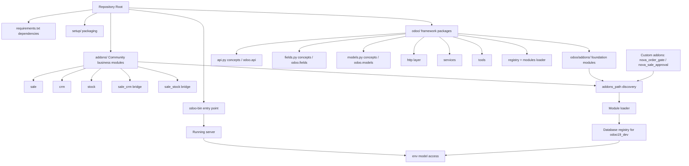

# UNIT II: HOW ODOO ACTUALLY WORKS

## CHAPTER 6: ODOO SOURCE CODE STRUCTURE

Chapter 5 gave you a workshop: a virtual environment, PostgreSQL, an Odoo 19.0 source checkout, a configuration file, `addons_path`, Developer Mode, logs, and a debugger. Chapter 6 answers the next practical question: once the server runs, where do you look?

References use Odoo 19.0 as the teaching baseline. Paths and package names follow a Community source checkout layout. Exact filenames can shift across maintenance commits; the navigation habits stay stable. Worked examples are local-development investigation models on databases such as `odoo19_dev`, not production change playbooks.

**Starting-point check:** Chapter 5 should already feel familiar. You do not need every log-level nuance memorized yet, but you should be able to start Odoo from a known config, open a named development database, and find a custom module directory on `addons_path`. If that chain still feels theoretical, revisit Chapter 5 before treating this chapter as a file-hunting checklist. Source navigation without a runnable workspace produces elegant confusion.

Think of Chapter 5 as getting keys to the workshop and Chapter 6 as learning which shelves hold tools, blueprints, and product parts. Without the keys, the shelves are locked. Without shelf literacy, the keys only let you stare at a large room.

Chapter 6 is navigational: you learn to move from a business symptom to a framework folder, an official addon, a model definition, an XML ID, and a method. The goal is not memorizing every file. The goal is a repeatable investigation habit you can trust when Sales Order `SO0052` behaves strangely.

---

## CHAPTER 6 TABLE OF CONTENTS

- [**Before We Start: Reading the Repository Root**](#before-we-start-reading-the-repository-root)
- [**6.1** `odoo/`](#61-odoo)
- [**6.2** `addons/`](#62-addons)
- [**6.3** Core Framework](#63-core-framework)
- [**6.4** `api.py` Concepts](#64-apipy-concepts)
- [**6.5** `fields.py` Concepts](#65-fieldspy-concepts)
- [**6.6** `models.py` Concepts](#66-modelspy-concepts)
- [**6.7** HTTP](#67-http)
- [**6.8** Services](#68-services)
- [**6.9** Tools](#69-tools)
- [**6.10** Registry](#610-registry)
- [**6.11** Modules Loader](#611-modules-loader)
- [**6.12** Reading Official Addons](#612-reading-official-addons)
- [**6.13** Tracing Model Definitions](#613-tracing-model-definitions)
- [**6.14** Tracing XML IDs](#614-tracing-xml-ids)
- [**6.15** Tracing Methods](#615-tracing-methods)
- [Bringing All of Chapter 6 Together](#bringing-all-of-chapter-6-together)
- [Source Navigation Architecture](#source-navigation-architecture)
- [Common Beginner Mistakes in Chapter 6](#common-beginner-mistakes-in-chapter-6)
- [Chapter 6 Mastery Check](#chapter-6-mastery-check)
- [Chapter 6 Summary](#chapter-6-summary)
- [**Free Learning Resources**](Resources.md)

**Then we will complete:**

- [Free Learning Resources](Resources.md)
- [Chapter Exercise](Exercise.md)
- [Chapter Project](Project.md)

---

## BEFORE WE START: READING THE REPOSITORY ROOT

Monday morning at Nova Retail Group. Rami has `odoo19_dev` running. Lina opens the source checkout root and says:

> "Do not start inside `sale`. Start at the door."

Rami answers the way many beginners answer:

> "So I search the whole tree for `action_confirm`?"

Noor overhears and adds a business constraint:

> "When Meridian Supplies asks why `SO0052` blocked CRM follow-up, I need a story that starts from evidence, not from a lucky grep."

That constraint is part of source literacy. Searching everything is sometimes useful. Knowing where classes of answers live is always useful.

At the repository root of an Odoo Community source checkout you typically see:

```text
odoo/
addons/
setup/
odoo-bin
requirements.txt
```

plus supporting files such as README material, license text, and packaging metadata. Exact companion files can vary. The five names above are the teaching landmarks for this chapter.

A useful mental model is:

$$ \text{Odoo Source} = \text{Framework} + \text{Business Addons} + \text{Entry Point} + \text{Dependencies} $$

Map those four ideas onto the root:

| Root landmark | Mental role |
| --- | --- |
| `odoo/` | Framework and runtime packages |
| `addons/` | Official Community business modules |
| `odoo-bin` | Entry point that starts the server process |
| `requirements.txt` | Python dependency contract for the checkout |
| `setup/` | Packaging and installation support for distributing/installing Odoo as a Python project |

Contrast two Monday mornings:

| Random browsing | Coherent browsing |
| --- | --- |
| Open random `.py` files until something looks familiar | Decide whether the question is framework, addon, launch, or dependency |
| Blame "Odoo" as one folder | Separate runtime engine from business modules |
| Edit Community files because they are nearby | Read Community files, then extend through custom addons such as `nova_order_gate` |
| Treat every import error as an Apps problem | Ask whether `requirements.txt` and the virtual environment disagree |

The left column can still produce occasional lucky finds. The right column produces an investigation you can explain to Lina and Noor.

Keep one more root equation nearby while reading this chapter:

$$ \text{odoo-bin} + \text{requirements} + \text{framework packages} + \text{addon trees} = \text{A navigable Odoo 19 checkout} $$

If any term is missing from your mental model, later sections will feel like disconnected folder tourism. If all four terms are present, each section becomes a named shelf rather than a surprise.

### WHY THIS MATTERS FOR AN ODOO DEVELOPER

Odoo development is evidence work across a large tree. When Sales confirmation, CRM opportunity updates, or stock reservation surprise you, the first skill is choosing the correct shelf. Chapter 6 builds that map piece by piece. Do not skip a piece because "I already opened `addons/sale` once." Ask whether you know why that folder is not the framework.

Also ask whether your Chapter 5 workspace still supports the hunt. Source literacy without `odoo19_dev`, logs, and a working `addons_path` becomes abstract file appreciation. This chapter assumes the workshop from Chapter 5 is already usable.

---

## 6.1 ODOO/


### INTUITION

Odoo is not one homogeneous pile of business screens.

Part of the source is the engine: ORM, registry, HTTP request handling, module loading, and shared runtime services. Another part is the product catalog of business applications: Sales, CRM, Inventory, Accounting helpers, and hundreds of other modules.

If Rami confuses those two parts, he asks the wrong questions. He looks for invoice rules inside framework packages, or he looks for registry mechanics inside a Sales form view.

### DEFINITION

The **`odoo/`** directory is primarily the framework and runtime package tree for the Odoo server.

It is the neighborhood for ORM mechanics, HTTP glue, services, tools, registry/module-loading machinery, and related runtime packages. Top-level `addons/` is the separate Community business-module tree covered in Section 6.2.

Together they form the classic split:

$$ \text{Runnable Odoo} = \text{Framework (odoo/)} + \text{Business Addons (addons/)} $$

That equation is a teaching model. Some base modules live under `odoo/addons/` as well, which the nested-addons subsection below covers. The first habit is still correct: treat framework concerns and business-module concerns as different neighborhoods.

### WHAT BELONGS WHERE

Under `odoo/` you expect packages and modules that answer questions such as:

- How are models registered?
- How do field types behave?
- How does an HTTP request become a Python call?
- How are modules discovered and loaded?
- What shared utilities exist for dates, caching, images, and similar work?

Under top-level `addons/` you expect modules that answer questions such as:

- How does `sale.order` behave for Nova Retail salespeople?
- Which views define the CRM opportunity form?
- How does Inventory reserve quantities?
- Which XML IDs create standard Sales menus and actions?

Lina puts it bluntly for Rami:

> "`odoo/` is how Odoo thinks. `addons/` is what Odoo sells as business apps."

### A CONCRETE ROOT WALK

When Rami opens the checkout used with `odoo19_dev`, he should be able to point at:

```text
odoo/          -> framework neighborhood
addons/        -> official business modules neighborhood
odoo-bin       -> process entry point
requirements.txt
setup/
```

He should also remember Chapter 5's custom addons directory. That directory is usually outside vendor source, for example a sibling folder containing `nova_order_gate` and `nova_sale_approval`. It is not a substitute for either `odoo/` or official `addons/`. It is a third neighborhood: Nova Retail extensions.

$$ \text{Investigation Space} = \text{Framework} + \text{Official Addons} + \text{Custom Addons} $$

### WHY THE SPLIT PREVENTS FALSE EDITS

Beginners often "fix" a business bug by editing the first matching file. If that file is inside framework code, the fix may appear local while breaking unrelated apps. If that file is inside an official addon and the change is made in place, upgrades become painful.

Nova Retail's safer pattern is:

1. Read framework code to understand mechanisms.
2. Read official addon code to understand standard behavior.
3. Implement Nova-specific rules in custom modules such as `nova_sale_approval`.

### WHY THIS MATTERS FOR AN ODOO DEVELOPER

Stack traces mix framework frames and addon frames. Knowing which path prefixes mean "engine" and which mean "business module" turns a scary traceback into a map. Without that split, every failure looks like a mysterious Odoo interior.

### EXAMPLE

Noor reports that confirming Sales Order `SO0052` for Meridian Supplies fails after `nova_order_gate` was installed. Rami's first question is not "Which random file mentions confirm?" His first question is:

> "Is the failure in our custom gate, in Sales business logic, or in framework execution mechanics?"

He checks the traceback path prefixes:

- paths under custom addons point at Nova logic,
- paths under `addons/sale` point at official Sales behavior,
- paths under `odoo/` point at runtime/framework behavior.

That triage takes one minute and saves an afternoon of editing the wrong neighborhood.

Caveat: some shared "base" business modules live under `odoo/addons/`. Seeing `addons` inside `odoo/` does not cancel the framework-versus-business split; it refines it in the nested-addons subsection below.

### COMMON MISTAKE

A beginner treats the entire repository as one editable application folder and patches whichever file appears first in search results.

**Wrong thinking:**

> Everything under the Odoo checkout is fair game for quick business fixes.

**Correct thinking:**

> `odoo/` is framework territory, official `addons/` is standard product territory, and Nova changes belong in custom modules unless there is a deliberate, reviewed exception.


### ODOO/ADDONS/ VERSUS TOP-LEVEL ADDONS/


#### INTUITION

Once Rami learns "`odoo/` is framework and `addons/` is business," he discovers another folder:

```text
odoo/addons/
```

That folder name looks like a contradiction. Is it framework? Is it business? Both instincts are half right, which is why beginners get lost.

#### DEFINITION

**`odoo/addons/`** holds base and tightly coupled modules that ship with the framework tree, including foundational modules the server expects as part of a normal database.

**Top-level `addons/`** holds the broader Community business application set: Sales, CRM, Inventory, website helpers, and many other official modules.

Teaching model:

$$ \text{Official Modules} = \text{Base modules in odoo/addons/} + \text{Community apps in top-level addons/} $$

Both are addon directories from Odoo's discovery point of view. Both can appear on `addons_path`. Their product roles differ.

#### WHY TWO OFFICIAL ADDON LOCATIONS EXIST

Think of `odoo/addons/` as the foundation layer close to the engine: modules without which "Odoo as an application platform" barely stands.

Think of top-level `addons/` as the storefront catalog: modules that implement major business domains.

Rami does not need the historical packaging story memorized on day one. He needs the navigation consequence:

| Location | Typical questions answered |
| --- | --- |
| `odoo/addons/` | Base/web/foundation module behavior close to the framework |
| top-level `addons/` | Domain apps such as `sale`, `crm`, `stock`, `sale_crm`, `sale_stock` |
| custom addons path | Nova Retail modules such as `nova_order_gate` |

#### ADDONS_PATH REALITY CHECK

Chapter 5 taught that Odoo discovers modules from configured addon directories. A typical teaching configuration includes both official trees plus a custom directory.

Conceptually:

```text
addons_path = odoo/addons, ./addons, /path/to/custom_addons
```

Exact path syntax depends on OS and install layout. The idea is stable:

$$ \text{Module Visibility} = \text{Directory Membership on addons path} $$

A module in the wrong place relative to `addons_path` is invisible even if the files are perfect.

#### HOW TO AVOID THE "WHICH ADDONS FOLDER?" PANIC

When Lina asks Rami to open Sales code, he should go to top-level `addons/sale` in a normal Community checkout teaching layout.

When he needs base or web foundation modules, he should check `odoo/addons/` before assuming the module is missing.

When he needs Nova Retail logic, he should ignore both official trees and open the custom addons directory.

#### WHY THIS MATTERS FOR AN ODOO DEVELOPER

Misplacing a custom module into `odoo/addons/` or editing foundation modules "because that is where base lives" creates upgrade and review pain. Knowing the two official addon neighborhoods keeps Nova's code in the third neighborhood where it belongs.

#### EXAMPLE

Rami cannot find `sale_crm` under `odoo/addons/`. He almost concludes the checkout is broken. Lina points him to top-level `addons/sale_crm` and says:

> "Foundation and storefront are both official. They are not the same shelf."

He updates his personal map for `odoo19_dev` work:

1. framework packages under `odoo/` (outside `odoo/addons/`),
2. foundation modules under `odoo/addons/`,
3. Community business modules under top-level `addons/`,
4. Nova modules under the custom path.

Caveat: Enterprise layouts and additional addon repositories can introduce more directories. This chapter's baseline remains Community source literacy.

#### COMMON MISTAKE

A beginner assumes there is only one official `addons` directory and panics when a famous module is not under `odoo/addons/`, or dumps custom modules into `odoo/addons/` to "make Odoo see them."

**Wrong thinking:**

> If it is an addon, it belongs inside `odoo/addons/`.

**Correct thinking:**

> Official addons are split between foundation and Community storefront locations, while custom addons belong on a dedicated path entry.

### RELEVANT RESOURCES

Here are the relevant resources for **6.1 ODOO/**:

### 1. ODOO FOLDER STRUCTURE (BEGINNERS)

| | |
|---|---|
| **Source** | Community technical channel (Odoo Tech) |
| **Reinforces** | Top-level repository landmarks before diving into one addon |
| **Version note** | Titled for Odoo 18; pair with an Odoo 19.0 checkout as the authority |

<div align="center">

[](https://www.youtube.com/watch?v=hqg2DRO8Rw4)

**Watch on YouTube:** [Understanding Odoo Folder Structure | Beginners Guide to Odoo Development](https://www.youtube.com/watch?v=hqg2DRO8Rw4)

</div>

---

### 2. ODOO FOLDER STRUCTURE EXPLAINED

| | |
|---|---|
| **Source** | OdooVerse |

<div align="center">

[](https://www.youtube.com/watch?v=drZxPJIRUmo)

**Watch on YouTube:** [Odoo Folder Structure Explained | Beginner Friendly Guide](https://www.youtube.com/watch?v=drZxPJIRUmo)

</div>

---

### OFFICIAL DOCUMENTATION

| Topic | Documentation |
|---|---|
| **Architecture overview** | [Chapter 1: Architecture Overview (Odoo 19)](https://www.odoo.com/documentation/19.0/developer/tutorials/server_framework_101/01_architecture.html) |
| **Source repository** | [GitHub: odoo/odoo](https://github.com/odoo/odoo) |

Full chapter index: [Resources.md](Resources.md)

---

## 6.2 ADDONS/

### INTUITION

If `odoo/` is the machinery room, top-level `addons/` is the storefront catalog of official Community business applications.

This is where Rami should look when the question is Sales, CRM, Inventory, or another business domain. It is not where he should look first for registry mechanics or API decorator definitions.

Lina's short version:

> "Business symptoms usually start in `addons/`. Framework symptoms usually start in `odoo/`."

### DEFINITION

The top-level **`addons/`** directory is the official Community business modules tree in a normal Odoo source checkout.

Each child folder is typically one module. A module is a self-contained unit with a manifest, Python models, XML/CSV data and views, and often security and wizard files.

Teaching model:

$$ \text{Top-level addons/} = \text{Official business modules you install as Apps} $$

That is distinct from:

- framework packages under `odoo/` (outside `odoo/addons/`),
- foundation modules under `odoo/addons/`,
- Nova Retail custom modules on a separate `addons_path` entry.

### MODULE FOLDER ANATOMY

A typical official module shape, using Sales as the teaching example:

```text
addons/sale/
  __manifest__.py
  models/
  views/
  security/
  data/
  wizard/
  report/
  ...
```

Not every module has every folder. The habit is to expect this map and adapt.

| Folder / file | Usual job |
| --- | --- |
| `__manifest__.py` | Module identity, dependencies, data file list |
| `models/` | Python model definitions and business methods |
| `views/` | Form, tree/list, search, and related UI XML |
| `security/` | Access rights and record rules |
| `data/` | Seed/data XML or CSV |
| `wizard/` | Transient model assistants |
| `report/` | Report templates and related files when present |

### THE SALE EXAMPLE AS A FIRST MAP

When Noor asks about confirming `SO0052` for Meridian Supplies, Rami's first business-module stop is usually:

```text
addons/sale/
```

Inside it he does not wander randomly. He asks:

1. What does the manifest depend on?
2. Where is `sale.order` defined under `models/`?
3. Which view XML exposes the Confirm button?
4. Which security rules might block a user?

Only after that primary read does he widen to bridge modules such as `sale_crm` or custom modules such as `nova_order_gate`.

### DO NOT READ RANDOMLY

`addons/` is huge. Reading it like a novel produces fatigue without understanding.

Better rule:

$$ \text{Question} \rightarrow \text{Owning module folder} \rightarrow \text{Manifest} \rightarrow \text{Relevant model/view/security slice} $$

Do not open every Python file in `sale` on day one. Do not edit official files casually because they are "right there." Read them as product textbooks. Extend Nova Retail behavior in custom modules.

### WHY THIS MATTERS FOR AN ODOO DEVELOPER

Most Nova Retail tickets start as business behavior questions. If Rami cannot navigate `addons/` deliberately, he either rewrites official modules in place or invents duplicate logic that ignores what Sales already provides.

Module anatomy literacy also makes custom modules like `nova_sale_approval` easier to design, because they mirror the same folder contracts.

### EXAMPLE

Rami needs to understand standard quotation confirmation before changing `nova_order_gate`. He opens `addons/sale/__manifest__.py`, then `addons/sale/models/` for `sale.order`, then only the view file that defines the Confirm button. He writes notes for Lina naming those three stops. He does not claim he "read all of Sales."

Caveat: some foundational modules live under `odoo/addons/` rather than top-level `addons/`. If a famous base/web module is missing from top-level `addons/`, check Section 6.1's nested-addons subsection before declaring the checkout broken.

### COMMON MISTAKE

A beginner treats `addons/` as a random code dump, either scrolling endlessly through `sale` or patching official files for speed.

**Wrong thinking:**

> If the business feature lives under `addons/`, editing those files directly is the normal customization path.

**Correct thinking:**

> `addons/` is the official business-module catalog to read with a question and a folder map; Nova changes belong in custom modules unless there is a deliberate, reviewed exception.

### RELEVANT RESOURCES

Here are the relevant resources for **6.2 ADDONS/**:

### 1. ODOO MODULE STRUCTURE: MODELS, VIEWS, SECURITY

| | |
|---|---|
| **Source** | EasyDev |
| **Reinforces** | Module directory anatomy before tracing inheritance |

<div align="center">

[](https://www.youtube.com/watch?v=ov-ReGkIxIg)

**Watch on YouTube:** [Odoo Module Structure Explained](https://www.youtube.com/watch?v=ov-ReGkIxIg)

</div>

---

### 2. ODOO MODULES EXPLAINED

| | |
|---|---|
| **Source** | EasyDev |

<div align="center">

[](https://www.youtube.com/watch?v=uJPjmS5Arug)

**Watch on YouTube:** [Odoo Modules Explained](https://www.youtube.com/watch?v=uJPjmS5Arug)

</div>

---

### OFFICIAL DOCUMENTATION

| Topic | Documentation |
|---|---|
| **Module manifests / addon packages** | [Module Manifests (Odoo 19)](https://www.odoo.com/documentation/19.0/developer/reference/backend/module.html) |

Full chapter index: [Resources.md](Resources.md)

---

## 6.3 CORE FRAMEWORK

### INTUITION

If `addons/` is the showroom, the core framework is the machinery room.

Rami can click Sales menus all day and still not understand why records save, why methods resolve through inheritance, or why a request arrives with an environment attached. Those behaviors come from framework code.

### DEFINITION

The **core framework** is the set of runtime packages under `odoo/` that provide ORM mechanics, module loading, registry construction, HTTP serving glue, CLI startup support, and shared services/utilities used by nearly every addon.

It is not one file named `framework.py`. It is a neighborhood of packages.

A useful equation:

$$ \text{Business Module Code} + \text{Core Framework} = \text{Running Application Behavior} $$

### WHAT "CORE" MEANS IN PRACTICE

When developers say "look in core," they usually mean packages such as:

- `odoo.api`
- `odoo.fields`
- `odoo.models`
- `odoo.http`
- `odoo.service`
- `odoo.tools`
- `odoo.modules` (loader/registry-related machinery)
- supporting packages for CLI, OS helpers, and upgrade utilities depending on the checkout

Exact package lists evolve. The investigation habit is: if the question is mechanism, start in framework packages; if the question is business meaning, start in addons.

### FRAMEWORK VERSUS ADDON RESPONSIBILITY

| Question | Prefer |
| --- | --- |
| How does `create()` generally work? | Framework models/ORM packages |
| How does Sales compute margins? | `sale` and related addons |
| How is a controller routed? | `odoo.http` and related web modules |
| How does CRM create an activity? | `crm` and related addons |
| How are modules loaded into the registry? | Module loader / registry framework code |

Noor cares about business outcomes. Lina cares that Rami can separate outcome from mechanism. Core literacy is how he separates them.

### READING CORE WITHOUT DROWNING

Core code is dense. Beginners either avoid it forever or try to read it front to back. Both strategies fail.

Better approach:

1. Arrive with a question.
2. Open the package that owns that question.
3. Read the class or function that the traceback or docs named.
4. Stop when the mechanism is clear enough to return to the business module.

$$ \text{Question} \rightarrow \text{Framework Target} \rightarrow \text{Enough Understanding} \rightarrow \text{Back to Addon} $$

### WHY THIS MATTERS FOR AN ODOO DEVELOPER

Custom modules inherit framework behavior whether the author understands it or not. `nova_sale_approval` does not invent environments, fields, or registries. It uses them. Core literacy prevents magical thinking about decorators, recordsets, and inheritance.

### EXAMPLE

Rami sees `@api.depends` in `nova_order_gate` and wonders whether Sales invented it. Lina sends him to the framework `api` package first, then back to the custom module. He learns that the decorator is a framework contract used by many apps, not a Sales-only trick.

Caveat: reading core is not permission to patch core for routine Nova Retail requirements. Understanding and modifying are different decisions.

### COMMON MISTAKE

A beginner avoids framework packages completely and copies addon snippets until something works, or the opposite: rewrites framework files because a business rule seems global.

**Wrong thinking:**

> Core is either irrelevant or freely editable.

**Correct thinking:**

> Core is the shared mechanism layer: read it to understand, extend business behavior through addons, and change core only with exceptional justification.

### RELEVANT RESOURCES

Here are the relevant resources for **6.3 CORE FRAMEWORK**:

### ODOO PROJECT STRUCTURE EXPLAINED

| | |
|---|---|
| **Source** | EasyDev |
| **Why use it** | Project-level mental model before package-level reading |

<div align="center">

[](https://www.youtube.com/watch?v=9_I-U5eYKL8)

**Watch on YouTube:** [Odoo Project Structure Explained](https://www.youtube.com/watch?v=9_I-U5eYKL8)

</div>

---

### OFFICIAL DOCUMENTATION

| Topic | Documentation |
|---|---|
| **Architecture overview** | [Chapter 1: Architecture Overview (Odoo 19)](https://www.odoo.com/documentation/19.0/developer/tutorials/server_framework_101/01_architecture.html) |
| **ORM API** | [ORM API (Odoo 19)](https://www.odoo.com/documentation/19.0/developer/reference/backend/orm.html) |

Full chapter index: [Resources.md](Resources.md)

---
## 6.4 API.PY CONCEPTS

### INTUITION

Odoo business methods do not look like plain Python functions attached to random classes. They are decorated, environment-aware, and integrated with the ORM's dependency and calling conventions.

When Rami writes:

```python
@api.depends("amount_total")
def _compute_something(self):
    ...
```

he is not inventing a personal style. He is using framework API contracts.

### DEFINITION

**`api.py` concepts** are the ORM method contracts historically associated with Odoo's `api` layer: decorators and helpers for depends/constraints/onchange-style hooks and related calling conventions.

In Odoo 19, those concepts live in the **`odoo/api/` package** (imported as `odoo.api`), not only in one legendary standalone `api.py` file. Teaching still says "api.py concepts" because that is how many developers name the idea. Navigation must follow the package.

$$ \text{api.py concepts} \rightarrow \text{Odoo 19 odoo/api package} $$

Package layouts can include multiple modules. Navigate it as a package. Do not freeze your mental model to an older single-file picture if the checkout uses a package directory.

### WHAT THESE API.PY CONCEPTS ARE FOR

The API layer helps answer:

- Which methods are model methods with recordset semantics?
- Which compute methods depend on which field names?
- Which constraints should run when?
- How should certain methods be exposed or constrained in the ORM style?

It is the grammar of talking to the ORM politely.

### DECORATORS AS CONTRACTS

Decorators in `odoo.api` are not ornaments. They are contracts between your method and the framework.

Examples of the kind of contracts developers meet early:

| Contract style | Purpose in plain language |
| --- | --- |
| depends-style | Recompute when named inputs change |
| constrains-style | Validate invariants when relevant fields change |
| onchange-style | Advise UI about proposed values before save |
| model/returns helpers | Shape how methods integrate with ORM calling patterns |

Exact decorator names and preferred modern patterns should be confirmed in the Odoo 19 checkout and official docs while you work. The durable lesson is: read the decorator as a framework promise, not as decoration.

### WHY THE HEADING SAYS API.PY WHILE ODOO 19 USES A PACKAGE

Beginners often say "open `api.py`." In older mental models that was literal. In Odoo 19 teaching, prefer:

```text
import / navigate package: odoo/api/  (odoo.api)
```

Then inspect the symbols you actually import in addons:

```python
from odoo import api
```

That import is a package-level facade in modern layouts. Understanding "concepts first, package navigation second" prevents confusion when IDE navigation shows a directory rather than a single historic file.

### WHY THIS MATTERS FOR AN ODOO DEVELOPER

Almost every serious custom module uses API decorators. If Rami misunderstands `@api.depends`, computes fire too often, too rarely, or with stale assumptions. That bug will look like a Sales bug while being an API-contract bug.

### EXAMPLE

In `nova_sale_approval`, Rami adds a compute that should react to order totals and approval state. He declares dependencies explicitly through the API decorator style used in Odoo 19, then verifies on `odoo19_dev` that changing `SO0052`'s lines recomputes as expected.

He resists adding hidden side effects inside onchange-style methods when a real stored constraint or compute belongs in ORM-backed logic.

Caveat: UI onchange behavior and server-side constraints are not identical safety nets. Noor cares about what remains true after save, not only what the form looked like before save.

### COMMON MISTAKE

A beginner copies decorators without reading what they promise, or searches only for a legacy single file and concludes the API layer "moved away" when it is simply packaged.

**Wrong thinking:**

> Decorators are optional style, and `api` must be one flat file forever.

**Correct thinking:**

> API decorators are ORM contracts, and in Odoo 19 you should navigate the `odoo/api/` package even when people still say "api.py concepts."

### RELEVANT RESOURCES

Here are the relevant resources for **6.4 API.PY CONCEPTS**:

### OFFICIAL DOCUMENTATION

| Topic | Documentation |
|---|---|
| **ORM API (decorators, Environment)** | [ORM API (Odoo 19)](https://www.odoo.com/documentation/19.0/developer/reference/backend/orm.html) |
| **Framework packages in source** | [GitHub: odoo/odoo `odoo/api`](https://github.com/odoo/odoo/tree/19.0/odoo/api) |

Full chapter index: [Resources.md](Resources.md)

---
## 6.5 FIELDS.PY CONCEPTS

### INTUITION

Business objects are not only Python classes. They are collections of fields with types, storage behavior, relational targets, compute rules, and UI implications.

When Lina says "check the field definition," she means more than "find a variable name." She means find the field object's declaration and understand its type family.

### DEFINITION

**`fields.py` concepts** are the field-type and field-behavior contracts used in model declarations: scalars, relations, computes, related fields, and storage implications.

In Odoo 19, those concepts live in the **`odoo/fields/` package** (imported as `odoo.fields`), not only in one legendary standalone `fields.py` file.

$$ \text{fields.py concepts} \rightarrow \text{Odoo 19 odoo/fields package} $$

Model code typically imports field names from `odoo.fields` through familiar patterns such as:

```python
from odoo import fields
```

### FIELD DECLARATIONS AS DATA CONTRACTS

A field declaration tells Odoo:

- the column or relational meaning,
- whether values are stored, computed, related, or transient in behavior,
- how the value participates in views and ORM operations,
- what type conversions and validations apply.

Example shape Rami sees constantly:

```python
amount_total = fields.Monetary(string="Total", ...)
partner_id = fields.Many2one("res.partner", string="Customer")
```

Those lines are not "just attributes." They construct field objects governed by the fields package.

### TYPE FAMILIES

Without memorizing every option, group fields into families:

| Family | Examples of meaning |
| --- | --- |
| Scalar | characters, booleans, numbers, dates, datetimes, monetary amounts |
| Relational | many2one, one2many, many2many |
| Technical / special | binary, HTML, properties-like or advanced field kinds depending on version features |
| Computed / related patterns | values derived from other fields or delegated through relations |

When a bug says "the value is wrong," ask which family owns the field. Relational mistakes and compute mistakes need different investigations.

### STORED VERSUS COMPUTED THINKING

A stored field has persistence implications. A computed field has dependency and recalculation implications. A related field has delegation implications.

$$ \text{Wrong Field Family Assumption} \rightarrow \text{Wrong Fix} $$

If Rami treats a computed value as if it were independently writable storage, he will fight the ORM instead of working with it.

### WHY THIS MATTERS FOR AN ODOO DEVELOPER

Custom modules such as `nova_order_gate` add fields that Noor later filters, exports, and trusts in meetings. Field definitions are product contracts. A poorly typed field becomes a reporting wound that lasts for years.

### EXAMPLE

Nova Retail wants an approval flag on sales orders. Rami adds a boolean field in `nova_sale_approval` with a clear string label and help text, then uses it in views and domain filters. He reads `odoo.fields` enough to know what a Boolean field guarantees, rather than storing `"yes"`/`"no"` strings because the form looked easier that way.

Caveat: adding fields to official models via custom modules is normal; adding redundant shadow fields because the real field was not found is usually investigation failure, not design.

### COMMON MISTAKE

A beginner invents ad hoc storage patterns (encoded strings, parallel tables in custom SQL) before checking whether a standard field type already expresses the need, or assumes field behavior lives only in XML.

**Wrong thinking:**

> Fields are mostly view decorations.

**Correct thinking:**

> Fields are ORM data contracts defined in Python through the `odoo/fields/` package (`odoo.fields`), then exposed by views.

### RELEVANT RESOURCES

Here are the relevant resources for **6.5 FIELDS.PY CONCEPTS**:

### OFFICIAL DOCUMENTATION

| Topic | Documentation |
|---|---|
| **ORM API (fields)** | [ORM API (Odoo 19)](https://www.odoo.com/documentation/19.0/developer/reference/backend/orm.html) |
| **Framework packages in source** | [GitHub: odoo/odoo `odoo/fields`](https://github.com/odoo/odoo/tree/19.0/odoo/fields) |

Full chapter index: [Resources.md](Resources.md)

---
## 6.6 MODELS.PY CONCEPTS

### INTUITION

Everything business-shaped in Odoo eventually becomes a model: partners, products, sales orders, CRM opportunities, stock moves, and Nova Retail approval records.

The models.py / `odoo.models` layer is where the framework defines what a model is and how recordsets behave.

### DEFINITION

**`models.py` concepts** are the base model classes and recordset behaviors on which addon models are built.

In Odoo 19, those concepts live in the **`odoo/models/` package** (imported as `odoo.models`), not only in one legendary standalone `models.py` file.

$$ \text{models.py concepts} \rightarrow \text{Odoo 19 odoo/models package} $$

Addon code commonly looks like:

```python
from odoo import models, fields, api

class SaleOrder(models.Model):
    _name = "sale.order"
    _inherit = "sale.order"
```

Those base classes come from the models framework package.

### MODEL, RECORD, RECORDSET

Keep the trio clear:

| Term | Plain meaning |
| --- | --- |
| Model | The class/registry type, such as `sale.order` |
| Record | One business object instance |
| Recordset | Zero or more records of that model handled together |

Framework model code is obsessed with recordsets. Methods usually run on recordsets, not on isolated classic Python objects.

$$ \text{Method Call} = \text{Recordset} + \text{Environment} + \text{Business Logic} $$

### BASE CLASSES AND EXTENSION

Official and custom modules extend models using inheritance mechanisms provided by the framework. Rami's `nova_order_gate` does not replace Sales wholesale. It inherits `sale.order` and adds gate behavior.

That extension style only makes sense because `odoo.models` defines how model classes combine in the registry.

### WHERE TO READ VERSUS WHERE TO WRITE

Read `odoo.models` when you need to understand:

- why `self` is a recordset,
- how `create`, `write`, `unlink`, and `search` generally behave,
- what inheritance machinery is doing,

Write your business logic in addons, especially custom addons for Nova Retail rules.

### WHY THIS MATTERS FOR AN ODOO DEVELOPER

If Rami treats Odoo models like ordinary Django-or-Flask-style objects without recordset semantics, he writes loops incorrectly, misses multi-record cases, and creates bugs that appear only when Noor selects multiple quotations.

### EXAMPLE

On `odoo19_dev`, Rami confirms one Meridian Supplies order and later confirms a batch. His gate method must behave correctly for both recordset sizes. He reads enough of the models framework idea to stop writing methods that assume `self` is always one record unless he enforces that assumption deliberately.

Caveat: deeper ORM internals are a long study. This section only demands package literacy and recordset humility.

### COMMON MISTAKE

A beginner never opens `odoo.models`, copies random `self.ensure_one()` patterns without understanding why, or implements heavy business rules by bypassing ORM model methods with raw SQL too early.

**Wrong thinking:**

> Model base classes are framework trivia.

**Correct thinking:**

> `odoo.models` defines the execution style of almost every business method you will write or override.

### RELEVANT RESOURCES

Here are the relevant resources for **6.6 MODELS.PY CONCEPTS**:

### OFFICIAL DOCUMENTATION

| Topic | Documentation |
|---|---|
| **ORM API (models)** | [ORM API (Odoo 19)](https://www.odoo.com/documentation/19.0/developer/reference/backend/orm.html) |
| **Framework packages in source** | [GitHub: odoo/odoo `odoo/models`](https://github.com/odoo/odoo/tree/19.0/odoo/models) |

Full chapter index: [Resources.md](Resources.md)

---
## 6.7 HTTP

### INTUITION

The browser never talks directly to PostgreSQL. It talks HTTP to the Odoo server. Controllers, JSON-RPC style calls, session handling, and request objects live in this neighborhood.

When a button click becomes Python, HTTP and request handling are part of the bridge. That bridge is easy to forget because the UI feels like "Odoo screens talking to Odoo models." In reality, every click is a network conversation first.

Lina reminds Rami:

> "If the request never arrived, your elegant model theory is fiction."

### DEFINITION

The **HTTP layer** in Odoo source centers on the `odoo.http` package and related web request machinery that accepts browser or API calls and dispatches them into controllers or ORM-capable request environments.

Teaching model:

$$ \text{Browser Event} \rightarrow \text{HTTP Request} \rightarrow \text{Dispatcher/Controller} \rightarrow \text{Model Methods} $$

### WHAT YOU LOOK FOR HERE

Under HTTP-related framework code, Rami investigates:

- how routes are declared,
- how authentication modes affect access,
- how request/session objects are exposed,
- how JSON-RPC or web client calls land in Python,
- where response construction happens.

He does not look here for "how opportunity probability is calculated." That is CRM business logic.

A practical filter:

| Evidence | Prefer HTTP layer first? |
| --- | --- |
| Browser shows network failure / 404 / 403 | Yes |
| Server log shows no request | Yes |
| Traceback inside `sale.order` method | No, business/ORM first |
| Portal page routing anomaly | Yes, then related website/portal modules |

### CONTROLLERS VERSUS MODEL METHODS

A common beginner confusion is treating every customization as a controller problem because the browser is involved.

| Need | Typical place |
| --- | --- |
| Business rule on records | Model methods in addons |
| Custom HTTP endpoint / portal route | Controllers using `odoo.http` |
| Standard backend button on a form | Often an ORM method exposed to the client, not a bespoke controller |

Nova Retail's sales approval gate usually belongs on `sale.order` methods, not on a brand-new public controller. Public controllers create attack surface and bypass habits that backend record rules already express.

### REQUEST ENVIRONMENT MENTAL MODEL

Once a request is authenticated and dispatched into ORM-capable handling, model code usually sees an environment bound to that request's database and user context. That is why HTTP and ORM feel continuous in healthy backend flows:

$$ \text{HTTP authenticity} \rightarrow \text{Environment} \rightarrow \text{Recordset methods} $$

If authenticity or routing fails, the environment story never begins. If routing succeeds and business logic fails, HTTP did its job.

### WHY THIS MATTERS FOR AN ODOO DEVELOPER

Some bugs are transport bugs: CSRF, auth, routing, sessions. Some bugs are business bugs that merely arrive through HTTP. HTTP literacy prevents Rami from debugging the wrong layer when Meridian Supplies users report "the button does nothing."

It also prevents a worse habit: inventing custom routes for ordinary form actions because the developer is more comfortable with web frameworks than with Odoo model methods.

### EXAMPLE

A salesperson says confirming `SO0052` does nothing. Rami checks the browser network call first, then the server log. If the request never reaches Odoo, it is not a `sale.order` compute bug. If the request returns a traceback from `nova_order_gate`, HTTP succeeded and business logic failed.

He writes the triage in one line for Lina:

> "Transport OK, gate raised, CRM bridge not reached."

That sentence is only possible when HTTP evidence and method tracing are both in play.

Caveat: website, portal, and RPC styles have additional modules and patterns. Start with the request path evidence before specializing.

### COMMON MISTAKE

A beginner builds custom controllers for ordinary backend record actions that should be model methods, or ignores HTTP evidence and rewrites ORM code when the request never arrived.

**Wrong thinking:**

> Every UI problem is a model problem, or every UI need needs a new controller.

**Correct thinking:**

> Prove where the request went, then choose model logic or HTTP routing accordingly.

### RELEVANT RESOURCES

Here are the relevant resources for **6.7 HTTP**:

### OFFICIAL DOCUMENTATION

| Topic | Documentation |
|---|---|
| **Web controllers / HTTP** | [Web Controllers (Odoo 19)](https://www.odoo.com/documentation/19.0/developer/reference/backend/http.html) |
| **HTTP source landmark** | [GitHub: odoo/odoo `odoo/http.py`](https://github.com/odoo/odoo/blob/19.0/odoo/http.py) |

Full chapter index: [Resources.md](Resources.md)

---
## 6.8 SERVICES

### INTUITION

Not everything in Odoo is a model field. The server also needs process-level services: starting workers, managing database registries at a server level, handling long-running server concerns, and coordinating server operations around requests.

When Rami asks "who starts this machinery," services are part of the answer. When Noor says "Odoo is down," services may be part of the diagnosis before anyone opens `sale`.

### DEFINITION

The **`odoo.service`** area provides server-side service helpers and process/application service routines that support running Odoo as a service, including server operation helpers beyond a single business model file.

Teaching model:

$$ \text{HTTP Request Handling} + \text{ORM} + \text{Services} = \text{Living Server} $$

### WHAT "SERVICES" MEANS FOR NAVIGATION

Exact submodules evolve, but developers commonly visit service-related code when investigating:

- server startup behavior,
- database registry retrieval at the service layer,
- RPC-ish server dispatch boundaries,
- background or process management concepts depending on deployment style.

This is not where Meridian Supplies' payment terms are defined. This is where "how the server process serves databases" lives.

### A TRIAGE TABLE FOR "ODOO IS BROKEN"

| Report | First neighborhood |
| --- | --- |
| Process will not start | Service/startup, config, PostgreSQL connectivity |
| Database list oddities / registry fetch issues | Service and registry boundary |
| One Sales button wrong | Addon model/method tracing |
| All apps unreachable | Process/HTTP/service before `nova_order_gate` archaeology |

Rami's early career mistake is emotional: the last file he edited becomes the first file he blames. Services literacy interrupts that reflex when the failure is larger than one module.

### SERVICES VERSUS BUSINESS ADDONS

| Layer | Example question |
| --- | --- |
| Services | How does the process expose server operations for a database? |
| Registry/modules | How are models assembled for that database? |
| Addons | What does confirming a quotation do for Sales? |

Rami should keep those questions separate when a production-like issue arrives. Noor may say "Odoo is down." Lina wants to know whether the process, the database, or a business module misbehaved.

### WHY THIS MATTERS FOR AN ODOO DEVELOPER

Custom development mostly happens in addons, but outages and startup failures often involve service/process layers. Knowing the neighborhood exists prevents treating every failure as an XML ID mistake.

It also improves communication. Saying "service layer cannot open the registry for `odoo19_dev`" is actionable. Saying "Odoo hates me" is not.

### EXAMPLE

Rami's IDE launches `odoo-bin` against `odoo19_dev`. Startup fails before any Sales menu appears. He does not begin by editing `nova_sale_approval`. He checks configuration, PostgreSQL connectivity, and server startup/service logs first.

Only after the process is alive does he return to Sales confirmation experiments with Meridian Supplies data.

Caveat: deployment topologies (multi-worker, containers, reverse proxies) add operational detail beyond this chapter's source-navigation goal. Learn the package neighborhood first.

### COMMON MISTAKE

A beginner never distinguishes server/service failures from business logic failures, so every outage becomes a random hunt through `sale` and `crm`.

**Wrong thinking:**

> If Odoo fails, the bug must be in a business module I recently saw.

**Correct thinking:**

> Process/service startup and database serving failures deserve service-layer and environment checks before addon archaeology.

### RELEVANT RESOURCES

Here are the relevant resources for **6.8 SERVICES**:

### OFFICIAL DOCUMENTATION

| Topic | Documentation |
|---|---|
| **Architecture overview (server runtime)** | [Chapter 1: Architecture Overview (Odoo 19)](https://www.odoo.com/documentation/19.0/developer/tutorials/server_framework_101/01_architecture.html) |
| **CLI / runtime options** | [Command-line interface (Odoo 19)](https://www.odoo.com/documentation/19.0/developer/reference/cli.html) |
| **Service package in source** | [GitHub: odoo/odoo `odoo/service`](https://github.com/odoo/odoo/tree/19.0/odoo/service) |

Full chapter index: [Resources.md](Resources.md)

---
## 6.9 TOOLS

### INTUITION

Frameworks accumulate utilities: date helpers, safe evaluation helpers, image helpers, caching helpers, config helpers, floating misc functions every module needs but no business domain owns.

Odoo's tools neighborhood is that shared utility drawer. It is easy to ignore until the fifth custom module reinvents the same date conversion poorly.

### DEFINITION

The **`odoo.tools`** package is a framework utility package providing helpers used across official and custom addons.

Teaching model:

$$ \text{Addon Code} = \text{Business Intent} + \text{Framework Tools (when needed)} $$

### WHAT YOU MIGHT FIND THERE

Without turning this into an inventory list to memorize, expect categories such as:

- configuration and misc helpers,
- date/time utilities,
- SQL or query helpers in carefully used forms,
- floating/math helpers,
- mail or image related utilities in some areas,
- translation and safe-eval related helpers depending on submodule,

Always verify the symbol in your Odoo 19 checkout before copying an old blog snippet. Blog code ages. Your checkout is the authority for this roadmap's baseline.

### A JUDGMENT TEST BEFORE IMPORTING A TOOL

Ask three questions:

1. Does an official helper already express the mechanical need?
2. Is the helper commonly used by official addons in similar situations?
3. Would wrapping it behind a Nova-named function make business intent clearer?

If the answer to (1) is yes and (3) is also yes, Rami can use the tool through a thin Nova wrapper in `nova_order_gate` rather than scattering raw helper calls through views and wizards.

### WHEN TO USE TOOLS VERSUS WRITING YOUR OWN

If Nova Retail needs a tiny helper that already exists and is stable, prefer the framework utility. If the need is business-specific, keep it in `nova_order_gate` or another custom module.

Copying obscure tools deeply into custom modules without understanding them can create fragile dependencies on internals.

$$ \text{Useful tool} \neq \text{Public forever API guarantee} $$

That inequality keeps upgrades calmer.

### WHY THIS MATTERS FOR AN ODOO DEVELOPER

Reinventing utilities poorly is a silent productivity tax. Blindly depending on internal helpers without stability judgment is a maintenance tax. Tools literacy is how Rami balances both.

Noor will never ask for `odoo.tools` by name. She will ask why an import wizard mangled Meridian Supplies dates. Tools literacy is still part of that answer.

### EXAMPLE

Rami needs to parse dates from an imported Meridian Supplies spreadsheet in a small custom wizard. Before inventing a date parser, he checks whether an `odoo.tools` helper already covers the conversion style he needs, then writes a thin Nova-specific wrapper only if the business rule is special.

He documents the chosen helper in the module notes so future Rami does not "improve" it into a second parser six months later.

Caveat: "it exists in tools" does not always mean "it is a public stable API for all eternity." Prefer documented patterns when available.

### COMMON MISTAKE

A beginner either reimplements common helpers in every custom module or imports undocumented internals as if they were the public business API.

**Wrong thinking:**

> Tools are irrelevant, or tools are a free private standard library with no risk.

**Correct thinking:**

> Use `odoo.tools` as a shared utility neighborhood with judgment, and keep Nova business meaning in Nova modules.

### RELEVANT RESOURCES

Here are the relevant resources for **6.9 TOOLS**:

### OFFICIAL DOCUMENTATION

| Topic | Documentation |
|---|---|
| **Tools package in source** | [GitHub: odoo/odoo `odoo/tools`](https://github.com/odoo/odoo/tree/19.0/odoo/tools) |
| **ORM / framework helpers context** | [ORM API (Odoo 19)](https://www.odoo.com/documentation/19.0/developer/reference/backend/orm.html) |

Full chapter index: [Resources.md](Resources.md)

---
## 6.10 REGISTRY

### INTUITION

Odoo does not magically know all models because files exist on disk. At runtime, for a database, Odoo builds a registry of models and related metadata that the ORM uses.

When Rami says `env["sale.order"]`, he is asking the registry for that model.

### DEFINITION

The **registry** is the per-database runtime catalog of models (and associated ORM metadata) assembled from loaded modules.

Teaching model:

$$ \text{Loaded Modules} \rightarrow \text{Registry} \rightarrow \text{env[model name]} $$

### WHY THE REGISTRY EXISTS

Modules contribute model classes, fields, and overrides. The registry merges those contributions into the working model types used for a database such as `odoo19_dev`.

Without a registry:

- inheritance overrides would not combine cleanly,
- `env["sale.order"]` would not know which class features are active,
- module install state would not map to usable Python model types.

### REGISTRY VERSUS SOURCE FILES

Source files are definitions. The registry is the assembled runtime result for one database.

| Concept | Meaning |
| --- | --- |
| File on disk | Potential behavior |
| Installed module | Behavior activated for the database |
| Registry entry | Runtime model type available to `env` |

This is why "I added a file" is not the same as "the database has the model feature."

### INVESTIGATION CONSEQUENCES

If a field from `nova_sale_approval` is missing in the UI:

1. Is the module on `addons_path`?
2. Is it installed on `odoo19_dev`?
3. Did the registry load the model extension?
4. Is the view showing the field?

Jumping straight to view XML can miss a registry/install problem.

### WHY THIS MATTERS FOR AN ODOO DEVELOPER

Many "Odoo does not see my code" reports are registry lifecycle issues: module not installed, not upgraded, not loaded, or not on path. Registry literacy turns superstition into a checklist.

### EXAMPLE

Rami adds a method on `sale.order` in `nova_order_gate` but forgets to upgrade the module on `odoo19_dev`. The source file looks correct. The registry still serves the old assembled model. Lina asks:

> "Did the database load your new code, or only your editor?"

Caveat: deep registry internals are advanced. This section needs the operational meaning, not a complete engine rewrite lecture.

### COMMON MISTAKE

A beginner equates editing a Python file with changing the running registry, then blames random code when an upgrade or install step was skipped.

**Wrong thinking:**

> Saving the file updates the model the database uses.

**Correct thinking:**

> The registry reflects loaded/installed module state for that database; restart/upgrade habits matter.

### RELEVANT RESOURCES

Here are the relevant resources for **6.10 REGISTRY**:

### MODULE LIFECYCLE: INSTALL, UPGRADE, UNINSTALL

| | |
|---|---|
| **Source** | EasyDev |
| **Why use it** | Connects filesystem modules to runtime installed state |

<div align="center">

[](https://www.youtube.com/watch?v=lyUGD4reCys)

**Watch on YouTube:** [Odoo Module Lifecycle Explained](https://www.youtube.com/watch?v=lyUGD4reCys)

</div>

---

### OFFICIAL DOCUMENTATION

| Topic | Documentation |
|---|---|
| **Module manifests / loading context** | [Module Manifests (Odoo 19)](https://www.odoo.com/documentation/19.0/developer/reference/backend/module.html) |
| **Modules package in source** | [GitHub: odoo/odoo `odoo/modules`](https://github.com/odoo/odoo/tree/19.0/odoo/modules) |

Full chapter index: [Resources.md](Resources.md)

---
## 6.11 MODULES LOADER

### INTUITION

Before the registry can assemble models, Odoo must discover modules, read their manifests, load Python packages, import models, load XML data/views, and apply that payload in a defined order.

That pipeline is module loading.

### DEFINITION

The **module loader** is the framework machinery (commonly navigated under `odoo.modules` and related code) that discovers addon modules, loads their Python and data files, and feeds the registry/database with module contents.

Teaching model:

$$ \text{addons path discovery} \rightarrow \text{manifest} \rightarrow \text{Python imports} \rightarrow \text{data/XML load} \rightarrow \text{Registry update} $$

### MANIFESTS AS MODULE CONTRACTS

Each module has a manifest (historically `__manifest__.py`) declaring:

- name and technical identity,
- dependencies on other modules,
- data files to load,
- installable flags and metadata.

Dependencies matter. `sale_crm` does not stand alone in meaning; it bridges Sales and CRM. The loader respects dependency graphs.

### PYTHON VERSUS DATA LOADING

Module loading is not only Python. XML/CSV data files create or update records, views, menus, and more. A module can fail because a Python import crashed or because a data file referenced a missing XML ID.

| Failure mode | Typical evidence |
| --- | --- |
| Python import error | Traceback during module import |
| XML ID missing | Data/view load error naming an external ID |
| Dependency missing | Module cannot install until dependency is present |

### WHY THIS MATTERS FOR AN ODOO DEVELOPER

Custom modules such as `nova_sale_approval` live or die by manifests, dependencies, and load order. Loader literacy prevents "my module is invisible" and "install fails mysteriously" from becoming mystical events.

### EXAMPLE

Rami creates `nova_order_gate` depending on `sale`. He forgets to declare the dependency. On a thin database the module installs in a surprising way or fails when Sales models are missing. Lina makes him read the manifest as a contract, not as boilerplate.

Caveat: upgrade scripts and migration topics go beyond basic loader literacy. Learn the ordinary install/upgrade path first on `odoo19_dev`.

### COMMON MISTAKE

A beginner treats `__manifest__.py` as decorative metadata and randomly lists data files, or omits dependencies because "everyone has Sales installed anyway."

**Wrong thinking:**

> The loader will figure out what I meant.

**Correct thinking:**

> The loader follows manifests, paths, and dependencies literally.

### RELEVANT RESOURCES

Here are the relevant resources for **6.11 MODULES LOADER**:

### 1. MANIFEST FILE IN ODOO

| | |
|---|---|
| **Source** | Cybrosys Technologies |
| **Reinforces** | Manifest as dependency and data-loading metadata |

<div align="center">

[](https://www.youtube.com/watch?v=n7OXja3UBVw)

**Watch on YouTube:** [What is the Manifest File in Odoo?](https://www.youtube.com/watch?v=n7OXja3UBVw)

</div>

---

### 2. MODULE LIFECYCLE

| | |
|---|---|
| **Source** | EasyDev |

<div align="center">

[](https://www.youtube.com/watch?v=lyUGD4reCys)

**Watch on YouTube:** [Odoo Module Lifecycle Explained](https://www.youtube.com/watch?v=lyUGD4reCys)

</div>

---

### OFFICIAL DOCUMENTATION

| Topic | Documentation |
|---|---|
| **Module manifests** | [Module Manifests (Odoo 19)](https://www.odoo.com/documentation/19.0/developer/reference/backend/module.html) |
| **Modules package in source** | [GitHub: odoo/odoo `odoo/modules`](https://github.com/odoo/odoo/tree/19.0/odoo/modules) |

Full chapter index: [Resources.md](Resources.md)

---
## 6.12 READING OFFICIAL ADDONS

### INTUITION

Official addons are textbooks written in code. Sales teaches sales. CRM teaches opportunities. Stock teaches reservation and moves. Bridge modules teach integration.

Rami becomes faster when he can read those textbooks without drowning.

### DEFINITION

**Reading official addons** means navigating a module's structure deliberately: manifest, models, views, security, data, wizards, and controllers, then following only the path needed for the current question.

Section 6.2 already introduced module folder anatomy using `addons/sale/`. This section turns that map into a reading method you can repeat under time pressure.

### A REPEATABLE READING ORDER

When investigating a business behavior:

1. Confirm which module owns the behavior.
2. Read the manifest dependencies.
3. Find the model file for the technical name.
4. Find views only if the question is UI.
5. Find security only if the question is access.
6. Follow inherited modules only when the base module is insufficient.

$$ \text{Symptom} \rightarrow \text{Owning Module} \rightarrow \text{Model/View/Security Slice} $$

### WHAT NOT TO DO

Do not read `sale` from the first file to the last on day one. Do not edit official files casually. Do not assume the first method with a familiar English name is the only participant in a flow.

### WHY THIS MATTERS FOR AN ODOO DEVELOPER

Nova Retail custom modules should extend official behavior with understanding. Copying random snippets from official addons without reading surrounding contracts creates cargo-cult modules that break on upgrade.

### EXAMPLE

Noor asks why a quotation for Meridian Supplies shows a certain confirmation behavior. Rami opens top-level `addons/sale`, finds `sale.order`, searches the relevant action method, then checks whether `nova_order_gate` inherits that method. He reads official code first as evidence, not as something to rewrite in place.

Caveat: Community versus Enterprise module sets differ. This roadmap's reading practice uses Community baseline modules.

### COMMON MISTAKE

A beginner either never reads official addons (and reinvents poorly) or edits them in place for speed.

**Wrong thinking:**

> Official addons are either opaque or freely patchable product source.

**Correct thinking:**

> Official addons are readable references and extension targets; Nova behavior belongs in custom modules.

### RELEVANT RESOURCES

Here are the relevant resources for **6.12 READING OFFICIAL ADDONS**:

### 1. UNDERSTANDING ODOO MODULE STRUCTURE

| | |
|---|---|
| **Source** | Odoo Tech |

<div align="center">

[](https://www.youtube.com/watch?v=44IcOa9ZM9Q)

**Watch on YouTube:** [Understanding Odoo Module Structure](https://www.youtube.com/watch?v=44IcOa9ZM9Q)

</div>

---

### 2. CREATE A CUSTOM MODULE (ODOO 19)

| | |
|---|---|
| **Source** | Odoo Hub |
| **Why use it** | Module scaffolding after you understand where official addons live |

<div align="center">

[](https://www.youtube.com/watch?v=l9uoxgmS6ig)

**Watch on YouTube:** [Odoo 19 Tutorial | How to Create a Custom Module (App) From Scratch](https://www.youtube.com/watch?v=l9uoxgmS6ig)

</div>

---

### OFFICIAL DOCUMENTATION

| Topic | Documentation |
|---|---|
| **Building a module** | [Building a Module (Odoo 19)](https://www.odoo.com/documentation/19.0/developer/tutorials/backend.html) |
| **Practice targets** | [GitHub: odoo/odoo `addons/sale`](https://github.com/odoo/odoo/tree/19.0/addons/sale) |

Full chapter index: [Resources.md](Resources.md)

---
## 6.13 TRACING MODEL DEFINITIONS

### INTUITION

The technical model name is the passport across UI, ORM, database tables, and source files.

If Developer Mode shows `sale.order`, Rami should be able to travel from that name to defining classes and extensions. If he can only travel from the English words "Sales Order," he will get lost in translations and labels.

### DEFINITION

**Tracing model definitions** means following a technical model name from UI or traceback evidence to its `_name` / `_inherit` declarations across official and custom modules, then understanding which installed modules contribute fields and methods to the registry entry.

Teaching model:

$$ \text{UI / traceback} \rightarrow \text{technical model name} \rightarrow \text{defining modules} \rightarrow \text{assembled registry behavior} $$

### PRACTICAL TRACING MOVES

1. Copy the technical name exactly (`sale.order`, not "Sales Order").
2. Search the source for `_name = "sale.order"` and `_inherit = "sale.order"`.
3. Distinguish original definition modules from extension modules.
4. Filter mentally by installed modules on `odoo19_dev`.
5. Open only the contributors relevant to the bug.

A useful notebook habit is to write:

```text
model: sale.order
defined primarily in: sale
extended by: sale_crm, sale_stock, nova_order_gate, nova_sale_approval
question: which extension owns the surprising behavior?
```

That notebook line prevents "I opened five random files" sessions.

### DEFINITION VERSUS INHERITANCE

| Pattern | Meaning |
| --- | --- |
| `_name` without extending an existing peer | Defines a model identity |
| `_inherit` of an existing model | Extends that model |
| hybrid patterns | Advanced cases; verify carefully in code |

`nova_sale_approval` typically inherits `sale.order` rather than inventing a parallel sales engine.

### MULTI-MODEL FLOWS

Some Noor questions look like one model problem and are actually a chain:

$$ \text{sale.order} \rightarrow \text{crm.lead / opportunity} \rightarrow \text{bridge fields and methods} $$

or:

$$ \text{sale.order} \rightarrow \text{stock moves / pickings via sale stock} $$

Tracing the first model is still the correct start. Stopping at the first model is often the incorrect end.

### WHY THIS MATTERS FOR AN ODOO DEVELOPER

Without model tracing, custom work lands on the wrong class, duplicate models appear, and Noor's reports disagree with the UI because two "almost the same" objects exist.

Model tracing is also how Rami avoids creating `nova.sale.order` clones out of fear. Extension is usually cheaper than parallel universes.

### EXAMPLE

Rami needs to gate confirmation for Meridian Supplies orders. He traces `sale.order` to official Sales models, then adds inheritance in `nova_order_gate`. He does not create `nova.sale.order` as a competing document model unless the business truly needs a separate document type.

He also lists bridge extensions that already touch confirmation-related behavior so his gate does not accidentally fight them.

Caveat: some business flows span multiple models (`sale.order`, `sale.order.line`, `crm.lead`, `stock.picking`). Tracing one model is necessary but not always sufficient.

### COMMON MISTAKE

A beginner searches for English labels only ("Quotation") and edits a view while never finding the model class that owns the behavior.

**Wrong thinking:**

> The visible label is the identity.

**Correct thinking:**

> The technical model name is the identity used for source tracing.

### RELEVANT RESOURCES

Here are the relevant resources for **6.13 TRACING MODEL DEFINITIONS**:

### OFFICIAL DOCUMENTATION

| Topic | Documentation |
|---|---|
| **ORM API (models / inheritance context)** | [ORM API (Odoo 19)](https://www.odoo.com/documentation/19.0/developer/reference/backend/orm.html) |
| **Base Sales Order source** | [GitHub: sale_order.py (19.0)](https://github.com/odoo/odoo/blob/19.0/addons/sale/models/sale_order.py) |
| **CRM extension example** | [GitHub: sale_crm sale_order.py (19.0)](https://github.com/odoo/odoo/blob/19.0/addons/sale_crm/models/sale_order.py) |

Full chapter index: [Resources.md](Resources.md)

---
## 6.14 TRACING XML IDS

### INTUITION

Odoo connects menus, actions, view records, security records, and data hooks through stable external identifiers called XML IDs.

Tracing those links is how UI evidence becomes code evidence for structure and configuration. Without that discipline, Rami edits a visible string and wonders why Meridian Supplies still sees the old menu, action, or form layout.

Method overrides are a different contract. They belong in Section 6.15. This section stays with XML IDs.

### DEFINITION

**Tracing an XML ID** means following an external identifier such as `module_name.xml_id_name` to the module data/view/security file that defines it and to the records it creates or updates.

Teaching model:

$$ \text{UI structure / data record} \rightarrow \text{XML ID} \rightarrow \text{defining XML/CSV file} \rightarrow \text{owning module} $$

### XML ID SHAPE

External IDs usually look like:

```text
sale.model_sale_order
sale.action_quotations
nova_sale_approval.view_order_form_approval
```

The module prefix matters. It tells you which module owns the definition.

When an install error says an XML ID is missing, believe the identifier. Do not invent a nearby name and hope the loader is fuzzy. It is not fuzzy.

### WHAT XML IDS ARE GOOD FOR

| Symptom class | Why XML IDs come first |
| --- | --- |
| Wrong menu or action | Actions and menus are data records with external IDs |
| View inheritance not applying | View records and inherit_id links are XML-identified |
| Missing security group on a user | Groups and ACL records are often XML-identified |
| Module upgrade fails naming an external ID | The loader is telling you which ID is unresolved |

### HOW TO TRACE AN XML ID IN PRACTICE

1. Copy the full external ID exactly, including the module prefix.
2. Search the source for the XML ID name and for `id="..."` definitions in the owning module.
3. Read the surrounding record: is it a view, action, menu, or security row?
4. Check whether a later module inherits or replaces that record.
5. Confirm the owning module is installed on `odoo19_dev`.

Developer Mode is especially useful here because it often reveals the XML ID behind the button, action, or view you are staring at.

### WHY THIS MATTERS FOR AN ODOO DEVELOPER

UI structure bugs are often XML mismatches. If Rami jumps straight into Python methods, he may "fix" business logic that was never the problem while the wrong view or action remains loaded.

For Nova Retail, XML ID discipline is how `nova_sale_approval` views attach cleanly to official Sales forms instead of creating conflicting parallel views.

### EXAMPLE

Noor says the Meridian Supplies quotation form is missing an approval field that `nova_sale_approval` should show. Rami opens Developer Mode, notes the form view's XML ID, finds the official `sale` view, then finds the inheriting view ID in `nova_sale_approval`. He discovers the inherit view referenced a slightly wrong parent XML ID. The Python field existed. The XML join did not.

He corrects the XML ID reference, upgrades the module on `odoo19_dev`, and rechecks `SO0052`.

Caveat: some client actions and OWL/JS behavior add frontend layers. This section focuses on server-side XML IDs as the backend structure spine.

### COMMON MISTAKE

A beginner changes visible XML label strings and assumes structure or behavior changed, or invents a nearby external ID when the loader reports a missing one.

**Wrong thinking:**

> Nearby names are good enough for Odoo to connect views, menus, and data records.

**Correct thinking:**

> XML IDs are exact contracts; trace and type them exactly.

### RELEVANT RESOURCES

Here are the relevant resources for **6.14 TRACING XML IDS**:

### 1. FIND XML ID IN PYCHARM

| | |
|---|---|
| **Source** | Odoo Discussions |
| **Reinforces** | Locating external IDs during custom-module work |

<div align="center">

[](https://www.youtube.com/watch?v=0e9UcOh92PI)

**Watch on YouTube:** [Easily find XML ID in PyCharm | Odoo custom module development](https://www.youtube.com/watch?v=0e9UcOh92PI)

</div>

---

### 2. GENERATE EXTERNAL ID FOR UI-CREATED RECORDS

| | |
|---|---|
| **Source** | Odoo Mates |

<div align="center">

[](https://www.youtube.com/watch?v=VKpepIjraMs)

**Watch on YouTube:** [How To Generate External ID For The Records Created From User Interface Odoo](https://www.youtube.com/watch?v=VKpepIjraMs)

</div>

---

### OFFICIAL DOCUMENTATION

| Topic | Documentation |
|---|---|
| **Module data / manifests** | [Module Manifests (Odoo 19)](https://www.odoo.com/documentation/19.0/developer/reference/backend/module.html) |
| **View inheritance example** | [GitHub: sale_stock sale_order_views.xml (19.0)](https://github.com/odoo/odoo/blob/19.0/addons/sale_stock/views/sale_order_views.xml) |

Full chapter index: [Resources.md](Resources.md)

---

## 6.15 TRACING METHODS

### INTUITION

Buttons, server actions, and automated flows eventually call Python methods. Those methods are where confirmation gates, computes, and many business outcomes live.

If Section 6.14 answered "which XML record is this," this section answers "which Python method runs, and who overrides it?"

### DEFINITION

**Tracing a method** means following a method name from a button, server action, traceback, or override chain to the implementing Python functions across inheritance.

Teaching model:

$$ \text{UI affordance / traceback} \rightarrow \text{method name} \rightarrow \text{defining files} \rightarrow \text{override chain} $$

### METHOD TRACING SHAPE

For a confirmation flow, Rami might see a button call a method such as `action_confirm`. He then:

1. finds the method on `sale.order`,
2. searches for overrides in bridge and custom modules,
3. reads the override chain in inheritance order conceptually,
4. places debugger breakpoints on the relevant layers.

$$ \text{Official method} + \text{Bridge overrides} + \text{Custom overrides} = \text{Observed behavior} $$

A misspelled override is a silent no-op. The UI still calls the official method. The custom file still exists. The registry simply never connected them.

### FIELD AND VIEW TRACING TIPS WHILE FOLLOWING METHODS

Method tracing often intersects field and view questions. Keep these tips nearby:

| Tip | Why it helps |
| --- | --- |
| Trace the field definition in Python before blaming the method | A compute or related field may own the "wrong value" |
| Trace the view XML ID before rewriting a method | The button may call a different method than you assumed |
| Confirm `invisible` / `attrs` / column presence in views | "Method never runs" can mean "button never shown" |
| Use Developer Mode to reveal field names and view IDs | Labels lie; technical names do not |

In short:

$$ \text{Field definition} + \text{View XML ID} + \text{Method name} = \text{Complete click story} $$

### THE INVESTIGATION PYRAMID

Use a deliberate order so method tracing does not become random grepping.

Teaching pyramid (bottom to top in reading order):

$$ \text{Symptom} \rightarrow \text{Technical names} \rightarrow \text{Owning module} \rightarrow \text{Bridge modules} \rightarrow \text{Framework only if required} $$

In practice:

1. **Capture the symptom precisely.** Example: confirming `SO0052` for Meridian Supplies did not update the related CRM opportunity the way Noor expects.
2. **Extract technical names.** Model names, XML IDs, method names, module names from Developer Mode and logs.
3. **Read the primary domain module.** Start with `sale` and/or `crm` depending on the evidence.
4. **Read the bridge.** Open `sale_crm` or `sale_stock` before inventing a Nova-specific theory when domains interact.
5. **Check custom modules.** Inspect `nova_order_gate` / `nova_sale_approval` for overrides that changed the flow.
6. **Touch framework last.** Enter `odoo.models` / `odoo.http` only if the bug appears mechanical rather than business-integrated.

<div align="center">



</div>

Bridge modules themselves are studied as integration evidence in **Bringing All of Chapter 6 Together**. Here, the pyramid is the method-tracing discipline that tells you when to open them.

### WHY THIS MATTERS FOR AN ODOO DEVELOPER

Business bugs are often method override mismatches. Mixing them with XML-only investigations wastes days. Method tracing discipline keeps Python overrides, `super()` behavior, and bridge participation visible.

For Nova Retail, that discipline is how `nova_order_gate` stays a real gate instead of a file that never runs.

### EXAMPLE

On `SO0052`, the Confirm button still appears, but Nova's gate should have blocked confirmation. Rami traces the button's method, finds official `action_confirm`, then verifies whether `nova_order_gate` overrides the same method name on the same model. He discovers a misspelled method name in the custom module: the XML called the right official method, while the custom override never participated.

He fixes the method name, upgrades the module on `odoo19_dev`, and retests with Meridian Supplies data before telling Noor the gate is real.

Caveat: some client actions and OWL/JS behavior add frontend layers. This chapter focuses on server Python methods as the backend behavior spine.

### COMMON MISTAKE

A beginner creates an override method with a slightly different name and believes inheritance will "find it," or debugs methods without checking whether the view/button actually calls that name.

**Wrong thinking:**

> Nearby method names are good enough for Odoo to connect UI and Python.

**Correct thinking:**

> Method names are exact contracts; trace them exactly, then climb the investigation pyramid when the flow crosses modules.

### RELEVANT RESOURCES

Here are the relevant resources for **6.15 TRACING METHODS**:

### MODULE LIFECYCLE (RUNTIME PARTICIPATION)

| | |
|---|---|
| **Source** | EasyDev |
| **Why use it** | Reminds you that overrides only matter when their modules are installed |

<div align="center">

[](https://www.youtube.com/watch?v=lyUGD4reCys)

**Watch on YouTube:** [Odoo Module Lifecycle Explained](https://www.youtube.com/watch?v=lyUGD4reCys)

</div>

---

### OFFICIAL DOCUMENTATION

| Topic | Documentation |
|---|---|
| **ORM API (methods / inheritance)** | [ORM API (Odoo 19)](https://www.odoo.com/documentation/19.0/developer/reference/backend/orm.html) |
| **CRM method override example** | [GitHub: sale_crm sale_order.py (19.0)](https://github.com/odoo/odoo/blob/19.0/addons/sale_crm/models/sale_order.py) |

Full chapter index: [Resources.md](Resources.md)

---

## BRINGING ALL OF CHAPTER 6 TOGETHER

Friday afternoon at Nova Retail Group. Noor opens a call with Meridian Supplies concerns still on the whiteboard. Sales Order `SO0052` was confirmed, but CRM follow-up looks wrong. Lina tells Rami:

> "Do not start coding. Start navigating."

### THE SCENE

Observed facts:

1. Database is `odoo19_dev`.
2. Sales Order `SO0052` belongs to Meridian Supplies.
3. Confirm succeeded according to the salesperson.
4. CRM opportunity state/linkage is not what Noor expects.
5. `nova_order_gate` is installed, and `nova_sale_approval` may also participate in approval metadata.


### BRIDGE MODULES IN THE SAME STORY

Real business flows rarely live in one module. Confirming a sales order may touch CRM follow-up and stock reservation through bridge modules. If Rami only reads `sale`, he misses the integration story Noor actually experiences.

A **bridge module** connects two or more business domains by depending on them and extending their models/views/logic so the domains cooperate.

Classic Community examples:

| Bridge module | Domains connected |
| --- | --- |
| `sale_crm` | Sales and CRM |
| `sale_stock` | Sales and Inventory/Stock |

Without `sale_crm`, Sales and CRM can coexist as separate apps with weak linkage. With `sale_crm`, quotation and opportunity behaviors can integrate.

Without `sale_stock`, Sales may not implement the stock-aware behaviors Inventory users expect around deliveries and reservation.

Bridge modules are where "why did confirming create that other record?" often gets answered. Rami should practice reading bridge manifests and model inheritance:

- What does `sale_crm` depend on?
- Which models does it extend?
- Which methods or fields exist only when the bridge is installed?
- Same questions for `sale_stock`.

Those questions teach integration thinking before Nova writes its own bridges. They also prevent custom modules from reinventing links that official bridges already provide.

### STEP 1: FREEZE THE SYMPTOM

Rami writes one sentence:

> Confirming `SO0052` did not produce the CRM opportunity update Noor expects, despite a successful sales confirmation.

Vague symptoms create vague searches. Precise symptoms create technical targets.

### STEP 2: COLLECT TECHNICAL NAMES

Using Developer Mode and logs, Rami collects:

- model: `sale.order`
- method involved in confirm: likely `action_confirm` or a wrapper that calls it
- related CRM model names as shown on the opportunity
- modules installed: `sale`, `crm`, `sale_crm`, `nova_order_gate`, maybe `nova_sale_approval`

He resists searching only for "opportunity" across the entire OS.

### STEP 3: PLACE THE NEIGHBORHOODS

He sketches the root map:

```text
odoo/                     framework
odoo/addons/              foundation official modules
addons/                   Community business modules
custom addons/            nova_order_gate, nova_sale_approval
```

Confirm is not "somewhere in Odoo." It is somewhere in this map.

### STEP 4: READ PRIMARY THEN BRIDGE

He opens official Sales confirmation logic, then opens `sale_crm` to see what integration should happen when Sales and CRM are both present. He checks whether `sale_crm` is installed. A missing bridge module is a valid answer, not an embarrassment.

### STEP 5: READ CUSTOM GATES

He inspects `nova_order_gate` overrides around confirmation. Did the gate:

- block then allow through a path that skipped normal confirm internals,
- call `super()` correctly,
- raise and get caught oddly,
- reorder operations so CRM bridge code never ran?

He also checks whether `nova_sale_approval` fields/methods changed who is allowed to confirm without changing the bridge itself.

### STEP 6: USE RUNTIME EVIDENCE

He reproduces once on `odoo19_dev` with logging and a debugger breakpoint on:

1. custom gate method,
2. official confirm method,
3. a `sale_crm` override or related integration point if present.

The order of hits teaches the real story better than reading alone.

### STEP 7: DECIDE THE LAYER OF THE FIX

Possible outcomes:

| Finding | Likely response |
| --- | --- |
| `sale_crm` not installed | Install/configure bridge; do not reinvent it |
| Custom gate skips `super()` | Fix custom override |
| Official expectation misunderstood | Adjust process/training or explicit custom extension |
| Framework-level mechanical failure | Rare; investigate registry/loader/HTTP only with evidence |

Rami reports to Noor in business language and to Lina in layer language. Both need truth; they need different vocabulary.

### WHAT "DONE" MEANS FOR CHAPTER 6 SKILL

Rami is done with this chapter's practical skill when he can:

1. identify framework versus official addon versus custom addon paths,
2. explain `odoo/addons/` versus top-level `addons/`,
3. navigate `api` / `fields` / `models` as Odoo 19 packages,
4. know when HTTP, services, tools, registry, and loader neighborhoods matter,
5. trace models, XML IDs, and methods,
6. use bridge modules such as `sale_crm` / `sale_stock` and the investigation pyramid (Section 6.15) on a cross-app symptom such as Sales confirm plus CRM opportunity behavior.

If he can only recite folder names without choosing the next neighborhood for a Meridian Supplies symptom, he is not done yet. Folder vocabulary without triage judgment is still tourism.

A useful closing rehearsal is deliberate navigation, not deliberate production damage. On `odoo19_dev`, Rami can pick `SO0052`, confirm in a safe copy of the flow, and write a one-page investigation note naming each file he opened and why. That rehearsal teaches evidence discipline before a real Meridian Supplies escalation.

Caveat: rehearsals belong on local training databases. Do not rehearse destructive experiments on shared environments Noor depends on.

---

## SOURCE NAVIGATION ARCHITECTURE

Your mental map of Odoo source should look like this:

<div align="center">



</div>

Chapter 4's runtime architecture still holds:

$$ \text{Browser} \rightarrow \text{Odoo Server} \rightarrow \text{ORM} \rightarrow \text{PostgreSQL} $$

Chapter 5 made that architecture runnable. Chapter 6 makes the server codebase navigable.

Notice what the diagram refuses to merge. Framework packages are not Sales. Foundation modules are not the full Community catalog. Bridge modules are not optional trivia. Custom addons are not a place to hide copies of official bridges. Mature navigation is not opening every folder. Mature navigation is opening the correct folder next.

At Nova Retail, Lina can ask Rami:

> "Which neighborhood failed?"

and expect an answer like "custom gate override," "`sale_crm` bridge," or "module not loaded into registry," rather than "Odoo is weird." That vocabulary is the real deliverable of this chapter.

Another way to read the same architecture is as an investigation order. Technical names come before deep reading. Primary modules come before bridges. Bridges come before custom accusations. Custom code comes before framework surgery. Skipping ahead does not make you faster. It makes failures ambiguous.

| If this is wrong | Symptoms often look like |
| --- | --- |
| Root neighborhood choice | Editing framework for a Sales rule, or hunting Sales for a loader bug |
| `addons_path` / loader | Module files exist but registry behavior missing |
| Bridge awareness | Single-app fixes that never address CRM/stock linkage |
| Method/XML ID precision | Overrides that never run; buttons that call unexpected code |
| Custom `super()` discipline | Official and bridge logic silently skipped |

Keep that table nearby during your first source week. It turns panic into triage.

If you only remember one operational habit from the architecture section, remember this: name the neighborhood before you open the tenth file. Neighborhood first, search second, edit last.

---

## COMMON BEGINNER MISTAKES IN CHAPTER 6

These mistakes repeat because each one confuses two layers that feel similar from the outside.

### MISTAKE 1: TREATING THE WHOLE CHECKOUT AS ONE EDITABLE APP

**Wrong:**

Rami patches whichever file search shows first, including framework files, because the change looks small and `SO0052` needs to move today.

**Correct:**

Separate framework, official addons, and custom addons. Prefer `nova_order_gate` / `nova_sale_approval` for Nova Retail behavior.

### MISTAKE 2: IGNORING THE TWO OFFICIAL ADDONS LOCATIONS

**Wrong:**

If a module is not under `odoo/addons/`, Rami concludes it is missing or unofficial.

**Correct:**

Check both `odoo/addons/` (foundation) and top-level `addons/` (Community storefront) before declaring absence.

### MISTAKE 3: THINKING API/FIELDS/MODELS ARE ONLY LEGACY SINGLE FILES

**Wrong:**

Rami searches only for one historic filename and decides Odoo 19 "removed" the ORM entry points when navigation shows packages.

**Correct:**

Treat `api.py` / `fields.py` / `models.py` as concept names, then navigate the Odoo 19 packages `odoo.api`, `odoo.fields`, and `odoo.models`.

### MISTAKE 4: DEBUGGING BUSINESS RULES ONLY IN HTTP CONTROLLERS

**Wrong:**

Every backend button issue becomes a new controller experiment because the browser is involved.

**Correct:**

Prove the request path, then use model methods for record business rules and controllers for actual HTTP endpoints.

### MISTAKE 5: CONFUSING DISK FILES WITH REGISTRY STATE

**Wrong:**

"I saved the Python file, so `odoo19_dev` has the new behavior."

**Correct:**

Module install/upgrade/restart and loader success determine whether the registry assembled the new behavior.

### MISTAKE 6: SKIPPING MANIFEST DEPENDENCIES

**Wrong:**

Custom modules omit `sale` or bridge dependencies because "our database always has them."

**Correct:**

Manifests are contracts for the loader. Declare dependencies you import and extend.

### MISTAKE 7: READING OFFICIAL ADDONS BY ENDLESS SCROLLING

**Wrong:**

Open `sale` and read files randomly until tired, then claim official code is impossible to understand.

**Correct:**

Arrive with a technical name and read only the manifest, model, and related view/security slices needed.

### MISTAKE 8: TRACING LABELS INSTEAD OF TECHNICAL NAMES

**Wrong:**

Search only "Customer" or "Confirm" English text and edit the first view string.

**Correct:**

Trace model names, XML IDs, and method names as exact contracts.

### MISTAKE 9: IGNORING BRIDGE MODULES ON CROSS-APP SYMPTOMS

**Wrong:**

A Sales-plus-CRM issue is investigated only in `sale`, or solved by inventing a duplicate of `sale_crm`.

**Correct:**

Use the investigation pyramid and read `sale_crm` / `sale_stock` when domains interact.

### MISTAKE 10: CALLING FRAMEWORK CODE TOO EARLY OR TOO LATE

**Wrong:**

Either never open framework packages when mechanics are the issue, or dive into ORM internals before checking custom overrides and bridges.

**Correct:**

Framework last for ordinary business bugs; framework first when evidence shows mechanical/runtime failure.

### A PATTERN UNDER THE TEN MISTAKES

Notice the repeating shape:

$$ \text{Two similar-looking things} \rightarrow \text{One wrong substitution} \rightarrow \text{Confusing failure} $$

Framework versus addon. Foundation addons versus Community addons. Package versus single historic file. HTTP versus ORM method. File on disk versus registry. Label versus technical name. Primary module versus bridge module.

If you remember only one meta-lesson from the mistake list, remember this: when navigation feels chaotic, ask which pair of lookalikes you might have swapped.

Write that question on a sticky note near your IDE if needed. It is more valuable than memorizing every folder on day one.

---

## CHAPTER 6 MASTERY CHECK

Without rereading, navigate an Odoo 19 source checkout for Nova Retail.

Name:

1. what `odoo/`, top-level `addons/`, `setup/`, `odoo-bin`, and `requirements.txt` each represent in the root mental model,
2. how `odoo/addons/` differs from top-level `addons/`,
3. why `api.py` / `fields.py` / `models.py` concepts should be navigated as Odoo 19 packages under `odoo/api/`, `odoo/fields/`, and `odoo/models/`,
4. when you would open `http`, `service`, or `tools` instead of `sale`,
5. how registry and module loader failures differ from ordinary business logic bugs,
6. the steps to trace a model, an XML ID, and a method,
7. why `sale_crm` and `sale_stock` matter, and how the investigation pyramid orders your reading.

Then answer these traps:

- If confirming `SO0052` affects CRM unexpectedly, why is reading only `addons/sale` incomplete?
- If a custom field exists in a file but not on `odoo19_dev` forms, which neighborhood of causes should you check before rewriting XML?
- If IDE navigation opens a directory for `odoo.fields`, is that automatically a broken checkout?

A complete answer separates framework from business addons, foundation modules from Community storefront modules, disk definitions from registry state, and primary modules from bridge modules. If you only say "search the codebase," return to Sections 6.1, 6.2, 6.10, 6.14, 6.15, and Bringing All of Chapter 6 Together.

Work one short scene as a final check. Noor asks Rami why Meridian Supplies' confirmed order did not update CRM as expected. Rami should name the database, the technical model, the likely bridge module, the custom modules he will inspect, and whether framework code is needed yet. If that answer is vague, source literacy is not yet operational knowledge.

You should now be able to explain why this statement is incomplete:

> "I know Odoo source because I can open the `sale` folder."

A stronger explanation would be:

Odoo source literacy means navigating a repository as Framework plus Business Addons plus Entry Point plus Dependencies, distinguishing `odoo/addons/` from top-level `addons/`, reading `api.py`/`fields.py`/`models.py` concepts via Odoo 19 packages, knowing HTTP/services/tools/registry/loader neighborhoods, tracing models/XML IDs/methods precisely, and investigating cross-app flows through bridge modules such as `sale_crm` and `sale_stock` using a deliberate pyramid on databases such as `odoo19_dev`.

If that explanation makes sense rather than merely sounding technical, then the source map is working.

---

## CHAPTER 6 SUMMARY

This chapter converted a runnable Odoo workspace into a navigable source tree.

If Chapter 5 answered "how do I build a machine I can run and inspect," Chapter 6 answered "where do definitions and behaviors live inside that machine's code." Those are different skills. One is operational literacy. The other is source literacy. Odoo developers need both.

The core map is:

$$ \text{Odoo Source} = \text{Framework} + \text{Business Addons} + \text{Entry Point} + \text{Dependencies} $$

The main lessons are:

- Start at the repository root landmarks: `odoo/`, `addons/`, `setup/`, `odoo-bin`, `requirements.txt`.
- Treat `odoo/` as framework territory and top-level `addons/` as Community business modules.
- Remember foundation modules under `odoo/addons/` are official but not the whole storefront.
- Learn `api.py`, `fields.py`, and `models.py` concepts, then navigate them as Odoo 19 packages under `odoo/api/`, `odoo/fields/`, and `odoo/models/`.
- Use the HTTP layer for request dispatch questions, services for process/server serving questions, and tools for shared utilities.
- Distinguish disk modules from loader success and registry assembly on a database such as `odoo19_dev`.
- Read official addons with a question and a technical name, not by endless scrolling.
- Trace model definitions, XML IDs, and methods as exact contracts in separate passes.
- Climb the investigation pyramid while tracing methods: symptom, technical names, primary module, bridge, custom overrides, framework last unless evidence says otherwise.
- Study bridge modules such as `sale_crm` and `sale_stock` when domains interact, especially in cross-app confirmation stories.
- Keep Nova Retail behavior in custom modules such as `nova_order_gate` and `nova_sale_approval` rather than casually editing vendor source.

Most importantly:

$$ \text{Source Literacy} = \text{Neighborhood Choice} + \text{Technical Tracing} + \text{Bridge Awareness} + \text{Evidence Discipline} $$

At this point we can find where Odoo behavior is defined. What we have not yet done is build a complete custom module workflow as a first-class development loop from scaffold to install to test.

<div align="center">


</div>

Unit III begins with Chapter 7, where module construction becomes the center of practice: manifests, models, views, security, and the habits that turn navigation knowledge into shipped Nova Retail features.

You are no longer only running Odoo. You are learning to read it on purpose. That reading habit is what makes later module writing safer for Meridian Supplies scenarios, `SO0052` investigations, and Nova Retail custom gates.

Chapter 6 ends when that habit feels ordinary. Chapter 7 begins when you use it to build.

When you are ready to test yourself on this chapter, work through the [Exercise](Exercise.md) and [Project](Project.md). Use [Resources.md](Resources.md) for the full verified index. After Chapter 6, complete the Unit II wrap-up: [Unit II Exercise](../Exercise/Exercise.md) → [Unit II Project](../Project/Project.md) → [Unit II Conclusion](../Conclusion/Summary.md).
